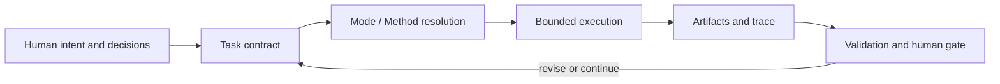

# Research Agent Workbench

Research Agent Workbench（RWB）是一套**由人负责决策、以文件契约承载研究状态、可跨模型与运行平台复核**的研究协作底座。它把任务边界、方法选择、执行事实、证据与交接写成可验证工件，同时让具体模型、工具和研究路径保持可替换。

## 它提供什么

- 版本化的 Task、Assignment、Handoff、Decision、Evidence、Claim 与 Trace 契约；
- 面向学科差异的 Mode / Action / Method 语义，而不是固定研究流水线；
- no-Skill、直接工具、受限 Skill 与 Human Gate 等并列执行路径；
- 受控读取、受限写入、预算、停止条件和风险分级交接；
- provider-neutral 的隔离执行缝与文件权威 Trace；
- 确定性 Schema、引用、哈希、权限和闭集一致性校验。



RWB 管理的是研究工作的**控制面与证据链**。模型负责有界生成和分析，工具负责可声明的能力，研究者保留范围、权限、方法适用性、科学主张和发布决定。

## 五分钟离线体验

需要 Python 3.11+。在仓库根目录执行：

```powershell
python -m pip install -e .
rwb validate examples registry
rwb schema list
rwb init work/quickstart-project --project-id quickstart
```

这条路径不调用模型或网络，也不要求 Skill；它验证仓库契约并创建一个最小文件式项目。当前
no-Skill Task 契约和 Resolver 的实现边界见[上手指南](docs/GETTING_STARTED.md)。

## 从哪里开始

- 第一次理解系统：[项目章程](docs/PROJECT_CHARTER.md) → [总体架构](docs/ARCHITECTURE.md)
- 第一次运行：[上手指南](docs/GETTING_STARTED.md)
- 判断当前能做什么：[实现状态](docs/STATUS.md)
- 参与开发：[开发协作指南](docs/DEVELOPMENT.md) → [实施任务清单](docs/TASKS.md)
- 查阅概念、决策或历史：[文档导航](docs/README.md)

项目处于内部技术 alpha；这描述产品成熟度，不改变已经接受的契约语义。限制和发布缺口以[实现状态](docs/STATUS.md)为准。
