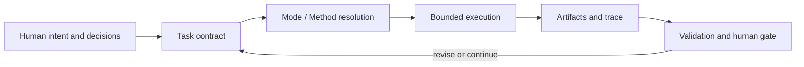

# Research Agent Workbench

Research Agent Workbench（RWB）是一套**由人负责决策、以文件契约承载研究状态、可跨模型与运行平台复核**的研究协作底座。它把任务边界、方法选择、执行事实、证据与交接写成可验证工件，同时让具体模型、工具和研究路径保持可替换。

## 它提供什么

- 版本化的 Task、Assignment、Handoff、Decision、Evidence、Claim 与 Trace 契约；
- 面向学科差异的 Mode / Action / Method 语义，而不是固定研究流水线；
- no-Skill、直接工具、受限 Skill 与 Human Gate 等并列执行路径；
- 受控读取、受限写入、预算、停止条件和风险分级交接；
- provider-neutral 的隔离执行缝与文件权威 Trace；
- 确定性 Schema、引用、哈希、权限和闭集一致性校验。



RWB 管理的是研究工作的**控制面与证据链**。模型负责有界生成和分析，工具负责可声明的能力，研究者保留范围、权限、方法适用性、科学主张和发布决定。

## 离线体验

按[上手指南](docs/GETTING_STARTED.md)安装到独立环境，切换到源码目录外后执行：

```shell
rwb resources check
rwb schema list
rwb init project --project-id quickstart
rwb project check project
rwb validate project/tasks/task.yaml project/profiles/local-no-skill.yaml --root project
```

这些命令创建可复用 no-Skill 项目，并校验随包资源、Task 与本地 Profile。安装后的步骤不调用模型或外部服务；
验收含义和使用限制统一见[支持能力与证据边界](docs/SUPPORTED_FEATURES.md)。

## 从哪里开始

- 理解系统：[项目章程](docs/PROJECT_CHARTER.md) → [总体架构](docs/ARCHITECTURE.md)
- 第一次运行：[上手指南](docs/GETTING_STARTED.md)
- 判断当前能做什么：[支持能力与证据边界](docs/SUPPORTED_FEATURES.md)
- 查阅模块与源码：[公开模块导航](docs/PUBLIC_GUIDE.md)
