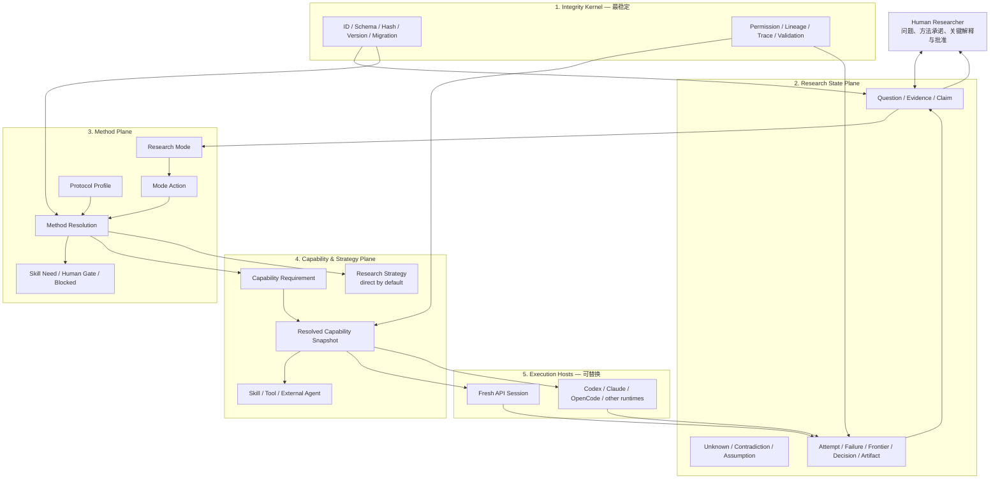
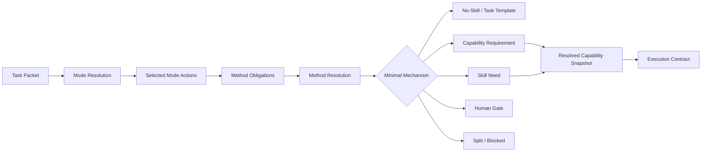

# 总体架构

版本：0.6-integration-candidate

状态：目标架构与迁移基线

日期：2026-08-20

## 1. 架构结论

Research Agent Workbench 是放在研究者与可替换 AI 执行能力之间的科研控制平面。它不拥有
研究问题，不取代人的科学判断，也不重新实现通用 Agent Runtime。它长期保存科研语义、研究
状态、证据关系、方法决定、失败与关键 Trace；Model、Runtime、Tool、Skill、Strategy 和 prompt
都属于可替换实现。

核心原则是：

> Research semantics and history should outlive models, runtimes, tools and skills.

当前集成分支已经在最新 `main` 上实现最小对象、Task/Handoff、Skill Assignment、上下文治理、
Mode Action、provider-neutral Method Resolution、Mode v0.2 migration、Decision Authority、Resolved
Capability Snapshot 与 strict API file loop；这些新增项在双方审查并合入 `main` 前仍是 candidate，
不能误报为主线稳定能力。长期 Research State、Execution/Method Trace、真实科研案例和发布 Gate 仍未完成。

## 2. 五个逻辑平面

Execution 层消费由 Method、Research State 与 Integrity 层冻结的契约；越稳定的科研语义约束越
可替换的执行实现。Execution 不能反向定义 Mode、Claim、Skill Need、权限放宽或 Human Gate；
执行结果经过验证后才回写 Research State。

## 3. 核心解析链

一个 Atomic Task 在执行前应经过以下 provider-neutral 链：

`Method Resolution` 解释为什么选择这些 Action 和机制、拒绝了哪些替代、哪里存在歧义。它不包含
Provider、Model 或 Host 字段。`Resolved Capability Snapshot` 才绑定本次 Attempt 的具体
Tool/Skill/Adapter 版本、hash、
权限、数据出口和副作用。

`Resolved Task + Skill Assignment` 继续作为兼容输入；严格路径由
`Task + Assignment + Method Resolution + Resolved Capability Snapshot + optional predecessor Main State`
派生 `Resolved Execution View`。兼容路径不得被解释为完整方法证明；迁移使用新版本和显式映射，
不原地改义。

## 4. 概念边界

| 概念 | 回答的问题 | 不负责什么 |
|---|---|---|
| Project Protocol | 本项目允许、禁止和必须由谁批准什么 | 不定义唯一研究顺序 |
| Research Mode | 当前研究活动受什么通用方法约束 | 不绑定 Skill、Tool、Host 或 Strategy |
| Mode Action | 本 Task 触发了哪项可验证方法动作 | 不等于固定阶段或全局 DAG |
| Protocol Profile | 需要遵守什么领域/社区/项目方法标准 | 不代替 Mode，也不包装为 Skill |
| Method Resolution | 为什么选择这些义务和最小机制 | 不绑定 Provider/Model |
| Skill Need | 哪个跨任务语义缺口可能值得复用 | 不表示已有或已准入 Skill |
| Skill | 如何完成一类可复用语义动作 | 不持有 Research State，不升级权限 |
| Capability Requirement | 执行需要什么能力与边界 | 不指定厂商品牌 |
| Resolved Capability Snapshot | 本次 Attempt 确切绑定了哪个实现 | 不等于 Host/Provider 能力报告，不改变 Method contract |
| Research Strategy | direct/tree/review 等执行策略 | 不改变 Mode 或 Claim 语义 |
| Agent Profile | 执行者的行为和权限上限 | 不定义完整科研方法 |
| Research State | 跨 Task/Runtime 延续的研究事实和开放问题 | 不等于聊天记忆或 Runtime state |
| Task/Handoff | 一次工作边界与正式交付 | 不成为长期科研真值 |

## 5. Research State

长期状态按文件、稳定 ID、revision 和 hash 保存，初始候选包括：

- Question、Evidence、Claim；
- Unknown、Contradiction、Assumption；
- Method、Run、Artifact；
- execution Attempt、Failure、Frontier item；
- Decision 与 Human Gate result。

Failure 不是日志垃圾，至少应记录目标、方法、结果、失败原因、学到什么与 revisit condition。
Frontier 是 compact index，不是要求主 Agent加载全部历史。新 Runtime 应能从冻结 Research State
建立下一 Atomic Task，而无需恢复旧对话或 Python 对象。

当前 `Attempt` 专指一次 Task execution attempt。Phase C 若需要表达包含多个执行 Attempt 的
research-level/method trial，应使用独立对象名或显式关系，不覆盖现有 Attempt/Archive/Receipt 语义。

Evidence–Claim 关系长期从简单 Mode ceiling 演进到 `provenance → relation → composition →
admissibility`。确定性检查只验证结构和可定位性；科学解释与高风险 promotion 保留给 Human Gate。

## 6. Trace、上下文与验证

Trace 分两层：

1. **Execution/Archive Trace**：actor、消息、读取、Tool、文件 revision、外部动作、状态、Receipt；
2. **Method Trace**：Mode/Action/Mechanism 的选择与拒绝、Capability resolution、Human Gate、
   Evidence/Claim 变化、Failure 与 reopen condition。

两层通过 Task/Attempt/actor/object ID 关联，但不互相复制全文。主 Agent 默认只读取 Task、Research
State compact index、Method Resolution、风险和 Handoff；原始材料、完整消息与事件账本按显式
引用和 Task 权限拉取。子 Agent 压缩可以容忍，主 Agent 非计划压缩应通过 safe pause/rollover
避免。

验证仍分为 deterministic、targeted semantic review 和 Human Gate。Trace 完整、Schema PASS、
多 Agent 一致或 benchmark 得分都不能单独证明 scientific correctness。

## 7. 决策权

| 决策 | Agent | Deterministic Resolver/Validator | Human |
|---|---|---|---|
| Mode/Action 候选 | 可提出 | 校验 catalog、trigger 与冲突 | 歧义/高风险确认 |
| 最小机制 | 可建议 | 在允许机制中解析 | 歧义或方法承诺确认 |
| Skill/Tool binding | 不得自由 fallback | 按 Need/Capability/权限冻结 | 高风险或能力缺口决定 |
| Claim proposal | 可提出 | 校验 provenance 与 method rule | 科学解释/promotion |
| 数据、来源或权限放宽 | 不得批准 | 不得静默放宽 | 必须明确批准 |
| 外部副作用/发布 | 可执行已授权动作 | 检查授权与 Receipt | 必须按风险批准 |

Decision Authority Matrix 已在集成分支冻结并接入 Method/execution preflight；它能 fail closed
处理未治理决定、执行层越权、Provider 污染和未批准 Gate，但仍不替代 Human 的科学判断。

## 8. 执行与适配边界

纯 API fresh session 是“只要有 API 即可执行”的可移植基线；Codex、OpenCode、Claude Code 或
其他平台是可选 Host。Runtime/Provider Adapter 负责能力声明、配置翻译、执行、取消、用量和
Receipt，不负责 Mode、Claim、Skill Need 或 methodology fallback。

上层请求 provider-neutral capability；执行前冻结具体 snapshot。能力不存在、权限不匹配或数据
政策不允许时返回 gap/blocked/Human Gate，不静默模拟或跨 Provider fallback。

## 9. 演化与评测

外部或自动生成的 Skill/Tool/Method/Protocol/Strategy 只能进入 candidate。Promotion 必须绑定
来源/许可/安全审计、冻结环境、困难 Task、简单 baseline、限制和 Human Decision。

永久基线为 Plain Agent、Plain+Tool、Mode+no-Skill/direct-tool 和 Mode+candidate Skill。复杂机制
没有改变错误、返工、Claim、provenance、人类纠正距离或成本时，应被删除、降级或保持 candidate。

## 10. 当前迁移边界

| 能力 | 当前状态 | 下一契约 |
|---|---|---|
| Mode Action | 集成候选：16 个 Schema-backed Action | 双方审查后冻结 Registry/stable hash |
| Method Resolution | 集成候选：八个 routing fixture + EVID-001 | 主线合并后接 Trace/Evaluation |
| Research Mode | v0.1 兼容 + v0.2 action refs | 双方确认 migration seam |
| Skill Need | dossier/规划约定 | 版本化 Need 与 evaluation refs |
| Capability | 集成候选：Requirement + Resolved Capability Snapshot + Execution View | live conformance 与更多真实绑定 |
| Research State | 七类对象、Attempt/Main State 分散存在 | compact State/Frontier 与 Failure memory |
| Trace | ADR/手工规则；M3-008 待实现 | Execution baseline 后再加 Method Trace |
| Evaluation | paired Skill contract 与指标已有 | 统一 Manifest 和四臂 baseline harness |

实时状态和唯一下一 Task 见 [`TASKS.md`](TASKS.md)；阶段依赖见 [`ROADMAP.md`](ROADMAP.md)；
实名维护边界见 [`DEVELOPMENT.md`](DEVELOPMENT.md)。

## 11. 架构不变量

- 人类拥有研究问题、方法承诺、关键解释、Claim promotion 与外部发布；
- 不建立全局 Supervisor、固定科研 DAG、长期聊天记忆或常驻 continuity 服务；
- 核心对象、Method Resolution 和 Research State 不依赖 Provider/Host；
- Mode 不固定绑定 Skill，发现不等于准入，no-Skill 是正常结果；
- 主 Agent 只维持决策、风险、索引与下一动作；
- 写入采用独占 scope 和不可变 revision，失败/反证不被 promotion 删除；
- 未知成本、缺失 Trace 和 capability gap 必须显式保留，不能填零或静默降级；
- 每个新增控制机制有消费者、baseline、成本和删除条件。
