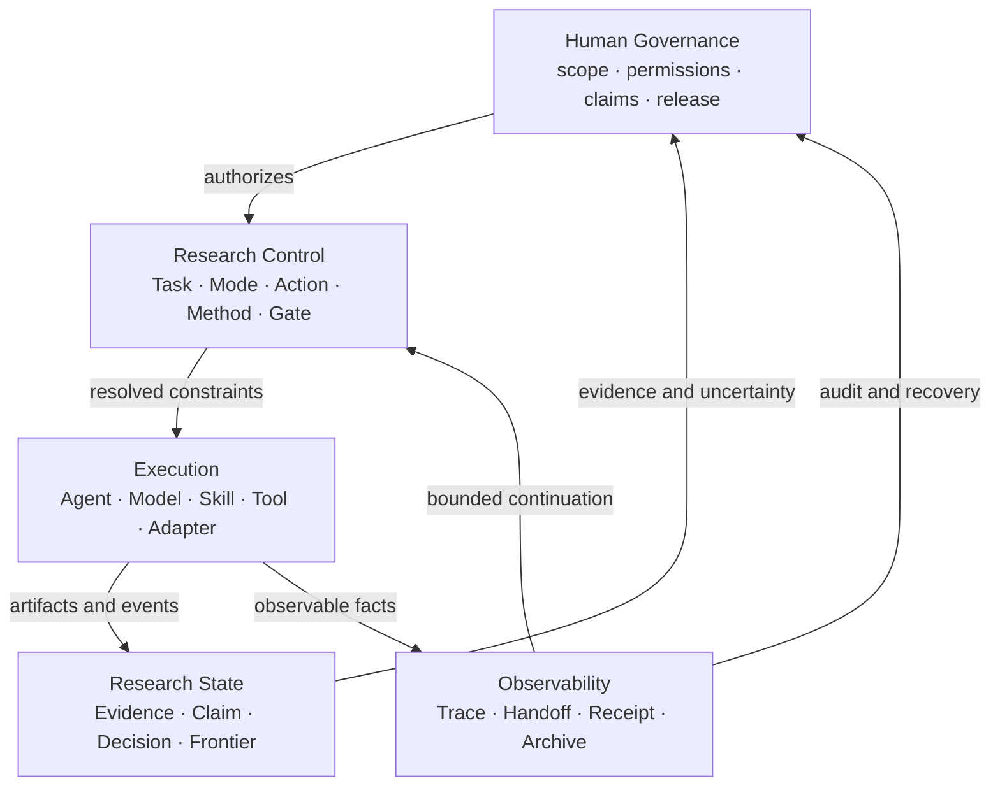
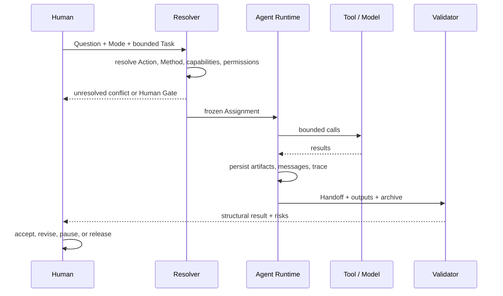

# 总体架构

版本：0.6
状态：Accepted system model
更新：2026-08-22

## 1. 核心模型

RWB 把研究协作拆为五个相互约束但可独立演进的平面。

控制面决定“应做什么以及边界是什么”；执行面决定“由什么能力完成”；研究状态保存“目前能据此知道什么”；可观察性保存“实际发生了什么”；人类治理保留不可下放的决定。

## 2. 对象责任与传递关系

| 对象 | Owns | 传递给 / 被谁消费 |
|---|---|---|
| Research Question | 研究问题、范围与预期主张类型 | Mode、Task |
| Research Mode | 学科/方法语境与 Action catalog | Method Resolution |
| Mode Action | 在某 Mode 中可审计的研究动作 | Method、Capability、Gate 解析 |
| Method Resolution | 为什么选择某机制、能力和控制条件 | Task、Execution、Method Trace |
| Task | 单次原子目标、输入、权限、预算、输出和停止条件 | Agent Assignment、Validator |
| Agent Profile | 角色能力上限、默认权限和上下文策略 | Assignment Resolver |
| Skill | 经证明有净增量的窄方法程序 | Agent 执行；不拥有任务或科学决定 |
| Tool | 具有权限与副作用元数据的可调用能力 | Agent / Adapter |
| Assignment | Task 与 Profile、Skill、权限交集的冻结结果 | Execution |
| Evidence / Claim | 来源事实、推断、限制与可主张上限 | Human Gate、后续 Task |
| Handoff | 面向下一执行者的最小充分状态 | Agent / Human |
| Trace / Receipt | 执行事件、引用、输出与闭集关系 | Validator、Audit、Recovery |
| Decision | 具名选择、理由、替代项和约束 | Research State、后续控制面 |

## 3. 任务解析与执行

解析允许 no-Skill、tool-only、Human Gate、拆分和阻塞结果。Resolver 不为了“必须继续”而静默扩大权限、替换数据边界或选择不适用的方法。

## 4. 上下文与连续性

- 主 Agent 维护需求、决定、风险、索引和下一动作，不吸收完整语料与原始日志。
- 子 Agent 只读取 Task、仓库规则、所选 Profile/Skill、声明输入和目标模块；扩读必须留痕。
- 所有可见的 Agent 间传递、工具事实和正式输出进入 Attempt Archive。
- Compact Handoff 是默认路径；压缩、外部副作用、提升、争议或高风险触发完整审计链。
- 文件路径、版本和内容哈希构成恢复锚点；聊天摘要不是权威状态。

## 5. 验证与权威

确定性验证检查 Schema、引用、哈希、权限交集、事件与索引闭集、输出存在性和状态转换。模型评审可检查语义完整性，但不能替代可判定规则。方法适用性、科学主张、权限或数据放宽、例外和发布由具名人类批准。

## 6. 可替换执行边界

核心只依赖 provider-neutral 的 Task、Assignment、能力、事件和工件接口。模型 API、Codex/OpenCode 等 Agent Runtime、MCP、CLI 或本地程序通过薄 Adapter 接入。Adapter 映射能力和执行事实，不重新定义研究语义，也不把平台会话 ID 变成长期权威。

## 7. 演进不变量

1. Stable object identity 与版本必须显式；
2. 新 Skill 从可重复 Need 和净增量证据产生，不从来源清单产生；
3. 兼容行为必须显式选择，禁止静默重解释旧工件；
4. 高风险决定不能由执行者自批；
5. Trace 记录事实，不记录隐藏推理，不保存秘密；
6. 任何机制都可以在未证明价值或增加负担时被降级、替换或退役。

当前实现覆盖见[实现状态](STATUS.md)，旧契约边界见[兼容性说明](compatibility/README.md)，概念细节见[模块设计](modules/)。
