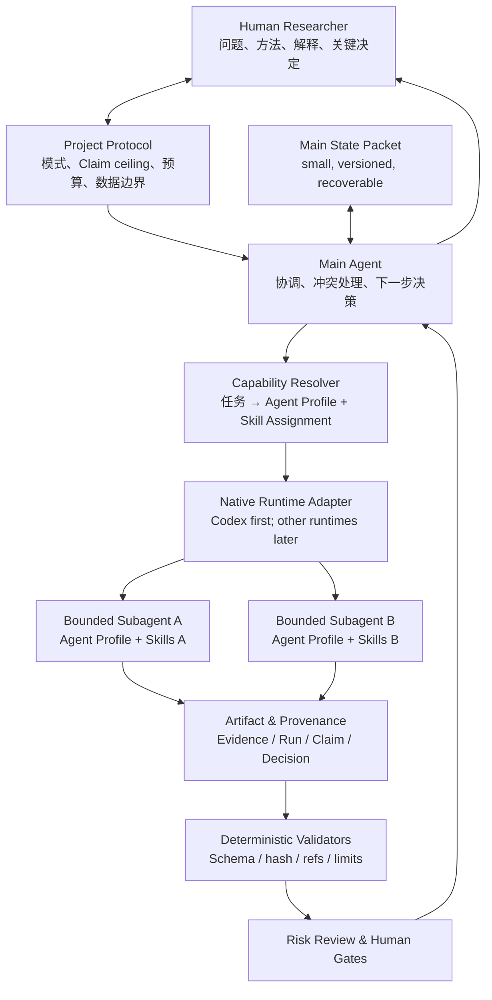
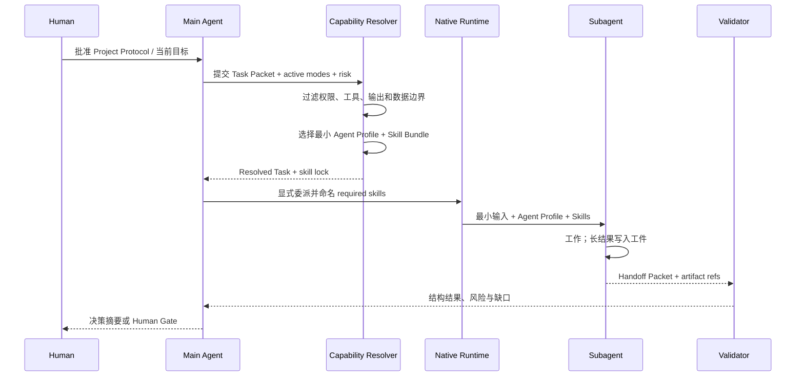

# 总体架构

版本：0.2

状态：实施基线

日期：2026-08-13

## 1. 架构结论

系统采用“最小科研内核 + 方法模式包 + 能力绑定 + 原生 Agent 运行时 + 工件与验证”的分层结构。

真正的运行单位不是“某个永久角色”，而是一次已解析的任务绑定：

```text
Resolved Task
= Project Protocol
+ Research Mode constraints
+ Task Packet
+ Agent Profile
+ Skill Assignment
+ Tool/permission boundary
+ Output contract
```

这一区分解决了两个常见问题：

1. “文献 Agent”“仿真 Agent”等角色不应被理解为拥有固定、无限的能力；其能力来自本次任务加载的 Skills 和工具。
2. Skills 不应成为隐式魔法。高风险或可复现任务必须记录实际加载的 Skill ID、版本、来源和输出契约。

## 2. 核心概念不得混用

| 概念 | 回答的问题 | 不负责什么 |
|---|---|---|
| Research Mode | 当前研究活动受什么方法约束 | 不决定由哪个 Agent 执行 |
| Agent Profile | 谁以什么模型、权限和行为边界执行 | 不定义完整研究方法 |
| Skill | 如何可靠完成一类可复用任务 | 不持有项目状态，不自行升级权限 |
| Tool / MCP / CLI | 可访问什么数据或执行什么动作 | 不定义研究质量标准 |
| Task Packet | 这一次具体要做什么 | 不成为长期记忆 |
| Handoff Packet | 正式交付了什么、证据在哪里 | 不复制完整会话 |
| Project Protocol | 本项目允许什么、禁止什么 | 不规定唯一研究顺序 |

## 3. 逻辑架构



## 4. 分层职责

### L0：人类治理层

拥有研究问题、方法承诺、伦理与安全、关键异常排除、主要 Claim 和外部发布的最终责任。系统只减少信息整理负担，不转移责任。

### L1：最小科研内核

定义 Question、Hypothesis/Proposition、Method、Run、Evidence、Claim、Decision 及其可追溯关系。内核不包含“生物学”“物理学”等学科词汇，也不包含特定模型提供商。

详见[最小科研内核](modules/01-RESEARCH_KERNEL.md)。

### L2：项目协议与研究模式

Project Protocol 声明当前问题、激活模式、Claim ceiling、人工 Gate、数据边界和预算。Research Mode Pack 为实验、仿真、推导、观察统计和证据综合等活动添加方法约束。

详见[项目协议与研究模式](modules/02-PROTOCOL_AND_MODES.md)。

### L3：Agent 与 Skill 能力层

Agent Profile 描述执行容器；Skill 描述可复用工作方法；Capability Resolver 按任务的硬约束选择最小组合，生成不可变的 Skill Assignment。

详见[Agent 运行模型](modules/03-AGENT_RUNTIME.md)与[Skill 系统](modules/04-SKILL_SYSTEM.md)。

### L4：任务与上下文层

Task Packet 是委派边界，Handoff Packet 是返回边界，Main State Packet 是主 Agent 的可恢复最小状态。原始资料和日志留在工件层，按需拉取。

详见[Task 与 Handoff](modules/05-TASK_AND_HANDOFF.md)及[上下文治理](modules/06-CONTEXT_GOVERNANCE.md)。

### L5：工件、验证与风险层

以文件、稳定 ID、内容哈希和版本引用保存正式事实；确定性验证器检查机器可以判断的部分；专项 Agent 只检查明确风险；Human Gate 处理不可逆或科学解释问题。

详见[工件与溯源](modules/07-ARTIFACTS_AND_PROVENANCE.md)及[验证、风险与 Gate](modules/08-VALIDATION_RISK_AND_GATES.md)。

### L6：适配与观测层

Runtime Adapter 把平台中立契约映射到 Codex 等原生能力；Tool Adapter 接入检索、引用、仿真、统计和版本工具；观测层只记录决策所需的 trace、成本和质量指标。

详见[适配器](modules/09-ADAPTERS_AND_INTEGRATIONS.md)及[观测、成本与评估](modules/10-OBSERVABILITY_EVALUATION_COST.md)。

## 5. Agent—Skill 绑定流程



路由的硬规则：

- `required_skills` 必须显式调用，不能只期待隐式 description 匹配；
- 每次任务冻结 Skill 版本或内容哈希；
- Skill 不能扩大 Agent Profile 或 Task Packet 授予的权限；
- 默认不超过两个主 Skill，可附加一个验证 Skill；超过时应拆任务；
- 任务声明的 `forbidden_skills` 优先级高于推荐；
- 路由不确定、Skill 冲突或缺少验证时，返回阻塞/人工决定，而不是猜测；
- 主 Agent 只读取 Skill 元数据和路由结果，不默认加载所有 Skill 正文。

## 6. 上下文架构

### 主 Agent 保存

- 当前问题、目标和 Claim ceiling；
- 不可破坏的约束；
- 已接受决策及理由；
- 活跃任务索引；
- 未解决冲突与风险；
- 最近 Handoff 的短摘要和工件引用；
- 下一步动作与停止条件。

### 主 Agent 不保存

- 完整论文正文、网页或数据集；
- 原始命令日志、测试日志和长堆栈；
- 所有子 Agent 对话；
- 已被正式工件替代的探索笔记；
- 全部 Skill 正文。

### 子 Agent 输入

仅包含 Task Packet、选定 Agent Profile、明确的 Skill Assignment、必要输入引用、写入范围和输出 Schema。子 Agent 压缩只有在正式工件已写入且 Handoff 可验证时才可接受。

## 7. 状态与真值

采用三类真值，而不是继续扩张控制面：

| 真值 | 载体 | 示例 |
|---|---|---|
| 科研工件真值 | 版本化文件与哈希 | Evidence、Run、Claim、Decision |
| 机器验证真值 | 可重跑检查输出 | Schema、引用、哈希、测试 |
| 会话工作状态 | Main State / Task / Handoff | 当前目标、未决问题、下一步 |

聊天总结、Agent 自评和 Markdown 中的“PASS”都不是独立真值。Human Gate 是正式 Decision 工件，不是自然语言中的一句同意。

## 8. 预警模型

预警在离散边界触发，而非由常驻 Supervisor 轮询：

- Task 创建前；
- Skill Assignment 解析后；
- 子 Agent Handoff 时；
- 工件合并或 Claim 升级时；
- 主 Agent checkpoint / rollover 时；
- 外部发布前。

预警级别为 `INFO / WARN / BLOCK / HUMAN`。只有结构损坏、权限越界、缺失必需证据、数据边界冲突等问题可以自动阻断；方法合理性和科学解释进入 Human Gate。

## 9. 运行时策略

### 首选：原生平台适配

Codex 首版映射：

- 仓库指令：`AGENTS.md`；
- Agent Profile：`.codex/agents/*.toml`；
- Skills：`.agents/skills/*/SKILL.md`；
- 单次绑定：Task Packet + 显式 Skill 调用；
- 并行与线程：Codex 原生子 Agent；
- 权限：平台 sandbox/approval 与 Agent Profile 的交集。

### 以后才考虑编程式运行时

只有当真实案例证明需要跨平台批处理、可重复批量评估或稳定 API 编排时，才评估 OpenAI Agents SDK、LangGraph 或其他运行时。即使引入，也只能实现 Adapter，不得取代科研内核和正式工件。

## 10. 架构不变量

1. Agent Profile、Skill、Mode、Tool 不得合并成一个大角色配置。
2. Skill 和 Agent 都不能自行提高 Claim ceiling。
3. 主 Agent 不得成为原始资料存储层。
4. 任何正式 Claim 必须有可定位依据或明确标记为 unresolved。
5. 任何关键人工决定必须形成 Decision 工件。
6. 确定性检查不得宣称科学正确性。
7. 原始证据、负结果和冲突不得因摘要而消失。
8. Runtime Adapter 可替换，公共内核不得绑定平台私有会话格式。
9. 不得默认递归委派；子 Agent 再委派需要 Task Packet 明确允许并受深度/预算限制。
10. 新全局机制必须由真实事故或已量化风险支持。

## 11. 首个垂直切片

首版选择证据综合和仿真 V&V，是因为二者在数据、工具、输出与评价标准上差异足够大：

| 项目 | Evidence Scout | Simulation Auditor |
|---|---|---|
| Agent Profile | 源只读、任务区受限写、检索密集 | 工件读取、任务区受限计算 |
| 主 Skill | 文献证据提取 | 仿真验证与确认 |
| 输入 | 问题、语料/检索边界 | 模型、参数、运行清单 |
| 输出 | Evidence records、引用缺口 | V&V report、Run 风险 |
| 主要风险 | 引用漂移、来源注入、过度概括 | 版本陈旧、收敛不足、模型越界 |
| Human Gate | 来源权重和综合解释 | 模型代表性和误差可接受性 |

如果二者必须共享大量方法专用字段，说明公共内核过窄；如果为了兼容二者产生大量空字段，说明公共内核过宽。

## 12. 文档与实施关系

本文件定义稳定关系和不变量；模块文件定义各自的职责、接口、风险和验收；[实施计划](implementation/IMPLEMENTATION_PLAN.md)定义交付顺序；[任务清单](TASKS.md)是当前执行状态的唯一入口。软件交付阶段不是研究工作的强制顺序。
