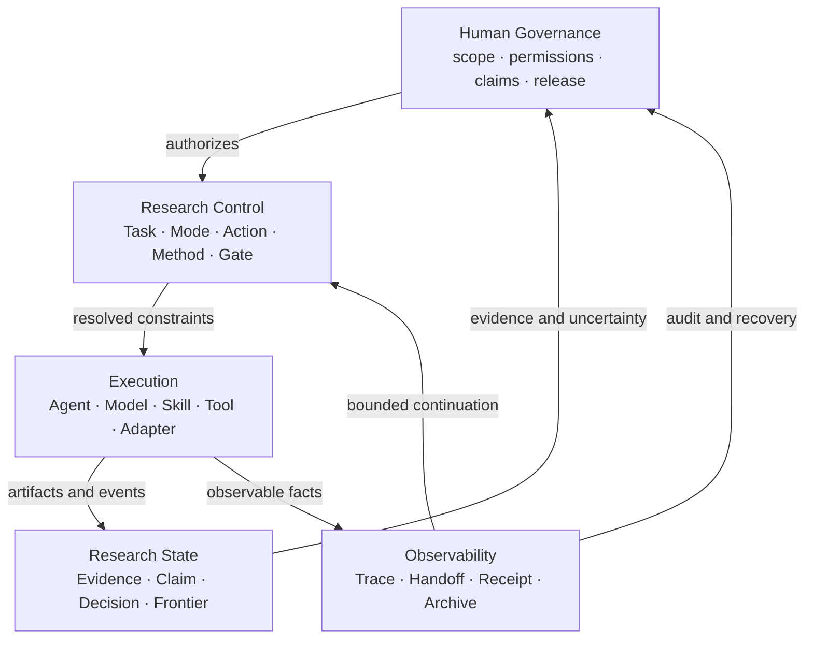
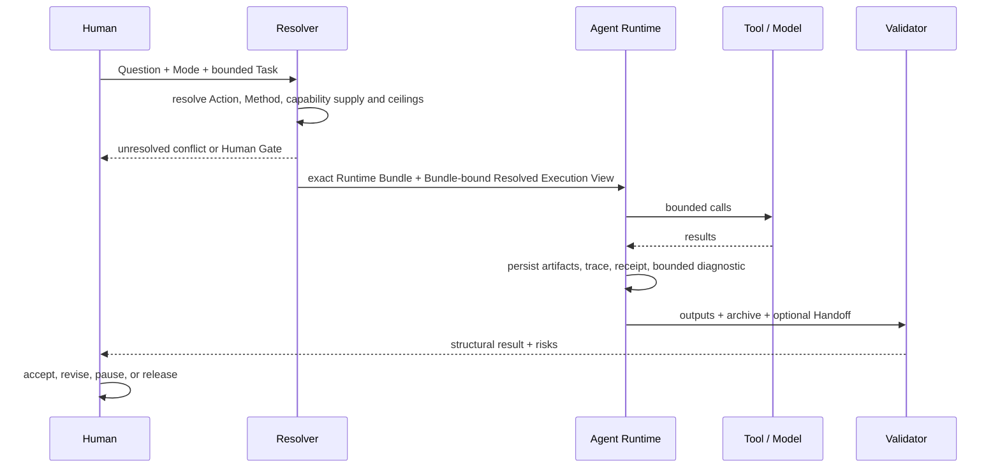

# 总体架构

版本：0.7.1
状态：Accepted system model
更新：2026-08-31

## 1. 核心模型

RWB 把研究协作拆为五个相互约束但可独立演进的平面。



控制面决定“应做什么以及边界是什么”；执行面决定“由什么能力完成”；研究状态保存“目前能据此知道什么”；可观察性保存“实际发生了什么”；人类治理保留不可下放的决定。

## 2. 对象责任与传递关系

| 对象 | Owns | 传递给 / 被谁消费 |
|---|---|---|
| Research Question | 研究问题、范围与预期主张类型 | Mode、Task |
| Research Mode | 学科/方法语境与 Action catalog | Method Resolution |
| Mode Action | 在某 Mode 中可审计的研究动作 | Method、Capability、Gate 解析 |
| Method Resolution | 为什么选择某机制、能力和控制条件 | Capability Requirement、Method Trace |
| Task | 单次原子目标、输入、权限、预算、输出和停止条件 | Runtime Bundle、Resolved Execution View、Validator |
| Agent Profile | 角色能力上限、默认权限和上下文策略 | Resolved Execution View producer；Skill-bearing 兼容路径中的 Assignment Resolver |
| Skill | 经证明有净增量的窄方法程序 | Agent 执行；不拥有任务或科学决定 |
| Tool | 具有权限与副作用元数据的可调用能力 | Agent / Adapter |
| Capability Requirement | 与具体 Skill、Tool、Adapter 或 Provider 无关的需求与 ceiling | Supply Report、Capability Resolution |
| Capability Supply Report | 一个具体供给的 identity、能力、I/O、边界与证据事实；不能选择自身 | Research Control / Capability Resolver |
| Capability Resolution | Resolver 对显式候选的 deterministic compare、qualification 与唯一 selection；或 gap/ambiguous/blocked | Resolved Capability Snapshot |
| Resolved Capability Snapshot | Resolver 对一次确定性选择所冻结的需求、供给、证据与 supply-side boundary | Runtime Bundle、Resolved Execution View producer |
| SkillReleaseProjection | 已准入不可变 Skill Release 的窄、只读发布视图 | Skill Supply Report；不暴露演化历史 |
| Runtime Bundle / Consumer Profile | exact allowed-read closure 与 Action→Capability slice；不选择 Supply、不授予执行权 | Resolved Execution View producer、Execution Host |
| Resolved Execution View | Snapshot 与 exact Host/Provider/Adapter/Model、freshness、DataPolicy 和权限交集 | Execution Host |
| Assignment | 仅 Skill-bearing 路径所需的 Task、Profile、Skill 精确锁定；no-Skill/direct Tool 不创建 | Resolved Execution View |
| Capability Diagnostic | Runtime 产生的有界失败事实，不是 Skill Need | 本地审计；可选 Maintainer triage |
| Evidence / Claim | 来源事实、推断、限制与可主张上限 | Human Gate、后续 Task |
| Handoff | 面向下一执行者的最小充分状态 | Agent / Human |
| Trace / Receipt | 执行事件、引用、输出与闭集关系 | Validator、Audit、Recovery |
| Decision | 具名选择、理由、替代项和约束 | Research State、后续控制面 |

## 3. 任务解析与执行



解析允许 no-Skill、tool-only、Human Gate、拆分和阻塞结果。Resolver 不为了“必须继续”而静默扩大权限、替换数据边界或选择不适用的方法。

## 4. Runtime 内环与 Maintainer 外环

Research Runtime 以 Capability-first 的内环执行任务；Skill Evolution 是可选 Maintainer 外环。二者不能
共享一套隐式可写状态机。

```mermaid
flowchart LR
    subgraph R["Capability-first inner loop"]
        TM["Task / Method"] --> CR["Capability Requirement"]
        CR --> SR["Explicit Supply Report(s)"]
        SR --> RS["Research Control / Capability Resolver<br/>compare · qualify · resolve · select"]
        RS --> SS["Frozen Resolution / Snapshot"]
        SS --> RB["Runtime Bundle<br/>exact allowed-read closure"]
        RB --> EV["Resolved Execution View<br/>bound to exact Bundle"]
        EV --> EX["Execution Host<br/>consume exact frozen input"]
        EX --> TR["actual facts / Trace / Receipt<br/>bounded Diagnostic or re-resolution request"]
    end

    subgraph M["Optional Maintainer evolution outer loop"]
        MT["Maintainer triage"] --> SN["Skill Need"]
        SN --> CA["Candidate"]
        CA --> TE["Trial / Evaluation"]
        TE --> HA["Named Human Admission"]
        HA --> LC["Lifecycle + immutable Release"]
        LC --> RP["SkillReleaseProjection"]
    end

    RP -->|"published, versioned, hash-pinned"| SR
    TR -. "optional, local-by-default, redacted and consented" .-> MT
```



Research Control / Capability Resolver 是唯一 Supply selection owner：它接收显式候选 Reports，在既有
ceilings 内 compare、qualify、resolve、select，并生成新的 Resolution 与 Snapshot revision；上游 View
producer 只能按该 frozen selection 生成 Resolved Execution View，不能再次选择。Execution Host / Runtime
consumer 只消费 exact View 与该 View 绑定的 Runtime Bundle；上游 Snapshot 只通过这条 closure 被使用。
调用前由 trusted clock 重验 freshness，并按哈希重载 Bundle 以阻断可控文件 TOCTOU 漂移。它可以在不改变
Capability/Supply binding 时做非语义执行调度，但不能重新选择、静默替换、rebind、automatic fallback，
也不能用“局部重规划”修改当前 frozen execution input。

当当前供给失效或变化时，Execution Host 只产生 bounded Diagnostic / re-resolution request；替换必须由
上游 Resolver 生成全新的链：

```text
Execution detects failure/change
  → bounded Diagnostic / re-resolution request
  → Research Control / Capability Resolver
  → new Capability Resolution
  → new Snapshot revision
  → new Resolved Execution View
  → Execution Host
```

Maintainer 可以隔离地评测并发布 Release，但不能控制当前 Task、Method、Claim、Gate、权限或 Snapshot。
Release metadata 和 runtime eligibility 只声明供给事实与 ceiling，不能授予执行权限。

no-Skill、direct Tool、procedure 与 Adapter/Provider 路径在 Evolution 对象完全缺席时仍必须闭合。
Runtime 对 gap/failure 最多形成 `CapabilityDiagnostic`；只有具名 Maintainer 的独立 triage 才能提出
Skill Need。完整决定见 [ADR-0019](decisions/0019-OPTIONAL-MAINTAINER-SKILL-EVOLUTION-OUTER-LOOP.md)。

## 5. 上下文与连续性

- 主 Agent 维护需求、决定、风险、索引和下一动作，不吸收完整语料与原始日志。
- 子 Agent 只读取 Task、仓库规则、所选 Profile/Skill、声明输入和目标模块；扩读必须留痕。
- 所有可见的 Agent 间传递、工具事实和正式输出进入 Attempt Archive。
- Compact Handoff 是默认路径；压缩、外部副作用、提升、争议或高风险触发完整审计链。
- 文件路径、版本和内容哈希构成恢复锚点；聊天摘要不是权威状态。

## 6. 验证与权威

确定性验证检查 Schema、引用、哈希、权限交集、事件与索引闭集、输出存在性和状态转换。模型评审可检查语义完整性，但不能替代可判定规则。方法适用性、科学主张、权限或数据放宽、例外和发布由具名人类批准。

## 7. 可替换执行边界

Topic 4 Core 只依赖 provider-neutral 的 Task、Capability Requirement/Snapshot、Runtime Bundle/Profile、
Resolved Execution View、事件和工件接口。no-Skill、direct Tool、procedure 与 Adapter/Provider 不依赖
SkillReleaseProjection；可选 Assignment 与发布投影只属于 Skill-bearing extension。模型 API、
Codex/OpenCode 等 Agent Runtime、MCP、CLI 或本地程序通过薄 Adapter 接入。Adapter 映射能力和执行事实，
不重新定义研究语义，也不把平台会话 ID 变成长期权威。

## 8. 演进不变量

1. Stable object identity 与版本必须显式；
2. 新 Skill 只由 Maintainer 从正式 Need、净增量证据与具名 Human Admission 产生，不从 Runtime gap、来源清单或自动生成直接产生；
3. 兼容行为必须显式选择，禁止静默重解释旧工件；
4. 高风险决定不能由执行者自批；
5. Trace 记录事实，不记录隐藏推理，不保存秘密；
6. Runtime 不读取完整 Need/Candidate/Evaluation/Lifecycle；Skill 路径只消费不可变发布投影；
7. Supply、Release 或 Registry 变化只能由上游 Resolver 产生新的 Resolution/Snapshot/View；Execution Host
   不能改写运行中的执行输入或在其中 rebind/fallback；
8. 任何机制都可以在未证明价值或增加负担时被降级、替换或退役。

当前实现覆盖见[实现状态](STATUS.md)，旧契约边界见[兼容性说明](compatibility/README.md)，概念细节见[模块设计](modules/)。
