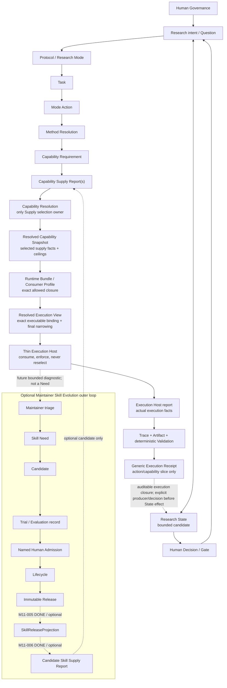
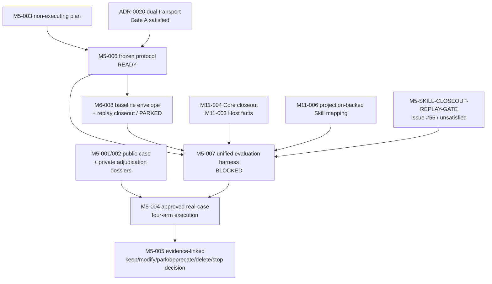

# RWB 开发者架构地图：核心控制、执行边界与可验证性

> Developer Architecture Map｜基于 `develop@dd2454b5595e33a12aa058529358d46d311a08c4` 的
> Phase D 入口跨契约审计（2026-09-02）。
>
> 本文是 derived developer navigation，不创建新 Contract、Task、Gate 或 authority。稳定架构以
> [ARCHITECTURE.md](ARCHITECTURE.md)、[Accepted ADR](decisions/README.md) 与
> [implementation contracts](implementation/README.md) 为准；实现覆盖以 [STATUS.md](STATUS.md)
> 为准；Task 状态以 [TASKS.md](TASKS.md) 为准；Phase / Topic / architecture Gate 以
> [ROADMAP.md](ROADMAP.md) 为准。

---

## 1. 阅读口径

本图沿“研究意图如何变成可验证执行，执行事实如何返回 durable research meaning”的路径，
联合核对 Contract、Schema、Python implementation、Registry、fixture、validator、CLI 与 tests。
任何成熟度判断均保留以下限制：

```text
Contract accepted
!= arbitrary-domain scientific validity

Schema / fixture exists
!= live Provider or ordinary-user E2E

machine validation PASS
!= Human Decision or Claim acceptance

execution completion
!= Task completion, Claim promotion, or Human acceptance

Resolved Capability Snapshot
!= final executable authorization
```

### 1.1 成熟度标记

| 标记 | 含义 |
|---|---|
| **D** | `develop` 已有 executable implementation / deterministic verification；后缀限定其范围 |
| **A** | architecture / contract boundary 已 Accepted，但不等于完整执行实现 |
| **P** | Planning、PARKED、Human closeout pending 或尚未进入当前施工路径 |
| **L** | Legacy / compatibility-only；仍可回放，但不是目标 Runtime 主链 |
| **G** | 明确缺口；不得由相邻实现、synthetic fixture 或 CI PASS 冒充 |

### 1.2 当前成熟度矩阵

| 层 | 当前判定 | 已经成立 | 不能据此推出 |
|---|---|---|---|
| Protocol / Mode / Action | **D** | Mode v0.2、16 个 logical Actions、migration 与 bounded obligations 可验证 | Action 科研价值已被实证 |
| Method Resolution | **D｜bounded fixtures** | Task-bound no-Skill/Tool/Need/Human/split/blocked 决定可回放 | arbitrary Task 有通用自动 resolver |
| Capability demand/supply | **D｜structural** | Requirement、Report、Resolution、Snapshot 责任与唯一 selection owner 已冻结 | Report 可选择自己，Snapshot 可授予执行权 |
| Runtime Bundle | **D｜bounded Core** | exact manifest closure、selected-supply closure、zero-Skill/零 Evolution Registry 路径可验证 | repository-wide validator 是 Runtime API，或 bundle 拥有 Method/Supply authority |
| Resolved Execution View | **D｜bounded Core** | exact Provider/Adapter/Model/Runtime/Host、freshness 与最严 policy intersection 可重算 | View producer 可重新选择 Supply 或放宽权限 |
| Thin Execution Host | **D｜bounded Core + G｜live** | exact View/bound Bundle 消费、trusted clock、TOCTOU 防线、actual facts 与 prevented/detected 分层已测试 | Host 获得 fallback/rebind authority，或 synthetic driver 证明 live Provider readiness |
| Execution closeout | **D｜generic Core + L｜legacy** | no-Skill/direct-Tool generic Receipt 可独立重放 actual binding/Supply/Trace/Artifact/Validation；旧 Skill-bound Receipt 继续可解释 | execution completion 等于 Task/Claim/Human acceptance |
| Research State / Failure | **D｜bounded candidate + P｜Human/R2** | revisioned State、Attempt lineage、Research Failure、Unknown/Assumption items、Contradiction relation 与 derived Frontier 可验证 | candidate 已是 final universal kernel 或科学语义已接受 |
| Method Trace | **D｜ref-only candidate + P｜Human/R2** | exact Attempt/Task/Method/Mode/Action/State path 与 authoritative actual-fact/gap 边界可闭合 | 已证明 reviewer reconstruction 或 complete method coverage |
| Phase C Gate | **D｜synthetic machine Gate + P｜semantic closeout** | 两个 fresh-process bounded case 的 exact closure、受控读取与 fixed predicates 可复验 | Human/R2 closeout 完成，或 Topic 5 自动解冻 |
| Source Admission | **D｜M4-001 + P｜promotion** | inbox/raw 分区、provenance sidecar、live-byte hash 与 raw-reference Gate 已实现 | promotion、Claim trace、Run reproduction、license 法律效力或科学质量已验证 |
| Evaluation Manifest | **D｜non-executing plan + G｜real cases** | canonical four-arm plan 冻结 Task/Model/Host/budget/context/evidence 并确定编译 | evaluation 已运行，或 Skill/Method 净增量已证明 |
| SkillReleaseProjection | **P｜optional extension** | 语义与排除面已被 ADR/M11 Task 定义限定 | Projection/mapping 已实现，或它 Gate 了 no-Skill Core |

---

## 2. 当前主传递图



该图的五个不变量是：

1. `Capability Resolver` 是唯一 Supply selection owner；Report、Bundle、View 和 Host 都不能二次选择。
2. Snapshot 只冻结上游选中供给事实与 ceilings；Bundle 冻结可读闭包；View 冻结最终 exact
   execution binding 和 effective constraints。
3. Host 只消费一个 exact View 及其绑定 Bundle，不接受候选列表，不 reselect/rebind/fallback。
4. actual execution fact 来自 Host/Trace 事实链；Snapshot 或 View 不得冒充“实际发生”。
5. Skill 是可选 Supply kind。Projection 缺失只阻塞 Skill new-binding，不阻塞 no-Skill/direct-Tool Core。

---

## 3. 三种不能互相替代的流

### 3.1 Control flow

```text
Question / Mode / Task / Action
→ Method Resolution
→ Capability Requirement / Reports / Resolution / Snapshot
→ Runtime Bundle
→ Resolved Execution View
```

它回答“为什么允许形成这个执行输入”。Runtime 不能为了方便从 Trace 反推并改写原始方法契约。

### 3.2 Execution fact flow

```text
Resolved Execution View + bound Runtime Bundle
→ Thin Host
→ actual facts
→ Trace / Artifact / Validation
→ Generic Receipt
```

它回答“实际发生了什么、产生了什么、在声明 scope 内通过了什么检查”。Generic Receipt
只能宣称 action/capability-slice closeout，`task_completion` 固定为 false。

### 3.3 Research knowledge flow

```text
Evidence / Research Failure / Method Trace
→ bounded Research State candidate
→ Claim / Unknown / Decision / Frontier
→ Human Gate
→ future Task
```

它回答“学到了什么、还不知道什么、为什么继续或停止”。M10 已实现 bounded candidate 与
machine Gate，但最终表示、科学语义与 Phase C closeout 仍待 Human/R2 接受。

---

## 4. Research Control：Mode 到 Method

### 已实现

- Research Mode v0.2 通过 `action_refs` 进入版本化 Action，不再直接推荐 Skill；
- 16 个 logical Actions 表达 trigger/non-trigger、obligation、failure、artifact、claim effect、Gate 和 stop boundary；
- 8 个 bounded TaskPacket/Method Resolution 覆盖 no-Skill、Tool、Skill Need、Human、split 与 blocked；
- Resolution 精确绑定 Task ID/revision/byte hash，且不选择 Provider/Adapter/Model。

### 边界

```text
formal bounded Method Resolution
!= arbitrary Task automatic scientific resolver

Action exists
!= Action has measured net value
```

---

## 5. Capability demand、supply 与 frozen selection

```text
Capability Requirement
→ Capability Supply Report(s)
→ Capability Resolution
→ Resolved Capability Snapshot
```

- Requirement 只声明 provider-neutral demand、I/O、artifact、permission/data-egress/side-effect ceiling 和
  verification constraints；
- Report 只报告具名 Supply 的 identity/version/hash、能力、边界、typed evidence、availability 与限制；
- Resolution 区分 `satisfied / gap / ambiguous / blocked`，只有它可以从显式候选中 select；
- Snapshot 冻结 exact selection 与 supply-side facts，不冻结最终 Host/Provider/Model 授权。

当前 checked-in 的 3 条 Snapshot 均为 `structural-replay` / `execution_input=false`。M11 的 bounded tests
在临时项目构造合格 `runtime-execution` input，这证明消费契约可行，不等于仓库已发布
live 执行输入。

供给变化必须形成新 revision：

```text
failure / stale / changed Supply
→ Diagnostic or re-resolution request
→ new Resolution
→ new Snapshot
→ new Bundle / View
→ Host
```

Host 不得在当前 View 内把 A 静默换成 B。`Capability Gap != Skill Need`；gap 只能进入具名
Maintainer triage，不能自动创建 Need。

---

## 6. Runtime Bundle / Consumer Profile（M11-001）

Runtime Bundle 回答“本次 Runtime 获准读取哪些 exact frozen documents”，不回答“是否应执行”。

当前 `load_runtime_bundle()` 已实现：

- 只接受单个 manifest，不接受目录，不扫描 Registry/examples；
- exact-pin Task→Method→Requirement→selected Report→Resolution→Snapshot 及 import graph；
- multi-candidate Resolution 只导入最终 selected Supply，且必须唯一 eligible；
- `Method Resolution.resolution_status` 必须为 `proceed`，`blocked/split-and-block` fail closed；
- Task required capabilities 必须等于 Method Actions requirements 并集；
- Core 固定 zero-Skill，不导入 Need/Candidate/Evaluation/Lifecycle；
- execution slice 不冒充 whole Task closure，`task_completion=false`。

`maintainer-full` repository validation 与 `runtime-bundle` 是两个 profile。前者读取演化/历史闭包，后者只读
显式执行闭包；“前者更全面”不是 Runtime 使用它的理由。

---

## 7. Resolved Execution View（M11-002）

View producer 消费 frozen selection，不是第二个 Resolver。当前 producer 已经冻结：

- exact Task / Method / Resolution / Snapshot / selected Supply refs；
- exact Profile、DataPolicy、Host policy 和 Runtime Bundle external pin；
- exact Provider、Adapter、Model、Runtime、Host identity/version/config digest；
- Supply availability、DataPolicy 与 Host policy freshness windows；
- Task/Profile/DataPolicy/Host/Supply 的 permission、data-egress、side-effect 最严交集；
- budget、required artifacts/verification、Action stop/blocked constraints。

交集必须反向证明 selected Supply 在 effective boundary 下仍可运行；否则 fail closed 并请求上游
re-resolution。View 不创造 permission grant，不放宽 Snapshot ceiling，不将 current availability 变化转成 local fallback。

---

## 8. Thin Execution Host（M11-003）

Host 只消费 exact View 与该 View 内绑定的 Runtime Bundle。它不接受第二个可替换 Bundle，也不接受
候选 Driver 列表。关键实现边界是：

- 执行前重算 View，并按 manifest pin 重载 Bundle/documents，阻断可控文件 TOCTOU；
- Driver binding 在调用前必须与 View 完全一致，调用后再检测 actual binding drift；
- elapsed time 由 Host trusted clock 的 start/end observation 计算，budget 不信任 Driver 自报；
- pre-call identity/freshness/integrity 失败可称 `prevented`；post-call boundary drift 只能称 `detected`，不冒充外部沙箱阻止；
- report 分开 requested binding/Supply 与 actual binding/Supply；post-call failed 仍保留可核查 actual facts；
- Driver exception 不写入敏感异常正文，不重试，不产生伪 actual binding。

Host 不拥有 Method、Claim、Human Gate、Task completion、retry/recovery 或 Topic 5 authority。

---

## 9. Trace、Artifact、Validation 与 Generic Receipt（M11-004）

```text
Trace      = operational facts ledger
Artifact   = persisted content/object
Validation = deterministic judgment within declared scope
Receipt    = execution closure evidence
```

M11-004 不改写 legacy Skill-bound Receipt。它新增 generic closeout，覆盖 completed、post-call failed 和
preflight blocked：

- completed 必须闭合 Host actual binding/Supply、Trace provider/tool facts、Artifacts 与 passing validation；
- post-call failed 必须有 typed、hash-pinned Trace execution fact 独立佐证 Provider/Adapter/Model/Runtime/Host/Supply；
- 无法由 Trace 独立佐证的 drift 不得生成 replay-valid Receipt；
- preflight blocked 不得出现 actual binding 或 Provider/Tool call；
- validation subject closed set 精确等于 Host report + Trace INDEX + Artifacts；
- `completion_claim=action-capability-slice-only`，`task_completion=false`；
- Generic Receipt Schema 排除 `skill_assignment_ref`、Claim、Human approval 与 recovery。

legacy Receipt 仍要求 Skill Assignment，这只是 compatibility truth，不再是 universal Runtime model。

---

## 10. Research State、Attempt / Failure 与 Method Trace（M10-001/002 + M3-009）

### 10.1 State candidate

Research State 是 revisioned composition：`entries` 引用现有 Question/Hypothesis/Evidence/Claim/Decision/Run/Task，
`open_items` 以 lightweight `unknown / assumption` 表达未闭合项。Contradiction 复用 Evidence–Claim
counterevidence relation，Frontier 从 current entries/open items 派生，不预冻结为独立 universal object。

### 10.2 三种 lineage 必须分开

```text
State-at-attempt
!= predecessor Attempt
!= reopen justification
```

Research Attempt sidecar 以 exact file hash 绑定 legacy execution Attempt；多个 Attempt 可共享 State，State 也可因
Evidence/Human Decision 独立演化。Research Failure 的 universal minimum 只冻结 learned result 和 revisit
condition；source Attempt、observed result 与 remaining uncertainty 是 bounded profile candidate。

```text
Research Failure
!= execution failure
!= negative Evidence
!= Capability Gap
!= Skill Need
```

### 10.3 Method Trace candidate

Method Trace 是独立 ref-only scientific/control trajectory，不嵌入或复制 M3-008 operational event stream。它：

- exact 绑定 Attempt/Task/Method Resolution/Mode/Action dispositions/State/kernel Decision；
- 必须覆盖 Resolution 中每个 Action decision，不能缺失或重复；
- 有 M11 authoritative execution fact 时，必须绑定同 Attempt 的 applied path 和 State effect；
- 没有本 Attempt fact 时，只能显式记录 `gap-only`；
- Snapshot 无论 qualification 如何都不是 actual execution fact。

上述是 bounded implementation candidate，不是最终研究本体、完整 Method coverage 或 Human/R2 semantic
acceptance。

---

## 11. Phase C bounded machine Gate（M10-003）

两个 synthetic case 按 source manifest 精确固定 closure，runner 将它们 staging 到一次性目录，再让新
Python 进程只读 manifest/allowlist 中的 case data。private oracle 在 actor 退出后才由 runner 首次
读取。

machine Gate 可证明：

- exact source/oracle/closure pins；
- fresh actor 不读 session/oracle/unlisted case data；
- compact State/Method Trace 可满足固定 predicates；
- known-failure path 没有被无声重复。

machine Gate 不能证明：

- OS sandbox 或恶意 native extension 隔离；
- reviewer reconstruction；
- 科学正确性；
- Human semantic review / R2 / Phase C closeout；
- Topic 5 implementation authority。

Phase C machine prerequisites 已实现，但 Topic 5 继续冻结。Human/R2 closeout 未来即使被接受，也只使
独立 Topic 5 architecture review/task-definition 可以开始，不自动授权 Handoff、context rollover、safe
pause/resume、recovery 或 salvage implementation。

---

## 12. Artifact / Provenance 与 Source Admission（M4-001）

```text
sources/inbox
= mutable / untrusted / non-referenceable

sources/raw
= admitted bytes + exact provenance sidecar
```

`rwb source admit` 默认 dry-run，只有 `--execute` 才写入。`rwb source check` 与 repository validation 会校验
Schema、完整路径段、admitted path、live raw bytes SHA、sidecar provenance 与 FileReference SHA。

```text
Source Admission PASS
!= source trustworthiness
!= license legal validity
!= content safety or scientific quality
!= work/object promotion
```

M4-002 是当前合法的 promotion frontier；M4-003 Claim/counterevidence trace 与 M4-004 Run reproduction 仍等待
该层。精确状态只看 `TASKS.md`。

---

## 13. Evaluation Manifest / baseline harness（M5-003）

当前 canonical treatment arms 为：

```text
Plain Agent
Plain Agent + Tool
Mode + no-Skill/direct-tool
Mode + candidate Skill
```

四臂共享冻结 Task、exact Model/slot/provider adapter、Host/runtime、turn/token/parallel budget、context/data
policy 和 evidence classes。plain arms 抑制 Mode/Method control；Mode arms exact-pin Mode/Method；no-Skill arm 拒绝
Skill Supply；candidate Skill arm 必须 exact-pin Skill package 和 Evaluation ref。

`rwb eval plan` 先复用 authoritative reference closure，再按 canonical 顺序编译四臂计划。它不运行模型、
不写入 result、不决定 admission/promotion、不产生 Runtime/Method/Claim/Human authority。

Phase D 的 primary estimand 是完整 RWB Runtime 集成系统相对 simpler Agent/Tool baseline 的
system-level net benefit；单一 Skill 效果只作 secondary interpretation。后继受控面为：



`M5-BASELINE-TRANSPORT-ARCHITECTURE-GATE` 已由 exact-pin 的
[ADR-0020](decisions/0020-PHASE-D-DUAL-TRANSPORT-SYSTEM-ESTIMAND.md) 闭合：A1/A2 使用 M6 isolated
session，A3 使用 M11 Core，A4 使用 M11 projection-backed Skill extension。`A4 − A2` 是包含 transport
difference 的 primary system-level estimand；`A2 − A1` 是同 M6 transport Tool 条件增量，`A4 − A3`
只有在 pairwise exact-equality closure 证明唯一 delta 为 admitted Skill extension 时才可称 Skill conditional
increment，否则降级为 Skill-bearing package / bundled effect 或 unavailable；`A3 − A2` 不得称 pure Mode
effect。M5-006 因此为 READY。

完整 Task 仍作为四臂共享 experiment identity exact-pin，但 A1/A2 只消费独立版本、
`additionalProperties=false` 的正向白名单 provider payload；完整 Task、actor/permission/budget/pins 只进入
enforcement metadata。`agent_profile`、Mode/Action/Method/Capability/Skill/private-oracle 与未知 Task 字段
不得进入 provider request。A1 Tool surface 为空；A2 唯一额外暴露为 qualified exact Tool interface。A2/A3
正式运行都拒绝 `structural-replay` / `execution_input=false` fixture；frozen→runtime 转换必须通过 M5-006
拥有的 hash-pinned `ArmExecutionQualificationRecord@1.0.0` 保持 Task/Requirement/Supply/component/
implementation/interface 与相关 A3 Mode/Action/Method，且所有 ceiling 只能等价或收窄。M6-008 只产生 A2
record；Capability Resolver 是 A3 runtime Resolution/Snapshot 的唯一 producer/selector，M11 只验证并消费，
M5-007 引用两端对象组装 A3 record并重算两类 record。
Decision 不等于 transport 实现，故新增 Execution-owned M6-008 负责 A1/A2 projection、每次 provider request/Tool
invocation use-boundary 的 pin reload、trusted clock、actual binding Trace facts 与 no-Skill replay-valid
closeout；M6-008 当前 PARKED，只有 M5-006 DONE、shared contract 冻结后才解锁，并在 DONE 前继续阻断 M5-007。
Gate A 不包含 admission-overlap 工件；后者仍由 M5-006 定义、M5-007 重算，避免自依赖。

Case 与 oracle 必须在观察输出前 hash-frozen；blind Human Review 先于 arm/Skill/cost/token/RWB label reveal。
metric status 区分 measured/estimated/unavailable/not-applicable，Research Integrity 退化不能被效率抵消，
也不得压成单一 weighted score。M5-004 的 A4 必须走真实 accepted Release→Projection→Skill Supply 与
统一 Runtime Bundle/View/Host 路径；synthetic projection 只可用于 contract test，不是正式价值证据。

A4 的 frozen treatment identity 仍是 M5-003 v0.1 的 `mode-candidate-skill`。正式运行采用
**candidate-origin treatment + admitted Runtime execution**：M5-006 定义独立 versioned
execution-qualification overlay，`A4-RUNTIME-ADMISSION-GATE` exact-pin candidate binding 与
`skill_evaluation_ref`，再闭合具名 Human Admission Decision→immutable Release→Projection→Skill Supply→
Capability Resolution→Snapshot→Runtime Bundle→Resolved Execution View→Thin Host。每跳必须有 exact
identity/path/hash；Runtime 不读 candidate，overlay 不改 Manifest，也不产生 admission、selection 或 permission
authority。overlay 由 Maintainer/Evaluation Harness 验证且不进入 Runtime Bundle；Runtime 只消费
resolver-selected Supply 与 frozen Snapshot/Bundle/View。生产 projection index 当前为空，所以该 Gate 尚未满足，
M5-004 保持 BLOCKED。Gate 是 pre-run qualification；M5-007 hard-depend M11-004 的 Core Trace /
generic-closeout contract（Host actual facts 由其 M11-003 依赖传递），并独立 hard-depend M11-006 的
projection-backed Skill mapping。M11-006 不传递 M11-003/004 的 producer/closeout 责任；M5-007 在执行后还必须
用 Host report、typed execution Trace fact 与 replay-valid Receipt 证明 actual Projection/Supply/binding 未偏离
overlay。当前 generic Receipt 对 Skill-bearing actual binding 的剩余适用性缺口由 Issue #55 的
`M5-SKILL-CLOSEOUT-REPLAY-GATE` 单独跟踪；列出 M11-004 依赖不等于宣称该缺口已经解决。M5-007 的
canonical hard dependencies 现在包含 M5-006、M6-008、M11-004、M11-006 与该 Gate；Harness 必须遵守
ADR-0020 的 arm→transport mapping，不得自行选择或隐藏 transport，也不得给 plain arm 注入 raw Task control、
dummy Method/Snapshot 或 Skill Assignment；A2/A3 qualification record 必须由 Harness 独立重算，不能作为
换 binding 或放宽 boundary 的旁路。M5-006 还冻结 `A3A4PairwiseComparabilityRecord`，M5-007 必须独立比较
Mode/Action/Method、non-Skill Capability/Supply、Tool/procedure、provider-visible interface 与 relevant boundaries；
只有 `exact-skill-only` 可称 Skill conditional increment，`skill-bearing-package`/`not-comparable` 分别触发
bundled/package 降级或 secondary contrast unavailable。Harness 与 M6-008 均不取得 Supply selection authority。

同一 overlay 还承载 M5-006 冻结的 admission-evidence overlap / held-out policy，但只在 Maintainer/Evaluation
侧使用。M5-006 定义独立、versioned、hash-pinned `AdmissionEvidenceOverlapAssessment`，绑定 exact Evaluation、
admission case/Task/input、typed oracle/checker/adjudication identities、两侧 comparison closure、`checked_at`、
validator 与结果。M5-007 在 confirmatory freeze 前重新加载两侧闭包，验证
`checked_at <= case_selection_frozen_at`，独立重算与 M5-001/002 case、Task、formal input、private-oracle 的
intersection/status/eligibility；重叠记录为 `admission-overlap`，只能作 pilot/secondary，不得进入 primary
net-benefit conclusion 或单独支撑 M5-005 pruning。公共 source set 无需完全互斥；缺失、typed
`absent`/`unknown` 或 unresolved 时 primary eligibility fail closed。该检查不改变 M5-003、Runtime input 或任何
authority。

下一步价值证据必须来自经人类批准的真实案例、M6-004 live Provider/session Gate 与独立
Evaluation/Trial records，而不是由 Manifest、Harness 或 synthetic fixture 的存在本身推导。

---

## 14. Optional Skill Evolution 边界

```text
Maintainer triage
→ Skill Need
→ Candidate
→ Trial / Evaluation Record
→ named Human Admission
→ Lifecycle
→ immutable Release
→ optional SkillReleaseProjection
→ candidate Skill Supply Report
```

Need 声明 semantic gap、no-Skill/direct-tool baseline、expected increment、evaluation criteria 和 required evidence
classes，不累积 actual results。Lifecycle 分开 intake、evaluation state、admission、runtime eligibility 和
disposition，但 eligibility 不是 execution permission。

M11-005/006 是已完成的 optional extension，但不使任何真实 Skill 自动获得 new-binding 资格：

- Projection 只发布 runtime-minimal immutable Release facts，不暴露 Need/Evaluation/Lifecycle history；
- candidate Skill 仍必须作为 Supply Report 进入唯一 Capability Resolver；
- View/Host 保持 supply-kind-neutral，不建立 Skill-specific dispatcher/session/fallback seam；
- Projection 缺失/stale/mismatch 只阻塞该 Skill candidate，不阻塞 Core。

---

## 15. Deterministic Validation 与 Human Authority

Validator 可以重算 shape、identity/version/hash、reference closure、status combination、qualification 和边界只收紧。
它不能判断 Method 是否科学最佳、Evidence 是否足够、Skill 是否有净增量或 Claim 是否应接受。

TEST-QUALITY-001 已将多个 authority-sensitive validator 拆到职责明确的独立模块，并用 Coverage Policy
v2 约束 critical line/branch 与 positive/negative evidence。`validation/documents.py` 仍包含一部分 dispatch/
orchestration 和未拆职责，不应被说成“纯 dispatch”，也不应再被说成所有关键校验的单体容器。

```text
Authority Rule Eligibility PASS
!= asserted fact proven
!= Human approval recorded
!= permission granted
!= Claim promoted
!= decision executed
```

M10 State candidate 复用具 actor/time/reason refs 的 kernel Decision 表达 bounded provenance-bearing Human Decision。
这是 implementation hypothesis，不是 Phase C Human/R2 semantic acceptance。

---

## 16. 当前真正的系统断点

### 16.1 Phase C Human/R2 semantic closeout

machine chain 已完成，但尚未有将 candidate 接受为 Phase C semantic baseline 的具名 Human/R2 closeout。
Topic 5 因此仍冻结，且未来 closeout 也只能开启独立架构审查，不直接授权实现。

### 16.2 M4 promotion / Claim trace / reproduction

Source Admission 已完成，但 raw/work 何时成为可引用 object/run、支持/反证/限制如何闭合、Run
如何从 exact inputs/artifacts/environment 复现仍未实现。

### 16.3 M5 real-case evaluation

Manifest 与 plan 已有，但两类真实案例边界、执行结果、人工修正、返工/上下文/成本和删减决定仍未闭合。

### 16.4 Optional Skill runtime extension

M11 Core 不需要 Skill extension。M11-005/006 已实现 Projection/publisher 与 eligible Skill supply 到统一 View
的 mapping；生产 projection index 仍为空，因此没有真实 Skill new-binding。该可选机制不反向 Gate Core，也不
证明科研净增量或 live Provider 可用性。

### 16.5 Live / ordinary-user / release closure

- M11 是 bounded synthetic Core，不是 live Provider conformance；
- 仓库没有 checked-in live runtime View/Receipt；
- ordinary-user E2E、外部 scaffold/migration UX 与发布就绪度仍未闭合；
- 项目 license 与原创 Skills 许可仍需人类决定。

---

## 17. Phase / Topic / M-series 定位

| Architecture area | 当前实现边界 | 仍保留的 Gate |
|---|---|---|
| Phase A | M8 Method/Core 已收口 | 不推导 Capability/Runtime/Human execution authority |
| Phase B | M9 Requirement→Report→Resolution→Snapshot 与 evolution foundations 已收口 | structural contracts 不证明 live availability 或 Skill increment |
| Phase C | M10 + M3-009 bounded candidate/machine Gate 已实现 | Human/R2 semantic closeout pending；Topic 5 不自动 thaw |
| Phase D | M5-003 canonical plan 与 ADR-0020 dual-transport estimand 已接受；M5-006 READY | M6-008 等待 M5-006 shared contract（PARKED）；baseline closeout、Skill replay Gate、Harness、真实案例/results/net-increment 与 disposition 未完成 |
| Phase F / Topic 4 | M11-001～004 bounded Core 与 M11-005/006 optional Skill extension 已实现 | production Skill projection、live conformance 与 ordinary E2E 仍是独立 Gate |
| Topic 5 | 没有新 implementation authority | Phase C Human/R2 closeout + 独立 R2 architecture review/task-definition |

M12、M13、M14 只是 reservation，没有 Task state、owner、dependency、acceptance 或 Schema；不得从本图生成
`M12-001` 等伪 Task。当前施工位置见 [M-series Implementation / Construction Map](M_SERIES_IMPLEMENTATION_MAP.md)，
exact status 只见 `TASKS.md`。

---

## 18. 开发与评审时的统一四问

1. **Intended Function**：这一层解决哪个不能由相邻层替代的问题？输入、输出和 owner 是谁？
2. **Formal Contract**：identity/revision/hash、reference closure、authority、ambiguity、migration 是否可重算？
3. **Executable Behavior**：是否有真实 parser/resolver/producer/consumer？negative case 是否 fail closed？是否有隐式 fallback/authority drift？
4. **Evidence of Value**：相对 baseline 减少了什么？遗漏、返工、回查、成本和科研风险是否有独立证据？

Contract/implementation 是 value evidence 的必要条件，不是充分条件。

---

## 19. 后续高价值验证问题

- **Phase C semantic review**：bounded State/Failure/Method Trace 是否真能让 reviewer 在不读完整会话的前提下重建关键决定？
- **Promotion authority**：raw/work 到 object/run/Evidence 的机器资格、Human Decision 和 Claim effect 如何分层？
- **Real-case evaluation**：四臂是否在 exact Task/Model/Host/budget/context 条件下可比，并记录遗漏、反证、人工修正与成本？
- **Live conformance**：Host-observed budget、binding/Supply closure 和 Trace facts 在真实 Provider/Adapter 上是否仍闭合？
- **Ordinary-user E2E**：新用户能否不扫描全仓、不伪造 Assignment，从 bounded Task 走到 replay-valid closeout？
- **Optional Skill extension**：只有在真实 Skill-bearing 需求出现时，Projection 是否能不泄漏 Evolution history 地进入统一 Supply/View 语义？

---

## 20. 主要代码 / 契约定位

### Canonical authority

- [ARCHITECTURE.md](ARCHITECTURE.md)：稳定 architecture、对象关系与 authority；
- [STATUS.md](STATUS.md)：当前 implementation maturity；
- [TASKS.md](TASKS.md)：唯一 live Task status/dependency/acceptance authority；
- [ROADMAP.md](ROADMAP.md)：Phase / Topic / macro dependency / activation Gate；
- [decisions/](decisions/README.md)：Accepted ADR，尤其 ADR-0013、0016、0019；
- [implementation/](implementation/README.md)：稳定与 candidate contracts。

### Core implementation surfaces

- `src/research_workbench/protocol/`：Mode、Action、Method Resolution、Protocol Profile；
- `src/research_workbench/capability/`：Requirement、Skill Need/Lifecycle、Supply、Resolution/Snapshot；
- `src/research_workbench/execution/`：Runtime Bundle、Resolved Execution View、Thin Host、generic closeout；
- `src/research_workbench/research_state/`：State/Attempt/Failure/Method Trace closure 与 Phase C Gate；
- `src/research_workbench/artifacts/admission.py`：Source Admission producer/validator；
- `src/research_workbench/evaluation/manifest.py`：Evaluation Manifest 与 non-executing plan；
- `src/research_workbench/observability/`：Execution Trace、legacy Receipt 与 shared facts；
- `src/research_workbench/validation/`：document dispatch 与独立 critical validators；
- `schemas/v0.1.0/`、`registry/`、`examples/`、`tests/`：结构契约、published objects、bounded evidence 与对抗测试。

### 一句话状态

RWB 已从“只有 Method/Capability structural contracts”前进到 **bounded supply-neutral Runtime Core + bounded
Research State/Method Trace candidate + Source Admission + non-executing Evaluation plan**；当前价值验证与
发布距离主要由 Human/R2 semantic closeout、promotion/reproduction、real-case evaluation、live conformance、
ordinary-user E2E 与 license/release Gate 决定，而不是继续堆叠新 Supervisor、fallback 或全局编排。
