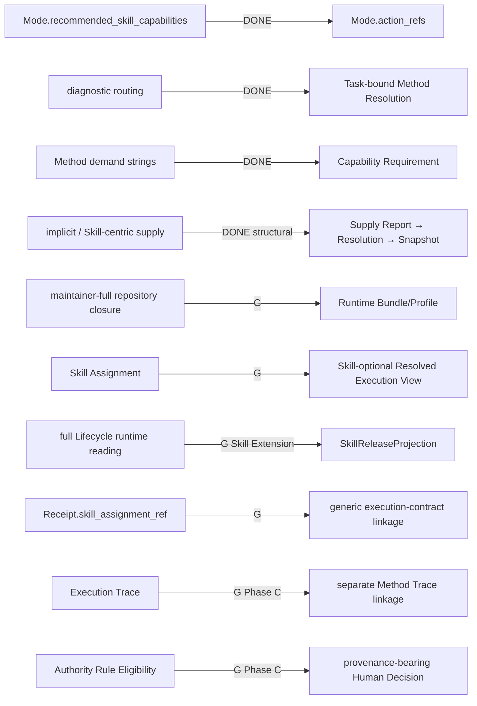

# RWB 开发者架构地图：核心控制、执行边界与可验证性

> Developer Architecture Map｜基于 `develop@b75900f5305fe2deeb8e54533584ef17eb41d0f8` 的跨契约审计
>
> 用途：帮助开发者理解 RWB 各层职责、对象传递、authority boundary、当前实现成熟度、
> compatibility debt 与后续验证问题。
>
> 本文是 derived developer navigation，不是新的 architecture / status / planning authority，也不创建新的
> Contract、Task 或 Gate。稳定架构以 [ARCHITECTURE.md](ARCHITECTURE.md)、
> [ADR](decisions/README.md) 与 [implementation contracts](implementation/README.md) 为准；当前实现以
> [STATUS.md](STATUS.md) 为准；Task 状态以 [TASKS.md](TASKS.md) 为准；依赖和阶段 Gate 以
> [ROADMAP.md](ROADMAP.md) 为准。发生冲突时，**canonical authority wins**。

审计日期：2026-08-25。

---

## 本轮审计口径

这份地图不是把 canonical 文档重新拼接一遍，而是沿着“科研意图如何变成可验证执行、执行事实如何回到研究状态”这一条跨层路径，联合核查 Contract、Python implementation、Schema、Registry、fixture、validator、CLI 与 tests。

判断始终遵守以下限制：

```text
单有设计文档
!= executable implementation

单有 Schema
!= resolver / consumer

单有 fixture
!= live Runtime

structural-replay
!= runtime execution

CI PASS
!= 科研有效性成立
```

同样，本文中的数量是审计基线的认知快照，不是长期 KPI；本文中的成熟度是跨层判断，不替代 `STATUS.md` 或 `TASKS.md` 的逐项事实。

### 成熟度标记

| 标记 | 含义 |
|---|---|
| **D** | 当前 `develop` 已存在正式 Contract、executable implementation 或 deterministic verification；后缀会注明其适用范围 |
| **A** | architecture / contract boundary 已 Accepted，但完整执行实现尚未形成 |
| **P** | Planning、PARKED 或尚未进入当前实现路径 |
| **L** | Legacy / compatibility-only；可继续解释历史，但不是目标 Runtime 主链 |
| **G** | 明确缺口；不得由旧对象、fixture 或相邻实现冒充 |

组合标记用于避免把不同成熟度维度压成一个 DONE/NOT DONE：

```text
D｜structural-only
D｜bounded fixture
D｜legacy
A｜accepted boundary
P｜Phase C
G｜runtime
```

### 审计总判定

| 层 | 当前判定 | 已经成立 | 不能据此推出 |
|---|---|---|---|
| Research Kernel / State | **D｜core objects + G｜Phase C state** | 7 类小型研究对象与引用/修订基础存在 | 已有完整 Research State、Failure、Unknown 或 Frontier |
| Protocol / Research Mode | **D** | Protocol、Mode 与边界化 method expectations 可验证 | Protocol 已成为通用工作流 DAG |
| Mode Action | **D** | 16 个逻辑 Action、两个版本的正式文档与迁移存在 | Action 的科研价值已经被实证证明 |
| Method Resolution | **D｜bounded fixture** | 8 个 Task-bound Resolution 表达 no-Skill、Need、Tool、Human、split、blocked 等机制 | 任意 Task 已有自动 minimal-mechanism resolver |
| Capability Requirement | **D** | immutable、provider-neutral、hash-indexed；经 Method Resolution / Resolution closure 与 exact Task/Method 绑定 | Requirement 文件本体已选择 Provider、Model、Adapter 或 fallback |
| Skill Need / Lifecycle | **D｜maintainer structural** | Need、Candidate/Evaluation 引用、Human Admission、Lifecycle v2 与迁移边界存在 | Need 是 Runtime 对象；Lifecycle eligibility 是执行授权 |
| Protocol Profile | **D｜structural** | 2 个 bounded profile 表达适用性、obligation、Gate 与 evidence expectations | Profile 已固定全局执行编排 |
| Capability Supply Report | **D｜fixture facts** | Tool、Adapter/Provider、no-Skill procedure 三类供给事实可表达 | Report 能选择自身或证明 live availability |
| Capability Resolution | **D｜structural resolver** | `satisfied / gap / ambiguous / blocked` 与唯一 selection authority 已冻结 | Execution Host 可以二次排序、替换或 fallback |
| Resolved Capability Snapshot | **D｜structural-only + G｜runtime input** | 3 条 exact/hash-bound Snapshot 可回放 | 仓库中存在合法 `runtime-execution` 输入或执行授权 |
| Runtime / Evolution Boundary | **A｜accepted boundary** | ADR-0019 已冻结两个独立环与两个有界单向端口 | Runtime 可以创建 Need，或 Evolution 可以控制当前执行 |
| Runtime Bundle/Profile | **G｜Topic 4 Core** | 允许读取面的责任和验收要求已定义 | 当前全仓 recursive validator 是 Runtime API |
| Resolved Execution View | **A｜accepted boundary + G｜implementation** | final frozen execution contract 的责任已冻结 | Snapshot 已包含最终 Provider/权限/Host/预算授权 |
| SkillReleaseProjection | **A｜Skill Extension + G｜implementation** | 可选发布投影的最小语义与排除面已冻结 | Projection 是 Topic 4 Core 的全局 prerequisite |
| Artifact / Provenance | **D｜file/hash refs + P｜promotion** | repository-relative refs、hash、执行输出持久化与 provenance linkage 存在 | standalone Artifact contract 或 work → object/run promotion 已实现 |
| Execution Trace | **D｜operational** | 文件权威 Trace、事件、消息、tool event、index 与恢复边界存在 | Trace completion 等于科研 Claim 被接受 |
| Method Trace | **P｜M3-009 + G｜implementation** | 责任和依赖已描述 | `trace.py` 已经实现 scientific/control trajectory |
| Deterministic Validation | **D｜maintainer-full** | Schema、policy、relationship 与多类闭包检查可执行 | validator 能判断 scientific truth，或当前 validator 是最小 Runtime closure |
| Execution Receipt | **D｜legacy + L｜Skill binding debt** | execution closeout、Attempt/Trace/Artifact/Validation 关联存在 | Receipt 已支持通用 no-Skill execution contract linkage |
| Human Gate / Decision | **D｜eligibility + G｜provenance-bearing decision** | authority eligibility matrix 与正反 fixture 存在 | 已有完整具名 Human Decision 记录与科研状态变迁 |
| CLI / Integration | **D｜bounded offline + G｜ordinary E2E** | 多类文档校验、回放、归档和兼容入口存在 | 普通用户 E2E、live Provider readiness 或完整 research loop 已成立 |

总判定是：Phase A 已把 Method-aware Research Control 形式化；Phase B 已把 capability demand 到 frozen structural supply selection 的链条形式化；ADR-0019 又把 Research Runtime 与 Maintainer Evolution 的部署和权威边界冻结下来。**当前断点已经从“缺 Capability 对象”后移到“缺最小 Runtime 读取面、最终执行契约及其薄消费层”。**

---

## 0. 数量快照与核心理解

### 0.1 当前数量快照

以下数字来自审计基线上的 index、正式文档目录和 checked-in fixture：

| 对象 | 数量 | 解释边界 |
|---|---:|---|
| Mode Action 文档 | 32 | 16 个逻辑 Action，各有 v0.1 / v0.2 文档；不是 32 个不同动作 |
| logical Actions | 16 | Evidence Synthesis 8 个，Simulation 8 个 |
| bounded Method TaskPackets | 8 | 专门用于 Task-bound Resolution 的有界输入 |
| Method Resolutions | 8 | 正式 fixture；不代表 arbitrary Task resolver |
| Capability Requirements | 4 | `bounded-compute`、`document-read`、`literature-search`、`research-contract-check` |
| Skill Needs | 3 | Maintainer-side evolution demand objects |
| Protocol Profiles | 2 | PRISMA reporting 与 simulation V&V assurance |
| Capability Supply Reports | 3 | Tool、Adapter/Provider、no-Skill procedure 各一条 |
| Capability Resolutions | 3 | 对应三条 structural resolution chain |
| Resolved Capability Snapshots | 3 | 全部 `structural-replay`、`execution_input=false`；`runtime-execution` 为 0 |
| Decision Authority fixtures | 9 | 4 eligible、5 blocked，覆盖 Agent / Resolver / Human 边界 |
| accepted Registry Skills | active 0 / legacy 2 / deprecated 1 | Lifecycle v2 对应 2 个 `legacy-preserved`、1 个 `retired`，三者均 `historical-replay-only` |

三个代码体量数字保留，因为它们能提示当前集成压力，而不是为了展示规模：

```text
src/research_workbench/observability/trace.py       1772 lines
src/research_workbench/validation/documents.py      3759 lines
src/research_workbench/cli.py                       1363 lines
```

它们说明当前很多语义仍汇集在大型验证和集成表面；但行数本身不证明模块质量，也不能代替依赖图与行为测试。

### 0.2 我对 RWB 的核心理解

RWB 的核心不是“让一个 Agent 自动做完研究”，也不是“收集尽可能多的 Skill”。它试图把科研活动拆成可引用、可冻结、可审计、可暂停、可恢复的对象与决定，并让每一层只拥有它被授予的 authority。

最短的概念链是：

```text
研究意图
→ 方法约束
→ 能力需求
→ 供给事实与唯一选择
→ 冻结执行契约
→ 受限执行
→ 事实与制品
→ 确定性判断
→ 人类科研决定
```

这一理解有三个重要否定面：

```text
Skill exists
!= Method requires Skill

Supply is eligible
!= Supply is authorized to execute

Execution completed
!= Research Claim accepted
```

因此，RWB 最值得维护的不是某个“全能 agent loop”，而是不同语义在跨层传递时不被偷换：Requirement 不混入供给；Report 不冒充选择；Snapshot 不冒充最终授权；Trace 不冒充研究结论；Capability Gap 不冒充 Skill Need。

---

# 1. 总体传递图

## 1.1 Capability-first 主链与 Maintainer 外环

```mermaid
flowchart TB
    HG[Human Governance] --> Q[Research Question]
    RS[Research State] <--> Q
    Q --> PM[Protocol / Research Mode]
    PM --> T[Task]
    T --> MA[Mode Action]
    MA --> MR[Method Resolution]
    MR --> CR[Capability Requirement]
    CR --> SR[Capability Supply Report(s)]
    SR --> RES[Capability Resolution<br/>only Supply selection owner]
    RES --> SNAP[Resolved Capability Snapshot<br/>exact + frozen]

    RB[Runtime Bundle/Profile<br/>allowed reading surface] -. explicit closure .-> VIEW
    SNAP --> VIEW[Resolved Execution View<br/>final frozen execution contract]
    VIEW --> HOST[Execution Host<br/>exact consumer]
    HOST --> TR[Trace + Artifacts]
    TR --> VAL[Deterministic Validation]
    VAL --> RCP[Execution Receipt]
    RCP --> RS
    RS --> HD[Human Decision / Gate]
    HD --> Q

    subgraph ME[Optional Maintainer Skill Evolution outer loop]
        TRIAGE[Maintainer triage] --> NEED[Skill Need]
        NEED --> CAND[Candidate]
        CAND --> EVAL[Trial / Evaluation]
        EVAL --> ADM[Named Human Admission]
        ADM --> LIFE[Lifecycle]
        LIFE --> REL[Immutable Release]
        REL --> PROJ[SkillReleaseProjection]
        PROJ --> SSR[Candidate Skill Supply Report]
    end

    SSR -. optional Skill Supply .-> SR
    HOST -. bounded, local, consented diagnostic .-> TRIAGE
```

图中虚线很重要：

- `Runtime Bundle/Profile` 约束 **View producer 可以读取什么**，不是另一种 Capability selection；
- `SkillReleaseProjection` 只让已发布 Skill 有机会成为候选 Supply，最终选择仍属于 Capability Resolver；
- Host 到 Maintainer 的联系只能是未来 bounded diagnostic，经具名 Maintainer triage 后才可能形成 Need；
- 图中没有 `Execution Host → Skill Need` 的自动反馈边，也没有 `Lifecycle → current Task` 的回写边。

## 1.2 三种不能互相替代的流

### A. Control flow

```text
Question
→ Mode
→ Task
→ Action
→ Method Resolution
→ Capability Requirement
→ Capability Resolution
→ Resolved Capability Snapshot
→ Resolved Execution View
```

Control flow 回答“为什么允许形成这个执行输入”。它不能由 Trace 倒推出完整的原始科研意图，也不能由 Runtime 根据方便程度临时改写。

### B. Execution fact flow

```text
Resolved Execution View
→ Execution Host
→ Execution Trace
→ Artifact
→ Validation
→ Receipt
```

Execution fact flow 回答“实际发生了什么、产生了什么、在声明的 scope 内通过了什么检查”。它不能决定 Claim 的科研含义。

### C. Research knowledge flow

```text
Evidence / Research Failure
→ Research State
→ Claim / Unknown / Decision / Frontier
→ Human Gate
→ new Task
```

Research knowledge flow 回答“我们学到了什么、还不知道什么、为什么继续或停止”。当前这条流只完成了部分小对象和规划边界，仍是 Phase C 的主要缺口。

三种流可能引用同一 Task、Snapshot 或 Evidence，但不能把同一个文档当成三种 authority 的替身。

---

# 2. 各传递层总览

| 层 | 主要输入 | 主要输出 | 该层回答什么 | 该层不回答什么 |
|---|---|---|---|---|
| Research Kernel / State | Question、Evidence、Claim 等 | durable research meaning | 当前研究对象与知识状态是什么 | 当前用哪个 Provider 执行 |
| Protocol / Mode | research intent、discipline expectations | bounded mode obligations | 适用何种研究控制语义 | 具体 Supply 是谁 |
| Mode Action | Mode、局部目标 | stable action contract | 当前动作必须/不得做什么 | 任意 Task 的最终机制 |
| Method Resolution | Task、Action、facts、authority | selected minimal mechanism | 这个 Task 的机制为何如此 | Provider availability |
| Capability Requirement | Method demand | provider-neutral demand | 需要什么能力与边界 | 谁能提供、是否在线 |
| Supply Report | observed supply facts | typed factual report | 某供给声明并证明了什么 | 是否被选择、是否获授权 |
| Capability Resolution | Requirement + Reports | status + exact selection | 哪个 Supply 在既有 ceilings 下唯一合格 | 最终 Host 权限与凭据 |
| Snapshot | Resolution closure | immutable frozen selection | 当时选择的 exact facts 是什么 | 最终 executable authorization |
| Runtime Bundle/Profile | explicit closure design | allowed reading surface | Runtime 允许加载哪些冻结对象 | Runtime 最终执行什么 |
| Resolved Execution View | frozen selection + policies | exact executable contract | 最终 exact binding 和 effective constraints 是什么 | 重新选择 Supply |
| Execution Host | exact Snapshot + View | actual execution facts | 在冻结边界内执行与报告 | fallback、改 Method、改 Claim |
| Trace / Artifact | actual events/content | facts ledger + persisted objects | 发生了什么、内容在哪里 | 科研结论是否成立 |
| Validation | documents + declared scope | deterministic judgment | 在 scope 内是否满足形式约束 | scientific truth |
| Receipt | Attempt/Trace/outputs/checks | closure evidence | 本次执行如何结束、证据是否闭合 | Claim 是否应晋升 |
| Human Decision | evidence + authority eligibility | provenance-bearing decision | 哪位有权人为何作出科研决定 | 替代 deterministic validation |

---

# 3. Research Kernel / Research State

## 3.1 目的

Research Kernel 应提供一组小而稳定、method-neutral 的研究对象，使一次对话、一次执行或一个工具进程都不是研究状态的唯一载体。它解决的是：

```text
研究对象是什么？
对象如何被引用、修订和追溯？
证据、Claim 与 Decision 如何保持可分离？
```

它不应该吞并 Runtime scheduling、Provider routing、全文知识图谱或 discipline-specific ontology。Phase C 的目标是最小 durable research meaning，而不是一次把 Research State 描述成知识图谱。

## 3.2 当前真的实现了什么

当前 Python 与 Schema 正式覆盖：

```text
Question
Proposition / Hypothesis
Method
Run
Evidence
Claim
Decision
```

这些对象具有 identity、revision、status、content hash、supersedes/reference 等小型基础。`Attempt` 也已作为独立执行连续性对象存在，但不属于 `kernel/objects.py` 的七类 ResearchObject。

这说明 RWB 已经有 durable object vocabulary，但还没有完整的 Research State composition。当前仍缺正式的一等对象或闭合语义：

```text
Unknown
Contradiction
standalone Assumption
Research Failure
Frontier
```

`Proposition.assumptions` 字段不能替代可引用、可失效、可重开的 Assumption 对象；execution status 中的 `failed` 也不能替代 Research Failure。

## 3.3 Phase C 要补的不是“更多日志”

最小 Research Failure 至少要能表达：

```text
observed result
learned result
invalidated assumption
remaining uncertainty
revisit condition
status
```

必须区分：

```text
execution failure
= 调用、工具、资源或 contract 执行没有按预期完成

research failure
= 研究路径产生了可持久化的否定知识、剩余不确定性与重访条件
```

二者可以相关，但不能互相冒充。一个执行可能技术上成功，却否定了研究假设；一个执行也可能技术失败，因而没有足够证据支持任何科研判断。

## 3.4 最值得验证的问题

- **目标验证**：Research State 是否帮助恢复“研究为何走到这里”，而不只是恢复进程？
- **状态完整性**：Unknown、Contradiction、Failure 与 Frontier 是否能在 Claim 之外独立演化？
- **Claim 语义**：支持、反证、限制和 Human Decision 是否保持分离？
- **防止内核膨胀**：哪些内容应继续是 Artifact/Trace，而不是进入 Kernel？

## 3.5 当前成熟度判断

```text
D｜small core objects
G｜Research State composition
P｜Phase C minimum
```

---

# 4. Protocol / Mode / Method-aware Research Control

## 4.1 目的

这一层把“研究要做什么”收敛成 Task-bound、可解释的 minimal mechanism，而不是从 Mode 名称直接跳到某个 Skill 或工具。

```text
Protocol / Mode
→ Mode Action
→ Method Obligation
→ Task-bound Method Resolution
```

它应回答：当前研究模式下，某个 Task 的哪些义务被触发？哪种机制足以满足这些义务？哪些替代方案被拒绝，为什么？

## 4.2 Research Mode 与 Mode Action

Phase A 已完成 Mode v0.1 → v0.2 的显式迁移。v0.2 不再用 `recommended_skill_capabilities` 直接暗示 Skill routing，而是通过稳定的 `action_refs` 进入 Action contracts。

当前有 16 个逻辑 Action：Evidence Synthesis 8 个、Simulation 8 个。每个 Action 的正式契约能够表达：

```text
trigger / non-trigger
method obligations
failure conditions
artifact expectations
claim effects
human gates
stop / blocked boundaries
```

32 份 YAML 是两个 Mode 版本下的 16 个 logical Actions，不应被读成 32 个互不相关的动作。

## 4.3 Method Resolution

8 个 bounded TaskPacket 与 8 个正式 Resolution 覆盖：

```text
frozen action
direct Tool
Skill Need reference
no Mode / no-Skill
Human Gate
split mechanism
blocked privacy case
rejected alternatives
```

这已经比“诊断字符串 + 推荐 Skill”更接近可审计控制面，因为 Resolution 固定 Task、Mode、Action、facts、authority basis 和所选机制。

但必须保留边界：

```text
formal Method Resolution exists
!= arbitrary Task automatic Method Resolver exists
```

当前 8 组是 carefully bounded fixtures 与 executable validation evidence。它们证明 Contract 可以表达决定，不证明对任意科研 Task 都能自动产生正确的 minimal mechanism。

## 4.4 不能推出什么

- Mode 不是 Protocol 的替代，也不是 workflow DAG；
- Action existence 不证明 Action 带来科研净增量；
- Method Resolution 不选择 Provider/Model/Adapter，不读取 availability/pricing；
- v0.1 `skill_need_refs` 继续用于 Maintainer validation 和历史重放，但不构成未来 Runtime Bundle 的必需闭包；
- Human Gate eligibility 不等于已经发生了具名 Human Decision。

## 4.5 最值得验证的问题

- **Action 是否真的必要**：相对于直接 Task contract，Action 是否减少语义重复和遗漏？
- **Obligation 是否可验证**：义务能否对应可观察 evidence，而不是口号？
- **Minimal Mechanism 是否减少复杂度**：no-Skill、Tool、Human、split 是否真的按需加载？
- **Mode 是否防止 overreach**：Claim effect 与 stop boundary 是否被 downstream 尊重？
- **bounded Resolver**：怎样从 8 个 fixture 走向有限领域 resolver，而不声称通用自动科研？

## 4.6 当前成熟度判断

```text
D｜Mode / Action contracts
D｜Task-bound Method Resolution fixtures
D｜explicit v0.1 → v0.2 migration
G｜arbitrary Task automatic resolver
```

---

# 5. Capability Demand、Supply 与 Frozen Selection

Phase B 把旧版地图中的最大断点正式向后移动。当前链条已经是：

```text
Capability Requirement
→ Capability Supply Report(s)
→ Capability Resolution
→ Resolved Capability Snapshot
```

这里四个对象必须分开，因为它们拥有不同 authority。

## 5.1 Capability Requirement

Requirement 回答“Method 要求什么”，当前特征是：

```text
immutable
provider-neutral
hash-indexed
exact-bound to Task / Method through references and closure
```

它可以声明 capability、I/O、artifact、permission ceiling、data-egress、side-effect 和 verification constraints；明确拒绝以下供给语义进入需求侧：

```text
Provider
Model
Adapter
availability
fallback
pricing
```

Requirement catalog 对象本身可以被多个 Method Resolution 复用；具体 Task/Method binding 由 Method Resolution 以及后续 Resolution/Snapshot 的 exact refs/hash closure 形成，而不是把单一 Task ID 写死进 Requirement 文件。

这不是形式洁癖。如果 Requirement 携带当前 Provider 可用性或价格，它就会随着部署环境变化而漂移，Method demand 也无法稳定回放。

当前 8 个 Method Resolutions 复用 4 个 immutable Requirements。复用本身是 provider-neutral demand seam 的正面证据；它仍不证明所有 Method demand 已经建模完毕。

## 5.2 Capability Supply Report

Supply Report 回答“某个具名供给在某个 observation scope 内报告了什么事实”。当前三条 fixture 分别表达：

```text
direct Tool
Adapter / Provider
no-Skill procedure
```

Report 可以携带 exact identity/version、capabilities、I/O、boundary facts、typed evidence 和 scoped availability observation。

它的核心动词是：

```text
reports
```

而不是：

```text
selects
authorizes
falls back
```

当前 availability 是 fixture-only。Report 的存在或 Schema PASS 不能证明 live Provider、真实 account/quota、执行时 freshness 或科研有效性。

## 5.3 Capability Resolution

Capability Resolver 是唯一 Supply selection owner。它比较 Requirement 与显式候选 Reports，并重算 capability、I/O、artifacts、permission、data-egress、side-effects、typed conformance、availability 与可选 Skill eligibility 等检查。

结果语义是：

```text
one qualified Supply  → satisfied + exact selection
no qualified Supply   → gap
multiple qualified    → ambiguous
ceiling violation     → blocked
```

`ambiguous` 不能被偷偷排序；`gap` 不能自动创建 Skill Need；`blocked` 不能通过 Runtime convenience 放宽。

必须长期保持：

```text
Report does not select
Execution Host does not select
Runtime does not fallback
Capability Resolver selects
```

## 5.4 Resolved Capability Snapshot

Snapshot 固定某次 Resolution 的 exact Task、Method Resolution、Requirement、Resolution、Supply Report、Supply identity、hash、三类 boundary facts 和 conformance refs。它回答：

> 在这个 revision 中，哪个供给被上游 Resolver 选择，哪些事实与 ceilings 被冻结？

当前 checked-in 三条 Snapshot 全部是：

```text
qualification: structural-replay
boundaries.execution_input: false
```

因此准确判断是：

> Phase B 已完成 Requirement → Supply → Resolution → structural Snapshot contract；这不等于 Runtime 已经得到合法执行输入。

`runtime-execution` 目前只是 Schema/contract 中的资格词汇和 fail-closed seam。即使未来某 Snapshot 获得该 qualification，也仍然只能表示它有资格进入 Topic 4 的下一层准入：

```text
runtime-execution eligible
!= authorized to execute
```

Snapshot 还没有冻结最终 Provider/Adapter/Model/Runtime/Host、credentials/quota、execution-time freshness、DataPolicy preflight 或 effective permission intersection。

## 5.5 供给替换边界

当前 A/B replacement fixture 证明在相同 Task、Mode、Action、Method 和 Requirement 下，可以生成不同 exact Supply/Snapshot，并保持 permissions、data-egress 和 side-effects ceilings 不被放宽。

它不证明 Host 可以在执行中把 A 换成 B。真正替换必须是新上游 revision：

```text
Supply failure / change
→ Diagnostic or re-resolution request
→ new Capability Resolution
→ new Snapshot revision
→ new Resolved Execution View
→ Execution Host
```

## 5.6 最值得验证的问题

- Requirement 能否跨 Provider、Runtime 与时间保持稳定？
- observation scope、typed evidence 和 freshness 能否阻止 fixture 冒充 live fact？
- ambiguity 是否始终 fail closed，而不是退化为隐式优先级？
- Supply replacement 是否始终生成新 revision，而不污染运行中 Snapshot？
- runtime-execution qualification 与最终 authorization 是否在实现中保持分离？

## 5.7 当前成熟度判断

```text
D｜Capability Requirement contract
D｜Supply / Resolution / Snapshot structural chain
D｜deterministic replacement replay
G｜checked-in runtime-execution Snapshot
G｜final Runtime authorization
```

---

# 6. Skill Need、Lifecycle 与 Maintainer Evolution

## 6.1 目的

Skill governance 要回答的不是“Runtime 缺什么就自动生成什么”，而是：某个可重复的 semantic gap 是否值得形成独立 Need；候选机制是否相对 baseline 有净增量；哪位具名人类允许哪一个 immutable Release 进入什么 scope。

当前 Maintainer-side chain 是：

```text
Maintainer triage
→ Skill Need
→ Candidate
→ Trial / Evaluation
→ Human Admission
→ Lifecycle
→ immutable Release
```

## 6.2 Skill Need 当前已经是什么

3 个正式 Need 已能表达 identity/version、trigger/non-trigger、semantic gap、no-Skill/direct-tool baseline、expected increment、evaluation criteria、required evidence classes 与 domain scope/variants。

Need 声明的是未来 trial/admission 要证明什么。它不保存实际 evaluation result、promotion outcome 或当前 Runtime binding。

必须保持：

```text
Capability Gap
!= Skill Need
```

Runtime 的 `gap`、`blocked` 或 execution failure 最多形成 bounded diagnostic。只有具名 Maintainer 单独 triage 后，才可能创建或修订 Need。

## 6.3 Lifecycle 当前已经是什么

Lifecycle v2 将以下轴分开：

```text
intake
evaluation state
admission
runtime eligibility
lifecycle disposition
```

这避免“进入候选列表”“通过某次 trial”“被人类准入”“当前可新绑定”“历史仍可回放”被一个 `active` 布尔值混在一起。

当前 accepted Registry 的 3 个旧 Skill 没有 active new-binding：2 个 legacy、1 个 deprecated；迁移到 Lifecycle v2 后是 2 个 `legacy-preserved`、1 个 `retired`，三者均 `historical-replay-only`。

因此：

```text
accepted historically
!= eligible for new binding

Lifecycle eligible
!= Runtime execution authorized
```

## 6.4 Evaluation 与科研净增量

Skill 存在、hash 可验、Schema 合法，都不回答它是否比 no-Skill、Tool 或 procedure baseline 更好。Need 只声明 evaluation criteria；Trial/Evaluation record 才保存实际条件和结果；Human Admission 才能作具名准入决定。

CI 可以证明 Registry、引用和 deterministic checks 闭合，但不能证明 Skill 带来 scientific increment。

## 6.5 最值得验证的问题

- Need 在不同 Task 上是否稳定，还是把一次失败过拟合成全局能力？
- no-Skill/direct Tool baseline 是否真实可比？
- Evaluation 是否记录遗漏、返工、回查、上下文成本和 Claim risk，而不只记录任务完成率？
- Admission 是否有 exact evidence 与 named decision provenance？
- Lifecycle 是否保护历史回放，同时阻止旧 Skill 获得新绑定资格？

## 6.6 当前成熟度判断

```text
D｜Need / Lifecycle structural contract
D｜explicit legacy migration
D｜maintainer-full validation
G｜scientific increment proof
G｜new-binding release publication
```

---

# 7. Research Runtime 与 Skill Evolution 的部署边界

ADR-0019 接受的核心模型是：

```text
Research Runtime consumes capabilities.
Evolution Runtime develops and publishes capabilities.
```

它不是把原有 Skill chain 改名，而是把两个拥有不同权限、不同数据面和不同部署节奏的环分开。

## 7.1 Capability-first Research Runtime inner loop

```text
Research Question
→ Protocol / Mode
→ Task
→ Mode Action
→ Method Resolution
→ Capability Requirement
→ Capability Supply Reports
→ Capability Resolution
→ Resolved Capability Snapshot
→ Runtime Bundle/Profile
→ Resolved Execution View
→ Execution Host
→ Trace / Artifact / Validation / Receipt
→ Research State
```

这里把 Runtime Bundle/Profile 写在主路径上，是为了显示 consumer readiness gate；它不是 data-plane selection object，也不改变 Snapshot→View 的 authority direction。

## 7.2 Optional Maintainer Skill Evolution outer loop

```text
optional feedback / evidence
→ Maintainer triage
→ Skill Need
→ Candidate
→ Trial / Evaluation
→ Human Admission
→ Lifecycle
→ immutable Release
→ SkillReleaseProjection
→ candidate Skill Supply Report
```

两个环只允许两个单向有界端口：

1. Maintainer → Runtime：不可变、版本化、hash-pinned 的 `SkillReleaseProjection`；
2. Runtime → Maintainer：未来可选、默认本地、脱敏且需同意的 `CapabilityDiagnostic`。

Diagnostic 不是 Need，不能触发 Candidate、Promotion、Release 或安装；Projection 不是 permission grant，也不能改写当前 Task、Method、Claim、Gate 或 Snapshot。

未来 `SkillReleaseProjection` 的最小发布面只包含：

```text
exact Skill ID / version / release identity
content digest / package digest
declared capabilities / I/O
dependencies / compatibility
permission / data-egress / side-effect ceilings
scoped runtime eligibility
minimal immutable Release + named Human Admission provenance
```

它明确排除：

```text
Skill Need 正文
Candidate working state
Trial / Evaluation results and scores
审议过程
完整 Lifecycle history
```

Projection 只让 Skill release 成为 candidate Supply Report；它不选择 Supply，也不扩大任何 Task/Profile/DataPolicy/Host authority。

## 7.3 三个 owner 必须准确分开

### Capability Resolver

唯一拥有：

```text
compare
qualify
resolve
select Supply
```

它只能在既有 Task/Method/Requirement 和 policy ceilings 内工作，不能创建 Need、放宽权限或把 ambiguous 伪装成 selection。

### Resolved Execution View producer

只做：

```text
consume frozen selection
→ calculate final execution constraints
→ freeze exact executable contract
```

它是 frozen-selection consumer / execution-boundary producer，不是第二个 Resolver。它不能重新比较、替换或选择 Supply。

### Execution Host

只做：

```text
consume exact frozen Snapshot + View
→ enforce executable boundaries
→ execute
→ report actual facts
```

它不得：

```text
reselect
silent A → B replacement
rebind frozen input
automatic fallback
change Method
change Claim
change Human Gate
```

## 7.4 权限不变量

- Runtime 内只有 Capability Resolver 可以从显式候选 Reports 中选择已发布供给；其他 Runtime 组件只能请求上游 re-resolution、执行与报告失败，不能创建、评测、晋升或改写 Skill；
- Evolution 可以隔离评测并发布 immutable Release，但不能控制当前 Task、Method、Claim、Gate、权限或冻结 Snapshot；
- Release metadata、eligibility、Supply Report 与 Snapshot 只声明 facts/ceilings，不能授予执行权限；
- 运行中的 Snapshot 不受 Registry、Release 或 availability 的静默更新影响；
- v0.1 Method→Need closure 只属于 `maintainer-full` 与 historical replay，不属于 Runtime bundle Core。

## 7.5 当前成熟度判断

```text
A｜ADR-0019 accepted boundary
G｜Runtime bundle implementation
G｜Skill release publisher / projection
P｜CapabilityDiagnostic feedback bridge
```

---

# 8. Runtime Bundle / Consumer Profile（下文统称 `Runtime Bundle/Profile`）

## 8.1 它回答什么

Runtime Bundle/Profile 回答：

> Runtime 到底被允许读取哪一小部分冻结契约？

它不回答：

> Runtime 最终执行什么？

后一个问题属于 Resolved Execution View。

```text
Runtime Bundle/Profile
= allowed reading surface / explicit closure

Resolved Execution View
= exact executable contract
```

## 8.2 为什么现有 loader 还不是 Runtime API

当前 `load_validated_capability_snapshot()` 默认从 `registry/` 和 `examples/` 递归收集文档，再调用 repository-wide validator。它适合：

```text
maintainer-full repository validation
historical replay
cross-document structural audit
```

但它会把 Need、Lifecycle、Gate、fixtures 和其他无关 Registry 文档一起带入读取面。因此它不能被描述为最终 Runtime bundle consumer。

未来 `runtime-bundle` 至少要求：

```text
explicit closure manifest
no directory-as-input
no recursive registry/example scan
zero-Skill valid
no Need/Candidate/Evaluation/Lifecycle imports
unrelated broken Registry document does not poison the bundle
```

只有在 manifest 明确请求 Skill-bearing extension 时，最小 closure 才可包含 Release Projection。

## 8.3 最值得验证的问题

- 删除整个 Evolution Registry 后，no-Skill/direct Tool bundle 是否仍可验证？
- closure manifest 是否精确固定 transitive refs，而不借目录获得隐式依赖？
- import graph 是否能证明 Runtime package 不导入 Evolution types/validators？
- 无关 Registry 文档损坏是否不影响指定 bundle？
- zero-Skill 是否是正常一等路径，而不是空数组特例或 dummy Skill？

## 8.4 当前成熟度判断

```text
G｜Topic 4 Core
```

这是当前最前置的 Runtime implementation gap。`maintainer-full` 已存在，不等于 `runtime-bundle` 已存在。

---

# 9. Resolved Execution View：最终冻结执行契约

## 9.1 核心定位

旧架构把许多执行信息寄托在 Skill Assignment。ADR-0019 后，核心问题不再只是“Assignment 能否表达 no-Skill”，而是：Snapshot 只有 supply-side frozen selection，谁来形成不依赖 Skill 的最终 executable contract？

```text
Resolved Capability Snapshot
!= final executable authorization

Resolved Execution View
= final frozen execution contract
```

## 9.2 未来至少需要冻结的类别

本文不提前发明最终 Schema 或字段名，但 accepted responsibility boundary 要求 View producer 至少处理：

```text
exact Task
exact Method Resolution
exact Capability Resolution
exact Resolved Capability Snapshot

Provider
Adapter
Model
Runtime
Host

external pins
execution-time freshness

effective permissions
data-egress
side-effects

Task / Profile / DataPolicy / Host intersection
optional Skill release binding
budgets / outputs / stop constraints
```

View 中的 effective permissions 只能是已授予 authority 与 Supply ceilings 的交集，不能从 Release metadata、Report 或 Snapshot 中凭空生成 grant。

## 9.3 Skill 是可选的

Topic 4 Core 必须形成：

```text
Runtime Bundle/Profile
→ supply-neutral Resolved Execution View
→ no-Skill / direct Tool / procedure / Adapter-Provider
```

Skill Runtime Extension 独立形成：

```text
SkillReleaseProjection
→ candidate Skill Supply
→ Skill-bearing binding
```

因此：

```text
Projection missing / mismatched
→ Skill new-binding fails closed

Projection missing
!= no-Skill Core stops
```

`SkillReleaseProjection` only gates Skill-bearing execution. It does not gate Topic 4 Core.

## 9.4 View producer 不拥有 selection

View producer 接收已经冻结的 selection，计算 final constraints 并冻结 exact executable binding。如果 freshness 或 policy preflight 失败，它只能拒绝并请求上游 re-resolution；不能在这一层把 Supply A 替换为 B。

## 9.5 最值得验证的问题

- View 是否精确引用而不是复制 Task/Method/Resolution/Snapshot 语义？
- final permission intersection 是否可重算且 fail closed？
- Provider/Adapter/Model/Runtime/Host identity 是否足以阻止隐式 rebind？
- freshness failure 是否回到新 Resolution/Snapshot，而不是触发 local fallback？
- 同一 contract 是否能同时表达 zero-Skill 和 Skill-bearing 路径而不强绑 Assignment？

## 9.6 当前成熟度判断

```text
A｜accepted responsibility boundary
G｜Schema / producer / consumer implementation
```

---

# 10. Execution Host：薄消费边界

## 10.1 目的

Execution Host 是架构上有意保持狭窄的相邻黑盒。它接收 exact frozen Snapshot 与 View，执行其中已经获准的调用，并报告 actual facts。

```text
input
= exact frozen execution contract

output
= actual execution facts
```

Host 不应重新解释研究意图，也不应拥有一份平行的 Capability Resolver。

## 10.2 当前实现如何理解

仓库已有 Provider Adapter、模型池/API session、traced execution、archive closeout 和 recovery preflight 等执行基础。这些是可复用的 implementation seams，但大部分形成于 legacy Skill-bound execution 路径。

当前仍缺的是 Topic 4 的 target thin consumer：

```text
Runtime Bundle/Profile
→ supply-neutral Resolved Execution View
→ exact Snapshot/View consumption
→ no-Skill / direct Tool E2E
```

因此准确标记是：

```text
D｜legacy execution seams
G｜Snapshot + View thin consumer
```

已有 API/trace 代码不能被重命名为新 Host 后就视为完成。它必须通过新输入契约和反越权测试。

## 10.3 Host 的禁止面

```text
no Supply reselect
no silent replacement
no frozen-input rebind
no automatic fallback
no Method / Claim / Gate mutation
no permission expansion
no automatic Skill evolution
```

Host 只能进行不改变 Capability/Supply binding、且被未来 View 明确冻结的非语义执行调度；本文不预先批准 retry 语义。任何 retry/budget/idempotency 行为都必须先进入 executable contract。一旦变化影响 exact identity、freshness、policy intersection 或 supply selection，Host 就必须拒绝当前 View 并请求上游形成新链。

## 10.4 最值得验证的问题

- Host 的 import graph 是否只面向 bundle/View/operational adapters？
- runtime error 与 upstream re-resolution request 是否明确分开？
- transport retry 是否不会变成 Provider fallback？
- actual model/tool/adapter identity 是否完整写回 Trace/Receipt？
- zero-Skill 路径是否完全不创建或加载 Skill Assignment？

---

# 11. Artifact / Provenance

从这一层开始，四个经常被混写的对象必须先并列区分：

```text
Trace
= facts ledger

Artifact
= persisted content/object

Validation
= deterministic judgment within scope

Receipt
= execution closure evidence
```

它们可以互相引用，但任何一个都不能替代另外三个。

## 11.1 目的

Artifact 是持久化内容或对象；Provenance 说明它从哪里来、经过什么转换、由谁或什么 Runtime 产生、如何被 exact reference 固定。

```text
Artifact
= persisted content/object

Provenance
= identity + origin + transformation + locator + integrity
```

这一层使 Research State、Trace 和 Receipt 可以引用内容，而不是复制正文或依赖会漂移的聊天上下文。

## 11.2 当前实现

当前已有 repository-relative refs、SHA-256、Attempt/Trace/Handoff/Receipt 中的 artifact refs/records、Trace tool-result persistence、Attempt outputs、Handoff/Archive linkage 和多类 path/hash validation。它们支持：

- 引用在项目根内解析；
- 内容与 index 之间保持 identity/hash closure；
- 执行事实与输出文件分离；
- promotion 前保留原始或中间来源；
- Receipt 不把所有内容直接内嵌。

当前没有 standalone `Artifact` class/schema；`TASKS.md` 中 M4-002 `work → object/run promotion` 仍是 READY。因此这里的 **D** 只覆盖文件/hash 引用、执行输出持久化和引用闭包，不覆盖正式 promotion pipeline。

## 11.3 不能推出什么

- 文件存在不等于它已经被 promote 为 Evidence；
- hash 相同只证明字节相同，不证明来源可信或研究含义相同；
- Artifact promotion 不等于 Claim promotion；
- 当前文件路径策略不等于大对象、远端对象存储或长期保留策略已经闭合。

## 11.4 最值得验证的问题

- **引用稳定性**：移动、归档和 migration 是否保留 exact identity？
- **Promotion**：raw output 何时成为 Evidence，谁拥有该决定？
- **原始来源**：external locator、抓取时间、license 和 redaction 是否足够？
- **大文件**：何时只保存 digest/manifest，何时必须保留原字节？
- **隐私**：Trace、Artifact 与未来 Diagnostic 的 retention/egress 是否保持一致？

## 11.5 当前成熟度判断

```text
D｜file/hash reference + persistence base
P｜M4-002 work → object/run promotion
G｜general remote/large-object lifecycle
```

---

# 12. Execution Trace 与 Method Trace

## 12.1 Execution Trace 的目的

Execution Trace 是 operational observable facts ledger。当前 file-authoritative trace 大体由以下表面组成：

```text
TASK.yaml
ACTORS.yaml
events.jsonl
messages/
tool-events/
INDEX.yaml
```

它记录执行期间的 actor、event、message、tool call/result、artifact reference、风险和归档闭包，并支持 append-only capture、index verification、safe pause 与 recovery preflight。

Trace 的核心价值是防止“运行过但无法说明实际发生了什么”。

## 12.2 关键语义

```text
Trace
= facts ledger

Trace completed
!= Claim accepted
```

Trace 中的 `completed` 或一个 tool event 的成功，只能说明相应 operational event。它不能证明 Method obligation 被充分满足，也不能决定 Evidence quality 或 Claim strength。

## 12.3 Execution Trace 不等于 Method Trace

三者应长期保持分层：

```text
Execution Trace
= operational observable facts

Method Trace
= scientific / control trajectory

Research State
= durable research meaning
```

Method Trace v0.1 未来应引用而不是复制：

```text
Task
Mode
Action
Method Resolution
Capability Resolution
Snapshot
actual supply binding
Human Gate
Evidence / Claim changes
Research Failure
safe pause / reopen
```

它不应被塞进现有 `observability/trace.py`，也不应把所有 operational event 重新复制一遍。

## 12.4 M3-009 的准确状态

`TASKS.md` 仍将 M3-009 标为 `PARKED`。其列明依赖 M3-008、M8-003、M8-005、M9-005 在结构上都已经 DONE，但 canonical Task state 没有改变。

> dependency appears structurally satisfiable, but canonical task state remains PARKED until task-definition realignment.

本文不能把它自行改成 READY，也不能因为需求已经更清楚就宣称 Method Trace 已实现。

## 12.5 最值得验证的问题

- **完整性**：关键 external call、actual binding、pause/reopen 是否都有事实？
- **边界真实性**：Trace 是否忠实记录实际 Runtime，而不是计划中的 Runtime？
- **成本**：full/redacted/minimal trace policy 是否与研究风险匹配？
- **可恢复性**：恢复是否引用 frozen objects，而不是重新解析当前 Registry？
- **分层**：Method Trace 是否只记录科学/控制转折，不复制事件流？

## 12.6 当前成熟度判断

```text
D｜Execution Trace
P｜M3-009 Method Trace
G｜Method Trace contract / implementation
```

---

# 13. Deterministic Validation

## 13.1 目的

Deterministic Validation 把可机械重算的规则从模型判断和 Human Decision 中剥离出来。它至少覆盖三类判断：

### Schema / shape

```text
字段是否存在？
类型、枚举、additionalProperties 是否符合约束？
```

### Document policy

```text
identity/version/hash 是否一致？
状态组合是否允许？
qualification 与 boundary flags 是否匹配？
```

### Relationship / closure

```text
引用是否存在且不越出根目录？
Task/Method/Requirement/Supply/Resolution/Snapshot 是否 exact-bound？
权限、egress、side-effects 是否只收紧？
Attempt/Trace/Artifact/Receipt 是否闭合？
```

## 13.2 Validation Authority 边界

Validator 可以判断“在声明 scope 内，文档和引用是否满足确定性规则”。它不能判断：

```text
这个 Method 对科研问题是否真的最合适
这个 Evidence 是否足以支持科学结论
这个 Skill 是否带来净增量
这个 Claim 是否应该被人类接受
```

因此：

```text
Schema PASS
!= scientific truth

repository validation PASS
!= Runtime authorization

CI PASS
!= research loop proven
```

## 13.3 `maintainer-full` 与 `runtime-bundle` 不能混用

当前 `validation/documents.py` 能检查非常丰富的跨仓闭包，适合 repository maintenance。但其读取和 import surface 明显大于普通 Runtime 所需。

```text
maintainer-full
= repository integrity + evolution/history closure

runtime-bundle
= explicit minimum execution closure
```

后者尚未实现，不能用“前者验证更全面”作为替代。更全面的读取面也可能意味着更强耦合、更多隐私暴露和无关损坏传播。

## 13.4 最值得验证的问题

- 每个 validation result 是否清楚声明 scope 和 authority？
- validator 是否只重算事实，而没有偷偷作 Human Decision？
- 不同 profile 的 checks 是否可组合且不会互相导入不必要 ontology？
- error taxonomy 是否区分 malformed、missing ref、policy violation、ambiguity、runtime stale？
- negative fixtures 是否证明旧对象无法冒充新资格？

## 13.5 当前成熟度判断

```text
D｜deterministic repository validation
D｜maintainer-full structural closure
G｜runtime-bundle validator profile
```

---

# 14. Execution Receipt

## 14.1 目的

Execution Receipt 是一次执行的 closure evidence。它把 Attempt identity、Runtime facts、Trace、outputs、validation references、limitations 与完成声明放在一个可核查的 closeout 对象中。

```text
Receipt
= execution closure evidence
```

它不是 Trace 的副本，也不是科研 Decision。

## 14.2 重要区分

```text
Receipt status = completed
!= completion_claim = contract-satisfied

contract satisfied
!= scientific Claim accepted
```

一个执行可以完成但保留 limitation；一个 contract 可以形式满足，但产生的 Evidence 仍不足以支持 Claim；只有具备 authority 的 Human Decision 才能处理科研状态变化。

## 14.3 当前迁移债务

当前 Execution Receipt Schema 和 Python model 都强制：

```text
skill_assignment_ref
```

validator 还会加载 Skill Assignment，并检查它与 Attempt、Task 和 Profile 的一致性。这使当前 Receipt 难以自然表达：

```text
no-Skill
direct Tool
procedure
Adapter / Provider without Skill Assignment
```

因此该字段属于：

```text
L｜Skill-bound migration debt
```

目标方向是 generic execution contract / Resolved Execution View linkage，但本文不提前冻结字段名、Schema 或 migration 方案。

## 14.4 最值得验证的问题

- Receipt 是否引用 final View 与 actual binding，而不是旧 Assignment 假设？
- completion claim 是否由 deterministic closure 支持？
- limitation、partial output、safe pause 与 cancelled 是否保持可区分？
- Receipt 是否能同时覆盖 no-Skill 与 Skill-bearing execution？
- Receipt 与 Method Trace / Research State 的连接是否只引用、不复制？

## 14.5 当前成熟度判断

```text
D｜legacy receipt implementation
L｜mandatory Skill Assignment linkage
G｜generic View-based linkage
```

---

# 15. Human Gate / Decision Authority

## 15.1 目的

Human Gate 表示某类变化必须由具名、具权人类决定；Decision Authority Matrix 判断某 actor 对某 action 是否具备 eligibility。二者都不应被模型或 validator 的“建议”替代。

当前 9 个 authority fixtures 覆盖 Agent、Resolver、Human 的允许和阻断案例，能够重算：

```text
谁可以 proposal
谁可以 deterministic commit
谁可以放宽 permission
谁可以 Claim promotion
缺少 asserted facts / Gate 时为何阻断
```

## 15.2 Eligibility 仍不等于 Decision

```text
Authority Rule Eligibility PASS
!= asserted fact proven
!= Human approval recorded
!= Decision executed
```

当前 `Decision` ResearchObject 是通用基础；opaque Gate ref 和 eligibility record 还不是完整的 provenance-bearing Human Decision。Phase C 需要把 actor、scope、reason/evidence refs、decision time、supersession 与 state effect 连接起来。

Release、Lifecycle、Snapshot、View producer 和 Host 都不能以 metadata 替代这一步。

## 15.3 最值得验证的问题

- eligibility 与 actual named decision 是否由不同对象承载？
- Human Decision 是否 exact-pin 它看到的 facts、Snapshot、Evidence 与 policy revision？
- decision supersession 与 reopen condition 是否可追踪？
- permission relaxation、Claim promotion 和 Skill Admission 是否保持不同 authority scopes？
- cosmetic human presence 是否被 validator 误当成有效 Gate？

## 15.4 当前成熟度判断

```text
D｜Decision Authority eligibility
G｜provenance-bearing Human Decision
P｜Phase C
```

---

# 16. CLI / Integration Surface

## 16.1 目的

CLI 应暴露清晰、可组合的 project operations，而不是把所有 architecture semantics 藏进参数默认值。当前 CLI 已承载 validation、legacy task/Skill resolution、Trace/Archive/Checkpoint、Provider/model probes 等多类入口。

这证明项目有 executable integration surface，但也意味着 CLI 容易成为语义泄漏点：legacy Assignment、maintainer-full validation、Provider probing 和 future Runtime bundle 不能由一个含糊的 `run` 路径混合。

## 16.2 当前不能宣称的 E2E

在以下链条实现前，不能宣称普通用户 E2E 已闭合：

```text
bounded Task
→ runtime-qualified Snapshot
+ Runtime Bundle/Profile explicit closure
→ Resolved Execution View
→ thin Execution Host
→ generic Receipt
```

仓库 fixture、CLI validation 和 API session seam 可以分别通过测试，但仍不等于 live Provider readiness 或完整 research loop。

## 16.3 最值得验证的问题

- **E2E consistency**：CLI 输入是否 exact-pin 到同一 Task/Method/Snapshot/View？
- **Semantics leakage**：CLI 是否在参数解析时偷偷选择 Supply 或 fallback？
- **Developer UX**：失败信息是否告诉用户应该修复 Requirement、Report、Resolution、bundle 还是 View？
- **Profile isolation**：maintainer-full 与 runtime-bundle 是否有明确不同入口？
- **Recovery**：恢复是否重用冻结输入，而不是读取最新 Registry 后静默改变执行？

## 16.4 当前成熟度判断

```text
D｜bounded offline and legacy integration
G｜Topic 4 supply-neutral E2E
```

---

# 17. 当前最关键的迁移带

迁移带比简单的“缺功能列表”更有价值，因为它显示旧对象在哪些路径上仍然可解释、目标对象要承接什么语义、哪些权威不得随迁移漂移。



| 迁移 | 当前状态 | 必须保留的边界 |
|---|---|---|
| `Mode.recommended_skill_capabilities → Mode.action_refs` | **DONE** | Mode 不再直接推荐 Skill；v0.1 只作 compatibility replay |
| diagnostic routing → Task-bound Method Resolution | **DONE** | 当前是 bounded fixtures，不宣称 arbitrary resolver |
| Method demand strings → Capability Requirement | **DONE** | Requirement 保持 supply-neutral；exact Task/Method binding 由引用闭包形成 |
| implicit/Skill-centric supply → Report → Resolution → Snapshot | **DONE as structural contract** | Resolution 独占 selection；Snapshot 不是最终授权 |
| maintainer-full repository closure → Runtime Bundle/Profile | **G** | explicit minimum closure；zero-Skill；无 Evolution import |
| Skill Assignment → Skill-optional Resolved Execution View | **G** | Core 对 Tool/procedure/Adapter 一视同仁，Skill 只是可选 binding |
| full Lifecycle runtime reading → optional SkillReleaseProjection | **G｜Skill Extension** | Projection 缺失只阻断 Skill new-binding |
| `Receipt.skill_assignment_ref` → generic execution-contract linkage | **G** | 不在本文提前冻结字段名或 migration Schema |
| Execution Trace → separate Method Trace linkage | **G｜Phase C** | Method Trace 引用 operational facts，不复制 event stream |
| Authority Rule Eligibility → provenance-bearing Human Decision | **G｜Phase C** | eligibility、evidence、approval、state effect 保持分开 |

当前主迁移不再是“把字符串变成 Capability Schema”，而是把 repository-wide structural foundation 收窄成可部署的 Runtime consumer，并把 legacy Skill-centric execution linkage 改造成 supply-neutral execution contract。

---

# 18. Phase A、Phase B、Phase C 与 Topic 4

## 18.1 Phase A：Method-aware Core

```text
Mode Action
→ bounded Method Resolution
→ Mode v0.1 / v0.2 migration
→ Authority Rule Eligibility
```

Phase A 已完成。完成含义是 method-aware contracts、migration 与 authority boundaries 收口，不是 Capability binding 或 Runtime execution 完成。

## 18.2 Phase B：Evolution Foundation 与 structural Supply chain

```text
Capability Requirement
→ Capability Supply Report(s)
→ Capability Resolution
→ structural Resolved Capability Snapshot

parallel Maintainer foundation:
Skill Need
→ Lifecycle v2
→ bounded Protocol Profile
```

Phase B 已完成 structural contract。它把断点后移到 Runtime consumer；三条 Snapshot 全部不可执行。

## 18.3 ADR-0019：两个环的 Accepted 边界

```text
Capability-first Runtime inner loop
!= optional Maintainer Skill Evolution outer loop
```

这是 Accepted architecture boundary，不是 Bundle、View 或 Projection 已实现的证据。

## 18.4 Topic 4 Core 与 Skill Extension

```text
Topic 4 Core
Runtime Bundle/Profile
→ supply-neutral Resolved Execution View
→ no-Skill / direct Tool / procedure / Adapter-Provider
→ thin Execution Host consumption
→ generic Trace / Receipt linkage
```

M9-005 的供给侧前置已经满足，但 Runtime Bundle/Profile 尚未实现；M6-003 在 `TASKS.md` 中仍是 BLOCKED，且继续受其既有 M2 dependencies 与独立 R2 task-definition 决策约束，不能被简化成“只差 bundle”或由本文改写状态。

```text
Skill Runtime Extension
SkillReleaseProjection / Publisher
→ Skill Supply
→ Skill-bearing binding
```

Extension 可与 Core 并行，但不 Gate Core。

## 18.5 Phase C：Research State 与 Verification

```text
Research State composition
+ Unknown / Contradiction / Assumption / Failure / Frontier
+ provenance-bearing Human Decision
+ Method Trace v0.1
```

Phase C 与 Topic 4 可以在边界清楚后并行推进：Topic 4 让 frozen contracts 可执行；Phase C 让执行结果形成 durable research meaning。任何一边都不能替代另一边。

Topic 5 继续受 Phase C minimum 与 Method Trace Gate 约束，不能因 Snapshot Core 或 Topic 4 解冻而提前宣称成立。

---

# 19. 当前最值得打磨的创新点

## A. Method-aware Control Plane

价值不在于多一层 YAML，而在于把 Mode → Action → obligation → Task-bound mechanism 的理由冻结下来。真正的验证是：相对于直接 prompt routing，它是否减少遗漏、overreach 和无关机制加载。

## B. Capability demand 与 supply authority 分离

Requirement 不知道 Provider，Report 不选择自身，Resolver 独占 selection，Snapshot 只冻结结果。这组边界为 reproducible supply replacement 提供了比“工具列表”更强的解释性。

## C. Capability-first Runtime + optional Skill Evolution

no-Skill、Tool、procedure 与 Adapter/Provider 是 Core；Skill 是经过 Maintainer evolution 后可选加入的 Supply 类型。其创新价值取决于能否真正实现零 Evolution 依赖的 Runtime bundle，而不是只停留在 ADR。

## D. Deterministic 与 Human Authority 分离

机器重算 identity、hash、closure 和 ceilings；具名人类决定 admission、permission relaxation 和 Claim promotion。二者既不能互相替代，也必须通过 provenance 精确连接。

## E. File-authoritative Trace / Artifact / Receipt

文件权威使执行可归档、可恢复、可独立检查。但下一步必须避免大型单体 validator/CLI 把所有层重新耦合，并补上 Method Trace 与 generic Receipt linkage。

## F. Research State 独立于 Conversation

这是 RWB 长期最重要但尚未完成的价值假设：研究进展应由 durable objects、Failure、Unknown 与 Decision 表达，而不是由某段聊天历史承担。Phase C 必须用真实恢复和重访场景验证它。

这些都只是值得验证的设计方向，不是市场宣传结论。对象存在、contract accepted 或 CI 通过，都不能证明它们已产生用户价值或 scientific increment。

---

# 20. 后续评估每一层时统一使用的四问

## 1. Intended Function

```text
X 要解决哪个不可由相邻层替代的问题？
X 的输入、输出和 owner 是谁？
X 明确不回答什么？
```

如果一个对象没有独立问题，它可能只是重复语义。

## 2. Formal Contract

```text
identity / revision / hash 是否稳定？
引用和 authority 是否可重算？
失败、歧义、兼容与 migration 是否显式？
```

只有 prose 没有可检验边界，不能称为 executable contract。

## 3. Executable Behavior

```text
是否有真实 parser / resolver / producer / consumer？
negative cases 是否 fail closed？
是否在最小读取面运行？
是否避免隐式 fallback 和 authority drift？
```

Schema 与 fixture 只回答部分问题。

## 4. Evidence of Value

```text
相对 baseline 减少了什么？
遗漏、返工、回查、成本或科研风险是否改善？
适用范围和失败边界是什么？
结果是否能被独立复核？
```

这四问形成一个递进关系：

```text
Intended Function
→ Formal Contract
→ Executable Behavior
→ Evidence of Value
```

前一层成立是后一层的必要条件，但不是充分条件。

---

# 21. 后续提问索引

这些编号用于以后直接选择一层深入，不表示 Task ID 或 Roadmap 顺序。

## Research State

- **R1 — Research State composition**：七类现有对象如何组成可暂停、可恢复、可重开的最小状态？
- **R2 — Failure / Unknown / Frontier**：如何区分 execution failure、research failure、remaining uncertainty 与 revisit condition？
- **R3 — Assumption / Contradiction**：何时需要独立对象，何时只是 Claim/Proposition 字段？

## Mode / Method Control

- **M1 — Mode admission**：哪些 facts 足以选择或拒绝一个 Mode？
- **M2 — Action value**：Action contract 相对直接 Task template 的净价值是什么？
- **M3 — Obligation verification**：如何把 obligation 对应到可观察 evidence 与 stop boundary？
- **M4 — bounded Method Resolver**：如何从 8 个 fixture 走向有限领域 resolver，而不声称任意 Task 自动化？

## Capability / Evolution

- **C1 — Requirement stability across runtimes**：Requirement 如何跨 Provider、部署和时间保持稳定？
- **C2 — Skill Need stability**：Need 是否跨 Task 稳定，还是一次失败的过拟合？
- **C3 — Evaluation net increment**：Skill 相对 no-Skill/Tool baseline 的净增量如何证明？
- **C4 — runtime-execution qualification**：live evidence、freshness 与 external pin 如何形成资格但不授予权限？
- **C5 — Supply replacement / ambiguity**：多候选和供给变化如何始终走新 Resolution revision？

## Execution Boundary

- **E0 — Runtime Bundle/Profile**：最小 explicit closure、import graph 与 zero-Skill Gate 如何实现？
- **E1 — Resolved Execution View**：最终 binding、policy intersection、budget 与 stop constraints 如何冻结？
- **E2 — SkillReleaseProjection**：怎样发布最小投影而不泄漏 Need/Evaluation/Lifecycle？
- **E3 — Thin Execution Host**：如何消费 exact View，并证明没有 reselect/rebind/fallback authority？
- **E2E1 — bounded vertical slice**：如何完成 `Task → View → Host → Receipt` 的 no-Skill 可执行切片？

## Artifact / Trace / Validation / Receipt

- **A1 — Artifact promotion**：raw output 何时、由谁、基于何证据成为 Evidence？
- **T1 — Execution Trace modularization**：如何减少大型 trace module 的职责集中？
- **T2 — Trace capture coverage**：哪些调用、identity、policy effects 必须被完整记录？
- **MT1 — Method Trace**：如何引用 execution facts，记录 scientific/control trajectory 而不复制日志？
- **V1 — Validator scope**：每个 validator 的读取面与 authority 是否清楚？
- **V2 — Validation composition**：maintainer-full 和 runtime-bundle checks 如何共享 primitives 而不共享 ontology？
- **RCP1 — Receipt migration**：怎样从 mandatory Skill Assignment 迁到 generic execution contract linkage？

## Human Authority / Integration

- **H1 — provenance-bearing Human Decision**：如何 exact-pin facts/evidence/policy 并表达 supersession/reopen？
- **CLI1 — Integration semantics leakage**：哪些 selection、fallback 或 migration 语义不应藏在 CLI 默认值中？

---

# 22. 已知 compatibility / documentation debt

本轮跨文档审计发现一项不影响 canonical conclusion、但值得后续单独维护的表述债务：

`modules/05-TASK_AND_HANDOFF.md` 仍有一段把 `Resolved Capability Snapshot` 描述成冻结 Agent Profile、Skill Assignment、effective permissions 和完整 Provider execution binding。更高 authority 的 `ARCHITECTURE.md`、ADR-0019 与 Capability Resolution Contract 已把边界更新为：

```text
Resolved Capability Snapshot
= selected supply identity/evidence + supply-side boundary facts

Resolved Execution View
= exact execution identities + freshness/pins
 + policy intersection
 + optional Skill binding
```

本文遵循后者。按照本任务的 docs-only scope，没有顺手修改该 module；该差异应作为独立 documentation alignment 处理，而不是让本 derived map 成为新的 authority。

---

# 23. 当前一句话状态

Phase A 已完成 Method-aware Core contract；Phase B 已完成 Requirement → Supply → Resolution → structural Snapshot，以及 Need/Lifecycle/Protocol 的结构基础；ADR-0019 已冻结 Capability-first Runtime 与可选 Maintainer Skill Evolution 外环。

当前真正尚未闭合的是：

```text
Runtime Bundle/Profile
→ supply-neutral Resolved Execution View
→ thin Execution Host consumption
→ generic Receipt linkage
```

以及并行的 Phase C：

```text
Research State composition
+ Research Failure / Unknown / Frontier
+ provenance-bearing Human Decision
+ Method Trace
```

这些完成并经边界化 E2E 验证之前，不宣称普通用户 E2E、live Provider readiness、Skill scientific increment 或完整 research loop 已经成立。

---

## 主要代码 / 文档定位

### Canonical authority

- [PROJECT_CHARTER.md](PROJECT_CHARTER.md)：长期使命、责任与非目标；
- [ARCHITECTURE.md](ARCHITECTURE.md)：稳定 architecture、对象关系与 authority；
- [STATUS.md](STATUS.md)：当前实现与成熟度 authority；
- [TASKS.md](TASKS.md)：Task 状态 authority；
- [ROADMAP.md](ROADMAP.md)：依赖、阶段与 Gate authority；
- [decisions/](decisions/README.md)：Accepted ADR，尤其 ADR-0013、0015、0016、0019；
- [implementation/](implementation/README.md)：Mode、Method、Capability、Skill、Protocol、Decision Authority contracts。

### Core implementation surfaces

- `src/research_workbench/kernel/`：ResearchObject 与基础研究对象；
- `src/research_workbench/protocol/`：Protocol、Mode、Action、Method Resolution 与 profiles；
- `src/research_workbench/capability/`：Requirement、Need、Lifecycle、Supply assessment 与 Resolution；
- `src/research_workbench/observability/`：Execution Receipt、Trace 与 deterministic closeout；
- `src/research_workbench/validation/`：Schema、document policy、relationship 与 repository closure；
- `src/research_workbench/cli.py`：当前 CLI integration surface；
- `schemas/v0.1.0/`：正式结构契约；
- `registry/`：indexed contracts、legacy/evolution records 与 authority fixtures；
- `examples/`：bounded fixtures、replay chains 与 vertical slices；
- `tests/`：executable validation、negative cases 与 governance checks。

### 阅读关系

```text
ARCHITECTURE.md
= canonical stable architecture

DEVELOPER_ARCHITECTURE_MAP.md
= cross-layer developer mental model + audited maturity map

DEVELOPMENT.md
= collaboration / process

STATUS.md
= implementation authority

TASKS.md
= task-state authority

ROADMAP.md
= dependency / planning authority
```

本文的任务是在这些 authority 之间提供可导航的 mental model；它不替代任何一项。
