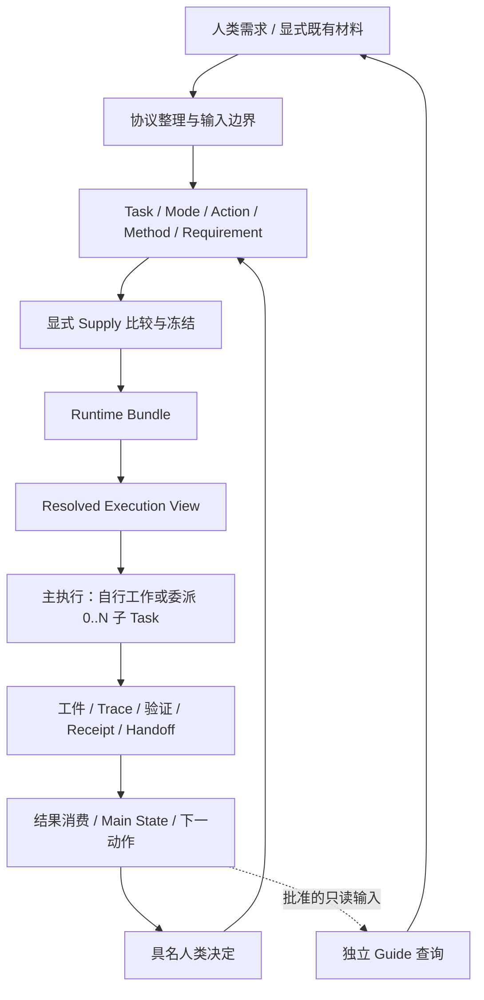

# RWB 开发者架构地图

本文帮助开发者沿输入、产出和消费接点定位实现。它不创建 Contract、Task、Gate 或 authority。
稳定语义见[总体架构](ARCHITECTURE.md)与[Accepted ADR](decisions/README.md)；当前能力见
[STATUS](STATUS.md)，任务状态、依赖与验收见[TASKS](TASKS.md)，演进方向与 Gate 见
[ROADMAP](ROADMAP.md)。实施细节集中在[契约导航](implementation/README.md)，历史过程见
[历史与审计](history/README.md)。

## 1. 先区分五件事

| 概念 | 回答的问题 | 边界 |
|---|---|---|
| 应用职责 | 本次谁整理协议、规划、执行、接收结果或解释状态？ | 可由同一 Agent 合并承担，不新增 core Role identity |
| Agent Profile | 执行者最多能读、写、调用和委派什么？ | 限定运行能力，不提供完整研究方法 |
| 职责指令 / Task | 这次做什么、读什么、输出什么、何时停止？ | 每次 AI 调用均需明确，不能以 Skill 替代 |
| Skill | 哪个可复用的方法程序补充明确语义缺口？ | 可选 Supply；需合法选择、exact pin 与实际加载事实 |
| 模块 / 会话 | 代码由谁维护 / 工作在什么临时上下文发生？ | 模块不是 Agent；会话不是研究状态或审批主体 |

路诚钺维护 Mode、Method、Capability vocabulary、Skill、读取/Handoff/Trace 与相关 fixtures；黄毅维护
Provider adapters、API session、live conformance 和 API 测试。应用窗口名或 Agent 名不替代具名负责人。

## 2. 应用流程与便携执行边界

```mermaid
flowchart TB
    H["人类需求 / 显式既有材料"] --> I["协议整理与输入边界"]
    I --> P["Task / Mode / Action / Method / Requirement"]
    P --> C["显式 Supply 比较与冻结"]
    C --> B["Runtime Bundle"]
    B --> V["Resolved Execution View"]
    V --> X["主执行：自行工作或委派 0..N 子 Task"]
    X --> O["工件 / Trace / 验证 / Receipt / Handoff"]
    O --> M["结果消费 / Main State / 下一动作"]
    M --> D["具名人类决定"]
    D --> P
    M -. "批准的只读输入" .-> G["独立 Guide 查询"]
    G --> H
```

这是接点图，不是固定科研 DAG，也不要求每个框启动一个模型会话。新项目和既有研究材料共用研究契约；
接入既有材料时先记录版本、允许集与缺失信息，不能补造来源准入、历史接受或 checkpoint。Guide 只读
批准的状态与引用，回答不自动进入主执行或研究状态。

便携执行基线始终是 **文件契约 → Runtime Bundle → Resolved Execution View → Thin Host**。
隔离 API session、本地程序或平台原生 Agent 均可充当可选 Driver/Adapter；核心不依赖某平台的线程数据库。
用户入口和多 Agent 编排是该基线之上的应用接合。入口是否自动产出全部契约、实际加载 Skill/Tool、
创建独立子会话并消费其结果，应分别验证，不能由一个 callback 或格式 fixture 推导。

候选开发与离线结果不等于已进入共享 develop、live conformance 或正式研究接受；
实际应用接合覆盖与相关候选证据统一查 STATUS。

## 3. 主链逐跳接口

| Producer | 产出契约 | Consumer | 启用条件与必须保留的失败 |
|---|---|---|---|
| 人类或协议整理调用者 | Project Protocol、显式输入清单 | 任务/方法规划调用者 | 有目标、边界与真实材料；缺失保持 unknown，草案不冒充批准 |
| Task/Method producer | Task、Method Resolution、Capability Requirement | Capability Resolver、Method Trace | Task-bound、Mode/Action exact refs；Human、blocked、split 保留 |
| Adapter/Tool/Provider 的事实报告者 | Capability Supply Report | 唯一 Capability Resolver | 显式候选和可信资格证据；Report 不选择自身 |
| Capability Resolver | Capability Resolution、Resolved Capability Snapshot | Bundle producer/loader | 唯一 eligible selection；gap/ambiguous/blocked 不伪造 executable closure |
| 显式 manifest producer / Bundle loader | Validated Runtime Bundle | View producer、Host | 完整 selected closure，Method proceed，Action/Capability slice；禁止扫描全仓发现输入 |
| View producer | Resolved Execution View | Thin Host | exact Profile/DataPolicy/Host policy/binding 与最终最严交集；不足或 stale 阻断 |
| Thin Host + pre-bound Driver | Host report、actual facts 与执行工件 | Trace / closeout producer | 重验 pins/freshness、限制调用与预算；保留 preflight block/post-call failure/unknown |
| Trace、Artifact、Validator、closeout producer | hash-pinned Trace facts、验证、Receipt | 主执行接收者 / 审计 | closed set 完整；Receipt 只声明 slice closeout，不接受 Claim 或完成整项 Task |
| 主执行接收者 / checkpoint writer | Handoff disposition、Main State、下一动作 | 新主会话 / Human / Guide | 明确采用结果和保留限制；resume check 不自动运行 next action |

### 控制侧最小实现定位

- `src/research_workbench/protocol/`：Mode、Action、Method、Protocol Profile 与 Decision Authority；契约见
  [Method Resolution](implementation/METHOD_RESOLUTION_CONTRACT.md)、
  [Mode Action](implementation/MODE_ACTION_CONTRACT.md)。Mode 不直接绑定 Skill、Tool、模型或 Runtime。
- `src/research_workbench/capability/requirements.py`、`supply.py`：Requirement、Report、比较和 status；契约见
  [需求](implementation/CAPABILITY_REQUIREMENT_CONTRACT.md)、
  [解析](implementation/CAPABILITY_RESOLUTION_CONTRACT.md)。调用者必须提供真实的资格证据与显式候选。
- 形式 Method Resolution 或 deterministic compare 不等于任意自然任务的科学方法自动规划；应用 producer
  是否已经接通，应按实际入口输出及下游消费证据判断。

### 冻结与执行最小实现定位

- `execution/runtime_bundle.py::load_runtime_bundle()`：只加载一个显式 manifest，exact-pin
  Task→Method→Requirement→selected Report→Resolution→Snapshot 与 imports，不扫描 Registry/examples。
  repository `maintainer-full` validation 不能替代 runtime-bundle 消费边界。
- `execution/execution_view.py::produce_resolved_execution_view()`：消费已选供给；冻结 exact
  Provider/Adapter/Model/Runtime/Host、Profile、DataPolicy、Host policy、freshness、outputs 和最严约束交集。
  交集仍须足以运行 selected Supply；不满足时请求上游重新解析。
- `execution/host.py::execute_frozen_view()`：只消费同一 Bundle-bound View 与一个 pre-bound Driver，调用前
  重载 pins、使用 trusted clock；不 select/rebind/fallback。事前阻止与事后检测越界必须分别报告。
- `execution/generic_closeout.py`：闭合 Host report、Trace、Artifact 与 Validation。
  `task_completion=false`；完成只指 Action/Capability slice。无 actual fact 的前置阻断不伪造调用。

对应契约：[Runtime Bundle](implementation/RUNTIME_BUNDLE_PROFILE.md)、
[Execution View](implementation/RESOLVED_EXECUTION_VIEW.md)、[Thin Host](implementation/THIN_EXECUTION_HOST.md)、
[Generic closeout](implementation/GENERIC_EXECUTION_CLOSEOUT.md)。Skill-bearing closeout另见
[Skill execution closeout](implementation/SKILL_EXECUTION_CLOSEOUT.md)；旧 Skill-bound 字段只见
[兼容面](compatibility/README.md)。

## 4. main、child 与结果消费

main 在 Protocol/Task 的深度、并发、预算和 write scope 内决定 0..N 个子 Task；零子任务是正常路径。
每次子执行都有独立 Task、允许集、Profile、冻结输入与输出契约。平台原生 child 或隔离 API session
都可承载它；独立会话不等于独立科学证据，同供应商也不等于共享隐式会话状态。

接收者必须消费子结果的具体工件引用、disposition、失败、限制、冲突与未决项，必要时按获批范围回查正文。
只传回任务 ID、成功标记或摘要而未接入所需工件，不能称为完整结果消费。并行写入必须分区；递归委派
必须显式授权；aggregate usage 保留每次调用和 unknown，不用协调摘要覆盖实际失败。

Tools 接通需要 exact selected interface、参数校验、allowlist、副作用/数据边界、执行结果及 Trace；
Skill 接通需要 exact binding、受控 package/body 读取与实际使用记录。只有 Supply 元数据或 requested
consumption 不能证明 Tool 已调用或 Skill 正文已加载。会话和工具循环的实现定位见
[API/Runtime 模块](modules/09-ADAPTERS_AND_INTEGRATIONS.md)。

## 5. 三类状态与三种事实

| 表示 | Producer / Consumer | 不能替代的内容 |
|---|---|---|
| Main State | 主执行 checkpoint writer / 新主会话、Human、只读 Guide | 研究本体、全部原始材料、并发协调数据库 |
| Research State candidate | 显式研究对象 composition producer / Method Trace、Human review | conversation memory、最终通用 kernel、自动决定或恢复策略 |
| Execution/Archive Trace | Runtime/Adapter recorder / 审计、closeout、定向排障 | Method 解释、科研 Evidence 或隐藏推理 |
| Method Trace candidate | 显式方法/状态路径 producer / 研究审查、Human | 全量 operational stream、计划 Snapshot 冒充 actual fact |
| Receipt | closeout producer / replay validator、接收者 | Task completion、Claim promotion、Human acceptance |

Research State 用 revisioned entries 引用现有 Question/Hypothesis/Evidence/Claim/Decision/Run/Task，
lightweight open items 表达 unknown/assumption，Contradiction 与 Frontier 按已声明关系表达或派生。
Research Attempt 的 state-at-attempt、predecessor Attempt、reopen justification 分开；Research Failure
保存 learned result/revisit condition，不与 execution failure、负 Evidence、Capability Gap 或 Skill Need 合并。

Method Trace exact-pin Task/Method/Mode/Action、Attempt、State 和 Decision；存在 authoritative execution
fact 时绑定同 Attempt 的 applied path/State effect，没有时明确 gap。Snapshot 和 View 是计划事实。
候选表示的机器 closure 不完成 Human/R2 semantic closeout，也不自动授予 Topic 5 实现 authority。
相关契约：[Research State](implementation/RESEARCH_STATE_CANDIDATE_CONTRACT.md)、
[Attempt/Failure](implementation/RESEARCH_ATTEMPT_FAILURE_CONTRACT.md)、
[Method Trace](implementation/METHOD_TRACE_CANDIDATE_CONTRACT.md)、
[Phase C Gate](implementation/PHASE_C_BOUNDED_GATE.md)。Gate 方向只由 ROADMAP 管理。

## 6. 按任务启用的研究与维护外环

| 外环 | 实际接点 | 启用条件 | 输出限度 |
|---|---|---|---|
| Source / Evidence | source admission sidecar→Evidence producer→Claim evidence map | 使用原始来源、需要可定位证据 | admitted bytes/hash/provenance，不证明来源可信或许可法律效力 |
| Artifact promotion | pre-Attempt Task/policy→受信 checker/runner重执行→Promotion Receipt | 从 work 复制到正式工件区 | exact资格与复制事实；保留负结果，不接受 Claim |
| Claim localization | explicit Claim/Evidence refs→locator/provenance closure | 主张需回查支持、反证与限制 | 只读定位，不补足证据或自动提升强度 |
| Run reconstruction | pinned Run/program/input/environment→fresh process report | 任务明确要求有界重建 | 输出集合与字节一致，不证明任意环境可复现或科学正确 |
| Method Trace / Research State | 显式 applied path/actual fact或gap→state composition | 需要研究轨迹和对象接续 | 候选结构 closure，Human/R2语义接受独立 |
| Skill维护 | Maintainer triage→Need→Candidate→Evaluation→Human Admission→Release/Projection | 简单Task/Tool/checker不足且存在可复用语义缺口 | 可选准入供给，不控制运行中的 Task 或 frozen selection |
| 系统价值评估 | 冻结案例/四臂→qualification/comparability→运行记录→盲评与分析 | 独立批准的评价任务 | 指定比较的价值证据，不成为每个研究Task的必经步骤 |

工件实现见 `src/research_workbench/artifacts/` 与[模块07](modules/07-ARTIFACTS_AND_PROVENANCE.md)。
Skill维护边界见[ADR-0019](decisions/0019-OPTIONAL-MAINTAINER-SKILL-EVOLUTION-OUTER-LOOP.md)、
[Skill Need](implementation/SKILL_NEED_CONTRACT.md)、[Release Projection](implementation/SKILL_RELEASE_PROJECTION.md)。
Runtime只消费不可变投影形成的候选 Supply，不读 Need/Candidate/Evaluation/Lifecycle。
Projection缺失只阻塞该Skill路径；no-Skill/direct-Tool/procedure/Adapter/Provider Core照常按资格闭合。
Runtime失败只形成有界 Diagnostic，正式Need来自具名Maintainer独立triage。

## 7. 评价专属传输与解释规则

四臂是 Plain Agent、Plain Agent+Tool、Mode+no-Skill/direct-tool、Mode+candidate Skill。
共享 Task/input、Model、Host、预算、context和evidence classes；treatment binding分别冻结。
[ADR-0020](decisions/0020-PHASE-D-DUAL-TRANSPORT-SYSTEM-ESTIMAND.md)规定 A1/A2 使用隔离session，
A3使用Core，A4使用projection-backed Skill extension。`A4−A2` 是含transport差异的系统净收益；
`A2−A1` 是同transport Tool增量；只有pairwise exact-skill-only才可将`A4−A3`称Skill条件增量，
否则降为package/bundled effect或unavailable；`A3−A2`不称pure Mode effect。

计划编译不执行。正式 arm qualification拒绝structural-replay；A4保留candidate-origin treatment identity，
运行供给必须走具名Admission→Release→Projection→Supply→Resolution→Snapshot→Bundle→View→Host。
Runtime不读candidate或评分历史。case/oracle先于输出冻结，Human盲评先于条件揭示；overlap/held-out与
pairwise comparability独立重算，Research Integrity退化不能由效率抵消，也不压成一个加权分数。
Harness和baseline transport均不拥有Supply selection。

契约及实施入口：[Manifest](implementation/EVALUATION_MANIFEST_CONTRACT.md)、
[Protocol](implementation/SYSTEM_EVALUATION_PROTOCOL.md)、[Harness](implementation/SYSTEM_EVALUATION_HARNESS.md)、
[模块10](modules/10-OBSERVABILITY_EVALUATION_COST.md)。这些评价规则不代替普通入口、child结果消费或Tool加载桥接。

## 8. 验证与开发时的四问

1. 谁产出、谁消费，什么条件触发，为什么相邻层不能代替？
2. identity/version/hash、引用闭包、权限与歧义是否可重算？
3. 是否存在实际producer/consumer调用，失败是否fail closed，还是只有fixture或裸callback？
4. 是否有独立证据证明减少遗漏、返工、回查、成本或研究风险？

结构PASS、离线fixture、live调用、Task合同完成、科研价值和人类接受是不同证据层级。
Validator只能在声明scope内重算；不能证明asserted事实、记录人类批准或授予权限。
发布投影遵循[ADR-0021](decisions/0021-CURATED-DEVELOP-TO-MAIN-RELEASE.md)，不取得Runtime、Method、Claim或
Human authority。公共阅读面和产品发行也不能替代研究价值证据。当前状态与缺口均回到STATUS/TASKS，
本图不维护第二套成熟度矩阵。
