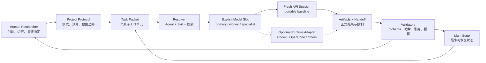

# Research Agent Workbench 使用指南与发布就绪度

- 文档状态：面向首次使用者的当前实现指南
- 适用版本：`0.1.x` 开发快照
- 更新日期：2026-08-14

## 1. 先说结论

Research Agent Workbench（下文简称 Workbench）不是自动运行整个课题的“AI 课题组”，也不是另一个子 Agent 调度器。它是一层放在 Codex、Claude Code 或模型 API 之上的科研工作契约：帮助研究者明确这次任务由谁做、加载哪个 Skill、可以读取和写入什么、必须交付哪些工件、如何验证，以及上下文不足时如何安全暂停和恢复。

当前版本已经适合三类用途：

1. 阅读和复用架构、Schema、风险边界；
2. 在本仓库中运行完整的离线示例、生成确定性的 Agent/Skill Assignment 和 Codex dispatch；
3. 由熟悉 Git、YAML 和模型 API/Agent 平台的开发者进行受控试点。

当前版本还不适合：

- 作为 PyPI 上安装后即可独立使用的一键科研应用；
- 自动启动、监控和回收所有原生子 Agent；
- 在没有人工研究判断时自动接受 Claim 或对外发布；
- 把结构校验通过当作科学正确；
- 在未经真实案例验证时宣称多 Agent 比单 Agent 更好。

发布判断：当前可称为“内部技术 alpha”，尚未达到“外部可复用 pilot”，更没有达到稳定 `1.0`。决定距离的不是还要增加多少 Agent，而是后文列出的真实执行、项目脚手架、许可、兼容性和科研价值证据是否完成。

## 2. 用五分钟理解架构

一次工作由以下链条组成：



初次使用只需理解九个概念：

| 概念 | 用一句话解释 | 仓库示例 |
|---|---|---|
| Project Protocol | 本项目允许什么、禁止什么，谁拥有最终决定 | [`examples/project-protocol.yaml`](../examples/project-protocol.yaml) |
| Research Mode | 当前活动是证据综合、仿真、推导还是其他方法模式 | [`registry/modes`](../registry/modes) |
| Agent Profile | 执行者的用途、工具和最高权限 | [`registry/agents`](../registry/agents) |
| Skill | 完成某类任务的可复用方法，不持有项目状态 | [`.agents/skills`](../.agents/skills) |
| Task Packet | 这一次具体要完成的一个原子工作单元 | [`examples/task-evidence.yaml`](../examples/task-evidence.yaml) |
| Skill Assignment | Resolver 固定下来的 Agent、Skill、权限和内容哈希 | [`examples/vertical-slice/evidence-assignment.yaml`](../examples/vertical-slice/evidence-assignment.yaml) |
| Model Slot | 显式选择主模型、平价工作模型或特定能力模型 | [`registry/models/pool.example.yaml`](../registry/models/pool.example.yaml) |
| Handoff / Receipt | 子 Agent 正式交付了什么，实际执行和验证情况如何 | [`examples/handoff-evidence.yaml`](../examples/handoff-evidence.yaml) |
| Main State | 新主会话恢复所需的最小状态，不复制聊天历史 | [`examples/main-state.yaml`](../examples/main-state.yaml) |

四个最容易混淆的概念必须分开：

- Mode 规定研究方法约束；
- Agent Profile 规定谁以什么权限执行；
- Skill 规定如何完成一类任务；
- Tool 只规定能访问或执行什么。

不要为每个学科创建一个全能 Agent。新增差异应优先落在 Mode、Skill 或 Tool Adapter 中，公共内核只保存跨研究活动都需要的最小对象。

## 3. 安装与首次自检

### 3.1 前置条件

- Python 3.11 或更高版本；
- Git；
- PowerShell、Bash 或同等命令行；
- 实际纯 API 执行需要一个已配置的 Provider 和模型；Codex、OpenCode 等平台不是必须条件；
- 离线示例和 dry-run 不需要模型 API 凭据。

### 3.2 安装开发快照

PowerShell：

```powershell
git clone https://github.com/Chengyue-Lu/research-agent-workbench.git
Set-Location research-agent-workbench
git switch agent/m1-provider-neutral-foundation
python -m venv .venv
.\.venv\Scripts\python.exe -m pip install -e .
```

上面的分支名是本指南编写时承载当前实现的开发分支；合并或正式发布后应改用对应的 `main`、tag 或固定 commit。如果已激活虚拟环境，也可以直接运行 `python -m pip install -e .`。当前没有正式发布的 wheel 或 PyPI 版本，推荐从固定 Git commit 或 tag 安装，不要无版本地依赖移动分支。

### 3.3 验证安装

```powershell
.\.venv\Scripts\rwb.exe --help
.\.venv\Scripts\rwb.exe validate examples registry
```

当前仓库快照的预期摘要是：

```text
validated=<current count> errors=0 warnings=0
```

这个命令只读取本地文件，检查 Schema、引用、内容哈希和 Registry 关系，不会启动 Agent，也不会调用模型 API。

如果不使用虚拟环境，后文的 `rwb` 可以替换为安装后实际生成的可执行入口。

## 4. 十分钟完成第一条离线路线

这一节使用仓库自带的合成证据任务，不会处理真实论文，也不会发出网络请求。

### 4.1 查看已准入 Skills

```powershell
rwb skills accepted --root .
```

你会看到三个仓库级 Skill：

- `literature-evidence-extraction`；
- `simulation-vv`；
- `handoff-integrity`。

“accepted”只表示它进入了本项目的固定 Registry，不表示科学正确，也不表示所有外部项目都应采用。

### 4.2 检查 Codex 原生布局

```powershell
rwb runtime codex validate --root .
```

该命令核对 `.codex/agents`、`.agents/skills` 与平台中立 Registry 的映射。它不会启动 Codex 子 Agent。

### 4.3 解析 Task、Agent 与 Skill

```powershell
New-Item -ItemType Directory -Force work/quickstart | Out-Null
rwb task resolve examples/task-evidence.yaml `
  --profile registry/agents/evidence-scout.yaml `
  --registry registry/skills/accepted.json `
  --root . `
  --output work/quickstart/evidence-assignment.yaml
```

Resolver 会检查：

- Task 要求的 capability 是否被 Skill 覆盖；
- Task、Profile 和 Skill 的权限交集；
- Skill 内容、包和 Registry 哈希；
- 输出契约、工具、冲突和禁止项。

相同输入应生成相同 Assignment ID。修改 Task revision、Skill 内容、工具或权限后应重新解析，不能沿用旧 Assignment。

### 4.4 生成最小 dispatch

```powershell
rwb runtime codex render examples/task-evidence.yaml `
  --profile registry/agents/evidence-scout.yaml `
  --registry registry/skills/accepted.json `
  --root . `
  --output work/quickstart/evidence-dispatch.txt
```

dispatch 只包含 Task 边界、输入路径与哈希、写入范围、显式 Skill、完成检查和暂停条件。它不会嵌入论文全文、其他 Skill 正文或主会话历史。

到这里仍然没有启动 Agent。这是已有的可选 Codex dispatch 路径。Task-to-API 文件桥接由黄毅维护；路诚钺当前主线是 Mode–Skill 选择、Agent Trace 与上下文成本，不依赖该桥接完成后才开始。

### 4.5 检查一份已有 Handoff

```powershell
rwb handoff validate examples/handoff-evidence.yaml `
  --task examples/task-evidence.yaml `
  --assignment examples/vertical-slice/evidence-assignment.yaml `
  --root .

rwb handoff audit-transfer `
  examples/handoff-transfer-audit-evidence.yaml `
  --root .

rwb execution assess `
  examples/observability/execution-evidence-contract.yaml `
  --protocol examples/project-protocol.yaml `
  --root .
```

该 evidence 示例的 Task 明确要求 Transfer Manifest，因此属于 H2 路径。普通 H1 Handoff 不需要运行 `audit-transfer`。`HANDOFF-SEMANTIC-UNREVIEWED` 是一个有意保留的警告：它表示结构覆盖已通过，但没有冒充语义等价或科学审查。只有真实的独立抽样或人工判断才能解除相应语义风险。

### 4.6 检查安全暂停能否恢复

```powershell
rwb context resume-check `
  examples/continuity/main-state-safe-pause.yaml `
  --protocol examples/project-protocol.yaml `
  --root .
```

预期结果是没有 blocking deterministic risks。它证明文件引用、哈希、状态和下一动作自洽，不证明下一次模型执行一定正确。

## 5. 当前怎样实际运行一个子 Agent

当前仓库已经有 fresh API session 内核，但尚未提供完整的 Task-to-API CLI 和自动 Trace 捕获。因此过渡期有两种受控方式：开发者直接调用该内核进行离线/集成测试，或使用现有 Codex dispatch 作为人工平台入口。无论采用哪种方式，Workbench 都使用同一套契约和 Attempt Archive；黄毅负责执行端实现，路诚钺负责 Mode/Skill/Trace 方法与评估。

1. 人类批准 Project Protocol 和本次 Task 边界；
2. 用 `rwb task resolve` 生成不可变 Assignment；
3. 显式绑定 `primary`、`worker` 或 specialist 模型槽；若走平台路径，再用 `rwb runtime codex render` 生成最小 dispatch；
4. 为子任务新建独立 API session 或平台窗口，不继承主 Agent 全历史；同时创建 Attempt Archive、稳定 actor_id 和实名 accountable owner；
5. 让子 Agent 只读取 Task、选定 Skill、`input_refs` 和获批目标模块；可以先看路径元数据，新增正文需请求扩展；只写入 `write_scope`；
6. 每条 Agent 间可见传递写入 `messages/`；简短 Worklog 只做导航。普通返回写 H1 Compact Handoff，只有风险/压缩/副作用等触发时才增加 H2 Manifest/Audit/Receipt；
7. 运行确定性检查和 `rwb handoff validate`；
8. 主 Agent 只读取 Handoff、风险、Attempt/工件索引和下一动作；仅在排障 Task 获批后按 message ID 回放原文；
9. 需要换主会话时生成 Main State，新会话先通过 `resume-check`。

给 API session 或平台 Agent 的指令至少要明确：

```text
执行指定 Task Packet；使用指定 Agent Profile 和 required Skill；
不得扩大输入、写入范围、权限或委派深度；
先持久化正式工件，再返回 Handoff；
机器完成检查未通过时只能 safe-paused，不能宣称 completed。
```

不要把整个仓库、全部 Skills、完整聊天和所有原始材料一次性塞给子 Agent。需要查看来源时沿 `input_refs` 按需读取；需要未声明正文时先扩展 Task 允许集，不能先扫完再补理由。

## 6. 从零建立一个真实 Task

### 6.1 先写 Project Protocol

Project Protocol 至少要回答：

- 当前研究问题是什么；
- 激活哪些 Research Modes；
- Claim 最多可以说到什么强度；
- 哪些决定必须由人类批准；
- 数据能否外发；
- 并发、委派深度和协调成本上限是多少；
- 主 Agent 是否允许加载原始材料。

可以从 [`examples/project-protocol.yaml`](../examples/project-protocol.yaml) 复制并修改。

### 6.2 把工作切成一个 Atomic Work Unit

一个合格 Task 不应写成“完成整个课题”或“研究这个问题”。它应该能在一个明确边界结束，例如：

- 检查一组已限定来源并生成 Evidence records；
- 审计一个固定仿真版本的收敛和敏感性；
- 验证一个推导步骤及其假设；
- 对一个已固定数据集执行预先声明的统计检查。

Task Packet 的关键字段：

| 字段 | 必须回答的问题 |
|---|---|
| `goal` | 这一次具体要得到什么 |
| `active_modes` | 使用什么研究方法约束 |
| `required_capabilities` / `required_skills` | 需要哪些能力和方法 |
| `input_refs` | 允许读取哪些固定输入 |
| `write_scope` | 只能写到哪里 |
| `permissions` | 文件、网络和外部写权限 |
| `budget` | 最大轮次、输出和其他预算 |
| `atomic_boundary` | 到哪个边界可以安全结束或换窗 |
| `completion_checks` | 哪些机器检查通过才算满足合同 |
| `safe_pause_conditions` | 什么情况下允许持久化后暂停 |
| `stop_conditions` | 何时停止继续扩张 |

证据任务的完整写法见 [`examples/task-evidence.yaml`](../examples/task-evidence.yaml)，仿真任务见 [`examples/task-simulation.yaml`](../examples/task-simulation.yaml)。

### 6.3 固定输入哈希

```powershell
rwb hash path/to/input-file
```

把输出的 SHA-256 写入 `input_refs`。如果输入内容变化，应创建新的 Task revision 或明确的新 Attempt，不能只替换哈希并假装同一次执行仍可复现。

### 6.4 选择最小 Agent 和 Skill

选择顺序是：

1. Task 先声明 capability 和数据/权限边界；
2. 选择满足用途且权限不过大的 Agent Profile；
3. 从 accepted Registry 选择最少 Skills；
4. Resolver 计算最终交集并生成 Assignment。

默认最多两个主 Skill和一个完整性检查 Skill。若需要加载更多，通常意味着 Task 过宽，应拆成多个原子单元。

### 6.5 交付正式结果

一次真实执行至少应留下：

- Task Packet；
- Skill Assignment；
- Attempt；
- 领域工件，例如 Evidence、Run 或 V&V report；
- Handoff Packet；
- Execution Receipt；
- 若 Task 要求，Transfer Manifest 和 Transfer Audit；
- 若会话需要交接，Context Snapshot 和 Main State。

聊天摘要不是这些工件的替代品。

## 7. 状态、完成与安全暂停

### 7.1 不要混淆三种“完成”

| 位置 | 状态含义 |
|---|---|
| Attempt / Receipt 的 `status: completed` | 本次执行生命周期已经结束 |
| Handoff 的 `status: completed` | Task 合同声称已经完成 |
| Receipt 的 `completion_claim: contract-satisfied` | 明确声明机器证据支持 Task 合同满足 |

执行结束可以得到失败结果或负对照，因此不自动等于合同满足。显式 `contract-satisfied` 如果缺少内核可解释的机器验证，或者验证报告为 `fail`，会被阻断。

### 7.2 什么时候使用 `safe-paused`

出现以下情况时应安全暂停，而不是硬写“完成”：

- 下一原子单元会侵占收尾和安全余量；
- 所需来源、权限或人工决定尚不可用；
- 机器检查尚未通过，但当前进度已经持久化；
- 继续执行会越过 Task 的数据、预算或方法边界。

动态上下文条件是：

```text
remaining >= next_atomic_cost + closeout_cost + safety_margin
```

不满足时不启动下一 AWU。若连 `closeout_cost + safety_margin` 都无法覆盖，应停止扩张并立即写入最小可恢复状态。

### 7.3 创建 Context Snapshot 和 Main State

```powershell
rwb context assess --id CTX-001 `
  --protocol examples/project-protocol.yaml `
  --scope main `
  --metric loaded_chars=25000 `
  --context-budget-status estimated `
  --context-budget-unit characters `
  --remaining-context 5000 `
  --next-atomic-cost 4000 `
  --closeout-cost 800 `
  --safety-margin 500 `
  --output work/CTX-001.yaml

rwb context checkpoint --id MS-001 `
  --protocol examples/project-protocol.yaml `
  --snapshot work/CTX-001.yaml `
  --continuity-status safe-paused `
  --rollover-reason "Next AWU would consume the closeout reserve." `
  --next-action "Validate the checkpoint, then run only the pending AWU." `
  --capture-git-head `
  --root . `
  --output work/MS-001.yaml
```

`--capture-git-head` 只能锁定已提交 HEAD，不能代表未提交工作树；应在明确的提交边界使用。Main State 还会用哈希固定协议、Snapshot 和显式提供的 `--machine-state-ref`。

YAML 工件采用排他原子发布，不覆盖已有文件。若输出路径已存在，请创建新的 ID/文件，而不是删除旧 Attempt 或 checkpoint。

## 8. 怎样为不同研究类型扩展

新增需求时按下面的判断放置，不要直接扩大公共内核：

| 需求 | 应放在哪里 |
|---|---|
| 某类研究活动共同的方法约束 | Research Mode Pack |
| 可复用的执行方法、检查清单或脚本 | Skill |
| 文件、检索、仿真、统计或外部系统访问 | Tool Adapter |
| 一类受限执行者的工具和权限上限 | Agent Profile |
| 本项目独有的数据、问题和决定 | Project Protocol / Research Objects |
| 跨平台消息或模型调用差异 | Runtime / Provider Adapter |

例如：

- 理论推导不应复用仿真的收敛检查，而应建立 assumption ledger、符号检查和反例搜索 Skill；
- 重实验模式应强调 protocol version、calibration、排除规则和人工 Gate；
- 观察统计模式应强调 cohort、missingness、multiple testing 和 causal ceiling；
- 证据综合模式应强调来源准入、定位引用、反证和证据强度。

任何新 Skill 都先进入候选区，经过来源、许可、安全、trigger/non-trigger、边界失败和真实 paired evaluation，再由人类决定是否进入 accepted Registry。目录存在或下载成功不等于准入。

## 9. 常用命令速查

| 目的 | 命令 |
|---|---|
| 初始化最小目录 | `rwb init <empty-path> --project-id <id>` |
| 校验文件/目录 | `rwb validate <paths...> --root <project-root>` |
| 计算输入哈希 | `rwb hash <file>` |
| 查看 Schema | `rwb schema list` |
| 查看 accepted Skills | `rwb skills accepted --root .` |
| 解析 Task | `rwb task resolve <task> --profile <profile> --registry <registry>` |
| 检查 Codex 布局 | `rwb runtime codex validate --root .` |
| 生成 Codex dispatch | `rwb runtime codex render <task> --profile <profile> --root .` |
| 校验 Handoff | `rwb handoff validate <handoff> --task <task> --assignment <assignment>` |
| 审计压缩交接 | `rwb handoff audit-transfer <audit> --root .` |
| 检查引用 | `rwb reference check <document> --root .` |
| 追踪 Claim | `rwb claim trace <claim> --protocol <protocol>` |
| 评估上下文 | `rwb context assess ...` |
| 创建恢复包 | `rwb context checkpoint ...` |
| 新会话恢复前检查 | `rwb context resume-check <state> --protocol <protocol>` |
| 审计执行收据 | `rwb execution assess <receipt> --protocol <protocol>` |
| Provider 零环境 dry-run | `rwb providers conformance --adapter <adapter>` |

`rwb init` 当前只创建 `project-protocol.yaml` 和 `objects/tasks/handoffs/checkpoints/work` 目录。它不会复制 Agent Profiles、accepted Skills、Registry 或 Codex 配置，因此目前只是最小文件项目初始化器，不是完整的可复用项目脚手架。首次试用应先在本仓库运行示例；真实试点建议固定本仓库 commit，并将它作为每个试点项目的完整模板。

## 10. 常见问题与处理

### `rwb` 命令不存在

确认执行了 `python -m pip install -e .`，并使用同一 Python 环境。Windows 下可直接调用 `.venv\Scripts\rwb.exe`，无需激活环境。

### `REF-HASH-MISMATCH`

引用文件内容已经变化。先判断这是篡改、自然更新还是新输入：

- 意外变化：恢复原文件或停止；
- 合法新输入：创建新的 Task revision/Attempt，并重新解析 Assignment；
- 不要只改哈希来消除错误。

### `TASK-SKILL-MISMATCH` 或解析失败

检查 required capability、required Skill、Agent Profile 工具、网络权限和 write scope。不要为了通过 Resolver 给 Agent 扩大全局权限，应缩小 Task 或选择更合适的 Profile/Skill。

### `HANDOFF-SEMANTIC-UNREVIEWED`

结构映射已通过，但没有科学语义审查。低风险任务可保留警告；关键 Claim 应执行 Task policy 要求的最小独立抽样或 Human Gate。

### `CTX-NEXT-AWU-UNSAFE`

不要启动下一原子单元。完成当前工件、Handoff、Snapshot 和 Main State，然后换主会话。

### `RESUME-CONFLICT-GIT`

checkpoint 记录的 Git HEAD 与当前仓库不同。先解释代码/契约变更，再重新生成恢复包；不要忽略后继续执行旧下一动作。

### 输出文件已存在

Workbench 默认不覆盖正式 YAML。为新的 Attempt、报告或 checkpoint 使用新 ID 和新文件，保留失败历史。

### 验证通过是否代表结果可靠

不代表。Validator 只能证明 Schema、引用、哈希、权限、状态等机器可判定条件自洽。来源质量、方法合理性、因果解释和外部发布仍由领域检查和人类负责。

## 11. 当前发布就绪度

### 11.1 按能力评估

| 能力 | 当前状态 | 判断 |
|---|---|---|
| 产品边界和总体架构 | 已形成 Charter、Architecture、模块和 ADR | 可复用 |
| Schema、模型和确定性验证 | 本地测试和全部示例/Registry 校验通过 | 技术 alpha 可用 |
| CLI | 可 init、validate、resolve、render、audit、checkpoint | 技术 alpha 可用 |
| Agent—Skill 路由 | 两条不同 Skill 的离线切片可重放 | 路诚钺尚缺 Mode 决策卡、选择矩阵和增量价值证据 |
| API Session 内核 | 显式模型槽、有界工具循环和无 fallback 已测试 | Task-to-API 与真实调用由黄毅维护 |
| Codex Runtime Adapter | 布局、能力和 dispatch 已实现 | 可选路径，不在当前关键路径 |
| 上下文连续性 | SAFE_PAUSE、哈希、digest、Git 冲突和恢复 fixture 已实现 | 缺真实跨会话恢复 |
| Handoff 压缩审计 | Manifest/Audit 和风险触发抽样契约已实现 | 路诚钺尚缺 H1/H2 成本对照与真实材料样本 |
| Agent 过程留痕 | 已冻结实名 actor、Attempt Archive 和按需读取规则 | Trace Schema/validator 与运行时自动捕获尚未实现 |
| Provider Adapters | OpenAI、Anthropic、Gemini 离线合同和有界 runner 已实现 | 由黄毅继续维护 |
| Skill 供应链 | 候选隔离、静态审计、paired evaluation 契约已实现 | accepted Skills 仍标记 `project-original-unlicensed` |
| 工件 promotion 和 Run 复现 | 已有架构与任务 | 核心实现未完成 |
| 科研价值 | 有指标和对照计划 | 尚无两个真实案例，也未证明多 Agent 净收益 |
| 分发与法律 | 有 `pyproject.toml` | 无 LICENSE、正式 release、wheel/PyPI 和兼容性承诺 |

### 11.2 分级发布距离

#### 当前：内部技术 alpha

已经达到。适合维护者和愿意阅读 YAML/契约的协作者进行离线验证与受控试点。此级别不承诺独立脚手架、稳定 API 或科研效果。

#### 下一档：外部可复用 pilot

至少还需关闭六个发布 Gate：

1. 路诚钺完成 `K-MS-1` Mode–Skill/Trace 选择基线；黄毅并行完成 Task-to-API 闭环；
2. 完成一次真实 `safe-paused → 新主会话 → 正确下一动作` 恢复；
3. 把 `rwb init` 升级为可选择的完整项目模板，或提供受支持的 template repository；
4. 选择并加入项目 LICENSE，同时清理 accepted Skills 的许可状态；
5. 在 Windows 和 CI/Linux 上验证安装、原子文件发布和完整 quickstart；
6. 定义 `0.x` Schema/CLI 兼容、迁移和废弃政策。

完成这些后可以发布 `0.2.x pilot`，邀请少量外部研究者使用，但仍不能宣称科研价值或生产稳定性。

#### 再下一档：公开 beta

除 pilot Gate 外，还需：

1. 完成 source admission、work → object/run promotion 和 Run reproducibility；
2. 用至少一个证据综合案例和一个理论/仿真案例完成真实端到端验证；
3. 对单 Agent、轻量委派、多 Agent 做同任务对照，记录质量、返工、上下文和成本；
4. 完成真实 Handoff 语义抽样，测量遗漏和失真；
5. 若对外宣称某个模型 API 兼容，完成实际启用槽位的真实、有界、脱敏 conformance；
6. 增加 release 构建、安装测试、安全/数据边界说明和最小维护政策。

达到这些条件后，才适合标记 `0.x beta`。Provider conformance 不是所有本地文件用户的前置，但如果产品宣传多 API 兼容，它就是发布前置。

#### 稳定 `1.0`

`1.0` 不要求实现所有设想模块，但要求已承诺的范围稳定：

- 至少两个真实研究案例证明框架不会系统性遗漏关键状态；
- 有数据证明哪些任务值得用多 Agent，哪些应退回单 Agent + Skill；
- 协调与校核成本长期不超过任务成本的合理比例；
- 核心 Schema、CLI 和迁移政策稳定；
- 外部用户无需理解仓库内部结构即可初始化、运行、恢复和审计；
- 至少删除或简化一项真实数据证明无价值的控制机制；
- 许可、发布物、支持平台和安全边界明确。

因此距离 `1.0` 不能用代码完成百分比可靠表达。工程骨架已经形成，但决定稳定发布的真实执行与科研验证证据仍基本未开始。更准确的表述是：内部 alpha 已到位，外部 pilot 还差六个明确 Gate，公开 beta 和 `1.0` 还依赖 M4/M5 的真实案例证据。

## 12. 推荐的下一步顺序

发布关键路径应保持克制：

1. 先完成 Attempt Archive、实名 actor 与 Agent Trace 的手工 fixture/validator，使后续试验可以回放；
2. 完成 `K-MS-1`：Mode 决策卡、6 个边界 fixtures、Task-to-Skill 选择矩阵和 accepted Skill 边界审计；
3. 为同类任务比较 H1/H2 与内容读取扩展成本，删减没有改变决策的控制项；
4. 对一个 triage candidate 作 reject/retain-reference/continue-trial 决定；
5. 黄毅独立推进 Task-to-API、恢复、自动 Trace 捕获和真实模型证据；路诚钺只消费正式脱敏工件；
6. 同步确定 LICENSE 和完整项目 scaffold 方案；
7. 再进入两个真实科研案例、M4 工件 promotion/复现和对照评估；
8. 只有文件式连续性 benchmark 出现可复现瓶颈时，才评估 SQLite/FTS；图层只能作为 Index，不能成为事实源。

不要把增加 Supervisor、数据库、Agent 数量或 reviewer 层数当作发布进度。每个新增机制都应有真实故障、消费方、成本和删除条件。

## 13. 继续阅读

- [文档导航](README.md)
- [开发协作指南](DEVELOPMENT.md)
- [项目章程](PROJECT_CHARTER.md)
- [总体架构](ARCHITECTURE.md)
- [Task 与 Handoff](modules/05-TASK_AND_HANDOFF.md)
- [上下文治理](modules/06-CONTEXT_GOVERNANCE.md)
- [验证、风险与 Human Gate](modules/08-VALIDATION_RISK_AND_GATES.md)
- [实施任务清单](TASKS.md)
- [工件与 Agent Trace](modules/07-ARTIFACTS_AND_PROVENANCE.md)
- [Changelog](../CHANGELOG.md)
