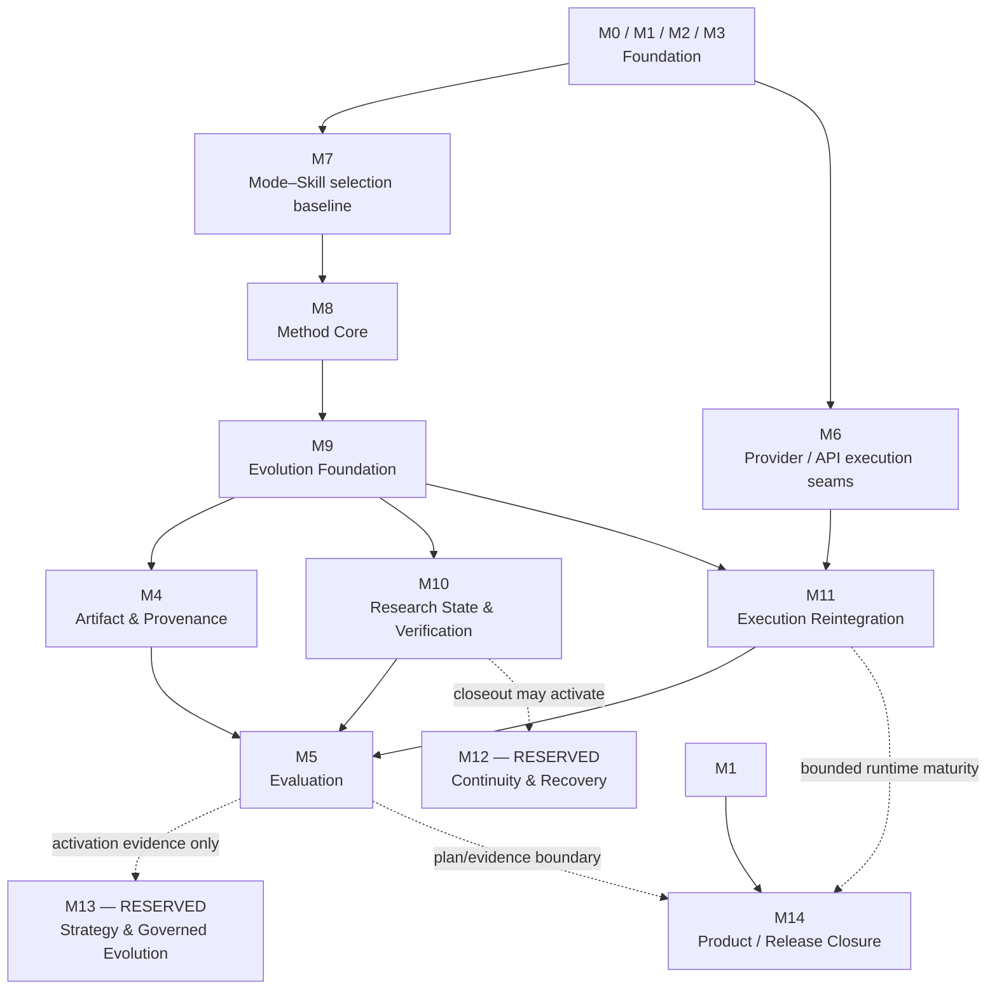
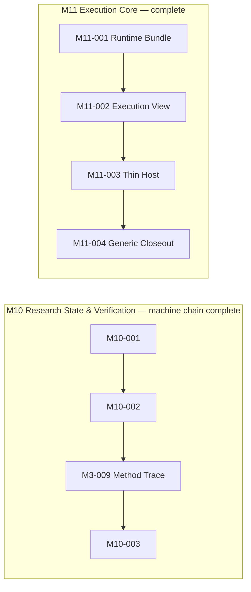
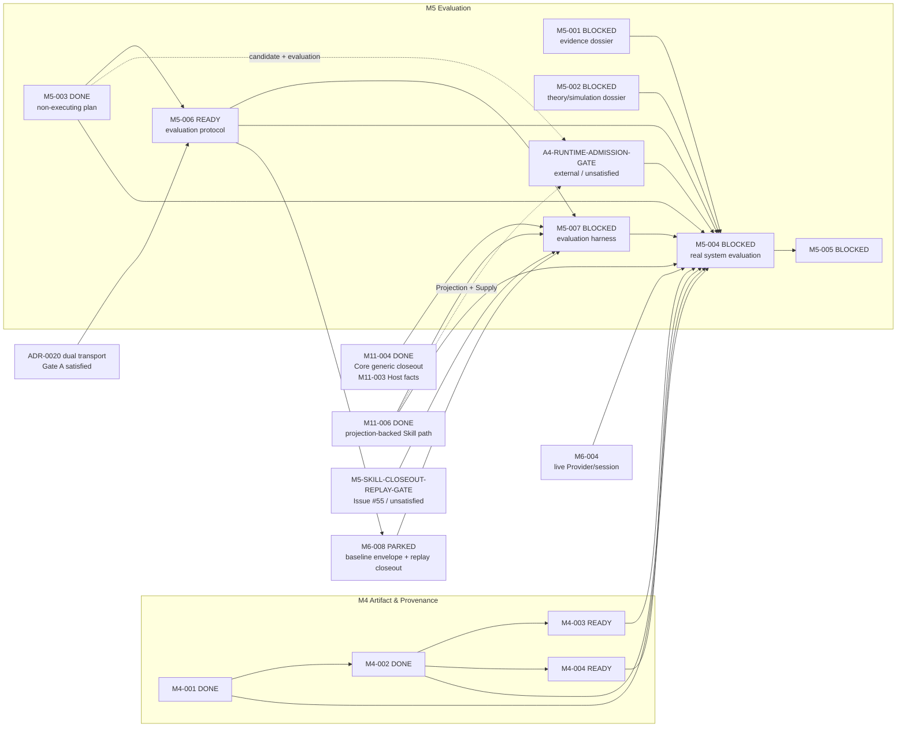
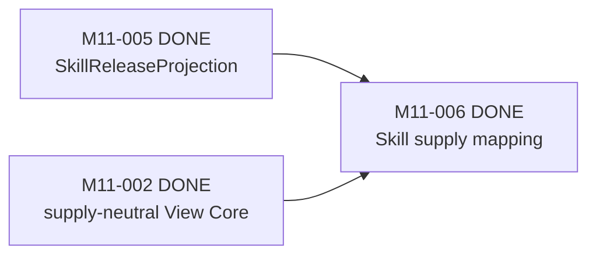
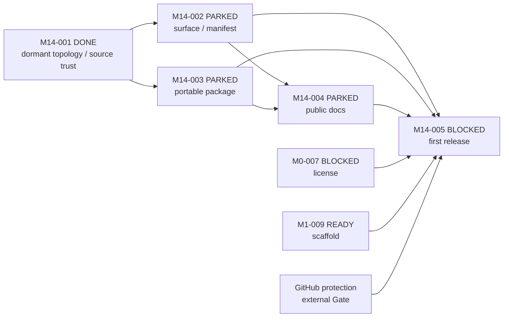

# M-series Implementation / Construction Map

状态：canonical implementation navigation；由 [`TASKS.md`](TASKS.md) 派生，不拥有独立的 Task
状态、依赖或验收 authority。

这张图只回答“普通开发沿哪些 M-group 与原子 M Task 施工”。Phase、Topic、authority 与 architecture
Gate 的原因解释见 [`DEVELOPER_ARCHITECTURE_MAP.md`](DEVELOPER_ARCHITECTURE_MAP.md) 和
[`ROADMAP.md`](ROADMAP.md)。

```text
M-group = implementation family / development route
Mxx-yyy = atomic executable Task
```

## 1. M-group 主施工图



箭头是 family-level 施工导航，不是机械的 hard dependency。任何具体 Task 的 exact dependency、状态、
owner、scope 与 acceptance 都以 `TASKS.md` 的 Task 行为准。M12/M13 仍是 reservation，不在执行队列；
M14 已 task-defined，`M14-001` dormant trust seam 为 DONE；其余仍为 PARKED/BLOCKED。虚线只表示 maturity
evidence，不生成 hard dependency。

## 2. M-group 索引

| M-group | Family | Definition status |
|---|---|---|
| M0 | Architecture & repository foundation | task-defined |
| M1 | Contracts & CLI | task-defined |
| M2 | Agent & Skill foundations | task-defined |
| M3 | Context, Trace & risk | task-defined；部分 residual work PARKED |
| M4 | Artifact, provenance & reproducibility | task-defined |
| M5 | Evaluation & pruning | task-defined |
| M6 | Provider/API execution seams | task-defined；M6-008 等待 M5-006 shared qualification contract，当前 PARKED；具名责任人维护 |
| M7 | Mode–Skill selection & coordination evidence | task-defined |
| M8 | Method Core formalization | task-defined and complete |
| M9 | Evolution Foundation | task-defined and complete |
| M10 | Research State & verification | task-defined；bounded machine chain complete，Human/R2 semantic closeout 独立 pending |
| M11 | Execution reintegration | task-defined；Core 与 optional Skill extension complete；生产 projection index 仍为空 |
| M12 | Execution Continuity & Recovery | **RESERVED** |
| M13 | Strategy & Governed Evolution | **RESERVED** |
| M14 | Product / Release Closure | task-defined；M14-001 DONE，其余依 DAG PARKED/BLOCKED |

`task-defined` 只表示该 family 已有原子 Task，不表示全部 Task 已完成。实时状态仍见 `TASKS.md`。

## 3. 当前派生施工位置

本节从 `TASKS.md` 派生，不维护独立 Task truth。以下分组只帮助开发者区分已完成链、
当前 frontier 与可选支线；状态发生变化时必须先更新 `TASKS.md`，再刷新本图。

### 3.1 Completed chains



`M3-009` 保留历史 identity，即使它位于 M10 的 canonical implementation chain；不得为了图形
连续性 cosmetic renumber。M10 的 machine chain complete 不等于 Human/R2 semantic closeout，M11 Core
complete 也不等于 live Provider 或 ordinary-user E2E。M4-001 Source Admission 与 M5-003 Evaluation
Manifest 也是已完成的当前后继前置。

### 3.2 Current frontier



M4-002 已闭合 fail-closed promotion（validity semantics：validation host 实际执行产出 provenance 三元组，eligibility 由 promotion-time 确定性重执行等价当场确立）；M4-003/004 现为两个独立 READY 后继。M5-004 同时等待
M4 闭环、两个 Human-approved public/private Case Dossier、M5-003 计划契约、M5-006 Protocol、M5-007
Harness、M11-006 真实 projection-backed Skill 路径与 M6-004 live Provider/session Gate。ADR-0020 已 exact-pin
双传输并关闭 `M5-BASELINE-TRANSPORT-ARCHITECTURE-GATE`：A1/A2→M6、A3→M11 Core、A4→M11 Skill
extension，primary `A4 − A2` 明确包含 transport difference；M5-006 因此 READY。`A4 − A3` 只有在
`A3A4PairwiseComparabilityRecord` 证明唯一差异是 admitted Skill extension 时才可称 Skill conditional
increment，否则降级为 bundled/package effect 或 unavailable。Decision 不冒充 transport implementation；
M5-006 拥有覆盖 A2/A3 的 `ArmExecutionQualificationRecord@1.0.0` contract/validator，M6-008 只负责 A1/A2
正向白名单 input、正式 A2 record、逐 provider request/Tool invocation use-boundary pin 重验、trusted-clock
enforcement、Trace actual facts 与 replay-valid closeout。Capability Resolver 是 A3 runtime Resolution/Snapshot
唯一 producer/selector；M11 只验证并消费，M5-007 引用两端对象组装 A3 record并重算两类 record。
qualification 必须保持 frozen Task/Requirement/Supply/component/
implementation/interface 与相关 A3 Mode/Action/Method，所有 ceiling 只能等价或收窄。
M5-007 不等待真实 case data，但 hard-depend M5-006、M6-008、M11-004 的 Core Host/Trace/Receipt contract、
M11-006 的 projection-backed Skill mapping 与 `M5-SKILL-CLOSEOUT-REPLAY-GATE`。两个既有 M11 Task 当前均为
DONE，但 M6-008 仍因 M5-006 未 DONE 而 PARKED，Core Receipt 也尚不支持 Skill-bearing actual binding；plain arm 不能通过 raw Task
control、dummy Method/Snapshot 或 Skill Assignment 改写 M5-003 treatment。Harness 还必须独立重算 A3/A4
pairwise record，不能把 Method、non-Skill substrate、interface 或 boundary 差异误报为 pure Skill effect。Issue
#55 的 Gate A 已满足，Gate B 仍未满足，所以 M5-007 保持 BLOCKED。M5-003 本身没有执行案例或产生净增量结论。
`A4-RUNTIME-ADMISSION-GATE` 是外部可审计条件，不是新 M Task：它保持 M5-003 的 candidate/evaluation
origin，并 exact-pin Human Admission Decision→accepted Release→Projection→Supply→Resolution→Snapshot→
Bundle→View→Host 的逐跳 identity/hash closure；当前生产 projection index 为空，故该 Gate 未满足。
M5-006 另行冻结 admission-evidence overlap / held-out policy，并定义 exact-pin Evaluation、admission case、
Task/input、typed oracle/checker/adjudication、comparison inputs、`checked_at`、validator 与结果的 versioned
`AdmissionEvidenceOverlapAssessment`。M5-007 在 confirmatory freeze 前重新加载 assessment 两侧闭包，验证
`checked_at <= case_selection_frozen_at`，独立比较 M5-001/002 case、Task、input、private-oracle exact identities
并重算结果。重叠 case 标为 `admission-overlap` 且只可作 pilot/secondary；缺失、typed `absent`/`unknown` 或
unresolved closure 不得进入 primary net-benefit conclusion，也不能单独支撑 M5-005 pruning。
本图未展开的独立 `READY` 行（例如 scaffold）仍直接从 `TASKS.md` 读取。

### 3.3 Optional Skill extension



M11-005/006 已按 accepted ADR-0019 完成 runtime-minimal projection publication 与统一 Skill Supply
mapping；Projection 缺失只阻塞 Skill new-binding，不阻塞已完成的 no-Skill/direct-Tool Core。DONE 不表示
任何真实 Skill 已准入或已证明净增量。其他 PARKED Task 的恢复条件只看 `TASKS.md`，所有图中省略的
hard dependency（包括 Human/external Gate）均不得由本图推断。

### 3.4 Curated release closure



M14 只把 frozen `develop` 确定性投影为精选 `main`，不成为新产品语义 owner；exact current `main` 只作为
generated release branch 的 Git 父提交。M14-001 已建立 dormant R2 trust anchor，M14-002 与 M14-003 后续
可并行闭合 projection/package，但 release branch 继续 fail closed、现行 exact develop release 继续有效。
M14-005 在全部 readiness Gate 闭合后才原子完成 topology cutover。首版允许 no-Skill Core，但不得发布
未许可/未准入 Skill，也不得把 incomplete M5 evaluation 写成已证明价值。Issue #57 的 `REL-*` 仅为工作包
别名，不能替代图中的 Task identity。

## 4. Reservation activation

将 M12 或 M13 从 reservation 转为正式 M-group，必须依次满足：

1. 对应 architecture area 的 activation Gate 已被接受；
2. 有证据证明现有 M-group 不能自然承载该 coherent implementation family；
3. 完成独立、docs-only 的 `task-definition`；
4. 当时再定义具体 Task ID、具名 owner、risk、hard dependencies、acceptance 与 negative boundaries。

在此之前，reservation 没有 Task state、branch/PR、CI 或 implementation authority，也不得解冻 Topic 5、
Strategy，或扩大 Runtime、Capability、Method、Claim、Gate、Human Decision authority。M14 已按同一规则
由 Issue #57、ADR-0021 与独立 docs-only task-definition 激活；其权限只限 `TASKS.md` 明列的 release closure。

## 5. 日常使用

- 查项目施工位置：先看本图的 M-group，再到 `TASKS.md` 查 exact Task。
- 建 branch/PR/CI：只能引用已声明的 `Mxx-yyy`，不能引用 Phase、Topic 或 RESERVED group 代替 Task。
- 解释为何允许启动：回到 Architecture Map 查 Phase/Topic/authority/Gate。
- 发现近期工作没有 Task：停止实现，走独立 `task-definition`，不能从 reservation 或示意箭头自行扩 scope。
