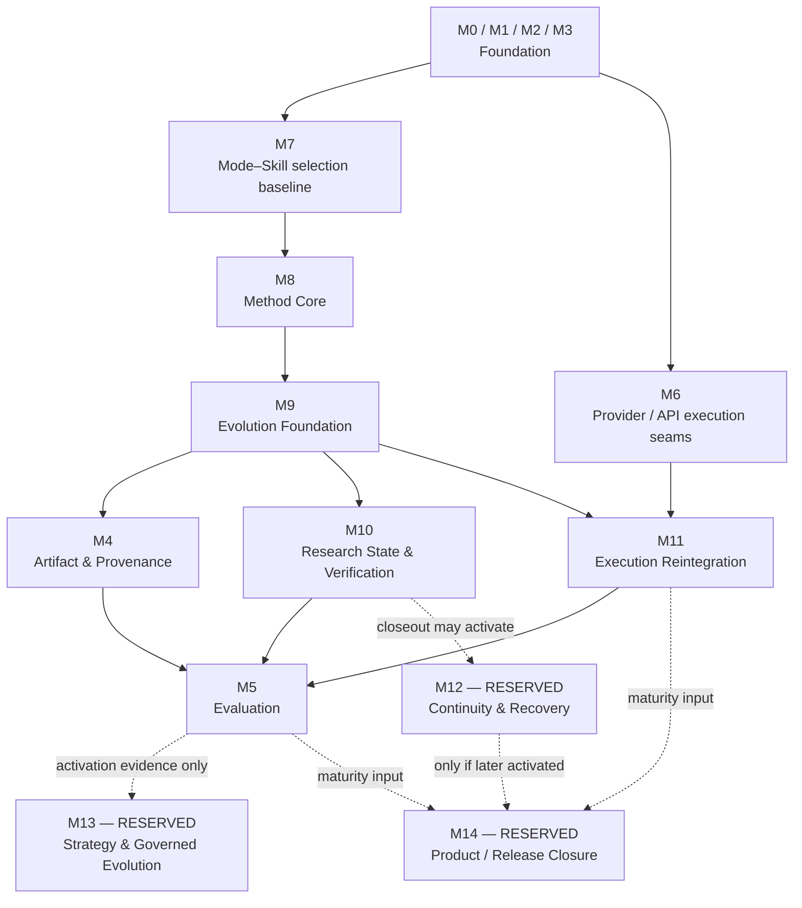
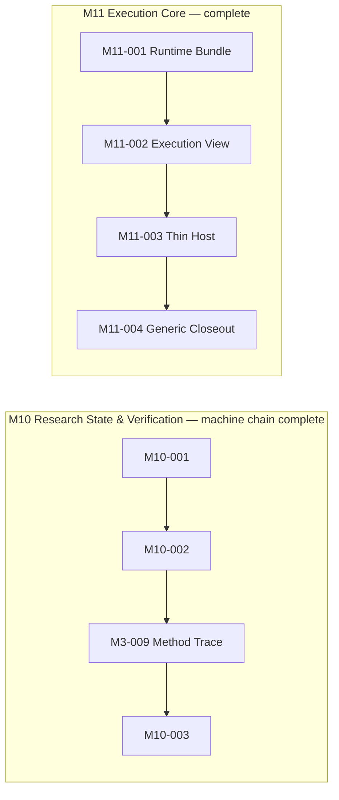
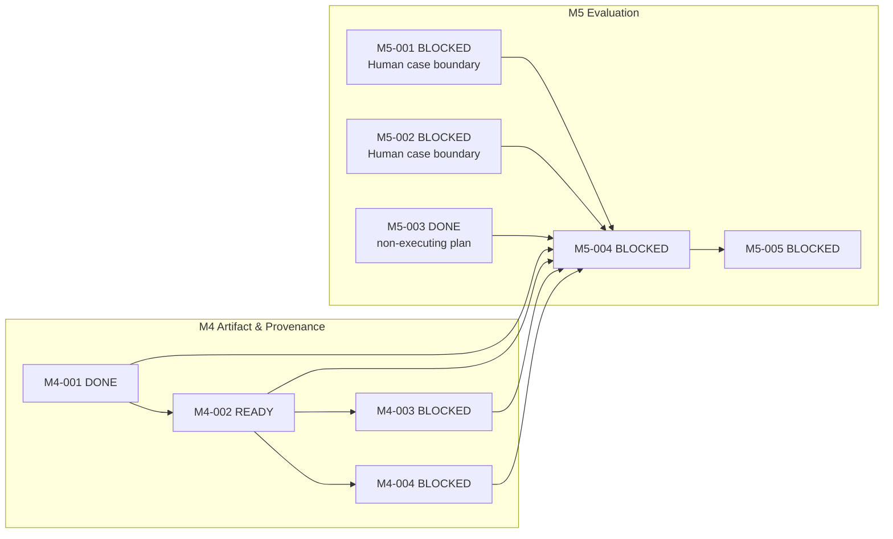
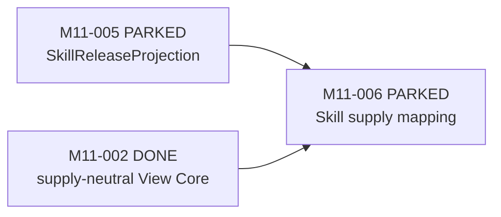

# M-series Implementation / Construction Map

状态：canonical implementation navigation；由 [`TASKS.md`](TASKS.md) 派生，不拥有独立的 Task
状态、依赖或验收 authority。

这张图只回答“普通开发沿哪些 M-group 与原子 M Task 施工”。Phase、Topic、authority 与 architecture
Gate 的原因解释见 [`DEVELOPER_ARCHITECTURE_MAP.md`](DEVELOPER_ARCHITECTURE_MAP.md) 和
[`ROADMAP.md`](ROADMAP.md)。

```text
M-group = implementation family / development route
Mxx-yyy = atomic executable Task
```

## 1. M-group 主施工图



箭头是 family-level 施工导航，不是机械的 hard dependency。任何具体 Task 的 exact dependency、状态、
owner、scope 与 acceptance 都以 `TASKS.md` 的 Task 行为准。M12～M14 是 reservation，不在执行队列；
虚线只表示未来 activation evidence 的可能来源，不授权实现。

## 2. M-group 索引

| M-group | Family | Definition status |
|---|---|---|
| M0 | Architecture & repository foundation | task-defined |
| M1 | Contracts & CLI | task-defined |
| M2 | Agent & Skill foundations | task-defined |
| M3 | Context, Trace & risk | task-defined；部分 residual work PARKED |
| M4 | Artifact, provenance & reproducibility | task-defined |
| M5 | Evaluation & pruning | task-defined |
| M6 | Provider/API execution seams | task-defined；具名责任人维护 |
| M7 | Mode–Skill selection & coordination evidence | task-defined |
| M8 | Method Core formalization | task-defined and complete |
| M9 | Evolution Foundation | task-defined and complete |
| M10 | Research State & verification | task-defined；bounded machine chain complete，Human/R2 semantic closeout 独立 pending |
| M11 | Execution reintegration | task-defined；Core complete，optional Skill extension 依 `TASKS.md` 单独激活 |
| M12 | Execution Continuity & Recovery | **RESERVED** |
| M13 | Strategy & Governed Evolution | **RESERVED** |
| M14 | Product / Release Closure | **RESERVED** |

`task-defined` 只表示该 family 已有原子 Task，不表示全部 Task 已完成。实时状态仍见 `TASKS.md`。

## 3. 当前派生施工位置

本节从 `TASKS.md` 派生，不维护独立 Task truth。以下分组只帮助开发者区分已完成链、
当前 frontier 与可选支线；状态发生变化时必须先更新 `TASKS.md`，再刷新本图。

### 3.1 Completed chains



`M3-009` 保留历史 identity，即使它位于 M10 的 canonical implementation chain；不得为了图形
连续性 cosmetic renumber。M10 的 machine chain complete 不等于 Human/R2 semantic closeout，M11 Core
complete 也不等于 live Provider 或 ordinary-user E2E。M4-001 Source Admission 与 M5-003 Evaluation
Manifest 也是已完成的当前后继前置。

### 3.2 Current frontier



M4-002 是当前 provenance/promotion 链的合法入口；M4-003/004 必须等它完成。M5-004 同时等待
M4 闭环、两个具名真实案例边界与已存在的 M5-003 计划契约；M5-003 本身没有执行案例或
产生净增量结论。本图未展开的独立 `READY` 行（例如 scaffold）仍直接从 `TASKS.md` 读取。

### 3.3 Optional / parked



Skill extension 只在明确的 Skill-bearing 需求下依 `TASKS.md` 恢复；Projection 缺失只阻塞 Skill
new-binding，不阻塞已完成的 no-Skill/direct-Tool Core。其他 PARKED Task 的恢复条件也只看
`TASKS.md`。所有图中省略的 hard dependency（包括 Human/external Gate）均不得由本图推断。

## 4. Reservation activation

将 M12、M13 或 M14 从 reservation 转为正式 M-group，必须依次满足：

1. 对应 architecture area 的 activation Gate 已被接受；
2. 有证据证明现有 M-group 不能自然承载该 coherent implementation family；
3. 完成独立、docs-only 的 `task-definition`；
4. 当时再定义具体 Task ID、具名 owner、risk、hard dependencies、acceptance 与 negative boundaries。

在此之前，reservation 没有 Task state、branch/PR、CI 或 implementation authority，也不得解冻 Topic 5、
Strategy、Release，或扩大 Runtime、Capability、Method、Claim、Gate、Human Decision authority。

## 5. 日常使用

- 查项目施工位置：先看本图的 M-group，再到 `TASKS.md` 查 exact Task。
- 建 branch/PR/CI：只能引用已声明的 `Mxx-yyy`，不能引用 Phase、Topic 或 RESERVED group 代替 Task。
- 解释为何允许启动：回到 Architecture Map 查 Phase/Topic/authority/Gate。
- 发现近期工作没有 Task：停止实现，走独立 `task-definition`，不能从 reservation 或示意箭头自行扩 scope。
