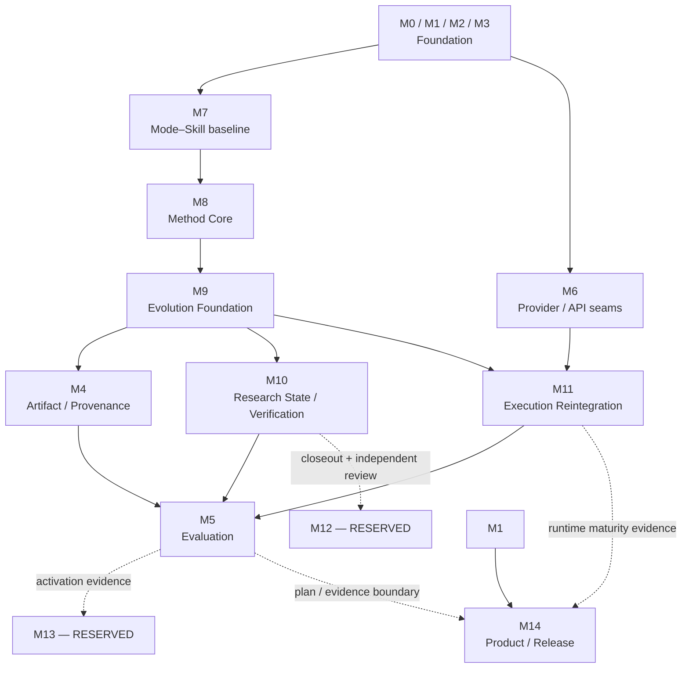

# M-series Implementation / Construction Map

本图只导航 implementation families 与原子 Task 路线，不维护独立状态、依赖或验收。
exact Task、owner、risk、hard dependencies 与验收以 [TASKS](TASKS.md) 为准，成熟度见 [STATUS](STATUS.md)；
Phase/Topic 的方向与 Gate 见 [ROADMAP](ROADMAP.md)，权威关系见 [开发者架构地图](DEVELOPER_ARCHITECTURE_MAP.md)。

## 1. Family 施工方向


```mermaid
flowchart TB
    Foundation["M0 / M1 / M2 / M3<br/>Foundation"] --> M7["M7<br/>Mode–Skill baseline"]
    Foundation --> M6["M6<br/>Provider / API seams"]
    M7 --> M8["M8<br/>Method Core"]
    M8 --> M9["M9<br/>Evolution Foundation"]
    M9 --> M4["M4<br/>Artifact / Provenance"]
    M9 --> M10["M10<br/>Research State / Verification"]
    M9 --> M11["M11<br/>Execution Reintegration"]
    M6 --> M11
    M4 --> M5["M5<br/>Evaluation"]
    M10 --> M5
    M11 --> M5
    M5 -. "activation evidence" .-> M13["M13 — RESERVED"]
    M10 -. "closeout + independent review" .-> M12["M12 — RESERVED"]
    M11 -. "runtime maturity evidence" .-> M14["M14<br/>Product / Release"]
    M5 -. "plan / evidence boundary" .-> M14
    M1 --> M14
```

箭头是 family-level 导航，不是机械 hard dependency。虚线提供 activation/maturity evidence，
不能从箭头获得 Task 授权、release 决定或 Topic 5 解冻。

| M-group | Family | exact 定义入口 |
|---|---|---|
| M0 | Architecture / repository | [TASKS M0](TASKS.md#m0架构与仓库) |
| M1 | Contracts / CLI / controlled intake | [TASKS M1](TASKS.md#m1契约与-cli) |
| M2 | Agent / Skill foundations / bounded role consumption | [TASKS M2](TASKS.md#m2agent-与-skills) |
| M3 | Context / Trace / risk | [TASKS M3](TASKS.md#m3上下文与风险) |
| M4 | Artifact / provenance / reproducibility | [TASKS M4](TASKS.md#m4工件与复现) |
| M5 | Evaluation / pruning | [TASKS M5](TASKS.md#m5真实案例与删减) |
| M6 | Provider / API execution seams | [TASKS M6](TASKS.md#m6api-execution黄毅维护) |
| M7 | Mode–Skill selection / coordination evidence | [TASKS M7](TASKS.md#m7modeskill-选择与协调成本) |
| M8 | Method Core formalization | [TASKS M8](TASKS.md#m8method-core-formalization) |
| M9 | Evolution Foundation | [TASKS M9](TASKS.md#m9phase-b-evolution-foundation) |
| M10 | Research State / verification | [TASKS M10](TASKS.md#m10phase-c-research-state--verification) |
| M11 | Execution reintegration / caller bridge Gate | [TASKS M11](TASKS.md#m11phase-f-execution-reintegration) |
| M12 | **RESERVED**：Execution Continuity / Recovery | [Reservation 条件](TASKS.md#future-m-series-reservations) |
| M13 | **RESERVED**：Strategy / Governed Evolution | [Reservation 条件](TASKS.md#future-m-series-reservations) |
| M14 | Product / Release Closure | [TASKS M14](TASKS.md#m14product--release-closure) |

## 2. 原子路线与直接接口

下表是阅读顺序；每个节点的完整 hard dependency（包括 Human/external Gate）仍在 TASKS。
历史 identity 保留，不为图形连续性重编号，例如 M3-009 仍位于 M10 的 machine chain。

| 路线 | Task 导航 | 直接协议 / 验证边界 |
|---|---|---|
| Method / demand / supply | M8 → M9 | [Method](implementation/METHOD_RESOLUTION_CONTRACT.md)、[Requirement](implementation/CAPABILITY_REQUIREMENT_CONTRACT.md)、[Resolution/Snapshot](implementation/CAPABILITY_RESOLUTION_CONTRACT.md) |
| Provenance | M4-001 → M4-002 → M4-003 / M4-004 | [Admission](implementation/SOURCE_ADMISSION_CONTRACT.md)、[Promotion](implementation/ARTIFACT_PROMOTION_CONTRACT.md)、[Claim localization](implementation/CLAIM_TRACE_CONTRACT.md)；结构/promotion 不等于 Claim/Human 接受 |
| State machine prerequisite | M10-001 → M10-002 → M3-009 → M10-003 | [Phase C Gate](implementation/PHASE_C_BOUNDED_GATE.md)；不等于 Human semantic closeout 或 Topic 5 实现 |
| Execution Core | M11-001 → M11-002 → M11-003 → M11-004 | [Bundle](implementation/RUNTIME_BUNDLE_PROFILE.md)、[View](implementation/RESOLVED_EXECUTION_VIEW.md)、[Host](implementation/THIN_EXECUTION_HOST.md)、[Core closeout](implementation/GENERIC_EXECUTION_CLOSEOUT.md) |
| Optional Skill extension | M11-005 → M11-006；M11-004 + M11-006 → M11-007 | [Projection](implementation/SKILL_RELEASE_PROJECTION.md)、[Skill closeout](implementation/SKILL_EXECUTION_CLOSEOUT.md)、[Gate B](workstreams/chengyue-lu/M11-SKILL-CLOSEOUT-GATE/GATE.md)；缺资格只阻断该支线 |
| Baseline transport | M5-006 → M6-008 → M5-007 | [ADR-0020](decisions/0020-PHASE-D-DUAL-TRANSPORT-SYSTEM-ESTIMAND.md)、[Baseline seam](workstreams/huangyi/M6-BASELINE-EXECUTION/README.md)；plain arms 不注入 Method/Skill control |
| Evaluation | M5-003 / M5-006 / M5-007 → M5-008 → M5-004 → M5-005 | [Protocol](implementation/SYSTEM_EVALUATION_PROTOCOL.md)、[Harness](implementation/SYSTEM_EVALUATION_HARNESS.md)、[Live pilot](workstreams/chengyue-lu/M5-SYSTEM-EVALUATION-DESIGN/M5-008_LIVE_PILOT_GATE.md)；真实 cases、live/admission、blind review 等外部门禁不能省略 |
| Provider | M6-001 → M6-002；M6-009 → M6-010 | [General profile plan](workstreams/chengyue-lu/M6-GENERAL-PROVIDER-DEFINITION/PLAN.md)、[Flash exact 受限收口](workstreams/chengyue-lu/M6-GENERAL-PROVIDER-IMPLEMENTATION/M6-010_COMPLETION.md)；offline 十一厂商不等于 live 十一厂商，原 M6-004 独立 |
| Release | M14-001 → M14-002 / M14-003 → M14-004 → M14-005 | [ADR-0021](decisions/0021-CURATED-DEVELOP-TO-MAIN-RELEASE.md)、[发行规范](DEVELOP_TO_MAIN_RELEASE.md)、[首发历史证据](workstreams/chengyue-lu/M14-CURATED-RELEASE/FIRST_RELEASE_COMPLETE.md)；每次发行重新具名授权 |

供给唯一选择权属于 Capability Resolver；Runtime 只消费 exact frozen objects 与 actual facts。
Core no-Skill/direct Tool 不等待 Skill Projection；closeout 只证明已声明的 execution slice，不代签 Task/Claim/Human 完成。
实际成熟度及已接受证据由 STATUS/TASKS 与各协议的 completion link 提供，本图不复制当前 frontier 或运行数字。

## 3. 普通研究入口的桥接导航

```text
M1-010：需求 / 人工材料 →受控契约产物
M2-009：必载角色职责 → main 的有界 0..N child →实际结果消费
M11-008：供给选择 / exact freeze → Bundle / View / Host → actual facts / closeout / whole-chain Gate
```

三切片独立复用 TASKS 所列的既有接口，以上排列表示产物消费，不生成新的互相阻断 hard dependencies。
M11-008 的最终 Gate 必须消费前两切片对应的实际产物，逐桥记录 producer、contract、consumer、结果与缺口。
可使用有界合成材料，不因此改成 M5 四臂评价；Tool/Skill 按具体 Task/Method 和现有资格条件启用。

角色职责可以合并，必载提示与可选 Skill 分开；main 在授权上限内决定 child 数量，caller 为每个有界 Task
单独预检和冻结，不将动态委派加入 Host。人工 MainState/旧材料是显式输入，unknown 不自动填补历史接受。
Guide 使用独立 approved-refs 只读上下文，没有主聊天/原 logs/全仓默认读取、科研写入或自动回传。
定义分支与代码候选分别接受，详见 [任务定义记录](workstreams/chengyue-lu/RWB-CHAIN-TASK-DEFINITION/README.md)。

## 4. Reservation 与日常使用

M12/M13 激活须 accepted architecture Gate、已有 M-group 不足的证据及独立 docs-only task-definition；
届时才定义原子 ID、具名 owner、risk、dependencies、scope、acceptance 与 negative boundaries。
reservation 不解冻 Topic 5，不扩大 Runtime/Capability/Method/Claim/Human authority。

查合法入口时读取 TASKS 的 exact 行；查成熟度时读取 STATUS；查为何受限时读取 ROADMAP/Architecture。
branch/PR/CI 不用 Phase、Topic、M-group 或工作包别名代替 Task identity。
发现未定义近期工作时先做 task-definition，不从本图补造 scope。
