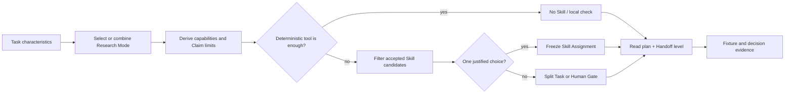

# 恢复点与下一步规划

状态：Mode–Skill 工作流接管本侧主线；API 工作已移交

日期：2026-08-14

## 1. 当前判断

已有架构足以表达任务、模式、Skill、权限、工件和交接。当前最大缺口不是再增加执行 Provider，而是判断：什么任务属于什么研究模式、何时需要哪个 Skill、何时不应加载 Skill，以及 Handoff 与校核的成本是否值得。

本侧不再负责 API 实现或测试。API 仍通过共享接口提供执行工件，但不阻塞本侧完成 Mode/Skill 设计和离线决策证据。

## 2. 已确认的缺口

- 只有两个正式 Mode，且尚无 trigger/non-trigger 与组合模式的成套 fixtures；
- 三个 accepted Skills 只有离线合同证据，真实增量价值未测；
- 24 个候选中只有 6 个仍处于 discovered/triage，不能按数量铺开；
- 当前 Skill 解析擅长执行显式选择，但人类面对任务时仍缺一张简洁选择矩阵；
- 普通 Handoff 是否需要完整审计链没有真实数据；
- Agent 内容读取边界没有形成可执行的“允许集—发现—扩展”规则。

## 3. 下一关键节点：K-MS-1

实施顺序：

1. 为 `evidence-synthesis`、`simulation` 建立 Mode 决策卡和负例；
2. 建立 6 个 Task fixtures，包括模式歧义、组合约束和 no-Skill；
3. 形成 Task-to-Skill 选择矩阵与排除理由；
4. 审计 accepted Skills 的 trigger/non-trigger；
5. 对一个 triage candidate 完成证据化去留决定；
6. 为 fixtures 指定内容读取允许集和 H0/H1/H2；
7. 汇总协调成本假设，达到节点后暂停评审。

## 4. 明确不做

- 不修改 Provider Adapter、模型池、API session、Task-to-API 或 live conformance；
- 不为补齐分类表而创建 experiment、theory 等空 Mode；
- 不下载即准入，也不默认安装 ZIP 候选；
- 不用 reviewer 数量代替确定性检查和人类方法判断；
- 不把完整 Handoff 审计链设为所有任务默认；
- 不把 fixture 成功宣称为科学正确或多 Agent 净收益。

## 5. 跨工作流依赖

需要真实 with/without 或实际执行数据时，本侧向 API Execution 工作流提供冻结的 Task、Mode、Skill Assignment、读取/工具/写入边界和输出契约。对方返回脱敏 Attempt、输出、边界偏差、Handoff 与用量。没有这些证据时，Skill 只能停留在 reference/triage/trial，不自动 accepted。

## 6. 恢复入口

依次读取 `AGENTS.md`、`docs/WORKSTREAM_OWNERSHIP.md`、ADR-0011、本文件和 `docs/implementation/MODE_SKILL_WORKSTREAM_PLAN.md`。接到具体 Task 后再读取目标 Mode/Skill，禁止从旧聊天或全仓库扫描恢复状态。
