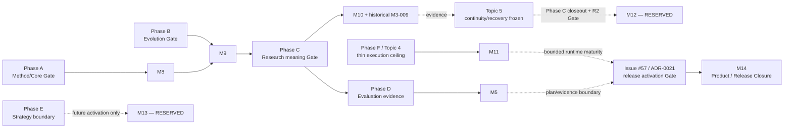

# 架构演进路线图

状态：方向与依赖基线；不记录逐项实时状态

更新：2026-09-02

逐项状态和唯一下一任务只在 [`TASKS.md`](TASKS.md) 更新。本文件说明依赖顺序、阶段 Gate 与
停止条件，不是工期承诺，也不是研究项目必须遵循的固定流程。

## 1. 总体顺序

| Phase | 目标 | 主要产物 | 启动条件 |
|---|---|---|---|
| A — Core Formalization | 把 Mode-first 方法论变成正式语义 | Mode Action、Method Resolution、Mode v0.2、Decision Authority | ADR-0013/0016 |
| B — Evolution Foundation | 支持可迁移、可评测的能力演化 | Skill Need、Lifecycle v2、Migration、Protocol、Resolved Capability Snapshot | Phase A 稳定接口 |
| C — Research State & Verification | 保存跨 Runtime 的研究意义 | State/Frontier、Failure、Evidence–Claim relation、Method Trace | A；部分依赖 B |
| D — Evaluation Loop | 证明完整系统相对简单 baseline 的可复核净增量 | Evaluation Manifest、public/private Case Dossier、frozen Protocol、统一 Harness、blind Review、system-level analysis 与 disposition | ADR-0020 已接受 dual transport；Protocol 可启动，Harness 仍等待 baseline/Skill closeout，真实执行仍需案例、provenance、live execution 与人类批准 |
| E — Strategy & Governed Evolution | 有界吸收新策略和外部候选 | Strategy interface、candidate pipeline、merge/prune/promotion | B+C+D |
| F — Execution Reintegration | 让 Runtime 消费冻结科研契约 | M11 Core：runtime bundle、supply-neutral resolved execution、Thin Host、Trace/Receipt integration；可选 Skill supply：release projection、统一 View semantic mapping | ADR-0019 与 M9-005 Core；Skill release projection 不 Gate Topic 4 Core；Topic 5 另受 Phase C Human/R2 closeout 约束 |

Phase 不是一条科研 DAG。它只表示框架接口的构建依赖；真实 Task 仍按 Mode/Action 选择路径。

### 1.1 Phase / Topic / M-group / M Task

本文件只回答 Phase 的 macro maturity、Topic responsibility、architecture Gate 以及为什么某类工作允许或
冻结。日常施工的 status、hard dependency、owner、scope、negative acceptance 与 evidence 只由
[`TASKS.md`](TASKS.md) 的 M Task 控制：

```text
Phase   = macro maturity / architecture Gate
Topic   = architecture responsibility / authority domain
M-group = implementation family / development route
Mxx-yyy = atomic executable Task / branch / PR / CI identity
```

一个 Phase 聚合多个 M-group 与 M Task，一个 M Task 可以跨多个 Topic。ROADMAP 中出现但 TASKS 中没有 ID 的近期
工作不能直接实现；必须先建立 docs-only `task-definition`。若两者对当前施工顺序表述冲突，TASKS 控制
implementation scheduling，ROADMAP 的 architecture freeze 仍是上限，Task 必须据此标为 BLOCKED/PARKED。

日常施工只使用 M-series。完整的 M-group 与原子 Task 导航见
[`M_SERIES_IMPLEMENTATION_MAP.md`](M_SERIES_IMPLEMENTATION_MAP.md)；本文件中的 Phase/Topic mapping 只解释
family 为什么存在、由什么 authority boundary 约束、何时允许启动，不是第二套 queue。

### 1.2 Architecture Map：Phase / Topic → M-group

| Architecture area | Responsibility / authority boundary | M-group aggregation | Freeze / unlock Gate |
|---|---|---|---|
| Foundation / pre-A | Repository、Core contract、Trace、Provider 与 Mode–Skill baseline；各层 authority 分离 | M0、M1、M2、M3、M6、M7 | 已接受的 historical foundation；未完成项仍按 TASKS |
| Phase A | Method/Core 与 Authority Rule Eligibility；不产生执行或 Human Decision | M8 | 已收口 |
| Phase B | Capability demand/supply、Skill evolution、Protocol；不授予 Runtime authority | M9 | 已收口 |
| Phase C | Research State、Failure、Method Trace 与 bounded verification | M10，复用历史 `M3-009`；M4 为 provenance support | bounded machine DAG 已实现；Human/R2 semantic closeout 仍独立 pending |
| Phase D | Evaluation record、system-level baseline/net benefit 与 pruning；不自动 promotion | M5；baseline transport 复用 M6；部分 M7 experiments 由 TASKS 决定是否恢复 | ADR-0020 已闭合 baseline architecture Gate，M5-006 可启动；M6-008、Skill replay、真实 case/provenance/live execution/Human review 仍各自受 Gate 约束 |
| Phase E | Strategy candidate 与 governed evolution；不得自动修改 Core | 既有 M2/M7；M13 仅 **RESERVED** | Phase C/D evidence 证明旧 group 不足后另行接受 |
| Phase F / Topic 4 | Agent/Model/Provider/Runtime 消费 frozen contract；不拥有 Method/Claim/Gate/fallback authority | M11 Core 与 optional extension；M6 live conformance | M11 Core 与 optional Skill extension 已 bounded 实现；live conformance 仍依独立 Gate |
| Topic 5 residual | Handoff、context rollover、safe pause/resume、recovery/continuation | M12 仅 **RESERVED** | Phase C closeout + 独立 Topic 5 R2 review/task-definition |
| Product / release closure | Ordinary-user E2E、package/runtime/release governance | M14 已 task-defined | Issue #57 / ADR-0021 已接受 family 边界；从 M14-001 trust anchor 开始，首次发行仍受许可证、scaffold、远端保护与 M14-002～004 阻断 |



实线表达已接受的 architecture aggregation，虚线表达 maturity evidence 或尚未授予 implementation authority
的 activation condition。M12/M13 没有 Task 状态、owner、dependency、acceptance 或 Schema；不创建
`M12-001`、`M13-001`，也不继续推测 M15+。M14 已完成独立 R2 task-definition；其 exact 状态和依赖只看
`TASKS.md`，不能从本图推导 release 已可执行。

## 2. Phase A：Core Formalization

1. 把两个正式 Mode 的 Action Catalog 转成版本化、可引用文档；
2. 新增 provider-neutral `Method Resolution`；
3. 将八个既有 routing fixture 无损转换为正式 Resolution fixture；
4. 建立 Research Mode v0.2，移除直接 Skill recommendation；
5. 冻结 Mode/Action/Mechanism/Skill/Tool/Claim/permission 的 Decision Authority；
6. 明确稳定 Core invariants 与 replaceable implementation boundary。

停止 Gate：

- `Task → Method Resolution → Execution` 成为明确接口；
- no-Skill、tool-only、Human Gate、split、blocked 都能正式表达；
- 新 Mode 不再隐式携带 Skill；
- 在 Gate 通过前不新增 accepted Skill 或正式 Mode。

### Phase A 收口判定（2026-08-24）

**PASS — Core contract closure。** M8-001～005 已在 PR #30 接受 R2 跨负责人审查，并以
`develop@ead1270` 形成集成边界：Mode Action、Task-bound Method Resolution、Research Mode v0.2
migration 与 Authority Rule Eligibility 均有版本化对象、确定性验证和正反 fixture。

这里的 `Task → Method Resolution → Execution` Gate 指稳定的输出/消费接口已经明确：Method
Resolution 只产生需求、Gate、blocked 与最小机制语义，供后续 Capability / Execution 层消费；它不表示
Capability binding、Resolved Execution View、Receipt migration 或 Runtime consumer 已实现。后者继续属于
Phase B/F，不能反向写成 Phase A 未完成，也不能借 Phase A 收口宣称端到端执行闭环。

## 3. Phase B：Evolution Foundation

Phase B 保持“需求语义先于供给绑定”的顺序：

1. `Capability Requirement` 先成为 provider-neutral 的需求侧契约，不表达 available/gap 或具体供给；
2. 具名 Maintainer 可在独立 triage 后把可复用语义缺口发布为版本化 `Skill Need`，定义 gap、
   direct/no-Skill baseline、预期增量、evaluation criteria、
   required evidence classes 与 domain scope/variants；它不累积实际 trial/evaluation/promotion 结果；
3. lifecycle v2 分离 intake、evaluation state、admission 与 runtime eligibility，引用 baseline/trial/
   evaluation record/decision 和 promotion evidence；完整 benchmark/metric/experiment framework 留在 Phase D；
4. Protocol Profile 独立表达 PRISMA、V&V 或项目方法标准的适用性、method obligations 与 Gate/evidence
   expectations，不复制 Mode Action、不固定研究 DAG，也不绑定 Skill/Tool/Provider；
5. M9-005 建立显式供给缝：`Capability Requirement → Capability Supply Report(s) → Capability Resolution
   → Resolved Capability Snapshot`。Report 只陈述 supply identity、实现版本/hash、能力、I/O、权限、
   data-egress、副作用、typed conformance artifact、scoped availability 与限制，不拥有选择、fallback、Method、Claim 或
   Human Gate authority；Resolution 比较零个或多个 Report 并给出 satisfied/gap/ambiguous/blocked；
   Snapshot 区分不具执行资格的 `structural-replay` 与具有非 fixture typed-evidence 资格、仍待 Topic 4
   完成最终执行准入的 `runtime-execution`；
6. migration 保持 append-only 和显式调用。Phase A 的 Mode v0.1→v0.2 是首个已完成 exemplar，Phase B
   不重造通用 migration framework，只在新增对象确有版本迁移需求时扩展。

`Capability Requirement` 是 Runtime 主链的需求入口；它只有在具名 Maintainer 独立 triage 后才可形成
`Skill Need`，capability gap/failure 不自动完成该转换。两者可在冻结共同引用语义后顺序推进；M9-004
Protocol Profile
与 M9-002/003 并行，不阻塞 M9-005。M9-005 的 Snapshot Core 只依赖 M9-001 与 M8 Decision Authority，
先覆盖 Method no-Skill 对应的 procedure、direct Tool、Adapter/Provider supply facts 的 structural replay；
fixture 不得声明 final effective boundary 或 execution eligibility。Skill 作为合法供给候选的扩展额外等待
M9-003，并且新绑定还必须解析独立 evidence 与 Human decision。Resolved Capability Snapshot 涉及
Method 与 Provider 两侧，必须跨负责人审查：路诚钺维护需求词汇、Resolution/Snapshot authority ceiling
与 provider-neutral fixture，黄毅维护 Adapter/Provider 的真实供给映射与 conformance。Phase B 不接管
API/Runtime 实现。

停止 Gate：至少一个 fixture 在 Task、Mode、Action、Method Resolution 与 Capability Requirement 均不变时，
将 Supply A/Snapshot A 替换为 Supply B/Snapshot B；permission、data-egress 与 side-effect ceiling 不放宽，
Runtime 不获得 Method authority，旧研究对象仍可解释和重放。

### Phase B 实现判定（2026-08-25）

**IMPLEMENTED AS STRUCTURAL CONTRACT。** M9-001～006 已形成 Requirement、Need、lifecycle v2、两个
bounded Protocol Profile、typed Report→Resolution→两级 Snapshot、repository-wide structural consumer 与
Skill Supply
Extension。M9-006 Gate 固定同一 Task/Mode/Action/Method/Requirement，并证明 Supply A→B 只改变 exact
supply，三类 Supply boundary facts 保持一致；Research Mode 与 Skill lifecycle
migration 均保持 exact-pin replay。

此判定不证明 live Provider 可用、Skill 科研净收益、Human Decision 或真实执行。checked-in 的三条
Phase B fixture 都是 `structural-replay`；后续 M11 bounded tests 只在临时项目构造并消费合格的
`runtime-execution` Snapshot/Bundle/View，仓库仍没有可供真实执行的 checked-in input。Topic 5 继续冻结。

### Topic 4 thin-layer Architecture Hold

以下四项是 Phase B 已接受的供给侧前置契约：

- Capability Requirement；
- Capability Supply Report；
- Capability Resolution boundary；
- Resolved Capability Snapshot Core。

依据 [ADR-0019](decisions/0019-OPTIONAL-MAINTAINER-SKILL-EVOLUTION-OUTER-LOOP.md)，Topic 4 将 Core 与可选
Skill Runtime Extension 拆成两条依赖。

**Topic 4 Core Gate**：

- `runtime-bundle` 使用显式 closure manifest，不接受目录输入，不递归扫描 `registry/examples`，import
  graph 不包含 Skill Need、Candidate、Evaluation 或 Lifecycle validator；
- no-Skill、direct Tool、procedure 与 Adapter/Provider 可以在零 Skill、零 Evolution Registry 情况下形成
  Resolved Execution View；
- 供给更新创建新的 Resolution/Snapshot/View，不能改变运行中的冻结输入；gap/failure 不自动创建 Skill Need。

Topic 4 的 implementation vocabulary 已落到 M11：Runtime Bundle/Profile → supply-neutral Resolved
Execution View → Thin Execution Host → actual execution facts → generic Trace/Receipt Core Gate。当前
bounded Core 已证明 no-Skill/direct Tool 路径可在零 Evolution Registry 下闭合；procedure 与
Adapter/Provider 仍使用同一 supply-neutral 契约，不等待 SkillReleaseProjection。四层保持独立
producer/consumer authority；同一强耦合 workstream 的 module-level PR 集成历史不合并 Task identity。

**Skill Runtime Extension Gate**：

- SkillReleaseProjection 只发布不可变、exact hash-pinned 的 Skill Release；
- Projection contract 被接受且 exact-pin validation 可用后，才启用 Skill-bearing binding；
- 投影未实现、缺失、stale 或不匹配时，Skill new-binding fail closed，且不得回退读取完整 Lifecycle；
- View/Capability semantic owner 将 eligible Skill supply 映射进统一、supply-kind-neutral 的
  Resolved Execution View；不建立 Skill-specific Runtime seam。该 extension 只在明确 Skill-bearing
  需求出现后依 `TASKS.md` 激活，不阻塞任何非 Skill Core 路径。

解冻范围只包括 Topic 4 的上游 Research Control / View producer 冻结 external hash pin、执行时 freshness、
精确 Provider/Adapter/Model/Runtime/Host binding，以及 Task/Profile/DataPolicy/Host policy 与 selected supply
ceilings 的最终收紧交集；仅在 Skill Extension 存在时加入可选 Skill/Assignment。Execution Host 只消费
exact frozen View 与其绑定的 closure-valid Runtime Bundle、报告 actual execution facts，
并执行 permission/data-egress/side-effect boundary。它不得重新选择 Supply、在当前 View 内 rebind 或执行
automatic fallback；model auto-routing、multi-Agent orchestration、critic voting、hidden routing，以及
Runtime 修改 Method、Claim 或 Gate 继续禁止。

## 4. Phase C：Research State 与 Verification

Phase C 的唯一 implementation chain 是：

```text
M10-001 minimal Research State
→ M10-002 Attempt / Research Failure
→ M3-009 Method Trace v0.1
→ M10-003 bounded verification Gate
```

bounded State composition 的 entries 引用 Question/Hypothesis/Evidence/Claim/Decision/Run/Task，`open_items`
承载轻量 Unknown/Assumption；Contradiction 由 Evidence–Claim relation 表达，Frontier 是派生视图。
Research Attempt lineage 与 Research Failure 是独立 sidecar/candidate，Failure 至少记录 learned result 与
revisit condition。M4-001～004 是 provenance/promotion/reproduction supporting Tasks，不替代上述 Phase C
closeout chain。

Method Trace v0.1 已在 M3-008 可观察执行 Trace 之上形成独立的 ref-only candidate：它绑定
Attempt/Task/Method Resolution/Mode/Action/State 与 path disposition；有 authoritative execution fact 时
绑定 actual capability/supply path effect，缺失时显式记录 per-Attempt gap。Snapshot 不得冒充 actual
execution fact，该 candidate 也不证明科学正确性或 reviewer reconstruction。

不一次建设统一知识图谱。当前 evidence-synthesis 与 simulation-negative 两个 synthetic bounded
case 只证明 compact State/Method Trace 的 exact closure、fresh-process 受控读取与固定 fixture
behavior；它们不是真实案例，也不证明跨 Runtime 恢复或 reviewer reconstruction。

minimal Research State、Failure/Attempt、Method Trace v0.1 与 bounded machine Gate 的 implementation prerequisites
已完成；Human semantic review 与 R2/Phase C closeout 仍独立 pending，因此 Topic 5 继续冻结。
M9-005 或 Topic 4 Core 的完成不能替代 Phase C 语义接受。

Phase C 的 `M10-001 → M10-002 → M3-009 → M10-003` 是 Topic 5 的 activation prerequisite chain，
不是 Topic 5 membership。完成这些 Task 只满足 machine prerequisite；还必须先接受 Phase C Human/R2
semantic closeout，才可以开始独立 Topic 5 R2 architecture review/task-definition。二者都不会自动授权
Handoff、context、pause/resume、recovery 或 continuation implementation。

Topic membership 按 Task objective 判断：只有改变 Handoff、context rollover、safe pause、recovery、
salvage/clean recovery 或 continuation semantics 的 Task 才属于 Topic 5。M11-003/004 仅实现 Topic 4
Thin Host、actual fact reporting 和通用 observability closure；使用 Trace/Receipt 不使其成为 Topic 5
Task，也不绕过上述 freeze。

## 5. Phase D：Evaluation Loop

正式比较至少包含：

1. Plain Agent；
2. Plain Agent + Tool；
3. Mode + no-Skill/direct-tool；
4. Mode + candidate Skill。

M5-003 已建立最小 Evaluation Manifest/baseline harness：以四个 canonical treatment 冻结共享条件、
exact references、指标与 evidence classes，并编译 non-executing plan。它不执行 evaluation，不保存
真实 trial/evaluation result，也不证明 Skill/Method 有净增量；实际 record 与分析属于后续
Phase D 执行。Need 本体仍只声明 evaluation criteria 和 required evidence classes，M9-003
lifecycle 只引用 record，不在 Phase B 重建完整 benchmark/experiment framework。

Phase D 的 primary estimand 由 ADR-0020 固定为 `A4 − A2`：最终 RWB Mode/Method/admitted-Skill/M11
execution package 相对 tool-enabled simpler Agent/M6 baseline 是否产生可复核的 system-level net benefit；
该差异明确包含 transport package，不能拆读为 pure Mode 或 pure Skill effect。`A2 − A1` 是同 M6
transport 下的 Tool 条件增量；`A4 − A3` 只有在 pairwise exact-equality closure 证明唯一 delta 为 admitted
Skill extension 时才是 Skill conditional increment，否则只可称 Skill-bearing package / bundled effect 或
unavailable。`A3 − A2` 只能称 Mode/Method + transport 组合差异，`A4 − A1` 只作完整栈支持性 contrast。M5-001/002 分别负责
evidence-synthesis 与 theory/simulation Case Dossier；每个 dossier 都必须把所有 arm 可读的 Public Case
Package 与不可读的 Private Adjudication Package 分开，并在观察 treatment output 前完成 exact hash freeze、
Human approval 和 no-treatment-specific-tuning 记录。

`M5-BASELINE-TRANSPORT-ARCHITECTURE-GATE` 已由
`PHASE-D-DUAL-TRANSPORT-SYSTEM-ESTIMAND@1.0.0` 闭合；exact path/hash 见
[Gate record](workstreams/chengyue-lu/M5-SYSTEM-EVALUATION-DESIGN/BASELINE_TRANSPORT_GATE.md)。A1/A2
固定使用 M6 isolated session，A3 使用 M11 Core，A4 使用 M11 projection-backed Skill extension。完整 Task
继续作为 experiment identity 被 exact-pin，但 A1/A2 只消费独立版本、`additionalProperties=false` 的
正向白名单 provider payload；完整 Task、actor/permission/budget/pins 留在不可见 enforcement metadata。
`active_modes`、`agent_profile`、Task `required_capabilities`、Action/Method/Capability control、Skill、
private-oracle 与未知 Task 字段不得进入 provider request。A1 Tool surface 为空，A2 唯一额外暴露为 qualified
exact Tool interface，Snapshot/Method ref 只作 Harness provenance。该 Decision 不修改 M5-003、不产生
Runtime/Method/Supply/Human authority，也不证明 transport implementation 已存在。

因此 M5-006 进入 READY，不必等待真实案例完成即可设计 System-Level Evaluation Protocol：冻结
primary/secondary questions、randomization、replicates、pilot/stopping/retry、model/provider drift、blind/reveal、
metric operationalization、measurement status、analysis rule 与 decision hierarchy。`measured`、`estimated`、
`unavailable`、`not-applicable` 互不等价；Research Integrity 的退化不能被成本收益抵消，也不得建立单一
weighted aggregate score。跨 M6/M11 transport 的 completion time 只能由同一 Harness 外层可信时钟形成
可比观测；内部 timing/cost/token 口径若不能同义化，必须显式 estimated/unavailable/N/A，而不是填零。

Protocol 还拥有覆盖 A2/A3 的 `ArmExecutionQualificationRecord@1.0.0` contract、Schema、comparison rule 与
fail-closed validator。record exact 连接 M5-003 frozen structural Snapshot 与正式 runtime-execution Snapshot，
保持 Task/Requirement/Supply/component/implementation/interface 以及相关 A3 Mode/Action/Method 不变，所有
ceiling 只能等价或收窄。M5-006 DONE 后才解锁 M6-008；M6-008 只产生 A2 record。Capability Resolver 是
A3 runtime Resolution/Snapshot 的唯一 producer/selector；M11 只验证并消费 exact Snapshot，M5-007 引用两端
对象组装 A3 record并独立重算两类 record。Protocol 另行冻结 `A3A4PairwiseComparabilityRecord`：比较
Mode/Action/Method、non-Skill Requirement/Supply、Tool/procedure、provider-visible interface 与 relevant boundaries，
只有 `exact-skill-only` 可支持 Skill conditional interpretation；`skill-bearing-package` 与 `not-comparable`
分别触发 bundled/package 降级或 secondary contrast unavailable。

Protocol 同时冻结 A4 admission-evidence overlap / held-out policy，并定义独立、versioned、hash-pinned 的
`AdmissionEvidenceOverlapAssessment`。该工件 exact-pin `skill_evaluation_ref`、admission case IDs、Task/input、
typed private-oracle/checker/Human-adjudication identities/hashes、两侧 comparison input closure、`checked_at`、
validator identity/version/hash 与计算结果；它不修改 Skill Evaluation v0.1，也不向 Runtime 暴露 private bytes。
M5-007 必须在 confirmatory freeze 前重新加载两侧闭包，验证 `checked_at <= case_selection_frozen_at`，独立重算
M5-001/002 的 case、Task、formal input、private-oracle intersection、status 与 eligibility；closure 缺失、typed
`absent`/`unknown` 或 unresolved 时 fail closed，任一重叠记录为 `admission-overlap` 并令
`primary_confirmatory_eligible=false`。重叠 case 只作 pilot/secondary evidence，不进入 primary net-benefit
conclusion，也不能单独支撑 M5-005 pruning；公共 source set 不要求完全互斥。

ADR-0020 同时产生新的 Execution-owned `M6-008`：从 A1/A2 frozen arm 确定性编译 treatment-visible
baseline envelope，并通过 M6 isolated session 形成 actual Provider/Adapter/Model/Runtime/Host/Tool facts、
Trace、Artifact、Validation 与 no-Skill replay-valid closeout；正式 A2 必须拒绝 M5-003 的
`structural-replay` / `execution_input=false` fixture，改用具有 typed conformance 的 runtime-execution Tool
binding。该转换通过 M5-006 shared contract 的 A2 `ArmExecutionQualificationRecord@1.0.0` exact 连接 frozen
binding 与 runtime binding；两端 Tool supply identity、implementation version/hash、component 与 provider-visible interface 必须相同，
permission/data-egress/side-effect ceiling 只能等价或收窄。M6-008 还须在每次 provider request 与每次 Tool
invocation 的实际 use boundary 立即重验对应 pins、使用 transport trusted clock，并由 Trace 记录重验后的
bytes/hash、独立佐证 actual binding；它不复用 legacy mandatory Skill Assignment，所有状态固定
`task_completion=false`。M6-008 当前等待 M5-006 的 frozen shared contract；Decision 本身不是其实现证据。

M5-007 hard-depend M5-006、M6-008、M11-004、M11-006 与 `M5-SKILL-CLOSEOUT-REPLAY-GATE`。M11-004 通过
M11-003 提供 Core Host actual-fact 与 generic Trace/Receipt/Artifact closeout contract；M11-006 独立提供
projection-backed Skill Supply mapping，但不传递前者。现有 Core Receipt 不支持 Skill-bearing actual binding，
所以 Issue #55 跟踪的该外部 Gate 必须先接受 replay-valid closeout seam，或由 R2 正式修订 M5-007 acceptance。
baseline transport architecture decision 已作为 M5-006 的 hard dependency 传递；Harness 必须实现其中冻结的
arm→transport mapping 并消费 M6-008，不能通过 raw Task control、dummy Method/Snapshot 或 Skill Assignment
强塞 plain arms 进入 M11；对 A2/A3 必须独立重算 `ArmExecutionQualificationRecord@1.0.0`，拒绝 binding
substitution 或 boundary relaxation；A3 runtime Resolution/Snapshot 仍只由 Capability Resolver 产生/选择，
M11 验证并消费，Harness 只引用两端对象组装 record。Harness 还须
独立重算 `A3A4PairwiseComparabilityRecord`，不得把 known Method/Supply/interface difference 掩盖为 pure Skill
increment。Harness 只在不改变 M5-003 arm treatment/read boundary 的 evaluation
plan/run-record 层统一调度、匿名化、metric evidence、Human Review、reveal map 和 analysis input，不得为 A4
建旁路、直接加载 candidate、在 confirmatory run 使用 synthetic projection 或自动作出
promotion/pruning/Human judgement。

M5-004 的正式 system-level execution 还必须等待 M4 provenance chain、两个 Human-approved dossier、
M6-004 live Provider/session conformance，以及 `A4-RUNTIME-ADMISSION-GATE`。A4 保持 M5-003 v0.1 的
`mode-candidate-skill` identity，其正式含义是 candidate-origin treatment + admitted Runtime execution；M5-006
定义独立、版本化的 execution-qualification overlay，不回写 frozen Manifest。该 Gate 必须 exact-pin
candidate binding→`skill_evaluation_ref`→具名 Human Admission Decision→immutable accepted Release→
SkillReleaseProjection→projection-backed Skill Supply→Capability Resolution→Snapshot→Runtime Bundle→
Resolved Execution View→Thin Host 的 identity/path/hash lineage；任一缺失即 BLOCK。当前生产 projection index
为空，故 Gate 尚未满足，M5-004 继续 BLOCKED。该链先形成 pre-run qualification；M5-007 还必须在执行后以
Host report、typed execution Trace fact，并在 `M5-SKILL-CLOSEOUT-REPLAY-GATE` 接受 Skill-bearing closeout
seam 后以 replay-valid Receipt 独立证明 actual Projection/Supply/binding 与 overlay 相同；M11-004 Core Receipt
本身不构成该证明，planned View 也不构成 actual execution evidence。
pilot/confirmatory 与 failed Attempts 分别保留，blind Human Review 完成；单次成功不构成 promotion。
M5-005 最终必须基于 exact protocol/cases/runs/reviews/analysis 作出至少一个具名保留、修改、停放、弃用、
删除或停止决定，且开发 sunk cost 不构成 KEEP 依据。精确状态与依赖只看 `TASKS.md`。

## 6. Phase E/F 边界

第一版 Strategy 只需 `direct` 加至多一个实验策略，且 direct 永远保留为基线。外部发现、自动
生成、repair/merge/prune 只作用于 candidate。

Execution reintegration 不授权 Runtime 定义 Mode、Claim、supply/Skill fallback、rebinding、silent
replacement 或权限放宽。bounded contracts 已覆盖 State-at-attempt / predecessor 分离、slice-only
completion、Source Admission、Supply side-effect ceilings、Host-observed duration 与临时 fixture 再生；
这不等于 Evidence→Claim trace、Provider cancellation/deadline、live actual-fact provenance 或 ordinary-user
E2E 已闭合，后者仍须各自 Task/Gate。

Runtime 也不创建 Skill Need/Candidate、不执行 Trial/Evaluation/Promotion、不读取完整 Lifecycle。Skill
供给通过已发布投影进入 Capability Supply Report；no-Skill/direct Tool 路径不依赖该投影。可选
Capability Diagnostic/feedback bridge 等待 Phase C Failure/Trace 与 privacy 语义稳定，不阻塞 Topic 4。

Phase F 的 M11-001～004 Core 与 M11-005/006 optional Skill supply publication/mapping 均已完成 bounded
integration；生产 projection index 仍为空，真实 Skill new-binding 继续依独立 evidence/Human admission。
M6-003 保留为历史 compatibility seam，不再充当执行
umbrella。M6-004 只验证 Provider/isolated session 的 live conformance，在 M6-001/002 后由具名 live
authorization 解阻；它不 hard-depend M11-004，也不替代已接受的 Task→View→Host→generic
Receipt bounded Gate。

## 7. Product / Release Closure

[Issue #57](https://github.com/Chengyue-Lu/research-agent-workbench/issues/57) 与
[ADR-0021](decisions/0021-CURATED-DEVELOP-TO-MAIN-RELEASE.md) 已证明 release source trust、curated main、
portable package、公开文档与首次 tag/release 不能由 M1 scaffold 或 M11 Runtime contracts 自然承载，因此
M14 从 reservation 转为正式 implementation family。它不改变既有 Phase/Topic authority，也不把尚未完成
的 M5 真实评价当作产品价值证据。

```text
M14-001 release topology + source trust
    ├── M14-002 deterministic surface / manifest / export-check
    └── M14-003 portable package / Runtime resource boundary
              M14-002 + M14-003
                       ↓
              M14-004 public documentation surface
                       ↓
              M14-005 first curated release
```

M14-001 是唯一初始 `READY` 入口，只建立 dormant release topology/source-trust seam，`release/v*` 仍
fail closed。M14-002/003 等待 trust anchor 后可并行，分别闭合 projection 与 package；M14-004 等待确定的
文件面和安装边界。三项完成都不产生 release merge eligibility。M14-005 还 hard-depend M0-007 license、
M1-009 scaffold、GitHub remote protection 与具名人类 release decision；只有全部 readiness Gate 闭合后，
它才原子启用 `release/v* -> main` 并禁用 direct `develop -> main`。

发行分离两条受信关系：内容/provenance 从 `develop full engineering truth -> frozen exact commit ->
deterministic projection`，Git ancestry 从 `exact current main -> generated release/v* -> new curated main`。
导出只读取 frozen develop commit Git blobs，并完整替换父分支工作树；外部 expected develop source SHA、
expected main parent SHA、versioned allowlist 和 strict manifest 共同形成 closed-set/byte-identity 证明。合并前
机器证明 prospective merge-result tree、release projection tree 与 manifest closed output tree 完全相同；若
current main 前进则从新 parent 重新生成。release branch 不接收语义修复，也不合并回 develop。

portable package 区分两种验证：develop 的 repository/maintainer Gate 继续重验完整 publication provenance；
installed Runtime 只消费独立 RuntimeResourceManifest 下的 published Schema/index/hash/identity，不为运行时
验证重新打包 Need/Evaluation/Lifecycle 私有历史；最终 RELEASE_MANIFEST 再 pin wheel、resource manifest 与
source-CI。默认资源不依赖 cwd；首版 no-Skill Core 不等待真实 Skill 准入。

在 M14-005 readiness/cutover 完成前，现有 exact `develop -> main` 仍是执行事实，不能根据本 Roadmap 手工放行
`release/* -> main`。精确验收与 negative boundaries 见 [`TASKS.md`](TASKS.md) 和
[M14 workstream](workstreams/chengyue-lu/M14-CURATED-RELEASE/README.md)。

## 8. 不在近期关键路径

- 新增大量正式 Mode 或 accepted Skill；
- 通用多 Agent Supervisor、团队拓扑或全局 DAG；
- Tool marketplace 或内建大规模科学工具库；
- 长期 conversation memory；
- 更多 Provider 接线；
- 自动修改 Core；
- 没有真实消费者的数据库、消息总线或 distributed runtime。

## 9. 长期成功判据

- 更换 Model/Runtime/Tool/Skill 后，Research State 与 Method contract 仍可复用；
- 旧对象跨版本迁移和历史 Attempt 解释可复现；
- Method violation、Claim overreach、provenance error 和重复失败率下降；
- Skill measured increment 能相对简单基线说明；
- Trace 能让 reviewer 重建关键决定而无需加载完整历史；
- 至少一项复杂控制因无增量而被删除或简化。
