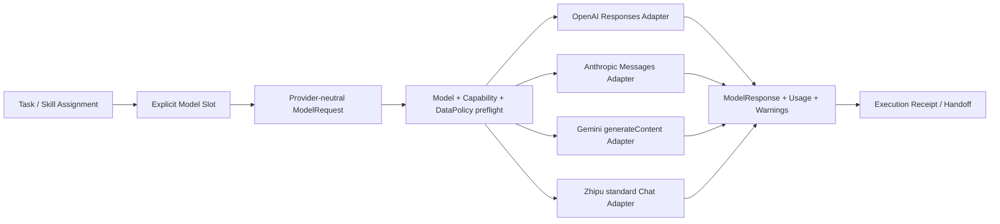

# 多提供商模型 API 实施计划

状态：`K-API-2` evidence/H2 与 simulation/H1 双合同离线闭环完成；Zhipu 标准 API text/structured/tools Adapter 已离线通过；真实项目 Gate 待运行

日期：2026-08-16

维护边界：黄毅负责本计划的 Provider Adapter、API session、live conformance、自动 Trace 捕获和相关测试。路诚钺只消费公开的 Task/Assignment/Handoff/Receipt/Trace 接口和脱敏执行证据。共享接口变更按 [开发协作指南](../DEVELOPMENT.md)由两人共同确认。

## 1. 目标与边界

该层现在构成受限 Task 的首要可移植执行路径；Codex、OpenCode、Claude Code 等平台保留为可选交互外壳或兜底入口。它仍不成为全局调度器，只负责：显式模型槽绑定、请求映射、能力预检、错误/停止原因归一化、有界工具往返、用量记录和数据策略前置检查。



提供商选择属于执行策略；研究对象和 Claim 不保存 SDK 对象或路由状态。模型池只有 `primary`、`worker` 和按需 specialist 等少量显式槽，不建设动态 Router。跨提供商 fallback 必须是上层的一次新 Attempt，并保留实际 provider/model/data policy，不能在 Adapter 内静默完成。

## 2. 当前文件边界

- `port.py`：稳定请求、响应、能力、数据策略和标准错误；
- `http.py`：可注入的有界 HTTPS Transport 与延迟凭据解析；
- `base.py`：共同 preflight、本地结构化校验和错误边界；
- `openai.py`、`anthropic.py`、`gemini.py`、`zhipu_chat.py`：四套独立映射；其中 Zhipu 声明标准 API text、本地校验的 structured output，以及仅 `auto`、每轮单调用的 client tools；
- `configuration.py`：非秘密配置解析和存在性探测；
- `conformance.py`：固定合成提示、硬预算和脱敏报告的 live conformance runner；
- `pool.py`：显式模型槽配置、不可变 Model Assignment 与延迟模型 ID 绑定，不做评分、自动选择或 fallback；
- `session.py`：fresh context 的 provider-neutral 有界工具循环，不保存跨 Attempt 会话；
- `execution/contracts.py` 与 `execution/compiler.py`：按精确签名选择 evidence/H2 或 simulation/H1 合同，冻结 Task/Profile/Assignment/Skill/输入并编译最小请求；
- `execution/tool_registry.py` 与 `execution/tools.py`：把合同工具和 Assignment 允许集求交，只构造哈希锁定读取与无代码执行的有限数值原语；
- `execution/output.py`：把模型输出当作不可信数据，做 Schema、来源哈希、locator 和跨工件语义一致性预检；
- `execution/pipeline.py` 与 `execution/closeout/`：执行 intent、防重放、五终态、排他发布、Main State 最后提交和文件恢复；
- `observability/trace_recorder.py`：在调用前冻结允许集，自动记录脱敏边界事件，并对未保存的 Provider/工具正文诚实声明 capture gap；
- `registry/providers/adapters.yaml`：禁用状态的环境变量引用模板；
- `tests/test_provider_adapters.py` 与 `tests/test_k_api_2_pipeline.py` 等：官方响应形状和 fake-local 文件闭环的离线合同 fixture。

## 3. 已实现的语义

| 规范语义 | OpenAI | Anthropic | Gemini | Zhipu 标准 API |
|---|---|---|---|---|
| 系统指令 | system/developer input | top-level `system` | `systemInstruction` | Chat `system` message |
| 客户端工具定义 | Responses function tool | `tools[].input_schema` | `functionDeclarations` | Chat `tools[].function.parameters` |
| 工具调用 | `function_call` | `tool_use` | `functionCall` | 单个 `tool_calls[].function` |
| 工具结果 | `function_call_output` | `tool_result` | `functionResponse` | `role=tool` + exact call id |
| JSON Schema 输出 | `text.format` | `output_config.format` | `generationConfig.responseJsonSchema` | `json_object` + 本地完整校验 |
| 暂停/拒绝 | status/refusal | `pause_turn`/`refusal` | finish reason / prompt block | finish reason / sensitive filter |
| 用量 | input/output + cached/reasoning | input/output + cache read | prompt/candidate/cache | prompt/completion/cache；无货币 cost |
| 指定工具 | Responses `tool_choice` function | `tool_choice.type=tool` | `functionCallingConfig=ANY` + allowlist | 只支持 `auto`；返回名称必须通过本地验收 |

统一只发生在确有共同含义的字段。Anthropic 的 `pause_turn` 保留为 `paused`，Gemini 的并行调用要求显式 `parallel_tools`，服务端工具不映射为普通客户端工具。

## 4. 凭据与真实 Windows 边界

仓库只提交变量名：`OPENAI_API_KEY`、`ANTHROPIC_API_KEY`、`GEMINI_API_KEY`、`ZHIPU_API_KEY` 和对应模型变量名。代码遵循以下顺序：

1. 构造 Adapter 时保存 credential source，不解析值；
2. capability/model/data policy 预检失败时不接触凭据；
3. 仅在即将发送 HTTPS 请求时解析值；
4. request/response 的常规表示隐藏 header 和 body；
5. trace、Execution Receipt 和异常消息不得包含 key 或完整研究输入。

本仓库内可安全运行：

```powershell
rwb providers probe --config registry/providers/adapters.yaml
```

它默认不读取环境。存在性检查应由用户在已授权的真实 Windows Terminal 中显式执行：

```powershell
rwb providers probe --config registry/providers/adapters.yaml --check-environment
```

该命令只输出 `present/missing`，不输出变量值；它也不发 API 请求。认证状态已确认不等于模型/API shape 已通过 live conformance。

## 5. 隐藏风险与预警

后续实现应重点防止：

- **模型别名漂移**：同一别名升级后能力、价格和输出形状变化；每次运行记录实际返回 model/version。
- **托管面不等价**：Azure、Vertex、Bedrock 的认证、区域、字段和保留策略不同；不得只替换 base URL。
- **角色优先级损失**：把 developer/system 合并时可能改变指令优先级；live test 必须覆盖。
- **Schema 方言差异**：提供商仅支持 JSON Schema 子集；本地完整校验不能证明远端接受，同样远端接受不能替代业务规则。
- **工具输出注入**：工具结果是不可信数据；进入下一轮前需要长度、类型、来源和敏感信息检查。
- **工具参数越界**：即使厂商 strict mode 成功，也必须在本地按声明的 Schema 复验工具名称和参数，验证通过前不得执行。
- **调用 ID 不稳定**：缺失 ID 时生成的 ID 只可用于当前 Attempt，不能成为跨运行权威标识。
- **用量不可直接横比**：cached/reasoning/工具 token 定义不同；Execution Receipt 保留分项和 provider 原值，不伪造统一成本。
- **双重重试与重复收费**：SDK、网关和上层若同时重试可能重复执行工具或计费；当前 Adapter 不自动重试。
- **流式取消不确定**：取消到达时间、已计费 token 和部分工具参数可能不一致；未实现前不声明 streaming。
- **数据控制是账户事实**：ZDR、区域和训练退出不能根据厂商品牌推断，必须由部署配置和合同证明后写入 capability snapshot。
- **上下文跨轮膨胀**：工具循环不能把全量网页/论文结果反复回灌；下一阶段执行器必须设置轮数、字符/token、工具结果和成本预算。
- **测试泄密**：live fixture 只保存脱敏后的 shape/摘要，不保存 prompt、key、完整论文或响应全文。

## 6. 分阶段实施

### P0：端口与边界（完成）

冻结 canonical request/response、能力、data policy、错误与停止原因；缺口在出站前阻断。

### P1：非流式薄 Adapter（完成；Zhipu 工具面离线完成）

OpenAI、Anthropic、Gemini 实现 text、client tools、structured output 和可得 usage 映射；Zhipu 标准 API 实现 text、`json_object` + 本地 Schema 校验、token usage 和单调用 client-tool 循环。GLM 工具轮所需的 `reasoning_content` 只在单 Attempt 的有界私有内存中原样续传，不进入共享端口或项目记录。用注入 Transport 的离线 fixture 覆盖正反路径。ToolChoice、本地工具参数复验、conformance runner 和 CLI 安全边界均纳入全仓回归；不在文档中固定易漂移的测试数量。GLM-5.3 的标准 API、key 类型、工具与 reasoning handback 边界见 [GLM Runbook](GLM_LIVE_GATE_RUNBOOK.md)。

### P2：真实 Windows live conformance（Runner 已完成，执行待完成）

已实现 `rwb providers conformance`：默认只生成计划，不读取环境或发送网络；live 模式必须显式启用本地配置、添加 `--execute`、声明执行上下文并指定一个不存在的输出文件。每家先选一个明确模型，最多发送三个固定合成请求：文本、Schema 和指定 client tool。默认每次最多 64 output tokens，硬上限 256；不重试，第一次失败后停止。

报告记录实际 model/version、停止原因、可得用量、输出块类型和工具调用数量，但不保存 prompt、响应正文、工具参数、凭据、provider response ID 或原始错误正文。HTTP 错误映射继续由离线 fixture 覆盖，不为了测试而故意发送无效 live 请求。

真实 Windows 执行流程：

```powershell
New-Item -ItemType Directory -Force .rwb
Copy-Item registry/providers/adapters.yaml .rwb/provider-adapters.local.yaml
# 在本地副本中只启用要测试的一个 Adapter；不要把 key 写入该文件。

rwb providers conformance `
  --config .rwb/provider-adapters.local.yaml `
  --adapter openai-responses

# 只在已确认授权的真实 Windows Terminal 中设置/继承模型与凭据变量后执行：
rwb providers conformance `
  --config .rwb/provider-adapters.local.yaml `
  --adapter openai-responses `
  --execute `
  --execution-context real-windows-user-session `
  --max-provider-invocations 3 `
  --max-output-tokens 64 `
  --output runs/provider-conformance/openai.yaml
```

`.rwb/` 与 `runs/` 均被 Git 忽略。通过条件：文本、Schema、指定工具调用三项均通过；失败时保留脱敏报告并降低/修正 capability snapshot，而不是添加兼容猜测。

### P3：有预算的隔离 API 会话内核（完成）

已在 Adapter 之上新增独立 runner，限制最大模型轮次、工具调用数、单轮并行数、单工具输出大小、单轮输出、累计 token/可得成本和 wall time。工具调用需要本地声明和 handler，不接受模型临时发明工具；未知硬预算会安全暂停。Runner 每次从调用方提供的消息开始，不复用 provider response ID，不自动 fallback。

该阶段达到 `K-API-1`，但还没有把 Task/Skill Assignment 自动编译为请求，也没有自动生成 Attempt/Execution Receipt，因此不是完整 Task 执行器。

### P4：Task-to-API 文件闭环（离线实现完成，真实 Gate 待运行）

当前已完成两个精确合同。`evidence-h2@0.1.0` 处理明确要求 Transfer Manifest 的 evidence Task，产出 Evidence、Compact Handoff、Manifest/Audit；`simulation-h1@0.1.0` 产出 Simulation V&V Report、Compact Handoff 和只证明结构/引用/Claim 边界的 deterministic check report，不伪造 Manifest/Audit。未知或歧义签名在 Provider discovery 前 fail closed，不做排名、默认合同或 fallback。

两条路径都在首次 Provider 调用前冻结 Task、Profile、Assignment、Skill、输入、Execution Contract 和 Model Assignment，只从受控 Tool Registry 构造合同与 Assignment 允许集的精确交集。runner 保留 `completed`、`stage-completed`、`safe-paused`、`incomplete`、`failed`、`blocked` 的合同化关闭语义；`stage-completed` 只表示模型阶段和结构检查完成，必须转入 Human Gate，不能宣称科研接受。closeout 采用执行 intent、排他发布和 Main State 最后提交；H1/H2 的四个故障注入检查点均验证同 Attempt 恢复不会重放 Provider。

Agent Trace 现已自动生成。由于默认不持久化完整 prompt、响应正文、工具参数和工具结果正文，Trace 会以声明的 policy-omission capture gap 诚实标记 `gapped`，而不是伪装 `complete`。Attempt、Receipt、Trace、Model Assignment、Handoff 等级和 Main State 相互锁定引用与哈希；删除临时运行状态后，H1/H2 均可由 fresh Python 子进程恢复。该恢复是文件级执行/审计链证据，不是已运行的真实主模型会话，也不证明科研正确性。

因此 `M3-007`、`M3-008` 和 `M6-006` 已完成，`M6-003` 仍为 `IN_PROGRESS`。项目级 K-API-2 的剩余关闭条件是 `M6-004` OpenAI 单家真实 Gate；当前机器缺少 `OPENAI_API_KEY` 与 `RWB_WORKER_MODEL`，只能保留为 `EXTERNAL`/pending/not-run，不能因 fake-local fixture 通过而标成 passed。

### P5：按真实消费者扩展

只有案例需要时才增加 streaming、图像、文件、prompt caching 或 server tools。每项单独增加 capability、data policy、合同测试和停止/删除条件。

### P6：跨提供商对照

使用同一受限 Task 比较科研质量、证据完整性、上下文负担、工具失败率、成本和人工校核时间。不以“能返回答案”作为兼容性结论。

## 7. 当前不做

- 不在默认/dry-run 路径读取或提交真实 API key；live 路径只在即将发送请求时读取真实 Windows 进程已有的环境变量；
- 不在 Codex 沙箱内判断真实 Windows 身份是否认证；
- 不做评分式选模、自动降级或静默切换提供商；只允许调用方显式绑定模型槽；
- 不实现网关、常驻代理、会话数据库或通用 Agent loop；
- 不因为离线 fixture 通过而把 live conformance 标成 passed。
