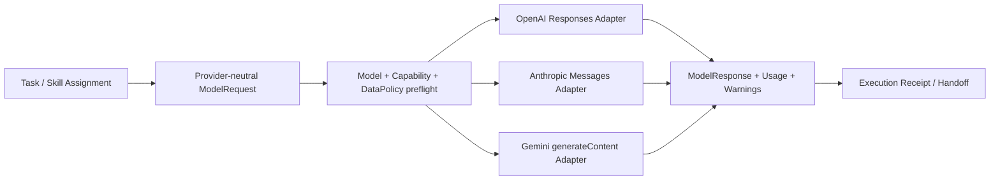

# 多提供商模型 API 实施计划

状态：离线合同切片完成，真实环境一致性验证待执行

日期：2026-08-13

## 1. 目标与边界

该层服务于需要程序化模型调用的受限 Task，不取代 Codex、Claude Code 等平台原生 Agent，也不成为第二个全局调度器。它只负责：请求映射、能力预检、错误/停止原因归一化、工具往返表达、用量记录和数据策略前置检查。



提供商选择属于 Project/Task 策略；研究对象和 Claim 不保存 SDK 对象或路由状态。跨提供商 fallback 必须是上层的一次新 Attempt，并保留实际 provider/model/data policy，不能在 Adapter 内静默完成。

## 2. 当前文件边界

- `port.py`：稳定请求、响应、能力、数据策略和标准错误；
- `http.py`：可注入的有界 HTTPS Transport 与延迟凭据解析；
- `base.py`：共同 preflight、本地结构化校验和错误边界；
- `openai.py`、`anthropic.py`、`gemini.py`：三套独立映射；
- `configuration.py`：非秘密配置解析和存在性探测；
- `registry/providers/adapters.yaml`：禁用状态的环境变量引用模板；
- `tests/test_provider_adapters.py`：官方响应形状的离线合同 fixture。

## 3. 已实现的语义

| 规范语义 | OpenAI | Anthropic | Gemini |
|---|---|---|---|
| 系统指令 | system/developer input | top-level `system` | `systemInstruction` |
| 客户端工具定义 | Responses function tool | `tools[].input_schema` | `functionDeclarations` |
| 工具调用 | `function_call` | `tool_use` | `functionCall` |
| 工具结果 | `function_call_output` | `tool_result` | `functionResponse` |
| JSON Schema 输出 | `text.format` | `output_config.format` | `generationConfig.responseJsonSchema` |
| 暂停/拒绝 | status/refusal | `pause_turn`/`refusal` | finish reason / prompt block |
| 用量 | input/output + cached/reasoning | input/output + cache read | prompt/candidate/cache |

统一只发生在确有共同含义的字段。Anthropic 的 `pause_turn` 保留为 `paused`，Gemini 的并行调用要求显式 `parallel_tools`，服务端工具不映射为普通客户端工具。

## 4. 凭据与真实 Windows 边界

仓库只提交变量名：`OPENAI_API_KEY`、`ANTHROPIC_API_KEY`、`GEMINI_API_KEY` 和三个模型变量名。代码遵循以下顺序：

1. 构造 Adapter 时保存 credential source，不解析值；
2. capability/model/data policy 预检失败时不接触凭据；
3. 仅在即将发送 HTTPS 请求时解析值；
4. request/response 的常规表示隐藏 header 和 body；
5. trace、Execution Receipt 和异常消息不得包含 key 或完整研究输入。

本仓库内可安全运行：

```powershell
rwb providers probe --config registry/providers/adapters.yaml
```

它默认不读取环境。存在性检查应由用户在已授权的真实 Windows Terminal 中显式执行：

```powershell
rwb providers probe --config registry/providers/adapters.yaml --check-environment
```

该命令只输出 `present/missing`，不输出变量值；它也不发 API 请求。认证状态已确认不等于模型/API shape 已通过 live conformance。

## 5. 隐藏风险与预警

后续实现应重点防止：

- **模型别名漂移**：同一别名升级后能力、价格和输出形状变化；每次运行记录实际返回 model/version。
- **托管面不等价**：Azure、Vertex、Bedrock 的认证、区域、字段和保留策略不同；不得只替换 base URL。
- **角色优先级损失**：把 developer/system 合并时可能改变指令优先级；live test 必须覆盖。
- **Schema 方言差异**：提供商仅支持 JSON Schema 子集；本地完整校验不能证明远端接受，同样远端接受不能替代业务规则。
- **工具输出注入**：工具结果是不可信数据；进入下一轮前需要长度、类型、来源和敏感信息检查。
- **调用 ID 不稳定**：缺失 ID 时生成的 ID 只可用于当前 Attempt，不能成为跨运行权威标识。
- **用量不可直接横比**：cached/reasoning/工具 token 定义不同；Execution Receipt 保留分项和 provider 原值，不伪造统一成本。
- **双重重试与重复收费**：SDK、网关和上层若同时重试可能重复执行工具或计费；当前 Adapter 不自动重试。
- **流式取消不确定**：取消到达时间、已计费 token 和部分工具参数可能不一致；未实现前不声明 streaming。
- **数据控制是账户事实**：ZDR、区域和训练退出不能根据厂商品牌推断，必须由部署配置和合同证明后写入 capability snapshot。
- **上下文跨轮膨胀**：工具循环不能把全量网页/论文结果反复回灌；下一阶段执行器必须设置轮数、字符/token、工具结果和成本预算。
- **测试泄密**：live fixture 只保存脱敏后的 shape/摘要，不保存 prompt、key、完整论文或响应全文。

## 6. 分阶段实施

### P0：端口与边界（完成）

冻结 canonical request/response、能力、data policy、错误与停止原因；缺口在出站前阻断。

### P1：三家非流式薄 Adapter（完成）

实现 text、client tools、structured output 和可得 usage 映射；用注入 Transport 的离线 fixture 覆盖正反路径。当前 73 项仓库测试通过；本切片新增 20 项 Adapter/凭据合同测试和 2 项 CLI 探测测试。

### P2：真实 Windows live conformance（下一阶段）

由用户在真实 Windows 授权上下文执行，每家先选一个明确模型，只发最小低成本请求。记录：请求时间、实际 model/version、停止原因、用量字段、结构化输出和单次工具往返。测试脚本只读环境变量，不打印 key，并提供 `--dry-run` 与预算上限。

通过条件：文本、Schema、工具调用、错误 fixture 至少各一次；失败时降低 capability snapshot，而不是添加兼容猜测。

### P3：有预算的工具循环执行器

在 Adapter 之上新增独立 runner，限制最大模型轮次、工具调用数、并行数、单工具输出大小、累计 token/成本和 wall time。每轮生成 Attempt/Execution Receipt；工具调用默认需要 allowlist，不接受模型临时发明工具。

### P4：按真实消费者扩展

只有案例需要时才增加 streaming、图像、文件、prompt caching 或 server tools。每项单独增加 capability、data policy、合同测试和停止/删除条件。

### P5：跨提供商对照

使用同一受限 Task 比较科研质量、证据完整性、上下文负担、工具失败率、成本和人工校核时间。不以“能返回答案”作为兼容性结论。

## 7. 当前不做

- 不读取或提交真实 API key；
- 不在 Codex 沙箱内判断真实 Windows 身份是否认证；
- 不自动选模型、自动降级或静默切换提供商；
- 不实现网关、常驻代理、会话数据库或通用 Agent loop；
- 不因为离线 fixture 通过而把 live conformance 标成 passed。
