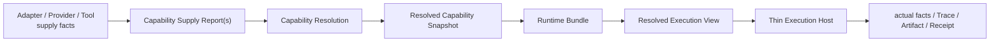

# 模块 09：API 执行、运行时与工具适配

## 1. 目标

把平台中立的 Task、Method Resolution 与 frozen Capability selection，经 Runtime Bundle、Resolved
Execution View 和 Thin Execution Host 映射到模型 API、Agent Runtime 与科研工具。纯 API 隔离会话是
可移植兜底；平台 Adapter 是可替换便利层。Adapter 只报告供给事实或执行 frozen binding，不能选择自身、
改变研究状态、放宽权限或批准 Gate。

Provider / Runtime 实现由黄毅维护；Method、Mode、Skill、受控读取、Handoff 与 Trace 语义由路诚钺维护。跨边界对象需要双方审查，执行层不能反向定义方法 fallback。

## 2. 三类适配器



- Runtime Adapter 映射完整 Agent 平台的 Profile、权限、线程与取消语义；只有 future Skill-bearing
  extension 才额外映射 exact Skill binding；
- Model Provider Adapter 映射程序化模型请求、响应、工具调用和用量；
- Tool Adapter 映射一个可声明的读取、计算或副作用能力。

三者都报告能力，不拥有研究方法或 Supply selection。Skill 可以指导工具使用，但不能授予 Tool 本身
没有的权限。

## 3. 能力协商

```text
Capability Requirement = provider-neutral demand and ceilings
Capability Supply Report(s) = explicit implementation capability and boundary facts
Capability Resolution = compare candidates and produce satisfied / gap / ambiguous / blocked
Resolved Capability Snapshot = freeze the exact selected-supply closure and supply-side ceilings
Runtime Bundle = exact Runtime-readable Action/Capability-slice closure
Resolved Execution View = final exact execution binding and policy intersection
Thin Execution Host = consume only; report actual facts or bounded re-resolution request
```

Capability Resolver 是唯一 Supply selector。它在解析凭据和执行外部动作前比较显式候选的能力、I/O、
数据边界、权限、副作用和 conformance evidence；只有唯一 eligible candidate 才能 `satisfied`。`split` 属于
上游 Method/Task 处理，Human Gate/permission relaxation 属于独立 authority，不得由 Capability Resolution
状态代替。不满足时返回 gap、ambiguous 或 blocked；禁止静默换 Provider、换模型、安装工具或扩大网络权限。

## 4. 隔离 API 会话

```text
ModelPool.bind(explicit_slot) -> ModelBinding
ProviderRegistry.require(adapter, request) -> ModelProvider
IsolatedApiSessionRunner.run(request, limits) -> ApiSessionResult
```

模型池只使用少量显式槽位，例如 `primary`、`worker` 和按需 `specialist`。一个槽可以更换具体模型，但必须冻结请求模型、Provider 返回模型与配置。系统不建设动态价格抓取、综合评分 Router 或跨 Provider 自动降级。

每次 `run` 是独立会话。上述组件只能为上游 frozen execution binding 提供具体 Driver，不能在 Host
调用时再选择 slot、Provider 或 Model。Runner 不把 response ID 或对话缓存在 Attempt 之间当作状态；
工具轮次、并发、结果大小、token / 成本可得性、Host-observed wall time 和停止原因必须受硬边界约束
并写入 execution facts/Receipt。

## 5. Runtime Adapter 契约

Adapter/Provider/Tool 的探测结果先形成 Capability Supply Report：它报告 implementation identity、
version/hash、provided capability、I/O、permissions、data-egress、side effects、deterministic/live
conformance、availability facts 与 limitations，但不能选择自身、声明 fallback 或放宽 Method/Task
边界。Capability Resolution 比较这些 Report；Snapshot 只冻结上游 selection，Runtime 还必须经过
Bundle、View 和 Host 三层，不能把 Snapshot 当成最终 executable authorization。

```text
report_supply() -> CapabilitySupplyReport
load_runtime_bundle(manifest_ref) -> ValidatedRuntimeBundle
produce_view(bundle, profile, data_policy, host_policy, binding) -> ResolvedExecutionView
execute_once(view, prebound_driver, trusted_clock) -> ExecutionHostReport
record_actual_facts(host_report) -> Trace / Artifact / Validation / GenericReceipt
```

Adapter 必须暴露平台版本、Agent / Tool 以及可选 Skill 的发现方式、可强制与仅可提示的约束、权限、
并发/递归限制、MCP 能力、会话到 Task/Attempt 的映射以及失败/取消语义。发现或报告能力不等于选择；
Profile、Host policy 与 binding 的 final narrowing 由 View producer 重算。

Codex、OpenCode、Claude Code 或其他平台各自实现这一接口；Canonical manifests 不因平台变化。应利用
平台原生子 Agent 和可选 Skill 能力，并在原生能力覆盖项目代码时删除重复机制。当前 M11 Core 已闭合
zero-Skill/no-Skill/direct Tool 的 bounded local contract；M11-005/006 SkillReleaseProjection/mapping 仍
`PARKED`，不是 Runtime prerequisite。

## 6. Model Provider 契约

Provider 能力必须通过声明与 conformance 证明，不能从厂商品牌推断。结构化响应仍需本地 Schema 验证；工具名称、call ID 和参数在执行前通过 allowlist、唯一性和参数 Schema 检查。

非秘密配置只保存环境变量名称。凭据由真实运行环境延迟读取，不能进入 Task、Handoff、Trace、报告或仓库。离线合同测试与真实账户 live conformance 必须分开标记。

## 7. Tool / MCP 契约

每个工具提供稳定 capability ID、输入/输出 Schema、读取和写入副作用、数据去向、认证方式、预算、错误与取消语义。MCP 是工具传输方式之一，不成为核心对象。

Tool 输出是不可信输入；进入 Agent 上下文的瞬时结果若没有稳定来源，必须脱敏后写入 Trace。外部写动作需要 Project Protocol 与 Task 双重授权。安装依赖、插件、MCP Server 或 Skill 属于供应链变化，需要独立任务或人工批准。

## 8. 有效权限

```text
Task permission
∩ Agent Profile ceiling
∩ selected Supply requirements/ceilings frozen by Snapshot
∩ DataPolicy ceiling
∩ exact Host policy ceiling
∩ Runtime session / API / tool hard limits
∩ optional Skill permission ceiling (Skill-bearing path only)
= Resolved Execution View effective constraints
```

Snapshot 中的 permission/data-egress/side-effect 字段是 selected Supply 的事实和 ceiling，不是 permission
grant。View 只能取最严交集，且必须反向证明交集仍足以运行 selected Supply；任一必需层缺失或冲突都在
调用前失败。凭据存在、API 可调用或 Adapter capability 都不能补造授权，Adapter 也不能签署 Human Gate。

## 9. 漂移与验证

运行前通过 Supply Report 描述具体实现供给事实，由 Capability Resolver 选择并在 Snapshot 中冻结
selected closure；Runtime Bundle 固定本次可读取文档，View 再冻结 exact Provider/Adapter/Model/Runtime/
Host binding、freshness 和最终 policy intersection。平台、模型或 Supply 变化必须形成新的
Resolution→Snapshot→Bundle/View 链，Host 不在旧 View 中 local rebind/fallback。

Thin Host 使用 trusted clock 的 start/end observation 执行 freshness 与 duration/budget 检查，并在调用前
重载 exact Bundle 防止 TOCTOU。其报告必须区分 preventive controls 与 post-call detected violations；
检测到越界不等于事前 sandbox 已阻止。completed 或可重放的 post-call failure 还必须由 typed、hash-pinned
Trace fact 独立佐证 actual Provider/Adapter/Model/Runtime/Host binding 和 actual Supply。平台或模型版本变化
后运行 contract tests；真实账户状态通过独立 live conformance 更新。诊断 ID 可以写入 Receipt，但运行时
会话日志不能成为唯一证据。

具体实现覆盖见[实现状态](../STATUS.md)，Provider seam 见[实现文档](../implementation/PROVIDER_ADAPTER_PLAN.md)，兼容字段见[兼容性说明](../compatibility/README.md)。

## 10. 验收条件

- 相同控制契约可映射到不同 Runtime 或直接 API；
- capability gap 和数据边界冲突在外部调用前暴露；
- 替换模型、Runtime 或 Tool 不修改科研内核；
- no-Skill 与 direct-tool 路径无需伪造 Skill binding；
- 所有外部副作用可追溯到具名授权和 Attempt；
- 未知用量保持 `unavailable`，不伪装为零；
- Adapter 不保存自己的权威项目状态，也不自动跨 Provider fallback。
