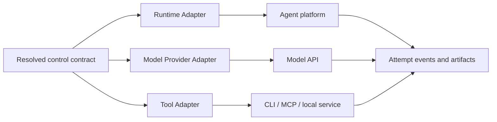

# 模块 09：API 执行、运行时与工具适配

## 1. 目标

把平台中立的 Task、Method Resolution、Resolved Capability Snapshot 和权限策略映射到模型 API、Agent Runtime 与科研工具。纯 API 隔离会话是可移植兜底；平台 Adapter 是可替换便利层。Adapter 只执行映射，不能改变研究状态或批准 Gate。

Provider / Runtime 实现由黄毅维护；Method、Mode、Skill、受控读取、Handoff 与 Trace 语义由路诚钺维护。跨边界对象需要双方审查，执行层不能反向定义方法 fallback。

## 2. 三类适配器



- Runtime Adapter 映射完整 Agent 平台的 Profile、Skill、权限、线程与取消语义；
- Model Provider Adapter 映射程序化模型请求、响应、工具调用和用量；
- Tool Adapter 映射一个可声明的读取、计算或副作用能力。

三者都报告能力，不拥有研究方法。Skill 可以指导工具使用，但不能授予 Tool 本身没有的权限。

## 3. 能力协商

```text
Capability Requirement = provider-neutral demand
Host / Provider / Tool Capability Report = available supply
Resolved Capability Snapshot = this Attempt's frozen binding
```

Resolver 在解析凭据和执行外部动作前检查能力、数据边界、权限、预算和输出契约。不满足时返回 capability gap、split、Human Gate 或 blocked；禁止静默换 Provider、换模型、安装工具或扩大网络权限。

## 4. 隔离 API 会话

```text
ModelPool.bind(explicit_slot) -> ModelBinding
ProviderRegistry.require(adapter, request) -> ModelProvider
IsolatedApiSessionRunner.run(request, limits) -> ApiSessionResult
```

模型池只使用少量显式槽位，例如 `primary`、`worker` 和按需 `specialist`。一个槽可以更换具体模型，但必须冻结请求模型、Provider 返回模型与配置。系统不建设动态价格抓取、综合评分 Router 或跨 Provider 自动降级。

每次 `run` 是独立会话。Runner 不把 response ID 或对话缓存在 Attempt 之间当作状态；工具轮次、并发、结果大小、token / 成本可得性、wall time 和停止原因必须受硬边界约束并写入 Receipt。

## 5. Runtime Adapter 契约

Adapter/Provider/Tool 的探测结果先形成 Capability Supply Report：它报告 implementation identity、
version/hash、provided capability、I/O、permissions、data-egress、side effects、deterministic/live
conformance、availability facts 与 limitations，但不能选择自身、声明 fallback 或放宽 Method/Task
边界。Capability Resolution 比较这些 Report，Runtime 只消费随后冻结的 Resolved Capability Snapshot。

```text
capabilities() -> HostCapabilityReport
resolve_agent(profile_ref) -> RuntimeAgentConfig
resolve_skills(assignment) -> RuntimeSkillBinding
launch(resolved_view) -> RuntimeExecutionRef
collect(execution_ref) -> HandoffCandidate
cancel(execution_ref) -> CancellationResult
```

Adapter 必须暴露平台版本、Agent / Skill 发现方式、可强制与仅可提示的约束、权限、并发/递归限制、工具/MCP 能力、会话到 Task/Attempt 的映射以及失败/取消语义。

Codex、OpenCode、Claude Code 或其他平台各自实现这一接口；Canonical manifests 不因平台变化。应利用平台原生子 Agent 和 Skill 能力，并在原生能力覆盖项目代码时删除重复机制。

## 6. Model Provider 契约

Provider 能力必须通过声明与 conformance 证明，不能从厂商品牌推断。结构化响应仍需本地 Schema 验证；工具名称、call ID 和参数在执行前通过 allowlist、唯一性和参数 Schema 检查。

非秘密配置只保存环境变量名称。凭据由真实运行环境延迟读取，不能进入 Task、Handoff、Trace、报告或仓库。离线合同测试与真实账户 live conformance 必须分开标记。

## 7. Tool / MCP 契约

每个工具提供稳定 capability ID、输入/输出 Schema、读取和写入副作用、数据去向、认证方式、预算、错误与取消语义。MCP 是工具传输方式之一，不成为核心对象。

Tool 输出是不可信输入；进入 Agent 上下文的瞬时结果若没有稳定来源，必须脱敏后写入 Trace。外部写动作需要 Project Protocol 与 Task 双重授权。安装依赖、插件、MCP Server 或 Skill 属于供应链变化，需要独立任务或人工批准。

## 8. 有效权限

```text
Runtime session permission
∩ API / tool allowlist
∩ Agent Profile ceiling
∩ Task permission
∩ Resolved Capability Snapshot boundary
∩ Skill permission ceiling
∩ Project data policy
```

任一层缺失都不按最宽权限推断。权限冲突在调用前失败；Adapter 不能签署 Human Gate。

## 9. 漂移与验证

运行前通过 Supply Report 描述 Host、Provider、Model、Adapter 和 Tool 的供给事实，再在 Resolved
Capability Snapshot 中冻结实际选择。平台或模型版本变化后运行 contract tests；真实账户状态通过独立
live conformance 更新。诊断 ID 可以写入 Receipt，但运行时会话日志不能成为唯一证据。

具体实现覆盖见[实现状态](../STATUS.md)，Provider seam 见[实现文档](../implementation/PROVIDER_ADAPTER_PLAN.md)，兼容字段见[兼容性说明](../compatibility/README.md)。

## 10. 验收条件

- 相同控制契约可映射到不同 Runtime 或直接 API；
- capability gap 和数据边界冲突在外部调用前暴露；
- 替换模型、Runtime 或 Tool 不修改科研内核；
- no-Skill 与 direct-tool 路径无需伪造 Skill binding；
- 所有外部副作用可追溯到具名授权和 Attempt；
- 未知用量保持 `unavailable`，不伪装为零；
- Adapter 不保存自己的权威项目状态，也不自动跨 Provider fallback。
