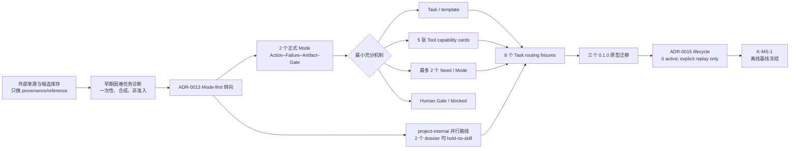

# K-MS-1 节点评审与分支总览

- 责任人：路诚钺（GitHub `Chengyue-Lu`）
- 评审任务：`M7-016`
- 日期：2026-08-19
- 分支：`agent/mode-skill-selection-baseline`
- 评审基线：`0be3982`
- 结论：`K-MS-1 reached — offline selection/governance baseline`
- 正式 Decision：[`D-K-MS-1-BASELINE@1`](../../../examples/objects/decision/D-K-MS-1-BASELINE.yaml)

## 1. 节点决定

接受 K-MS-1 作为 **Mode–Skill–Tool 的离线选择与治理基线**，并停止本分支的机制和库存扩张。
该决定说明 Mode action、最小机制、Tool capability、Skill Need、原型迁移和 Registry lifecycle
已经能形成一致、可确定测试的选择路径；它不说明任何 Skill 已证明真实增量，也不说明科研任务、
API 执行或公开发布已经就绪。

当前应安全停在这里，后续只有三条有前置条件的路径：

1. 路诚钺先完成 `M3-008` Trace Envelope/Index/Event Schema 与手工 fixture；
2. Trace 可用后，才解锁 `M7-005/006/014` 的真实 with/without、H1/H2 和 project-internal 比较；
3. 黄毅在独立工作流维护 API/session/Adapter，当前分支只消费双方确认的共享契约和脱敏工件。

## 2. 本分支形成的主链



主线变化不是“搜集更多 Skill”，而是把选择顺序改为：

```text
Mode/Task 边界
→ 可选 action 与失败
→ Artifact / Human Gate
→ no-Skill、Task、Tool、Skill Need 或 blocked
→ 只有 Need 和真实失败成立后才编写/验证 Skill
```

## 3. 九项完成条件审查

| # | 条件 | 证据 | 结论 |
|---:|---|---|---|
| 1 | 两个正式 Mode 有 trigger/non-trigger/组合/no-Mode fixtures | `MODE_ACTION_REQUIREMENTS.md`；`mode-action-routing-v1` | PASS |
| 2 | Action–Failure–Artifact–Gate 与最小机制完成 | evidence/simulation 各 8 个可选 action；Mode/Task/Tool/Need/Human/blocked 均可出现 | PASS |
| 3 | 每个 Mode 首批 Need ≤2，且有 no-Skill/direct-tool 基线 | evidence：Search Plan、Conflict Synthesis；simulation：Convergence、Sensitivity/UQ | PASS |
| 4 | 至少 6 个可解释 Task fixture | 当前 8 个，覆盖 tool-only、no-Skill、Need、Human Gate、blocked、split Task | PASS |
| 5 | Tool gap 可在调用前判断数据/权限/副作用/失败/验证 | 5 张 provider-neutral capability card，含预算和 explicit-only fallback | PASS |
| 6 | 三个 0.1.0 原型有迁移决定 | literature/simulation 为 legacy；handoff wrapper 为 deprecated；manifest/package hash 冻结 | PASS |
| 7 | 未扩张 Mode/API，且不把 fixture PASS 当科研价值 | 分支未修改 `registry/modes`、`.agents/skills`、Provider/Adapter；所有诊断均写明证据上限 | PASS |
| 8 | 外部来源不直接成为开发清单 | 早期来源 dossier 保留为历史探索，Human Decision 选择 0 个直接重写对象；现行 dossier 以 Need 为主键 | PASS（有历史记录但已降级） |
| 9 | project-internal 有 direct baseline、project-only 边界且 active Need ≤2 | Compact Handoff 与 Audited Transfer 均完成 failure fixture/dossier，结论均为 `hold-no-skill` | PASS |

节点判定为全项通过，但通过类型是 **结构、路由和治理可复验**。它没有覆盖真实模型质量、科学正确性、
人工成本、跨学科泛化或生产稳定性。

## 4. 本分支具体完成了什么

### 4.1 建立实名专项入口并归并文档

- 新建 `docs/workstreams/chengyue-lu-mode-skill/` 作为路诚钺维护范围的唯一专项入口；
- 将旧的匿名/重复实施计划并入实名目录，删除平行的当前计划真值；
- 明确路诚钺负责 Mode/Skill/Trace 方法，黄毅负责 API/session/Adapter 实现；
- 固定“完整留痕”和“默认少读”并存：Attempt Archive 保存过程，主 Agent 只读 Task、索引和 Handoff。

### 4.2 建立来源可追溯的候选库存

- 当前 candidate Registry 有 73 条：`48 reference / 10 triage / 10 rejected / 5 quarantine`；
- source Registry 有 11 个固定来源，覆盖一方文档和社区参考；
- 一方和社区条目均记录来源路径、revision/hash、capability、风险、状态和决定；
- 没有下载内容因“官方”或名称匹配而自动安装、执行或进入 accepted。

这些库存解决 provenance 和按 Need 检索，不代表 73 个待开发 Skill。

### 4.3 完成一次困难任务诊断，并据此收缩测试观

`claim-preserving-rewrite` 使用 GLM 5.3 运行 3 个 case × 3 个臂，共 9 个 fresh session，reported
tokens 合计 125,709。结果只支持 `revise-compact`：8 条短约束在本轮优于完整 Skill 的质量/成本
平衡，完整 wrapper 没有证明额外价值；checker 同时暴露 Markdown/中文边界缺陷。

该结果促成三项规则：简单冒烟不作增量证据、优先 baseline/compact/full 三臂、无区分时停止。
但它是单模型、单次、合成诊断，已归入历史探索；Mode-first 与 M3-008 Gate 之后才可能复验。

### 4.4 从来源驱动转为 Mode-first

- ADR-0013 固定 `Mode → action → failure/artifact/gate → mechanism → Skill Need`；
- `evidence-synthesis` 与 `simulation` 各有 8 个可选 action，不构成强制全局 DAG；
- 每个 Mode 只保留两个首批 Need；no-Skill、tool-only、Human Gate 和 blocked 都是正常答案；
- experiment/theory/observational/engineering 继续是候选分类，不因表格空缺批量准入。

### 4.5 增加 project-internal 路线，但没有制造“架构 Skill”

- ADR-0014 区分 Mode-derived Need 与本项目交接/恢复/Gate 准备 Need；
- 为 Compact Handoff 与 H2 Audited Transfer 建 direct baseline、失败 fixture 和 compact dossier；
- H1 omission 与 H2 semantic reversal 证明结构 PASS 的边界，但没有证明 Skill 能修复；
- 两项结论均为 `hold-no-skill`，交互留痕、Schema、权限和确定性检查继续是强制契约而非 Skill。

### 4.6 冻结 Tool capability 和 Task 路由

- 建立 5 张 card：`document-read`、`literature-search`、`citation-resolve`、`bounded-compute`、
  `research-contract-check`；
- 每张 card 都声明输入/输出、数据出口、凭据、权限、副作用、预算、失败、验证、fallback 和消费者；
- 8 个路由 fixture 覆盖两个 Mode、no-Mode、候选 Mode、拆 Task、capability gap 和 Human Gate；
- Skill Need 不形成隐式 Assignment，Tool 名称也不代表某个 CLI/MCP/API 已实现该能力。

### 4.7 迁移并实际约束三个 accepted 原型

- M7-004 按 Mode action 把 broad Skill 拆回 Task、Tool、Need 和 Human Gate，没有原地改包或创建
  无证据的 `0.2.0`；
- `literature-evidence-extraction@0.1.0` 与 `simulation-vv@0.1.0` 进入 legacy；
- `handoff-integrity@0.1.0` 进入 deprecated，checker 归入 `research-contract-check` 能力边界；
- ADR-0015 分离 `status: accepted` 准入历史和 `active/legacy/deprecated` 分配资格；
- 新 Assignment 默认只接受 active；historical replay 必须使用精确版本和显式
  `--historical-replay`，且禁止 auto-select。

当前 accepted 条目仍为 3 个，但 active 为 0。这是防止旧原型继续占用上下文的预期状态，不是需要
立即补齐的库存缺陷。

相应地，旧任务 M2-003/004（两个 broad Skill）、M2-007（双 Skill 垂直切片）和 M2-008
（来源驱动继续准入）统一转为 `PARKED`。它们的工件不删除，但不能再用 `IN_PROGRESS` 暗示沿旧
路线继续；未来只能由明确 Need、M3-008 Trace 和新的 Task 边界重新激活。

### 4.8 增加确定性回归保护

本分支新增或扩展测试，覆盖：

- source/candidate Registry 的逐项 provenance 与状态；
- 8 个 Mode-action routing fixture 的结果类型与 Tool ID；
- project-internal H1 omission/H2 semantic reversal 的结构边界；
- accepted 原型迁移夹具与实际包哈希一致；
- lifecycle 新分配阻断、精确回放、多版本歧义、旧 Assignment 自校验；
- Task selector 变化引起的 Transfer Audit、Main State hash 和 checkpoint digest 连锁。

评审时全套 159 项测试通过。PASS 只代表结构和回归条件满足。

## 5. 提交序列

| Commit | 作用 |
|---|---|
| `d400df8` | 建立实名 Mode–Skill–Tool 整理计划和边界 |
| `1262144` | 固定首批来源并完成社区候选机器/人工筛选 |
| `7766808` | 补齐 OpenAI/Anthropic/Google 一方逐项 Registry |
| `9666d74` | 转向 Mode-first，并建立 project-internal Need 路线 |
| `722ee22` | 建 project-internal direct baseline 与失败 fixture |
| `c9f1c4e` | 冻结 5 张 Tool cards 与 8 个 Task 路由 fixture |
| `2821600` | 按 Mode action 迁移三个 0.1.0 原型 |
| `0be3982` | 实现 active/legacy/deprecated lifecycle 和精确 replay |
| `3cdaf85` | 完成 K-MS-1 九项评审、正式 Decision 与 safe stop |

## 6. 当前能做与不能做

现在可以：

- 对一个 Task 解释为什么选择某个 Mode/action；
- 解释为何使用 Task、Tool、Skill Need、Human Gate 或直接 blocked；
- 在调用 Tool 前审查数据出口、权限、副作用、预算和失败；
- 防止历史 Skill 被普通新 Assignment 继续加载；
- 用 fixture 和确定性测试回归这些治理结论。

现在不能：

- 声称任何新 Skill 对真实研究有净增量；
- 声称 H1/H2、完整 Trace 或多 Agent 已节省成本；
- 自动执行 Tool card、MCP/API 或模型；
- 证明 evidence/simulation 之外的学科模式已经合理；
- 对外发布包、解决许可证或承诺跨平台/模型兼容；
- 把当前 159 个测试解释为科学正确性。

## 7. 交接与停止点

无历史上下文的开发者或 AI 应按以下顺序接手：

1. 读本文件确认节点结论与未证明内容；
2. 读 [`README.md`](README.md) 获取专项文档索引；
3. 读 [`docs/TASKS.md`](../../TASKS.md) 确认唯一后续任务；
4. 若处理真实评估，先完成 `M3-008`，不要直接恢复 GLM 扩跑；
5. 若处理 API/session，转交黄毅工作流，不在本分支修改；
6. 若未来 Need 进入 candidate，仍按 no-Skill/direct-tool/compact 对照和最多两个验证对象执行。

本分支到 K-MS-1 后应进入 safe stop。下一次继续开发不应再从“搜索更多 Skill”开始，而应从
Trace 前置、获批真实 Task family 或明确的 Human Decision 开始。

## 8. 远端提交与主线合并审计（2026-08-19）

审计基线为 `3cdaf85`，结论是：**建议把本分支合并到 `main`，但合并仅表示仓库采用这套离线
选择/治理基线，不代表 Skill 效果、科研价值或对外发布已经获批。**

| 检查项 | 结果 | 含义 |
|---|---|---|
| 主线关系 | `0 behind / 9 ahead` against `origin/main` | 无主线漂移，不需要先重放或解决冲突 |
| 工作区 | clean | 没有未提交或无关文件混入 |
| 回归 | 159 tests PASS | 结构、fixture 与历史 replay 未回归 |
| 补丁检查 | `git diff --check` PASS | 无已知空白/补丁格式错误 |
| 责任边界 | 无 Provider/API/session/live conformance 实现 | 未侵入黄毅负责的执行侧工作流 |
| 节点边界 | K-MS-1 Decision 已接受并 safe stop | 合并后不会自动开启 M3-008 或真实 trial |
| 发布边界 | M0-007 许可证问题仍存在 | 可以合并源码与文档，但不能据此发布 Skill 包 |

合并后的权威状态以 `main` 为准；原特性分支保留作为提交序列与调查历史，不继续在其上堆叠
下一节点工作。M3-008 应从更新后的 `main` 新建独立 Task/分支，并由其责任边界另行评审。
