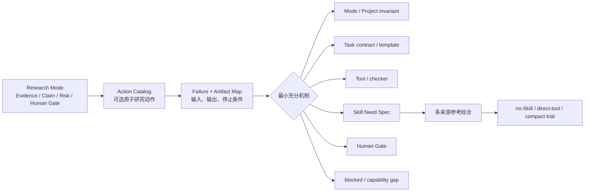

# Mode Action Requirements

- 责任人：路诚钺
- 状态：`M7-011` 已完成的初始基线
- 日期：2026-08-17
- 决策依据：[ADR-0013](../../decisions/0013-MODE-FIRST-SKILL-DERIVATION.md)

本文先从两个正式 Research Mode 推导研究动作、失败模式和最小机制。它不是强制研究阶段图，
也不是 Mode 对 Skill 的固定绑定。每个 Atomic Task 只选择与本次目标有关的 action。

## 1. 推导关系

## 2. 机制判定规则

| 问题 | 是 | 否 |
|---|---|---|
| 是否改变 Evidence/Claim ceiling、必需 Artifact 或 Human Gate？ | Mode/Project invariant | 继续判断 |
| 是否只是本项目、本数据或本次任务的步骤？ | Task contract/template | 继续判断 |
| 是否可由确定性程序、外部读取/计算/检索完整表达？ | Tool/checker | 继续判断 |
| 是否跨任务复用，且需要非平凡语义判断与可判定边界？ | 建立 Skill Need Spec | 保持 no-Skill |
| 是否涉及来源权重、代表性、可接受误差、伦理或最终解释？ | Human Gate；Skill 只能准备材料 | 不额外创建 Gate |

同一个 action 可以同时需要 Tool 和 Human Gate，但不能因此自动获得 Skill。Tool 不决定方法，
Skill 不授予权限，Human Gate 不能由更多 reviewer Agent 代替。

若必需输入、合法访问、批准或 capability 缺失，立即返回 `blocked/capability gap`。例如：

- ES-A2 所需数据库不在获准来源边界内时，不静默改用开放 Web 搜索补齐；
- ES-A4 缺少可定位全文时，不把摘要或二手转述提升为全文 Evidence；
- SIM-A3 没有可调整的分辨率、时间步、容差或误差量时，不宣称完成收敛研究；
- SIM-A5 缺少独立 benchmark/validation data 时，不能用更多内部 Run 代替外部验证。

`blocked` 不是失败的 Skill，也不触发自动安装、换 Provider、放宽来源边界或增加 reviewer Agent。

## 3. `evidence-synthesis` Action Catalog

| ID | 可选研究动作 | 主要失败模式 | 正式 Artifact / 输出 | 初步机制 | Human Gate |
|---|---|---|---|---|---|
| ES-A1 | 冻结问题、范围与来源边界 | 问题不可证伪、范围漂移、混入未批准来源 | Question ref、source boundary、claim ceiling | Mode + Task | 批准问题和边界 |
| ES-A2 | 设计有界检索策略 | query 偏置、数据库覆盖错配、无停止规则 | search plan、query ledger、stop rule | **Skill Need 候选** + search Tool | 批准覆盖/遗漏风险 |
| ES-A3 | 获取、固定和定位来源 | 版本漂移、全文错配、locator 不稳定 | source snapshot/ref、hash、locator | Tool + Artifact contract | 仅数据/访问策略异常时 |
| ES-A4 | 形成原子 Evidence | 把推断写成来源事实、遗漏反证、语义超摘 | Evidence records | Task contract + checker；Skill 增量待证 | 抽样核对高风险提取 |
| ES-A5 | 评价来源适用性与质量 | 把期刊/层级当绝对权重、忽略学科标准 | appraisal notes、quality flags | 学科/方法参考 + Human Gate；不做全局 Skill | 决定来源权重 |
| ES-A6 | 综合支持、冲突、限定和缺失 | 只汇总多数意见、范围差异伪装为冲突、未知项消失 | claim/evidence relation map、synthesis draft | **Skill Need 候选** + graph/checker Tool | 批准综合解释 |
| ES-A7 | 核对 citation 与 Claim locator | DOI 有效但不支持附近 Claim、撤回/勘误遗漏 | citation ledger、resolver receipt | Tool；语义 entailment 是否需 Skill 待真实写作案例 | 判断支持强度与替换引用 |
| ES-A8 | 提升或拒绝 Claim | 结构 PASS 被当作科学正确、越过 evidence ceiling | Claim、Decision | Mode invariant + Human Gate | 必需 |

### 3.1 首批 Skill Need 候选

只保留两个需求入口，不立即创建 Skill：

#### `NEED-ES-SEARCH-PLAN`

- trigger：开放问题需要在明确数据库、时间、语言或学科范围内设计可重放检索；
- non-trigger：已有冻结来源集、只解析 DOI、只运行既有 query；
- 预期增量：query 分面、覆盖/偏差说明、停止规则和失败回退；
- direct-tool 基线：调用 `literature-search` 并保存 query/result；
- 进入 trial 前证据：至少两个数据库覆盖不同、结果量受限且存在 query drift 的真实或脱敏案例。

#### `NEED-ES-CONFLICT-SYNTHESIS`

- trigger：多个 Evidence 对同一 Claim 形成支持、冲突、范围限定或关键缺失；
- non-trigger：单来源原子提取、简单事实核验、最终来源权重批准；
- 预期增量：区分真正矛盾与范围差异，保留负结果和 decision-changing unknown；
- direct-tool 基线：Evidence/Claim graph schema 与结构 validator；
- 进入 trial 前证据：至少一个时间/人群/测量范围不同造成伪冲突的困难案例。

`citation-claim-integrity` 暂不占当前 Need 名额；先作为 ES-A7 的真实写作案例观察项。

## 4. `simulation` Action Catalog

| ID | 可选研究动作 | 主要失败模式 | 正式 Artifact / 输出 | 初步机制 | Human Gate |
|---|---|---|---|---|---|
| SIM-A1 | 冻结模型目的、假设与参数边界 | 把模型当现实、范围外外推、目标不清 | Method、assumption ledger、parameter boundary | Mode + Task | 批准模型用途和假设 |
| SIM-A2 | 固定代码、环境、输入、seed 和输出 | 运行不可复现、依赖漂移、输入错配 | Run manifest、input lock、environment receipt | Tool + Artifact contract | 通常不需要 |
| SIM-A3 | 设计数值收敛研究 | 只见单一分辨率、误差指标错误、资源不足仍宣称收敛 | convergence plan/report | **Skill Need 候选** + bounded compute | 批准误差和资源阈值 |
| SIM-A4 | 设计敏感性与不确定性分析 | 参数范围任意、局部结果冒充全局、输入不确定性遗漏 | sensitivity/UQ plan、run set、report | **Skill Need 候选** + bounded compute | 批准参数分布和重要性解释 |
| SIM-A5 | 基准、校准和外部验证 | benchmark 不相关、校准数据泄漏、验证概念混淆 | benchmark refs、calibration/validation evidence | Mode + Task/方法参考 + Human Gate | 必需 |
| SIM-A6 | 执行有界计算 | 无 wall-time/输出/资源上限、失败结果丢失 | Run、logs、execution receipt | Tool | 批准高成本/外部执行 |
| SIM-A7 | 审计可支持的 Claim | numerical verification 升格为 physical validation | Claim audit、limitations、Decision | Mode invariant + checker + Human Gate | 必需 |
| SIM-A8 | 生成和检查仿真图表 | 色标/插值/截断误导、provenance 丢失 | figure spec、rendered artifact、lineage | Output Task + Tool；不自动创建 Skill | 最终科学表达审核 |

### 4.1 首批 Skill Need 候选

#### `NEED-SIM-CONVERGENCE-STUDY`

- trigger：离散化、时间步、迭代容差或随机估计误差可能限制 Run Claim；
- non-trigger：只复现已冻结 Run、纯软件单元测试、已有充分且获批的收敛证据；
- 预期增量：选择可解释的 refinement、误差量和停止标准，避免“程序成功退出=收敛”；
- direct-tool 基线：按给定参数运行 sweep 并检查 report schema；
- 进入 trial 前证据：至少两个求解器/数值形态不同的案例，不能绑定单一库。

#### `NEED-SIM-SENSITIVITY-UQ`

- trigger：结论依赖多个不确定输入、参数范围或随机过程，需要区分敏感性与不确定性传播；
- non-trigger：单参数调试、已知固定输入的重复运行、只需要绘图；
- 预期增量：明确目标量、参数范围/分布、采样设计、相互作用和解释边界；
- direct-tool 基线：执行给定设计并计算已指定指标；
- 进入 trial 前证据：至少一个局部/全局敏感性混淆和一个相关输入或结构不确定性案例。

## 5. 外部材料的使用方式

第二批 GLM 结果和首批 73 项 Registry 只做 reference inventory：

- Tool/MCP 只在 action 已产生 capability gap 后映射到 Tool card；
- Skill 内容按 Need 汇总共同约束、差异、学科变体和风险，不按来源逐个重写；
- 无许可正文不读取或复制；限制性许可只记录需求和风险模式；
- 任何安装、运行、凭据、网络和 Adapter 测试仍不属于本工作流；
- 外部来源没有合适 Skill 时保留空结果，不降低标准。

当前可用映射示例：

| Mode action | 参考材料用途 | 不是 |
|---|---|---|
| ES-A2 | paper-search MCP 元数据用于 `literature-search` capability gap | 自动成为搜索 Skill |
| ES-A6 | evidence-map 的 edge/unknown 结构作为 artifact/checker 参考 | 引入第二套 Evidence truth |
| SIM-A3 | fluidsim 的版本、资源和验证模式作为 convergence Need 参考 | 绑定 FluidSim 的通用 Skill |
| SIM-A6 | Jupyter/ipybox 元数据作为 bounded-compute Adapter 候选 | 在本分支实现或测试 API |
| future theory | lean-lsp-mcp 证明 Tool 可能存在 | 因 Tool 存在而准入 theory Mode |

## 6. 现有 Skill 的重新评估入口

| 现有 Skill | 关联 action | 当前处理 |
|---|---|---|
| `literature-evidence-extraction@0.1.0` | ES-A4，部分 ES-A6/ES-A7 | 冻结原型；先比较 Task+checker 是否足够，再决定拆分或新 trial |
| `simulation-vv@0.1.0` | SIM-A2–A7 | 范围过宽；冻结原型，按 action 重建需求，不原地扩写 |
| `handoff-integrity@0.1.0` | 非 Mode action；跨任务交接 | 迁移目标为 Tool/Trace/H2 模板，等待版本化 deprecation |

## 7. 完成 Gate

`M7-011` 完成需要：

1. 两个正式 Mode 的 action、failure、artifact、机制和 Human Gate 均可解释；
2. 至少有 no-Skill、tool-only、Skill Need、blocked 和 Human Gate 路径；
3. 每个 Mode 同时维护的首批 Skill Need 不超过两个；
4. 任一 Need 能在不读取全部候选正文时找到相关 reference inventory；
5. Mode action 不构成强制全局顺序，也不绑定 Agent、模型、Provider 或具体 Adapter；
6. 下一步是路由 fixture 和 Need dossier，而不是创建 Skill 包。
