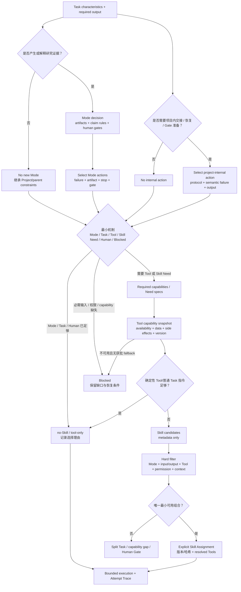

# Mode–Skill–Tool 划分与调用计划

## 1. 七个概念

| 概念 | 回答的问题 | 不负责 |
|---|---|---|
| Research Mode | 什么证据与工件能支持什么强度的 Claim | 指定模型、Agent 或厂商工具 |
| Mode Action | 某个 Mode 下本次 Task 可能需要哪一个原子研究动作 | 构成所有项目都必须执行的阶段图 |
| Skill Need | 哪个 action 缺少可复用的非平凡语义方法 | 预先指定某个外部 Skill 实现 |
| Agent Profile | 哪类执行容器、权限和上下文适合该 Task | 固定携带某个 Skill |
| Skill | 如何完成一个可复用研究动作 | 授予工具、网络或外部写权限 |
| Tool capability | 用什么确定性或外部能力读取、计算、查询或产出 | 决定方法合理性和 Claim ceiling |
| Output contract | 必须交付什么结构及怎样验证 | 替研究者接受结论 |

写作、翻译、绘图、citation audit、Handoff 检查和平台名称默认不是 Research Mode。它们通常是 cross-cutting Skill、Tool 或 Output。只有新的 Artifact、Claim rule、Human Gate 或风险边界无法由现有 Mode/组合表达时，才考虑新增 Mode。

## 2. Mode 划分

| 分类 | 当前状态 | 准入判断 |
|---|---|---|
| `evidence-synthesis` | 正式 | 有 bounded source/evidence/claim 约束，继续补 trigger/non-trigger 和 search/extraction 分界 |
| `simulation` | 正式 | 有 model/run/error/claim 约束，继续补纯代码检查、仿真生成和 V&V 分界 |
| `experiment` | 候选 | 需要真实实验设计/执行案例证明 protocol、randomization、calibration、safety Gate 的独立性 |
| `theory` | 候选 | 需要真实定义/假设/引理/反例/证明责任案例，不能只因使用 CAS 就新增 |
| `observational-statistics` | 候选 | 需要 sampling/bias/identification/missingness/robustness 改变 Claim/Gate 的案例 |
| `engineering-validation` | 候选 | 需要 requirement/operating condition/failure/safety margin 与 simulation 的差异证据 |
| reporting/writing/visualization | 非 Mode | 作为 Output/Skill/Tool，并继承上游 Mode 的 Claim 和数据边界 |
| citation/handoff/reproducibility audit | 非 Mode | 作为 cross-cutting Integrity Skill 或确定性 Tool |

一个 Atomic Task 默认只有一个 primary Mode。需要多个 Mode 时：

- 如果工作可顺序拆开，拆成多个 Task 并通过工件连接；
- 如果同一输出确实同时依赖两类证据，允许组合，Claim ceiling、权限和数据边界取更严格值，Human Gates 取并集；
- 纯维护、格式转换或完整性检查可以 `no new mode`，但必须继承父 Task/Project Protocol 的边界；
- Mode 不因选了某个 Tool 或 Skill 自动激活，也不因 Task 完成自动升级 Claim。

## 3. 路由流程

该流程分别判断本次 Task 的 Mode action 与 project-internal action，再在同一个最小机制节点合流。
只有 action 被判定为 Skill Need 后，才读取相关来源元数据并建立 need-centered dossier；不能通过
遍历候选正文让模型“自己挑”。Mode action 和内部 action 都是可选目录，不是固定 DAG，也不形成
Mode-to-Skill 或 governance Skill bundle。

## 4. Skill 调用规则

1. `exploratory` Task 可以隐式建议 Skill，但正式输出不得直接 promotion。
2. `controlled/high-risk` Task 必须显式列出 required Skill，并冻结内容/包哈希。
3. 确定性 Tool 或短 Task 指令足够时选择 `no-Skill`；no-Skill 是正常结果，不是能力缺失。
4. 默认一个 method Skill；必要时附加一个 output Skill 和一个风险触发的 integrity Skill，但仍受 Registry 的两个主 Skill + 一个 integrity 上限约束。
5. Tool availability、数据出口或权限不满足时返回 capability gap；不自动安装、登录、换 Provider、换模型或放宽边界。
6. 多个等价 Skill 不能靠 Agent 名称、描述长度或“更全面”自动选择；拆 Task、请求人工或返回 ambiguous。
7. Skill 可以要求 Tool capability，但 Tool 不能反向改变 Skill/Mode 的方法边界。
8. H1/H2 的完整消息均归档；只有风险触发 H2 审计链，不能把 `handoff-integrity` 常驻作为所有任务的默认校核 Agent。
9. project-internal Need 与 Mode-derived Need 并行发现，但在同一 Atomic Task 的 Resolver 合流；内部 Skill 继承 Mode/Project 边界并计入相同 Skill/context 上限。
10. 交互留痕、读取权限、输出 Schema 和确定性校验始终由 Protocol/Task/Tool 强制，不能因内部 Skill 未加载而失效。

## 5. Tool Capability Card

在绑定具体 CLI/MCP/API 前，先写 provider-neutral 卡。每张卡至少声明：用途、接口形态、读/写/执行
类别、输入输出、数据出口、凭据、权限、副作用、版本、预算、失败语义、验证、显式 fallback、
action 消费者和责任人。完整定义见[Action-driven Tool Capability Cards](TOOL_CAPABILITY_CARDS.md)。

卡描述的是能力，不承诺所有接口都实现。具体 Adapter 必须报告 capability gap，不能根据厂商名称
推断能力，也不能由路诚钺的文档测试替代黄毅维护的 Adapter/conformance 测试。

## 6. 首批 Tool 能力

| Tool capability | 类别 | 初始边界 | 直接消费者 |
|---|---|---|---|
| `document-read` | local/read | 只读声明输入；记录文件 hash/页段定位；无外传 | evidence extraction、citation audit |
| `citation-resolve` | external/read | 默认只发送 DOI/题名等书目信息；全文外传需单独批准 | evidence/citation integrity |
| `literature-search` | external/read | 发送 query plan；返回归一化结果和查询 Receipt；无静默多服务 fallback | search planning、evidence synthesis |
| `bounded-compute` | local/execute | 固定工作目录、依赖、wall time、输出路径和随机种子；禁止任意安装 | simulation V&V、统计/检查脚本 |
| `research-contract-check` | local/deterministic | 只检查 Schema、hash、reference、coverage 和声明状态；结构 PASS 不等于科学正确 | ES-A3/A4/A6/A7、SIM-A2/A7、内部 closeout |

`scientific-figure-generation` 尚未形成当前 Action-driven card；Zotero、Crossref/OpenAlex、Python/R、
Jupyter、MCP 或项目仿真 CLI 只能作为既有卡的 Adapter 候选，不直接写进 Mode。

## 7. 路由记录

每个 fixture/Resolved Task 至少记录：

- task characteristics 与 primary/combined/no-new Mode；
- required artifacts、Claim ceiling、Human Gates；
- required capabilities 的来源；
- Tool capability snapshot 与不可用项；
- deterministic/no-Skill 判断；
- Skill 候选及逐项排除理由；
- selected Skill/Tools 的版本、哈希、权限和数据出口；
- read allowlist、write scope、H0/H1/H2；
- unresolved ambiguity、split 或 Human Gate。

仅记录最终 Skill 名称不足以重放选择。

## 8. 首批路由 fixtures

首批八个实际 fixture、选择矩阵和边界解释见
[Task–Mode–Action–Mechanism Routing Fixtures](TASK_MODE_ACTION_ROUTING_FIXTURES.md)。机器输入使用
`.yaml.txt` 并声明 `formal_contract: false`；测试只固定 case 自洽、Tool ID 和结果覆盖。

这些 fixture 均不调用外部 API。Method 层只保留 capability requirement；数据策略不允许时明确 `blocked`，
而供应侧 available/gap 留给 Capability Resolution；
Skill Need 尚未实现时保留 Need 和 Human Gate，不伪造 Assignment。

## 9. 与 API 执行的接口

路诚钺交付：Mode/Skill/Tool capability IDs、输入输出契约、data egress、权限、副作用、预算、失败语义、验证与 fixtures。

黄毅交付：具体 Adapter capability snapshot、认证/环境存在性、真实调用结果、用量、Receipt、Trace 和 conformance。

任何一方修改共享字段都需要两人确认。路诚钺的路由测试不读取真实令牌、不测试 Provider；黄毅的 Adapter 不静默改变 Mode、Skill、Tool fallback 或 Claim ceiling。

## 10. 停止条件

- Mode 只改变提示语/Agent 名称，没有改变 Artifact、Claim、Gate 或风险；
- Skill 只是 Tool 使用说明，没有增量方法价值；
- Tool 卡没有真实 Skill/fixture 消费者；
- 组合规则使单个 Task 携带多个大 Skill，应拆 Task；
- 路由需要加载全部候选正文才能决策；
- 外部工具的数据、凭据、副作用或失败边界无法在调用前判断；
- 为获得“覆盖”开始批量添加厂商、平台或学科标签。

触发后停止扩张，返回 no-Skill、capability gap、reference、split Task 或 Human Gate。
