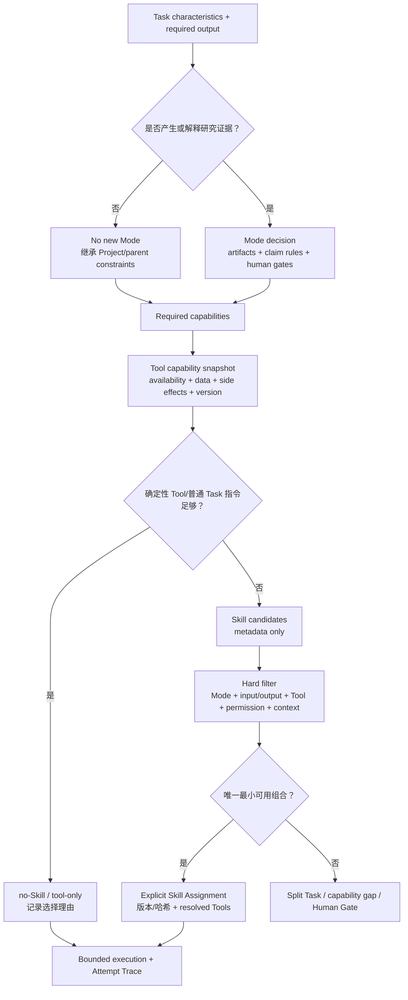

# Mode–Skill–Tool 划分与调用计划

## 1. 五个概念

| 概念 | 回答的问题 | 不负责 |
|---|---|---|
| Research Mode | 什么证据与工件能支持什么强度的 Claim | 指定模型、Agent 或厂商工具 |
| Agent Profile | 哪类执行容器、权限和上下文适合该 Task | 固定携带某个 Skill |
| Skill | 如何完成一个可复用研究动作 | 授予工具、网络或外部写权限 |
| Tool capability | 用什么确定性或外部能力读取、计算、查询或产出 | 决定方法合理性和 Claim ceiling |
| Output contract | 必须交付什么结构及怎样验证 | 替研究者接受结论 |

写作、翻译、绘图、citation audit、Handoff 检查和平台名称默认不是 Research Mode。它们通常是 cross-cutting Skill、Tool 或 Output。只有新的 Artifact、Claim rule、Human Gate 或风险边界无法由现有 Mode/组合表达时，才考虑新增 Mode。

## 2. Mode 划分

| 分类 | 当前状态 | 准入判断 |
|---|---|---|
| `evidence-synthesis` | 正式 | 有 bounded source/evidence/claim 约束，继续补 trigger/non-trigger 和 search/extraction 分界 |
| `simulation` | 正式 | 有 model/run/error/claim 约束，继续补纯代码检查、仿真生成和 V&V 分界 |
| `experiment` | 候选 | 需要真实实验设计/执行案例证明 protocol、randomization、calibration、safety Gate 的独立性 |
| `theory` | 候选 | 需要真实定义/假设/引理/反例/证明责任案例，不能只因使用 CAS 就新增 |
| `observational-statistics` | 候选 | 需要 sampling/bias/identification/missingness/robustness 改变 Claim/Gate 的案例 |
| `engineering-validation` | 候选 | 需要 requirement/operating condition/failure/safety margin 与 simulation 的差异证据 |
| reporting/writing/visualization | 非 Mode | 作为 Output/Skill/Tool，并继承上游 Mode 的 Claim 和数据边界 |
| citation/handoff/reproducibility audit | 非 Mode | 作为 cross-cutting Integrity Skill 或确定性 Tool |

一个 Atomic Task 默认只有一个 primary Mode。需要多个 Mode 时：

- 如果工作可顺序拆开，拆成多个 Task 并通过工件连接；
- 如果同一输出确实同时依赖两类证据，允许组合，Claim ceiling、权限和数据边界取更严格值，Human Gates 取并集；
- 纯维护、格式转换或完整性检查可以 `no new mode`，但必须继承父 Task/Project Protocol 的边界；
- Mode 不因选了某个 Tool 或 Skill 自动激活，也不因 Task 完成自动升级 Claim。

## 3. 路由流程



该流程先判断方法和 Tool，再加载 Skill 正文。未选 Skill 只读取 Registry 元数据；不能通过遍历候选正文让模型“自己挑”。

## 4. Skill 调用规则

1. `exploratory` Task 可以隐式建议 Skill，但正式输出不得直接 promotion。
2. `controlled/high-risk` Task 必须显式列出 required Skill，并冻结内容/包哈希。
3. 确定性 Tool 或短 Task 指令足够时选择 `no-Skill`；no-Skill 是正常结果，不是能力缺失。
4. 默认一个 method Skill；必要时附加一个 output Skill 和一个风险触发的 integrity Skill，但仍受 Registry 的两个主 Skill + 一个 integrity 上限约束。
5. Tool availability、数据出口或权限不满足时返回 capability gap；不自动安装、登录、换 Provider、换模型或放宽边界。
6. 多个等价 Skill 不能靠 Agent 名称、描述长度或“更全面”自动选择；拆 Task、请求人工或返回 ambiguous。
7. Skill 可以要求 Tool capability，但 Tool 不能反向改变 Skill/Mode 的方法边界。
8. H1/H2 的完整消息均归档；只有风险触发 H2 审计链，不能把 `handoff-integrity` 常驻作为所有任务的默认校核 Agent。

## 5. Tool Capability Card

在绑定具体 CLI/MCP/API 前，先写 provider-neutral 卡：

```yaml
tool_capability_id: literature-search
purpose: Query bibliographic indexes inside a declared search boundary.
interfaces: [local-index, cli, mcp, remote-api]
operation_kind: read-only
determinism: external-snapshot-dependent
inputs: [query-plan, source-boundary, date-boundary]
outputs: [normalized-search-result, query-receipt]
data_egress:
  sends: [search-query]
  forbids_by_default: [private-full-text, unpublished-results]
permissions: [network-search]
side_effects: none
versioning: adapter-and-source-snapshot
failure_semantics: [unavailable, partial, rate-limited, policy-blocked]
validation: [result-schema, source-id, query-receipt]
fallback_policy: explicit-only
owner:
  contract: 路诚钺
  execution_adapter: 黄毅
```

每张卡至少声明：用途、接口形态、读/写/执行类别、输入输出、数据出口、凭据、权限、副作用、版本、可复现性、预算、失败语义、验证、显式 fallback、适用 Mode/Skill 和责任人。

卡描述的是能力，不承诺所有接口都实现。具体 Adapter 必须报告 capability gap，不能根据厂商名称推断能力。

## 6. 首批 Tool 能力

| Tool capability | 类别 | 初始边界 | 直接消费者 |
|---|---|---|---|
| `document-read` | local/read | 只读声明输入；记录文件 hash/页段定位；无外传 | evidence extraction、citation audit |
| `citation-resolve` | external/read | 默认只发送 DOI/题名等书目信息；全文外传需单独批准 | evidence/citation integrity |
| `literature-search` | external/read | 发送 query plan；返回归一化结果和查询 Receipt；无静默多服务 fallback | search planning、evidence synthesis |
| `bounded-compute` | local/execute | 固定工作目录、依赖、wall time、输出路径和随机种子；禁止任意安装 | simulation V&V、统计/检查脚本 |
| `project-cli` | local/deterministic | 只调用 allowlisted 子命令；保存命令、exit 和报告 hash | handoff、schema、claim/citation checks |
| `scientific-figure-generation` | specialist/output | 可能涉及研究内容外传和生成代码；默认不可用，需 figure spec、lineage、data approval 和 Human Gate | 后续 output Skill |

具体工具如 Zotero、Crossref/OpenAlex、Python/R、Jupyter/Quarto、CAS 或项目仿真 CLI 只能作为某张能力卡的 Adapter 候选，不直接写进 Mode。

## 7. 路由记录

每个 fixture/Resolved Task 至少记录：

- task characteristics 与 primary/combined/no-new Mode；
- required artifacts、Claim ceiling、Human Gates；
- required capabilities 的来源；
- Tool capability snapshot 与不可用项；
- deterministic/no-Skill 判断；
- Skill 候选及逐项排除理由；
- selected Skill/Tools 的版本、哈希、权限和数据出口；
- read allowlist、write scope、H0/H1/H2；
- unresolved ambiguity、split 或 Human Gate。

仅记录最终 Skill 名称不足以重放选择。

## 8. 首批路由 fixtures

| Fixture | Mode 判断 | 期望 Skill/Tool 路径 | 关键边界 |
|---|---|---|---|
| 从 3 篇固定论文提取可定位结果 | `evidence-synthesis` | evidence extraction + `document-read` | 不做检索和最终综合 |
| 为开放问题制定检索并归一化结果 | `evidence-synthesis` | 先评估 search Skill 是否有增量；`literature-search` | query/data egress、部分结果 |
| 审核已冻结仿真 Run | `simulation` | simulation V&V + `bounded-compute/project-cli` | verification 不等于 physical validation |
| 只改善固定 Claim 的表达 | no new Mode | claim-preserving rewrite + local checker | 不事实核查、不增强结论 |
| 检查 DOI、引用和 Claim locator | no new Mode/继承上游 | direct Tool 或 citation integrity | deterministic PASS 不等于科学正确 |
| 推导一个带假设的引理 | candidate `theory` | 当前无 accepted Skill；Human Gate/blocked | CAS Tool 不自动创建 theory Mode |
| 设计随机化与功效方案 | candidate `experiment` | experiment-design 保持 trial/blocked | 统计假设和伦理/资源由人决定 |
| 生成论文示意图 | no new Mode/继承上游 | figure Output Skill + specialist Tool（当前 unavailable） | 数据外传、lineage、视觉误导 |

至少前五个 fixture 必须能在不调用真实外部 API 的情况下完成路由解析；Tool 不可用也应得到明确 `capability-gap`，而不是伪造成功。

## 9. 与 API 执行的接口

路诚钺交付：Mode/Skill/Tool capability IDs、输入输出契约、data egress、权限、副作用、预算、失败语义、验证与 fixtures。

黄毅交付：具体 Adapter capability snapshot、认证/环境存在性、真实调用结果、用量、Receipt、Trace 和 conformance。

任何一方修改共享字段都需要两人确认。路诚钺的路由测试不读取真实令牌、不测试 Provider；黄毅的 Adapter 不静默改变 Mode、Skill、Tool fallback 或 Claim ceiling。

## 10. 停止条件

- Mode 只改变提示语/Agent 名称，没有改变 Artifact、Claim、Gate 或风险；
- Skill 只是 Tool 使用说明，没有增量方法价值；
- Tool 卡没有真实 Skill/fixture 消费者；
- 组合规则使单个 Task 携带多个大 Skill，应拆 Task；
- 路由需要加载全部候选正文才能决策；
- 外部工具的数据、凭据、副作用或失败边界无法在调用前判断；
- 为获得“覆盖”开始批量添加厂商、平台或学科标签。

触发后停止扩张，返回 no-Skill、capability gap、reference、split Task 或 Human Gate。
