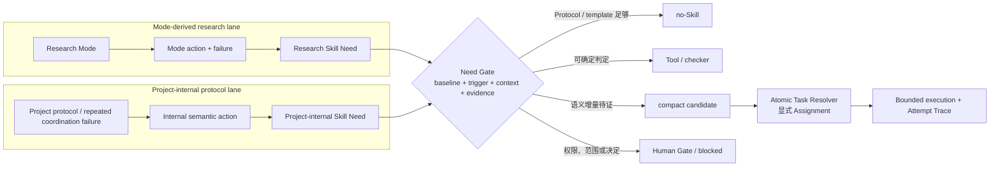

# 项目内生协议 Skill 规划

- 责任人：路诚钺
- 状态：候选槽与 direct baseline 已完成；Skill package 继续阻断
- 日期：2026-08-17
- 决策依据：[ADR-0014](../../decisions/0014-PROJECT-INTERNAL-SKILL-LANE.md)

本文只规划服务于 Research Agent Workbench 自身协议的 Skill Need。它不建立可对外复用的 Skill
目录，不改变科研 Mode，也不取代 Task、Handoff、Trace、Schema、Tool 或 Human Gate。

## 1. 两条并行路线

两条路线共享准入和上下文上限，但不共享固定 Skill bundle。一个内部候选不能因为“所有任务都要
交接”而常驻；只有本次 Task 的交接确实需要它时才显式选择。

## 2. 机制分界

| 需求 | 默认归属 | 何时才考虑 Skill |
|---|---|---|
| Agent 必须归档全部可见交互 | Project Protocol + Runtime Trace | 不考虑；这是不可选不变量 |
| 允许读取/写入哪些路径 | Task Packet + Agent Profile | 不考虑；Skill 无权扩大范围 |
| Handoff 有哪些字段 | Schema + Output template | 不考虑；确定性校验即可 |
| 从长任务中选择哪些决定、风险和未知项进入 Compact Handoff | Task template + checker baseline | 多类困难 Task 反复发生语义遗漏时 |
| H2 Transfer Manifest 是否覆盖 decision-changing 内容 | Manifest Tool + Human sample | 结构 PASS 仍反复遗漏关键语义时 |
| Trace 文件是否齐全、hash 是否匹配 | Tool/checker | 不考虑；机器可判定 |
| 新主 Agent 从哪些工件恢复、如何处理相互冲突状态 | Recovery contract + validator baseline | 冲突取舍无法由状态优先级完整表达时 |
| Human Gate 材料如何压缩为选项、证据、未知项和恢复条件 | Decision Brief template | 跨模块重复出现且模板不足时 |
| 输出 Markdown/JSON/YAML 的格式 | Output template + formatter | 不考虑；格式不是语义方法 |

## 3. 首批候选占位

这些条目是 Need placeholder，不是 Skill ID，不进入 Registry，也不保证最终实现。

| Need ID | 暂定动作 | Trigger | Direct baseline | 当前状态 |
|---|---|---|---|---|
| `NEED-INT-COMPACT-HANDOFF` | 从一次 Attempt 选择最小充分的决定、工件、风险、未知项和下一动作 | H1 任务含多个输出或被截断会改变下一决策 | Handoff Schema + Compact Handoff 模板 + 引用 checker | `priority-1` |
| `NEED-INT-AUDITED-TRANSFER` | 为 H2/压缩生成并核对语义转移覆盖 | compaction、关键 Claim/Decision promotion、争议或会话销毁 | Transfer Manifest/Audit Schema + hash/locator Tool + 人工抽样 | `priority-1` |
| `NEED-INT-BOUND-ASSIGNMENT` | 将目标转成最小 Task、允许读取集、写入范围、输出和停止条件 | 委派前存在多模块、多权限或含混完成条件 | Task Packet 模板 + resolver/checker | `observe` |
| `NEED-INT-CONTEXT-RECOVERY` | 在新主会话中从 Task/Main State/Handoff 恢复并处理状态冲突 | 会话切换、safe-pause 恢复或上游 revision 漂移 | Recovery 顺序 + reference/hash validator | `observe` |
| `NEED-INT-HUMAN-GATE-BRIEF` | 将待人决定的问题整理为选项、证据、风险、未知项和恢复路径 | blocked/ambiguous/高风险 Task 需要实名决定 | Decision Brief 模板 + evidence/reference checks | `observe` |

优先级不等于准入。当前只允许前两个进入 Need dossier；其余保持元数据占位，直到出现至少两个
不同 Task 家族的重复失败。任何一个 direct baseline 已充分解决的问题都降为 `no-Skill`。

## 4. 候选的最小输出

项目内生候选若进入 dossier，必须明确：

- `need_id`、Task/风险触发和 non-trigger；
- 它处理的语义判断，以及绝不能处理的权限/Claim/最终决定；
- direct protocol/template/tool baseline；
- 输入工件、输出工件和稳定 locator；
- 最多读取哪些正文，哪些只允许读取元数据；
- 与 Mode-derived Skill、Agent Profile、Handoff level 和 Tool 的关系；
- 预计正文上下文成本，以及不用 Skill 时的恢复路径；
- 成功、遗漏、过度加载、越权和“模板已足够”样例；
- project-only 标记、版本/hash 和退役条件。

未来若需要机器元数据，应先提出最小 Schema 变更，例如显式的 `scope: project-internal`；在 Schema
决策完成前，不借用 `applies_to_modes: [all]` 伪造 Mode 适用性。

## 5. 路由与上下文边界

1. 协调主 Agent 只读取 Need/Skill 元数据，不加载内部 Skill 正文；
2. worker 只读取显式 Assignment 中选中的一个内部 Skill及其当前步骤引用；
3. 内部 Skill 计入现有 Skill 数量和上下文预算，不获得额外槽位；
4. 与 Mode-derived method Skill 同时需要且总量超限时，拆成执行 Task 与 closeout/transfer Task；
5. H0 不加载 Handoff Skill；普通 H1 优先模板；只有风险触发才考虑 H2 候选；
6. 输出 Schema、Trace 捕获和 hash 校验始终独立生效，不能因 Skill 未加载而失效；
7. Skill 发现不得递归读取整个 Attempt Archive，所需消息或工件必须由 Task allowlist 指定；
8. 任何范围、权限、模型或外部副作用缺口返回 `blocked`，不由 Skill 兜底。

## 6. 并行实施计划

| Lane | 下一活动 | 可并行对象 | 停止点 |
|---|---|---|---|
| Mode-derived | M7-008 Tool cards、M7-003 路由 fixtures、M7-004 原型迁移 | 与内部 Need dossier 并行 | 不创建来源驱动 Skill |
| Project-internal | M7-013 已完成 direct baseline、failure fixture 与 compact dossier；等待独立 Task family | 不修改 Mode/Registry/Runtime | 两项均为 `hold-no-skill` |
| Shared evaluation | M3-008 后比较 no-Skill/template/tool/compact Skill | 两条 Lane 共用 Trace 指标 | 没有重复语义失败即停止 |
| Runtime/API | 由黄毅维护 Trace capture 与 Adapter | 只消费冻结契约 | 本分支不实现或测试 |

## 7. 验收与退役

进入 `trial` 前必须同时满足：

1. 至少两个不同 Task 家族出现同类语义失败，且结构 checker 已通过；
2. direct protocol/template/tool baseline 已冻结并作为对照；
3. trigger/non-trigger、读取集、输出、Human Gate 和停止条件可判定；
4. Skill 正文足够短，引用按需加载，不复制模块文档；
5. 能说明为什么它不是 Agent Profile、Output Schema、Tool 或新增 Mode；
6. M3-008 能留存实际加载、输出、上下文成本、遗漏、回查和返工。

出现以下任一情况则保持 `no-Skill`、降级或退役：

- 模板或 checker 达到同等结果；
- 只有单一 Task/单一 Agent 表现出需求；
- 必须常驻加载或读取完整历史才有效；
- 主要价值只是提醒遵守已经存在的强制规则；
- 增加的交接、review 或 token 成本高于减少的遗漏和返工。
