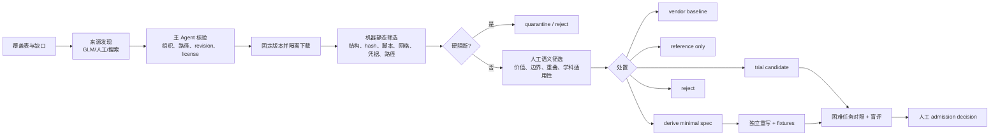
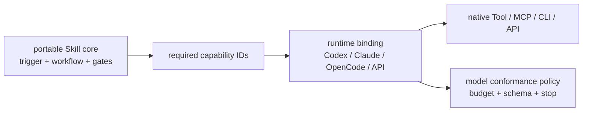

# Skill 来源搜集、隔离与筛选

- 维护人：路诚钺
- 状态：首批快照已完成机器初筛，等待人工语义筛选
- 适用范围：Mode、Skill、Tool 边界与候选重写；不包含 API/Provider 实现
- 最近更新：2026-08-16

本文把“到处找 Skill”改造成可重复的来源摄取流程。目标不是建立最大目录，
而是用来源多样性降低单次模型测试偏差，再从中找出少量值得独立重写或进入
困难任务验证的候选。下载、可运行、可安装和可准入是四个不同状态。

## 1. 基本策略

1. 工具和文件格式类优先采用格式所有者、平台厂商或标准组织的 Skill；它们
   主要提供可靠的接口、格式约束和安全操作顺序，不自动代表科研方法质量。
2. 科研方法类同时比较多个社区来源、论文/报告规范和本项目失败案例。没有
   任一外部 Skill 可以直接定义全学科研究流程。
3. 特异能力优先抽取问题定义、输入输出、停止条件和 checker 需求，再决定
   是采用、修改还是从本项目契约独立实现；许可不明时只允许 `reference-only`。
4. 外部内容只进入 `work/<task>/<attempt>/downloads/`。不从下载目录安装、
   import、执行脚本或更新 accepted Registry。
5. 机器筛选只负责完整性、许可线索、结构和风险信号；科研价值、方法正确性、
   重叠程度和适用学科必须由人工判断。

## 2. 开放分类轴

分类用于检查覆盖缺口，不作为固定 Mode 列表。一个 Skill 可以映射多个轴，也
可以在筛选后被认定为普通 Task 指令或确定性 Tool，而不是 Skill。

| 分类轴 | 代表性动作 | 首要判断 |
|---|---|---|
| 文件与格式 | PDF、DOCX、PPTX、表格、图片/OCR、LaTeX、Notebook、引文库、结构化数据 | 是否有官方格式/工具规范；能否降为 Tool |
| 检索与证据 | 问题细化、检索式、来源发现、证据抽取、证据图、系统综述 | 来源范围、召回/精度、Claim ceiling |
| 理论与推导 | 数学推理、符号推导、证明检查、假设管理、反例 | 推导可检查性和人为审阅点 |
| 实验与测量 | 实验设计、随机化、功效、测量、湿实验/现场流程 | 学科先验、伦理、安全、方法审批 |
| 仿真与工程 | 模型建立、数值实验、V&V、敏感性、不确定性、工程验证 | 参数/代码/环境可复现性 |
| 数据与统计 | 清洗、EDA、统计建模、可视化、稳健性、功效 | 假设、数据出口、统计审查 |
| 定性与人类研究 | 访谈、编码、问卷、混合方法、人体研究协议 | 伦理、隐私、研究者判断不可外包部分 |
| 写作与发布 | 科学写作、图表、同行评审、修订、披露、格式转换 | Claim 保真、引用、作者责任 |
| 完整性与复现 | 溯源、引用核查、结果复现、数据/代码谱系、审计 | 确定性检查与语义审查的分界 |
| 协调与元技能 | Skill 编写/评估、任务拆分、Handoff、上下文、安全 | 是否只是增加流程和 reviewer fanout |

## 3. 来源层级

| 层级 | 定义 | 默认用途 |
|---|---|---|
| A | 标准组织、格式/工具所有者或平台官方仓库 | 工具/格式基线；仍需逐文件许可和版本固定 |
| B | 有明确许可、版本和维护记录的高质量开源仓库 | 可比较、可改写候选；不得直接 accepted |
| C | 学科或任务专项社区实现 | 发现方法模式和失败模式；要求更强人工审查 |
| D | 未检测到许可、来源不清或聚合转载 | 只记录问题定义，禁止复制/再分发 |

“官方托管”与“官方撰写”分开记录。例如 GitHub `awesome-copilot` 是官方仓库，
但包含社区贡献；每个候选仍需独立审查。仓库级许可证也不能覆盖文件内另行
声明的限制。

## 4. 摄取流水线

### 4.1 发现代理的限制

发现代理只返回候选，不作准入决定。输入应是固定 taxonomy、已知来源和结果
Schema；输出限制候选数和每项证据字段。禁止让它递归读取 GitHub 渲染页面。
优先使用 GitHub/API 的仓库元数据、Tree 和单文件端点；单来源超过预算立即停。

本轮 GLM 5.3 因抓取大型渲染页面，reported tokens 至少达到 82,966，未产生
规定的 JSON handoff。这个结果说明“搜索代理能找到仓库”不等于“能低成本形成
可审计清单”。后续 GLM 仅承担分片关键词发现，每片最多 8 个候选；主 Agent
用 API 核验和下载，禁止把网页全文传回主上下文。

### 4.2 机器初筛

机器检查以下项目，但信号出现不等于恶意或不安全：

- ZIP 路径穿越、重复、加密、符号链接、跳过/超限文本；
- `SKILL.md` 数量、frontmatter、长度、references/scripts/assets 和包哈希；
- 安装命令、进程执行、动态代码、删除、网络、外部写、凭据访问；
- 硬编码模型/Provider、绝对路径、明文 HTTP 和二进制；
- 仓库/文件许可证、来源 revision 与聚合转载风险；
- 与现有 accepted/candidate 的名称和 capability 重叠。

静态信号按“Skill 是否要求执行该动作”人工复核。官方图像 Skill 合理读取 API
key，PDF Skill 合理建议安装工具；这些是权限和依赖声明，不是恶意判据。

### 4.3 人工筛选卡

每个候选只回答下列十项，避免先读完整仓库：

1. 它解决的最小可复用动作是什么？
2. 哪些任务明确不应触发？
3. 是 Skill、普通 Task 指令、确定性 Tool，还是方法参考？
4. 对哪些学科/研究形态有效，哪些前提不可迁移？
5. 输入、输出、Claim ceiling、停止条件和 Human Gate 是否清楚？
6. 所需 Tool、网络、凭据、数据出口和副作用是什么？
7. 相比本项目已有 Skill/Tool/compact contract 新增了什么？
8. 主 Agent 首次加载成本多少，长 reference 能否按需读取？
9. 许可和 lineage 允许采用、修改或只能独立实现吗？
10. 哪个困难案例最可能证明其价值，哪个案例最可能暴露失败？

处置只能为 `vendor-baseline`、`reference-only`、`derive-minimal-spec`、
`continue-trial`、`quarantine` 或 `reject`。机器分数不自动改变状态；有争议的
科研方法项至少由一名具备相应方法背景的人复核。

## 5. 首批离线快照（2026-08-16）

本批下载 9 个固定提交，其中 Agent Skills 规范只作格式标准；其余 8 个筛选
归档包含 54 个 `SKILL.md`。下载位置为忽略 Git 的
`work/SKILL-SOURCE-INTAKE-001/A-20260816-001/downloads/`，机器报告在同一
Attempt 的 `audits/`。没有内容被安装、执行、注册或准入。

| 来源 | 固定提交 | 选取数 | 许可/身份判断 | 当前用途 |
|---|---|---:|---|---|
| `agentskills/agentskills` | `69ef37e9` | 规范 | Apache-2.0，开放格式规范 | A：格式基线 |
| `openai/skills` | `49f948fa` | 5 | 所选目录逐文件 Apache-2.0 | A：Notebook/PDF/截图/图像/Skill 编写基线 |
| `anthropics/skills` | `f6656c12` | 6 | `docx/pdf/pptx/xlsx` 为限制性 source-available；`skill-creator` 为 Apache-2.0 | A/D 混合：文档技能只作参考 |
| `googleworkspace/cli` | `a3768d0e` | 8 | Google 官方，Apache-2.0 | A：共享安全规则与 Docs/Drive/Sheets/Slides 工具契约 |
| `github/awesome-copilot` | `a80885b7` | 10 | GitHub 官方托管社区库，仓库 MIT | A/B：转换、证据图、完整性、上下文模式 |
| `K-Dense-AI/scientific-agent-skills` | `43a3e619` | 9 | 仓库 MIT | B/C：检索、实验、统计、写作、可视化 |
| `ngtiendong/Academic-Research-Agent-Skill` | `41c611c2` | 1 | 仓库 MIT | C：单体学术研究流程的反例/拆分来源 |
| `lingzhi227/agent-research-skills` | `9e6c085d` | 12 | 未检测到许可证 | D：只抽取问题模式，不复制 |
| `obra/superpowers` | `b36e0829` | 3 | 仓库 MIT | B：Skill 编写、验证和调试的元技能参考 |

### 5.1 机器结果

- 54 个 Skill、140 个脚本文件；所有选择的文本均完成扫描；
- 0 个不安全 ZIP 路径，0 个因大小限制跳过的文本；
- 命中 332 次 high 和 1,632 次 medium 保守信号，集中于依赖安装、进程/脚本、
  网络 URL、凭据读取和模型/Provider 名称；这些是待人工定位的 occurrence，
  不是 1,964 个漏洞；
- 所有 54 个均为 unregistered，符合隔离预期；accepted Registry 未改变。

### 5.2 一方 Skill 快速筛选

对 OpenAI、Anthropic 和 Google 的一方来源采用快速来源 Gate：不重复质疑其
基本工程经验，但仍检查许可、平台路径、工具绑定、外部写和上下文成本。19 个
入口的初筛结论如下；这里的“保留”仍不是进入 accepted Registry。

| 来源/入口 | 结论 | 适应化动作 |
|---|---|---|
| OpenAI `jupyter-notebook`、`pdf` | 保留为 portable-core 候选 | 保留模板/渲染/复现检查；去掉 `$CODEX_HOME`、固定 `uv`、固定输出目录和自动安装假设 |
| OpenAI `screenshot` | 保留为 Tool Adapter 参考 | 主体缩为工具优先级、权限和保存策略；Windows/macOS/Linux 命令下沉到按需 reference |
| OpenAI `imagegen` | 保留为 specialist Adapter | 抽出 provider-neutral 图像任务/不变量契约；`image_gen`、API key 和保存路径只留在 OpenAI binding |
| OpenAI `skill-creator` | 保留为 authoring baseline | 采用简洁、自由度和渐进披露原则；版本、许可、runtime binding 移到项目 manifest |
| Anthropic `docx/pdf/pptx/xlsx` | `reference-only` | 四项为限制性 source-available；只从公开格式和本项目需求独立实现渲染、结构校验、公式/版式 QA 契约，不复制正文或脚本 |
| Anthropic `doc-coauthoring` | `reference-only / split` | 只保留“读者测试、作者最终责任”问题模式；删除默认全流程访谈、Claude/connector 和多 reviewer 编排；逐文件许可仍待确认 |
| Anthropic `skill-creator` | 保留为 evaluation reference | Apache-2.0；吸收 trigger eval、baseline 和盲评结构，但不复制其 Claude/Cowork 运行说明或完整测试编排 |
| Google `gws-shared` | 必需的 Adapter policy | 首批曾遗漏，现已补入；保留 schema discovery、dry-run 和写前确认，删除推广文本；认证和 `--sanitize` 必须受数据/权限策略控制 |
| Google `gws-docs/drive/sheets/slides` | 降为按需 API/CLI reference | 这些主要是生成式 API 目录，不应作为常驻 Skill 全文加载；运行时先查具体 method schema |
| Google `gws-docs-write`、`gws-sheets-read` | 保留为窄 Tool recipe | 分开 `read` 与 `external-write` capability；写操作要求显式确认，读操作限制范围、分页和结果大小 |
| Google `persona-researcher` | reject as architecture Skill | 它把 Drive、Docs、Sheets、Gmail 和协作写操作绑定成宽泛人格，与本项目 Mode/Skill/权限分离原则冲突 |

上述 19 个入口已补齐为逐项候选 Registry 记录，每项均固定 `source_path`、
`content_hash`、状态、能力、风险和 Decision；18 项为 `reference`，Google
`persona-researcher` 为 `rejected`，没有 `triage`、`trial` 或 `accepted`。
完整记录见[一方 Skill 逐项筛选结论](FIRST_PARTY_SKILL_TRIAGE.md)。

筛选后的方向不是维护 GPT、Claude、GLM 三套完整 Skill，而是维护一个公共核心和
很薄的运行时绑定：

简要微调原则：

1. **公共核心保持模型中立。** `SKILL.md` 只写触发、non-trigger、动作、产物、
   Human Gate 和验证；不出现 Claude、Codex、OpenCode、具体工具名或安装路径。
2. **最小 frontmatter。** 公共包只保留 `name`、`description`；Google 的
   `metadata.openclaw`、Anthropic 的 `license`、UI 信息、版本与依赖放入项目
   manifest，避免不同 Skill parser 行为不一致。
3. **工具通过 capability 绑定。** 例如 `document.pdf.render` 可以映射到平台
   原生 PDF、Poppler、MCP 或 CLI；缺能力时返回 gap，不让 Skill 自动安装、
   登录或更换服务。
4. **平台说明做薄 overlay。** Codex overlay 只映射其工具和 UI metadata；
   Claude overlay 只映射 connector/subagent/文件工具；OpenCode/GLM overlay 只
   映射可用命令、输出 Schema 和停止条件，不复制公共流程。
5. **模型差异由 conformance 产生。** 同一 fixture 检查 trigger、non-trigger、
   工具参数、写前确认、产物和停止行为。只有重复出现的差异才能进入 overlay，
   不根据模型口碑预写三套提示。
6. **对 GLM 先加执行护栏。** 根据本轮已观察到的网页抓取超支，初始 binding
   使用更小的结果 Schema、单步工具动作、来源/页数/结果字符/调用/token 硬上限；
   这是一项待复验的运行策略，不宣称为 GLM 的普遍能力判断。
7. **限制主上下文。** 大型 API 目录、OS 命令、文件格式 gotchas 和示例全部按需
   读取；主 Agent/worker 首次只接收 capability card、短 Skill core 和当前 binding。

因此一方文档的默认处置可以更快：工程规则进入候选基线，平台特有部分进入
binding，限制性许可内容只作参考；真正需要昂贵测试的是科研方法增量与跨模型
执行差异，而不是重新证明 PDF 需要渲染检查或写操作需要确认。

### 5.3 社区入口人工筛选结果

除 OpenAI、Anthropic、Google 外的 35 个 `SKILL.md` 入口已完成入口正文人工筛选，
并以固定路径、内容哈希、能力、风险和 Decision 写入候选 Registry。结果为 6 个
`triage` 改写候选、21 个 `reference`（其中 8 个明确下沉为 Tool/契约/模板）以及
8 个 `quarantine`/`rejected`。没有候选进入 `trial` 或 `accepted`。

六个 `triage` 项为 GitHub `build-evidence-map`，以及 K-Dense
`citation-management`、`experimental-design`、`peer-review`、
`scientific-visualization`、`statistical-power`。它们组成 dossier 候选池，
不是同时重写清单；下一轮仍只允许最多 4 个详细 dossier、最多 2 个独立最小
重写或困难任务测试。

完整逐项结论见[社区 Skill 人工筛选结论](COMMUNITY_SKILL_TRIAGE.md)。若工具 Skill
只是在列命令，则转为 Tool capability card；若科研 Skill 试图承包全流程，则先
拆成动作，不验证“大总管”版本。附带 references/scripts 仍按 dossier 需要读取，
不因候选进入 Registry 而自动展开。

## 6. 下一 Gate

`K-MS-SOURCE-1` 的完成条件与当前状态：

1. [x] 19 个一方入口与 35 个社区入口均完成逐项人工筛选、固定哈希与 Registry 留痕；
2. [x] 每个来源的许可限制与 revision 有证据位置，每个入口固定内容哈希；
3. [x] 覆盖工具/格式、证据/完整性、实验/统计、理论/推导和元技能；
4. [ ] 从六项 shortlist 中形成不超过 4 个详细 dossier，并明确 no-Skill/direct-tool 对照；
5. [ ] 最多选择 2 个候选进入独立重写或困难任务，其他停留在 `triage`/`reference`/`quarantine`/`rejected`；
6. [x] 没有下载内容被安装、执行或直接复制进 accepted Skill。

到达该 Gate 后再恢复高成本模型测试。这样测试对象来自多来源比较，而不是由
某一次搜索或某一个看起来完整的 Skill 偶然决定。
