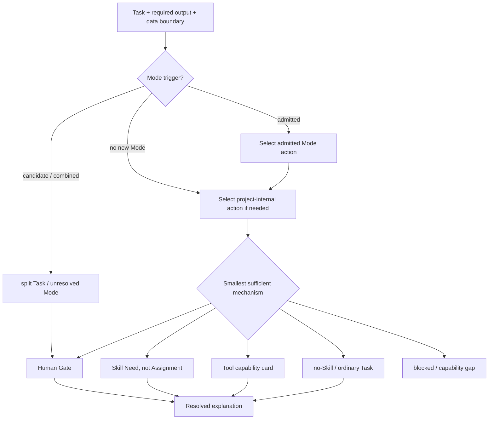

# Task–Mode–Action–Mechanism Routing Fixtures

- 责任人：路诚钺
- 状态：M7-002/M7-003 diagnostic baseline
- 日期：2026-08-18
- 机器可读诊断输入：[mode-action-routing-v1](../../../examples/mode-skill-routing/mode-action-routing-v1.yaml.txt)
- Tool 边界：[Action-driven Tool Capability Cards](TOOL_CAPABILITY_CARDS.md)

这些 fixture 验证选择理由的覆盖面，不是 Resolver runtime Schema，也不证明科研方法正确。文件使用
`.yaml.txt`，避免被仓库当作已支持的正式对象；后续只有真实消费者需要时才申请公共 Schema。

## 1. 路由顺序

Skill Need 不是 Skill Assignment。只要候选尚未实现或准入，路由必须停在 Need、Tool、Human Gate
或 blocked，不能用名称相似的 accepted/外部 Skill 自动填位。

## 2. 八个边界 Task

| Case | Mode / 边界 | Actions | Tool cards | 预期机制 |
|---|---|---|---|---|
| ROUTE-ES-FROZEN-001 | evidence-synthesis；冻结来源 | ES-A3/A4 + Compact Handoff | document-read、research-contract-check | tool-only + no-Skill；H1 模板 |
| ROUTE-ES-SEARCH-002 | evidence-synthesis；开放检索 | ES-A1/A2 | literature-search | Search Plan Skill Need + Human Gate |
| ROUTE-ES-CONFLICT-003 | evidence-synthesis；范围差异冲突 | ES-A6/A8 | research-contract-check | Conflict Synthesis Skill Need + Human Gate |
| ROUTE-SIM-REPLAY-004 | simulation；冻结 Run 重放 | SIM-A2/A6 | bounded-compute、research-contract-check | tool-only + no-Skill |
| ROUTE-SIM-CONVERGENCE-005 | simulation；数值设计 | SIM-A3/A7 | bounded-compute、research-contract-check | Convergence Skill Need + Human Gate |
| ROUTE-BLOCK-PRIVATE-006 | evidence-synthesis；数据边界冲突 | ES-A3 | document-read、literature-search | capability gap + blocked；无 fallback |
| ROUTE-NO-MODE-FORMAT-007 | representation-only | output-format | 无 | no new Mode + no-Skill |
| ROUTE-SPLIT-OBS-SIM-008 | simulation + 未准入 observational | SIM-A1 + identification gap | 无 | split Task + ambiguous/blocked + Human Gate |

## 3. 关键解释

- `ROUTE-ES-FROZEN-001` 同时选择 Mode action 与内部 closeout action，但 H1 模板足够，因此不加载
  project-internal Skill；这证明两条 Need 路线合流不等于两套 Skill 都要加载。
- `ROUTE-ES-SEARCH-002` 和 `ROUTE-ES-CONFLICT-003` 只产生 Need，不产生 Assignment；外部候选不能
  越过 dossier/trial/accepted 生命周期。
- `ROUTE-SIM-REPLAY-004` 把执行重放与收敛设计分开；程序退出成功不能自动激活 convergence Skill。
- `ROUTE-BLOCK-PRIVATE-006` 的阻塞来自数据策略，不是模型能力不足；不得自动换 remote/local Adapter。
- `ROUTE-NO-MODE-FORMAT-007` 继承父任务约束，避免把写作/格式化扩成 Research Mode。
- `ROUTE-SPLIT-OBS-SIM-008` 只允许 simulation 子任务继续；观测识别部分等待 Mode/Human 决定，
  不能把两个证据体系合并成一个宽泛 Agent 任务。

## 4. 当前完成边界

M7-002/M7-003 在诊断层完成意味着：

1. evidence/simulation 的 trigger、no-Mode、candidate Mode、组合和歧义均有样例；
2. tool-only、no-Skill、Skill Need、Human Gate、blocked、capability gap 和 split Task 均出现；
3. 只使用 M7-008 已冻结的 Tool card ID；
4. 没有 Provider、模型、Runtime、Adapter、MCP/CLI 实现或 accepted Skill 绑定；
5. 测试只固定 fixture 自洽和覆盖，不把预期路由宣称为真实科研效果。

M7-004/015 已按这些 action/route 迁移三个 0.1.0 Skill 原型并落实 lifecycle；后续不得回到来源驱动选择。
