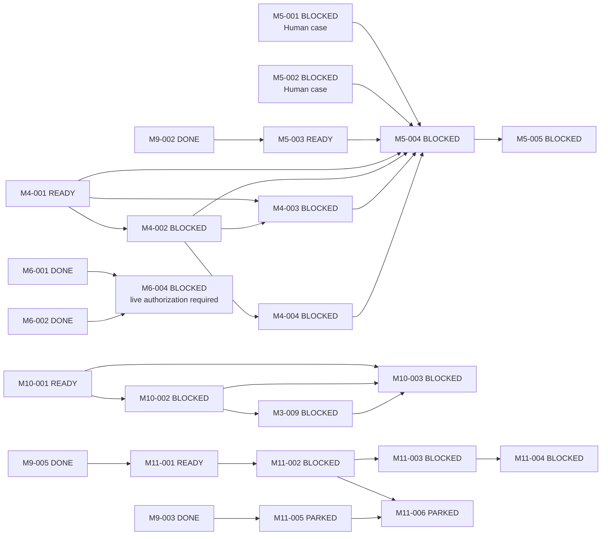

# M-series normalization matrix

状态：Issue #41 implementation-task proposal；事实基线仅为
`develop@73dcb03b4d4152f36fef5b2dadb3ae0f11d7de7b`。未合并 PR、远端 feature branch 与其中的状态变化
均不参与审计。

## 1. 口径

矩阵中的 Topic 使用以下 accepted responsibility 名称：Repository/Governance、Research Control/Method、
Capability/Skill Evolution、Topic 4（Agent/Model/Provider/Runtime）、Topic 5
（Execution/Context/Handoff/Recovery）、Research State/Claim/Human Decision、Artifact/Trace/Evaluation。
除 develop 已明确的 Topic 4/5 外，不新增数字标签，避免借 normalization 改写 Topic ownership。

`Dependency` 判断的是 baseline 行能否支撑其 baseline 状态；`historical` 表示 DONE 行不可变，只保留
历史解释。`Atomic` 判断一个 Task 是否仍可作为单一验收单元；M3-001～007 的“否”不会在本轮直接
拆分，因为其 residual work 受 Topic 5 freeze 约束。

## 2. M0～M10 全量审计

### M0～M2

| Task | Baseline → normalized | Objective | Phase | Topic(s) | Dependency | Atomic | Action |
|---|---|---|---|---|---|---|---|
| M0-001 | DONE → DONE | 产品定位/非目标 | foundation | Repository/Governance | historical | yes | KEEP |
| M0-002 | DONE → DONE | 总体架构/模块边界 | foundation | Repository/Governance | historical | yes | KEEP |
| M0-003 | DONE → DONE | Agent–Skill 架构边界 | foundation | Capability/Skill + Topic 4 | historical | yes | KEEP |
| M0-004 | DONE → DONE | 实施/迁移/测试计划 | foundation | Repository/Governance | historical | yes | KEEP |
| M0-005 | DONE → DONE | GitHub 仓库 | foundation | Repository/Governance | historical | yes | KEEP |
| M0-006 | DONE → DONE | 使用/发布指南 | release | Repository/Product | historical | yes | KEEP |
| M0-007 | BLOCKED → BLOCKED | 许可证与原创 Skill 许可 | release Gate | Repository/Governance | external Human condition missing | yes | KEEP |
| M1-001 | DONE → DONE | Python/CI bootstrap | foundation | Repository/Product | historical | yes | KEEP |
| M1-002 | DONE → DONE | 核心对象/Schema | foundation | Research State + Validation | historical | yes | KEEP |
| M1-003 | DONE → DONE | Protocol/Mode/Profile/Skill manifest | foundation | Research Control + Skill | historical | yes | KEEP |
| M1-004 | DONE → DONE | Task/Attempt/Handoff/Main State | foundation | Topic 5 + Research State | historical | yes | KEEP |
| M1-005 | DONE → DONE | ref/revision/hash/stale | foundation | Artifact/Validation | historical | yes | KEEP |
| M1-006 | DONE → DONE | minimal CLI | foundation | Repository/Product | historical | yes | KEEP |
| M1-007 | DONE → DONE | deterministic risks | foundation | Validation/Governance | historical | yes | KEEP |
| M1-008 | DONE → DONE | provider-neutral port | foundation | Topic 4 | historical | yes | KEEP |
| M1-009 | READY → READY | reusable scaffold/0.x policy | F/release | Repository/Product | yes | yes | KEEP |
| M2-001 | DONE → DONE | Skill Registry/Resolver | foundation | Capability/Skill | historical | yes | KEEP |
| M2-002 | DONE → DONE | Agent Profiles | foundation | Topic 4 | historical | yes | KEEP |
| M2-003 | PARKED → PARKED | legacy evidence Skill | E/optional | Capability/Skill | n/a while parked | yes | PARK |
| M2-004 | PARKED → PARKED | legacy simulation Skill | E/optional | Capability/Skill | n/a while parked | yes | PARK |
| M2-005 | DONE → DONE | Handoff integrity | foundation | Topic 5 + Validation | historical | yes | KEEP |
| M2-006 | PARKED → PARKED | Codex Runtime Adapter | F/optional | Topic 4 | broad range included parked Tasks | yes | REFINE dependency; PARK |
| M2-007 | PARKED → PARKED | historical dual-Skill slice | E/optional | Skill + Evaluation | unmet parked inputs | yes | PARK |
| M2-008 | PARKED → PARKED | external Skill intake | E/optional | Capability/Skill | broad `M1` token imprecise | yes | REFINE dependency; PARK |

### M3～M5

| Task | Baseline → normalized | Objective | Phase | Topic(s) | Dependency | Atomic | Action |
|---|---|---|---|---|---|---|---|
| M3-001 | IN_PROGRESS → PARKED | checkpoint/resume | foundation + post-C future | Topic 5 | broad `M1`; no active work | no: bounded slice + process drill | STATUS-FIX; PARK |
| M3-002 | IN_PROGRESS → PARKED | context/AWU budget | foundation + post-C future | Topic 5 + Evaluation | predecessor not DONE; no active work | no: policy + calibration | STATUS-FIX; PARK |
| M3-003 | IN_PROGRESS → PARKED | Handoff audit | foundation + post-C future | Topic 5 + Evaluation | broad `M2`; no active work | no: contract + field study | STATUS-FIX; PARK |
| M3-004 | IN_PROGRESS → PARKED | fanout/review/write-race | foundation + post-C future | Topic 5 + Evaluation | broad `M2`; no active work | no: guards + live behavior | STATUS-FIX; PARK |
| M3-005 | IN_PROGRESS → PARKED | sensitive Trace | foundation + post-C future | Topic 5 + Artifact/Trace | broad `M2`; no active work | no: policy + redactor | STATUS-FIX; PARK |
| M3-006 | IN_PROGRESS → PARKED | SAFE_PAUSE/machine completion | foundation + post-C future | Topic 5 | unmet range; no active work | no: contract + process recovery | STATUS-FIX; PARK |
| M3-007 | IN_PROGRESS → PARKED | actor/archive/Agent Trace rules | foundation + post-C future | Topic 5 + Artifact/Trace | unmet range; no active work | no: rules + future coverage | STATUS-FIX; PARK |
| M3-008 | DONE → DONE | Execution Trace Core | foundation | Artifact/Trace + Topic 5 | historical | yes | KEEP |
| M3-009 | PARKED → BLOCKED | Method Trace v0.1 | C | Research State + Topic 5 + Trace | M10-001/002 unmet | yes | STATUS-FIX; REFINE metadata |
| M4-001 | READY → READY | source admission/provenance | C support | Artifact/Trace + Research State | satisfied but broad | yes | REFINE dependency/acceptance |
| M4-002 | READY → BLOCKED | object/run promotion | C support | Artifact/Trace + Research State | missing M4-001 closure | yes | STATUS-FIX; REFINE dependency |
| M4-003 | READY → BLOCKED | Claim/counterevidence trace | C support | Research State/Claim + Trace | missing provenance/promotion | yes | STATUS-FIX; REFINE dependency |
| M4-004 | READY → BLOCKED | Run manifest/reproduction | C/D support | Artifact/Trace/Evaluation | missing promotion closure | yes | STATUS-FIX; REFINE dependency |
| M4-005 | PARKED → PARKED | DVC spike | deferred | Artifact | no real demand | yes | PARK |
| M5-001 | BLOCKED → BLOCKED | evidence-synthesis real case | D | Evaluation + Research State | Human boundary missing | yes | KEEP |
| M5-002 | BLOCKED → BLOCKED | theory/simulation real case | D | Evaluation + Research State | Human boundary missing | yes | KEEP |
| M5-003 | READY → READY | minimal Evaluation Manifest/baseline harness | D | Evaluation | M9-002 DONE | yes after refinement | REFINE objective/dependency |
| M5-004 | READY → BLOCKED | run approved cases/net increment | D | Evaluation + Research State | M4/M5 inputs unmet | yes | STATUS-FIX; REFINE dependency |
| M5-005 | READY → BLOCKED | prune/keep/stop review | D | Evaluation/Governance | M5-004 unmet | yes | STATUS-FIX |

### M6～M8

| Task | Baseline → normalized | Objective | Phase | Topic(s) | Dependency | Atomic | Action |
|---|---|---|---|---|---|---|---|
| M6-001 | DONE → DONE | Provider Adapters | foundation/F | Topic 4 | historical | yes | KEEP |
| M6-002 | DONE → DONE | model pool/API session kernel | foundation/F | Topic 4 | historical | yes | KEEP |
| M6-003 | BLOCKED → PARKED | Task-to-API umbrella | historical/F | Topic 4 + Topic 5 | includes parked Skill tasks; future surfaces separable | no | SUPERSEDE future scope by M11-001～004; preserve legacy seam |
| M6-004 | BLOCKED → BLOCKED | live Windows Provider/session conformance | F | Topic 4 | M6-001/002 DONE；external Human authorization missing | yes | REFINE；remove false M11-004 hard dependency |
| M6-005 | PARKED → PARKED | streaming/multimodal/platform adapters | deferred F | Topic 4 | no real demand | yes | PARK |
| M6-006 | DONE → DONE | legacy execution Trace bridge | historical/F | Topic 4 + Topic 5 + Trace | historical | yes | KEEP immutable; stale prose is history |
| M7-001 | DONE → DONE | owner/read/Handoff policy | pre-A | Governance + Topic 5 | historical | yes | KEEP |
| M7-002 | DONE → DONE | Mode decision fixtures | pre-A | Research Control | historical | yes | KEEP |
| M7-003 | DONE → DONE | Task-to-Mode mechanism matrix | pre-A | Research Control + Capability | historical | yes | KEEP |
| M7-004 | DONE → DONE | legacy Skill audit/migration | pre-A | Capability/Skill | historical | yes | KEEP |
| M7-005 | PARKED → PARKED | Mode-derived Skill trials | D | Skill + Evaluation | Method Trace unmet | yes | PARK |
| M7-006 | PARKED → PARKED | H0/H1/H2 cost comparison | D | Topic 5 + Evaluation | intentionally not queued | yes | PARK |
| M7-007 | PARKED → PARKED | new Mode admission | E | Research Control | no real case/gap | yes | PARK |
| M7-008 | DONE → DONE | Tool capability cards | pre-A | Capability + Topic 4 | historical | yes | KEEP |
| M7-009 | DONE → DONE | external Skill candidate pool | pre-A | Capability/Skill | historical | yes | KEEP |
| M7-010 | DONE → DONE | candidate dossiers/decision | pre-A | Capability/Skill + Human | historical | yes | KEEP |
| M7-011 | DONE → DONE | Mode action/Need baseline | pre-A | Research Control + Skill | historical | yes | KEEP |
| M7-012 | DONE → DONE | internal Skill Need route | pre-A | Capability/Skill + Topic 5 | historical | yes | KEEP |
| M7-013 | DONE → DONE | internal Need baseline/fixtures | pre-A | Capability/Skill + Evaluation | historical | yes | KEEP |
| M7-014 | PARKED → PARKED | traced difficult-task comparison | D | Skill + Trace + Evaluation | Method Trace unmet | yes | PARK |
| M7-015 | DONE → DONE | Skill lifecycle compatibility split | pre-A | Capability/Skill | historical | yes | KEEP |
| M7-016 | DONE → DONE | K-MS-1 Gate | pre-A | Governance + Research Control | historical | yes | KEEP |
| M8-001 | DONE → DONE | global architecture normalization | A | Repository/Governance | historical | yes | KEEP |
| M8-002 | DONE → DONE | Mode Action contract | A | Research Control | historical | yes | KEEP |
| M8-003 | DONE → DONE | Method Resolution | A | Research Control | historical | yes | KEEP |
| M8-004 | DONE → DONE | Mode migration | A | Research Control | historical | yes | KEEP |
| M8-005 | DONE → DONE | Decision Authority Matrix | A | Governance + Research State/Human | historical | yes | KEEP |

### M9～M10

| Task | Baseline → normalized | Objective | Phase | Topic(s) | Dependency | Atomic | Action |
|---|---|---|---|---|---|---|---|
| M9-001 | DONE → DONE | Capability Requirement | B | Research Control + Capability | historical | yes | KEEP |
| M9-002 | DONE → DONE | Skill Need | B | Capability/Skill + Evaluation | historical | yes | KEEP |
| M9-003 | DONE → DONE | Skill lifecycle v2 | B | Capability/Skill | historical | yes | KEEP |
| M9-004 | DONE → DONE | Protocol Profile | B | Research Control | historical | yes | KEEP |
| M9-005 | DONE → DONE | Report/Resolution/Snapshot | B | Research Control + Capability + Topic 4 | historical | yes | KEEP |
| M9-006 | DONE → DONE | migration/replacement Gate | B | Capability + Validation | historical | yes | KEEP |
| M10-001 | READY → READY | minimal Research State candidate | C | Research State/Claim/Human | yes | yes | KEEP |
| M10-002 | PARKED → BLOCKED | Attempt/Research Failure | C | Research State + Topic 5 | M10-001 unmet | yes | STATUS-FIX |
| M10-003 | PARKED → BLOCKED | bounded Phase C Gate | C | Research State + Topic 5 + Validation | M10-001/002/M3-009 unmet | yes | STATUS-FIX |

审计覆盖 baseline 全部 79 个 Task；没有使用未合并实现或候选状态。

## 3. 新增缺失原子 Task

| Task | Status | Independent surface | Owner | Hard dependency | Why separate | Non-goals |
|---|---|---|---|---|---|---|
| M11-001 | READY | Runtime Bundle / Consumer Profile | 黄毅 | M9-005 | Runtime allowed-read closure 可独立 fail/review | 不产生 View、不选 Supply |
| M11-002 | BLOCKED | Resolved Execution View Core | 路诚钺 | M9-005, M11-001 | final binding/policy intersection 是独立 producer contract | 不执行、不 fallback、不依赖 Skill projection |
| M11-003 | BLOCKED | Thin Execution Host/actual facts | 黄毅 | M3-008, M6-002, M11-002 | exact consumer 与 producer 可独立验收 | Topic 4 only；不重选 Supply、不改 Method/Claim/Gate、不实现 Topic 5 recovery |
| M11-004 | BLOCKED | generic Trace/Receipt linkage + Core Gate | 黄毅 | M3-008, M11-003 | execution closeout/legacy compatibility 是独立 surface | Topic 4 + Artifact/Trace；复用 Receipt 不构成 Topic 5 membership |
| M11-005 | PARKED | SkillReleaseProjection | 路诚钺 | M9-003 | Maintainer→Runtime 发布端口独立于 Core | 不控制当前 Task，不暴露 lifecycle history |
| M11-006 | PARKED | eligible Skill supply → unified View semantics | 路诚钺 | M11-002, M11-005 | View/Capability semantic mapping 独立于 Runtime consumer | supply-kind neutral；不建立 Skill-specific Runtime seam |

没有为 Runtime Bundle 的每个字段、Research State 的每个概念或每种 Provider 建 Task。M11-004 的
bounded vertical Gate 是 generic linkage 的验收证据，不另造纯 closeout Task。M11 Core 每个 dependency
layer 独立提交；R2 atomic completion exception 不用于跨 Bundle/View/Host/Receipt surface。

### 3.1 Future M-series reservations（非 Task）

| Reserved M-group | Expected family | Activation condition | Confidence |
|---|---|---|---|
| M12 — RESERVED | Execution Continuity & Recovery | Phase C closeout + independent Topic 5 R2 architecture review / docs-only task-definition | High |
| M13 — RESERVED | Strategy & Governed Evolution | Phase C/D evidence 证明 M2/M7 不能自然承载新的 coherent family | Medium–High |
| M14 — RESERVED | Product / Release Closure | Runtime/Evaluation/release readiness 成熟，且 M1/M11 被证明不足以闭合产品/发布 | Medium |

这三行不进入 85 个 Task 的 inventory：没有状态，不创建 `M12-001`/`M13-001`/`M14-001`，不冻结
owner、risk、dependency、acceptance 或 Schema，也不授予实现或架构 authority。满足 accepted activation
Gate、旧 M-group 不足的证据和独立 docs-only `task-definition` 后，才可转成正式 group。完整施工导航见
[`M_SERIES_IMPLEMENTATION_MAP.md`](../../../M_SERIES_IMPLEMENTATION_MAP.md)。

## 4. Split / supersession lineage

| Historical Task | Finding | Normalized lineage | Identity preserved? | Authority unchanged? |
|---|---|---|---|---|
| M6-003 | legacy compatibility 与四个未来 producer/consumer surface 混合 | M6-003 保留且 PARKED；未来主链由 M11-001→002→003→004 | yes | yes |
| M3-001～007 | 每行混合已实现 bounded slice、实测债务和未来 Topic 5 work | 原 ID 保留且 PARKED；Phase C closeout 后由新 R2 task-definition 决定 residual split | yes | yes；Topic 5 未解冻 |
| M5-003 | 旧 Agent-count 对照不足以承载已接受的 Evaluation Manifest seam | 保留 M5-003，refine 为 Manifest + baseline harness；实际结果仍在 M5-004 | yes | yes |
| M3-009 | Phase C 已复用唯一 Method Trace identity | 保留 M3-009，不创建重复 Phase C Trace Task | yes | yes |

## 5. Corrected dependency DAG

图只显示未完成关键路径；DONE 历史边保持在各 Task 行中。PARKED Skill Extension 不阻塞 M11 Core，
M6-004 也不依赖 M11-004。M11 Core 按图中每一 dependency layer 分 PR 验收。

## 6. Phase aggregation

| Phase | Constituent M Tasks | Entry / closeout meaning |
|---|---|---|
| Foundation / pre-A | M0～M3-008、M6-001/002/006、M7 completed baseline | 历史底座；不是当前 Phase queue |
| A | M8-001～005 | 已完成 Method Core contract closure |
| B | M9-001～006 | 已完成 structural evolution closure |
| C | M10-001 → M10-002 → M3-009 → M10-003；M4-001～004 为 provenance support | Phase C Gate 不等于 Topic 5 implementation approval |
| D | M5-003；M5-001/002 → M5-004 → M5-005；M7-005/006/014 optional | Evaluation records 与 net increment，不回写 Need 本体 |
| E | M2-003/004/007/008、M7-007 等 PARKED candidate work；M13 RESERVED | 无真实 Need/Gate 时不进入队列；reservation 不等于 strategy approval |
| F Provider conformance | M6-004 | M6-001/002 后的独立 live 授权 Gate；不证明 Runtime E2E |
| F Core | M11-001 → 002 → 003 → 004 | supply-neutral execution reintegration；一 dependency layer 一 PR |
| F optional Skill supply | M11-005 → M11-006 | publication + View/Capability-owned unified mapping；不 Gate Core，不形成 Runtime seam |
| post-C Topic 5 residual | M12 RESERVED | Phase C closeout + 独立 Topic 5 R2 Gate 前不 task-definition、不解冻 |
| future product/release closure | M14 RESERVED | 只在 maturity evidence 与 existing-group insufficiency 成立后激活 |

## 7. Topic / responsibility mapping

| Responsibility | Related canonical M Tasks | Boundary |
|---|---|---|
| Repository / Governance / Product | M0, M1-001/006/009, M8-001/005 | 不替代 Method/Human authority |
| Research Control / Method | M1-003/007, M7, M8-002～004, M9-001/004/005, M3-009 | 不执行 Provider selection/fallback |
| Capability / Skill Evolution | M2, M7-004/005/008～015, M9-001～003/005/006, M11-005/006 | Need/lifecycle 不控制 current Runtime；M11-006 保持 unified View semantics |
| Topic 4 — Agent/Model/Provider/Runtime | M1-008, M2-002/006, M6, M9-005, M11 | Host 不重选 Supply、不改 Method/Claim/Gate |
| Topic 5 — Execution/Context/Handoff/Recovery | M1-004, M2-005, M3, M6-003/006, M10-002/003 | 只收改变 Handoff/context/safe-pause/recovery/continuation semantics 的 Task；M11-003/004 不属于 Topic 5 |
| Research State / Claim / Human Decision | M1-002/007, M4-003, M8-005, M10, M3-009 | validator/eligibility 不产生科研决定 |
| Artifact / Trace / Validation / Evaluation | M1-005/007, M3-005/007～009, M4, M5, M7-006/013/014, M9-002/004/006, M11-004 | execution/evaluation evidence 不自动 promotion |

一个 Task 可跨多个 responsibility，仍只有一个 canonical ID；例如 M3-009 与 M11-004 不按 Topic 复制。

## 8. State correction summary

| Finding | Correction |
|---|---|
| M3-001～007 无 active implementation 却长期 IN_PROGRESS | 全部 PARKED；保留 bounded implementation fact，future residual 等 Phase C 后 R2 拆分 |
| M4-002～004 的 prerequisite 尚未闭合 | 改 BLOCKED；只保留 M4-001 READY |
| M5-004/005 依赖未完成却 READY | 改 BLOCKED；M5-003 以 M9-002 为 hard dependency 保持 READY |
| M6-003 umbrella 被 parked Skill 依赖永久阻断 | 历史 seam PARKED；未来 scope 明确 supersede 到 M11 Core |
| M10-002/M3-009/M10-003 属于 active Phase C chain 但被写成 PARKED | 依赖未满足，统一 BLOCKED |
| Topic 4 已解冻但没有 implementation Task | 新增 M11-001 READY 与后继 BLOCKED DAG |
| Optional Skill extension 可能变成 Skill-specific Runtime seam 或反向 Gate Core | M11-005/006 PARKED；M11-006 由 View/Capability semantic owner 维护并保持 supply-kind-neutral |
| Trace/Receipt 使用被误判为 Topic 5 membership | membership 按 Handoff/context/recovery/continuation objective 判定；M11-003/004 明确留在 Topic 4/Artifact-Trace |
| M6-004 被错误串到 Runtime Core Gate 后才允许 live conformance | 只保留 M6-001/002 hard dependencies；M11-004 E2E closure 独立验收 |

## 9. Completion checks

- baseline 79 个 Task 全部有审计行；新增 6 个 Task 均有 owner/risk/Phase/Topic/dependency/negative boundary；
- DONE 行未修改；历史 ID 未删除或 cosmetic renumber；
- READY 仅保留 hard dependencies 已 DONE 或纯 Human-independent 可启动项；
- M6-003、M3 legacy scope 均有 lineage，未借拆分扩大 Runtime/Recovery authority；
- ROADMAP 只聚合 Phase/Gate，TASKS 控制 implementation scheduling；
- Topic 5 保持冻结；M11-003/004 不属于 Topic 5，未创建 recovery/multi-Agent/fallback READY Task；
- M11 producer/consumer chain 采用一 dependency layer 一 PR，不使用 R2 atomic exception 跨层收口；
- M12/M13/M14 只作 M-group reservation，未进入 Task inventory、状态机或 architecture acceptance。
