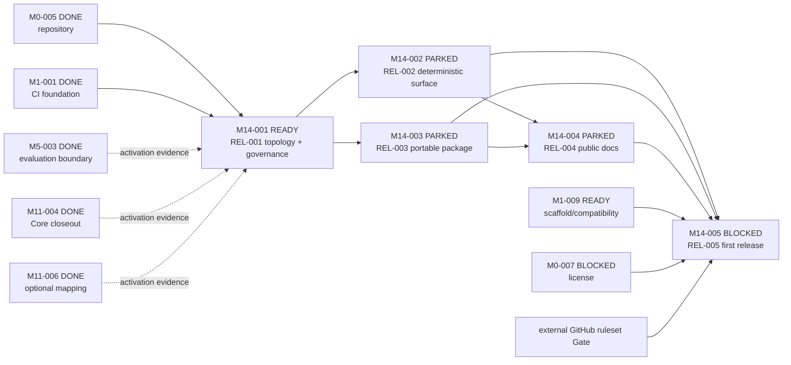

# M14 Curated Release Closure

- 责任人：路诚钺（GitHub `Chengyue-Lu`）
- 来源：[Issue #57](https://github.com/Chengyue-Lu/research-agent-workbench/issues/57)
- 架构决定：[ADR-0021](../../../decisions/0021-CURATED-DEVELOP-TO-MAIN-RELEASE.md)
- 状态：R2 task-definition；尚未实现 release topology、exporter、portable package 或首次发行
- 基线：`origin/develop@dd2454b5595e33a12aa058529358d46d311a08c4`

## 为什么激活 M14

M1-009 的边界是 external scaffold 与 `0.x` compatibility，M11 的边界是 Runtime Bundle/View/Host/Receipt。
二者都不能拥有 frozen develop source、curated main projection、release manifest、public surface 或 tag/release
治理。Issue #57 对当前树、wheel 和 GitHub 远端的审计同时暴露了 topology、surface、portability、license
和 navigation 五类跨模块缺口，构成一个可独立验收的 Product / Release Closure family。

M11-001～006 已提供 bounded execution/runtime foundation；M5-003 已冻结 non-executing evaluation plan，而
真实 M5 net-benefit 仍未证明。M14 的首个 `0.x` 发行必须如实披露这些限制，但不需要等待所有科研价值实验
才建立可重复、可安装、不会泄漏内部材料的发行机制。

## 入口审计事实

在上述 exact baseline 上以 `git archive` 构建并于系统临时目录安装 wheel 的诊断结果为：wheel 含 63 个
Schema、0 个 Registry、0 个 `.agents`、0 个 `.codex`；空目录 `rwb schema list` 与 `rwb init` 可通过，
但 repository-level `rwb validate examples registry` 和默认 `rwb skills accepted` 找不到 CWD-relative
Registry。单独提供 Capability Requirement Registry 时，loader 仍把 Schema 绑定到 project root；空
Projection index 则可使用 packaged Schema 加载。该 Python 3.12 诊断只证明当前缺口，不替代 M14-003 的
Python 3.11/3.13 exact clean-install acceptance。

当前 package-smoke 安装 wheel 后仍回到完整 checkout 验证 `examples`/`registry`，因此不能证明 portable
package。GitHub API 也尚未提供 main/develop protection 已启用的证据。这两项分别保留为 M14-003 与
M14-005 的未满足 Gate，不能由本 task-definition 标为受控。

## Canonical Task DAG

Issue 中的 `REL-001～005` 仅作工作包别名，不是治理器识别的 Task identity。

实线为 canonical hard dependency，虚线只记录 M14 family activation evidence。M14-002 与 M14-003 在
M14-001 完成后可并行；M14-004 等待两者，以最终 package/runtime boundary 生成
无断链的用户文档。M14-005 只做 frozen-source release、review、merge 和 tag，不在 release branch 修复
任何产品问题。

## 阶段边界

### M14-001 / REL-001 — Release trust anchor

以声明式 policy 定义 dormant `release/v* -> main` R2 topology、same-repository/source identity、external
expected source SHA/ancestry/CI requirements 与 manifest prerequisite。普通 feature/task-definition 仍进入
`develop`。

该 Task 不实现 exporter，也不开放一个仅靠分支名即可通过的 release path。M14-001 完成后 release PR 仍
必须以明确原因 BLOCK，现行 exact `develop -> main` 继续可执行；只有 M14-002 在同一验收变更中闭合
manifest/surface validator，才原子启用 `release/v* -> main` 并禁用 direct `develop -> main`。

### M14-002 / REL-002 — Deterministic projection

建立 strict、append-only versioned allowlist policy、strict manifest Schema，以及共享同一规则实现的
export/check。policy 拒绝 unknown、重复/overlap/不存在 include、file/tree ambiguity、路径逃逸以及 case-fold/
Unicode/Windows path collision。导出读取 frozen commit Git blobs，每个输出分类为 source-blob 或 exact
allowlisted generated：前者固定 path/mode/blob/size/hash，后者固定 generator identity/version/hash/inputs；
manifest-last 规则处理自哈希边界。

完整 tree 使用 canonical UTF-8 JSON/LF/稳定排序，不写 wall-clock、随机值或临时绝对路径。同 source/policy/
inputs 的两次结果逐字节相同；dirty working tree、CRLF 转换、Git mode drift、额外/隐藏/移动文件、重算伪
hash、路径逃逸、symlink/gitlink、undeclared generated 和 broad Registry inclusion 都必须被阻断。验收时
原子完成 release topology cutover。release checker 属 critical allow/block surface，进入 Coverage Policy
95/90 和独立正反 evidence。

### M14-003 / REL-003 — Portable package closure

建立独立、hash-pinned `RuntimeResourceManifest` 与 packaged default resolver，分离用户工件的
`project/filesystem root`、不可变 `runtime_resource_root` 与平台 `integration_config_root`，移除 CWD/checkout
隐式 fallback。首版支持 no-Skill Core；wheel/sdist→wheel 必须具有相同资源清单/hash，并在清空
`PYTHONPATH` 的 checkout 外 Python 3.11/3.13 新 venv/空 cwd 中确认 import 来自 venv。quickstart 输入只能由
wheel-owned curated fixture 或 `rwb init` 生成，并只证明 structural no-Skill smoke，不冒充 M1-009 完整 scaffold。

验证明确分成两种 profile：develop 的 repository/maintainer Gate 重验 Lifecycle、Evaluation、Human Decision
等完整 publication authority；installed Runtime Gate 只重验 `RuntimeResourceManifest` 以及已发布 Projection
的 Schema、index、hash、identity。若 Projection index 非空，还必须闭合 Projection→immutable Skill manifest/
package exact bytes 并拒绝 orphan/unindexed asset；否则 fail closed。M14-002 的 `RELEASE_MANIFEST` 在最终投影
中再 pin wheel/hash、RuntimeResourceManifest 与 source-CI，不形成 M14-003 对 M14-002 的隐藏依赖。

不能为了让安装后 smoke 通过而把 legacy `accepted.json` selector、`sources.json`、Need/Evaluation/Lifecycle
历史重新装入 wheel；但被非空 Projection exact path/hash 引用的单个 accepted Skill manifest/package 是条件
Runtime Release asset，必须通过 RuntimeResourceManifest 的 logical→installed path mapping 发布，不能恢复
AcceptedSkillRegistry selector。`.agents/skills/**` 不整体复制，只有该 exact closure 可映射进受控 installed
namespace；`.codex/**` 始终只由 integration root 读取。Provider capability baseline 不是 live Supply，provider
adapters/model pool 只是显式 integration/config。`rwb validate <用户路径>` 保持显式 filesystem 语义；旧
maintainer/provider/model/Codex 命令的 CWD default 要么改为显式 root，要么明确失败，不能把同一相对路径
悄悄解释成 package resource。

### M14-004 / REL-004 — Public documentation surface

形成公开 README、Getting Started、Supported Features 和稳定模块导航的单一来源。页面不得链接被 release
policy 排除的 TASKS/STATUS/DEVELOPMENT/workstream，也不得把 synthetic/bounded contract、空 Projection
index、未执行 Evaluation 或未验证 live Provider 描述为已完成产品能力。

### M14-005 / REL-005 — First curated release

在 exact develop SHA required CI 全绿、M0-007/M1-009/M14-001～004、GitHub remote protections 和人类 release
decision 全部满足后创建生成式 release branch。重复生成、release checks、R2 review、merge commit、tag 与
artifact/hash 必须绑定同一 source/manifest；release branch 永不合并回 develop。

## 允许读取与写入

task-definition 只写 canonical docs、ADR、workstream 与导航。后续实现必须按 exact M14 Task 进一步限定：

- M14-001：`.github` governance、治理测试与 release contributor docs；
- M14-002：release policy/export/check/Schema、focused tests 与 Coverage Policy；
- M14-003：package metadata、resource loader、portable smoke 与必要 runtime catalog；
- M14-004：release-facing docs/navigation；
- M14-005：生成的 `release/v*` tree、manifest、release evidence、main PR 与 tag。

不同 Task 不得借“release”名义跨写 Runtime/Method/Claim/Human authority。共享文件冲突时依上述 DAG 串行或
在同一 module-level PR 中保持独立 Task slice/evidence。

## 验证策略

- task-definition：Markdown link、repository validation、governance dry-run；不宣称实现测试；
- M14-001：dormant topology/source/manifest prerequisite、release fail-closed 与现行 develop release 回归；
- M14-002：两次 export byte-identical、source/generated provenance、external repository/source、Git mode/blob
  identity、strict policy/canonical manifest、closed output set 与攻击性输入，并验证 topology 原子 cutover；
- M14-003：direct wheel 与 sdist→wheel resource manifest/hash 一致、CWD/PYTHONPATH poison、三 root 分离、
  missing/corrupt/hash/path/orphan fail closed、双 Python checkout 外 clean install；
- M14-004：release projection 内链接闭合、developer-only token/path 泄漏检查、truthful support matrix；
- M14-005：exact-head hosted Gates、remote ruleset evidence、manifest reproducibility、merge/tag/artifact closure。

## 明确不进入本 workstream 的内容

- Runtime、Method、Capability selection、Claim、Human Decision 或 permission 语义修改；
- Topic 5 recovery、fallback、routing、multi-Agent orchestration 或 Skill self-evolution；
- 降低 develop 的 full behavioral、coverage-quality 90/95/90、package-smoke 或 governance Gates；
- 在 release branch 进行功能修复、手工挑文件或 cherry-pick 产品提交；
- 删除 Git 历史，或宣称公开 main tip 的裁剪会使历史材料不可见；
- 在许可证/Projection Gate 未闭合时发布 Skill package。

## 下一合法动作

本 task-definition 合并后只启动 `M14-001`。在其完成前不实现 M14-002～005，不创建 release branch，也不
冻结某次真实 release source SHA。若 `develop` 在本 PR 合并前前进，先 rebase 并重新核对 TASKS/ROADMAP/
ADR 编号与治理事实。
