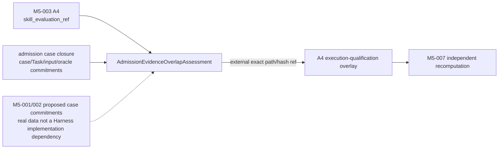
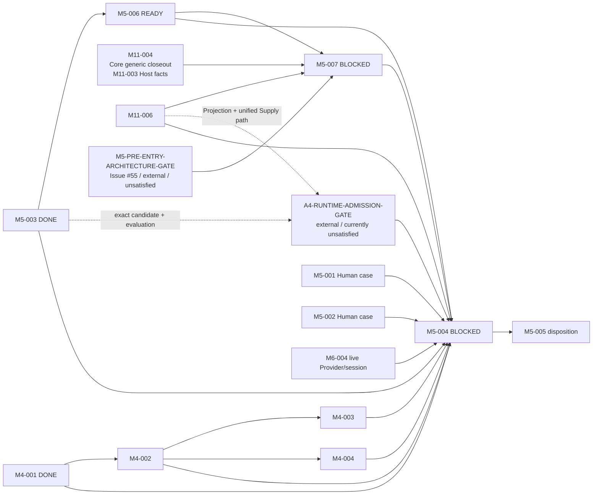

# M5 System-Level Evaluation Design

责任人：路诚钺（GitHub `Chengyue-Lu`）

风险：R2

PR 类型：`task-definition`（docs-only）

## 1. Primary estimand

本工作流冻结 Phase D 的首要问题：

> 最终 RWB Runtime 集成后的完整系统，相对 simpler Agent / Tool baseline，是否产生可复核的
> system-level net benefit？

Skill 独立效果只能作为 secondary interpretation，不能替代 system-level primary estimand。当前提交只定义
未来 Task 与 Gate，不执行 Evaluation，也不声称 RWB 已产生净收益。

## 2. 保留的 M5-003 基线

M5-003 已 DONE，其 Task definition 不作任何修改。四个 canonical arms 继续是：

```text
A1 plain-agent
A2 plain-agent-tool
A3 mode-no-skill
   Mode + Method + no-Skill/direct-tool/procedure
A4 mode-candidate-skill
   Mode + Method + exact candidate skill_binding + skill_evaluation_ref
```

Task、exact Model、Provider Adapter、Host、budget、context、data policy 与 evidence classes 是四臂共享
frozen conditions，arm 不得覆写。M5-003 仍只编译 non-executing exact-reference plan。

正式 M5-004 采用 B 型 system-level estimand，因此 A4 的执行解释固定为：

> **candidate-origin treatment + admitted Runtime execution**

`candidate` 是 frozen experiment source / 被评估对象，不表示 Runtime 可以加载 candidate directory。M5-003
继续 exact-pin candidate `skill_id`、`version`、package `content_hash`、source FileReference 与
`skill_evaluation_ref`；这些字段和 M5-003 v0.1 的 Schema、fixture、validator 均不在本 PR 改写。准入后的
运行身份由独立 execution-qualification overlay 追加引用，不能回填或替换 Manifest 中的 A4 binding。

## 3. Case dossier boundary

### M5-001 — Evidence-Synthesis Evaluation Case Dossier

Public Case Package 可被所有 treatment arm 读取，至少包含：research question、exact admitted source set、
inclusion/exclusion boundary、data/read boundary、required outputs、Claim ceiling、initial context 与 Task
contract。

Private Adjudication Package 不得被 treatment arm 读取，至少包含：required-fact set、known
counterevidence、known limitations、forbidden/overreaching claims、evidence-relation expectations 与 Human
scoring anchors。

### M5-002 — Theory + Simulation Evaluation Case Dossier

Public Case Package 至少包含：research question、exact model/governing equations、assumptions、parameters、
input data、simulation environment、required outputs、Claim ceiling 与 Task/context boundaries。

Private Adjudication Package 至少包含：expected invariants、numerical tolerances、known failure/convergence
conditions、known limitations、forbidden Claim overreach 与 evaluator anchors。

两个 dossier 都必须在观察 treatment output 前冻结 case 与 oracle hash，记录 case-selection rationale 与
Human approval，禁止 treatment-specific tuning 和 post-result oracle rewriting。M5-001/002 因真实案例尚未由
Human 批准而继续 BLOCKED。

## 4. M5-006 — System-Level Evaluation Protocol

M5-006 在 M5-003 之后独立 READY；它不等待真实案例完成。实现时必须预注册：

- primary estimand 与 secondary comparisons；
- run randomization、replicate count、pilot semantics 与 stopping rule；
- failure/retry rule、model/provider drift handling；
- blind-first Human review、reveal procedure；
- metric operationalization、measurement status 与 analysis rule；
- decision hierarchy；
- versioned A4 execution-qualification overlay 的字段与验证顺序；
- 独立、versioned、hash-pinned `AdmissionEvidenceOverlapAssessment` 的输入闭包、结果与验证顺序。

该 overlay 是 M5-003 frozen plan 之外的执行期资格记录：它必须 exact 引用 M5-003 manifest/arm、candidate
binding、`skill_evaluation_ref`，以及 `A4-RUNTIME-ADMISSION-GATE` 闭合的准入与 Runtime lineage。它不改变
canonical A4 identity，不把 candidate 改写成另一 treatment，也不产生 Human admission、Supply selection、
permission、Method、Claim 或 execution authority。M5-006 只冻结协议；每次运行的实际 overlay 由后继
Harness 在 Maintainer/Evaluation 侧形成并验证。overlay 不是 Runtime input；Runtime 只消费 resolver-selected、
projection-backed Supply 及其 Snapshot/Bundle/View，不读取 candidate、Evaluation 或 Lifecycle history。

overlay 是 pre-run qualification，不冒充 actual execution evidence。M5-007 在调用后还必须以既有 Core
Host report→typed execution Trace fact→generic Receipt contract 为基础，独立闭合 actual Projection、Supply 与
binding；但当前 Receipt 对 Skill-bearing path 的扩展尚未存在，必须先通过 `M5-PRE-ENTRY-ARCHITECTURE-GATE`。
`completed`、`post-call failed` 与 `preflight blocked` 分别保留既有状态语义，planned View 不能替代 actual facts。

### Admission-evidence overlap / held-out policy

M5-006 还必须在 Protocol 中冻结 A4 admission evidence 与 Phase D confirmatory cases 的 held-out 规则。
`skill_evaluation_ref` 所指向的 admission Evaluation v0.1 本身没有 private-oracle identity，因此不能把其现有
case 字段误写成完整 held-out 证明，也不得原位扩张该已发布契约。M5-006 必须另行定义独立、versioned、
hash-pinned 的 `AdmissionEvidenceOverlapAssessment`；每个消费者以 exact path/hash FileReference 绑定该工件，
旧 assessment 保留且不可被新结果原位覆盖。

该工件是一个文档、三个逻辑区，避免 closure 与 result 形成循环引用：

1. `admission_case_closure`
   - `assessment_id`、`version` 与 exact `skill_evaluation_ref`；后者必须等于 M5-003 A4 已冻结引用，并重新
     验证 Evaluation identity/Schema/hash；
   - evaluation/candidate/Skill identity，以及每个 admission case 的 case ID、Task binding 与 input binding；
   - private-oracle commitment、case-specific deterministic checker 与 case-specific Human adjudication 的
     identity/ref/hash；每类使用 `resolved | absent | unknown`，`absent`/`unknown` 必须带 reason，不能解释为
     “确认无重叠”；
   - Task binding 可显式区分 `formal-task | opaque-task-contract`；只有 opaque FileReference 而没有可比较
     formal identity 时必须 unresolved，不能虚构 `task_id/revision`。
2. `comparison_input_closure`
   - exact Protocol ref、proposed M5-001/002 case closure ref/hash、admission closure ref/hash；
   - 两侧按 case、Task、formal input、private-oracle 四类规范化后的 subject sets 与 deterministic input digest；
   - 同类别 identity 相等或 content/commitment hash 相等都构成 overlap；same path + different hash 是 drift，
     必须 unresolved；跨类别相同 hash、公共 source set 或共享通用 validator/framework 不构成禁止性 overlap。
3. `assessment_result`
   - `checked_at`、exact validator identity/version/path/hash；
   - validator 派生的 `overlap_status`、分类 `overlap_refs`、`unresolved_reasons` 与
     `primary_confirmatory_eligible`。

assessment 不保存自身 raw content hash，避免 self-hash 歧义；由 overlay 的 exact
`admission_overlap_assessment_ref {path, sha256}` 从外部固定其 bytes。



只有所有四类 identity 都存在可比较的 exact closure 时，assessment 才可能产生 `held-out`。任一 admission
Evaluation 没有 private oracle、只留下 typed `absent`/`unknown`、引用不可解析、hash 漂移或 comparison input
不完整时，结果必须是 `unresolved`，不得默认为 held-out，也不得进入 primary confirmatory conclusion。Private
oracle bytes 继续隔离于 treatment arms 与 Runtime；assessment 只保存可验证 identity/hash commitment。

每个 versioned execution-qualification overlay 至少记录：

- `case_selection_frozen_at`：在 confirmatory assignment/execution 和观察 treatment output 前冻结的选择时间；
- `admission_evaluation_ref`：必须与 M5-003 A4 `skill_evaluation_ref` 的 exact path/hash reference 相等；
- `admission_overlap_assessment_ref`：exact-pin 上述 assessment identity/version/path/hash；
- `overlap_status`：闭集 `held-out | admission-overlap | unresolved`；
- `overlap_refs`：按 case、Task、input、private-oracle 四类列出的 exact identity/hash overlap；
  `admission-overlap` 时必须非空，完整比较后的 `held-out` 必须为空；
- `primary_confirmatory_eligible`：validator 派生值；只有 closure 完整且 `overlap_status=held-out` 时为 `true`。

M5-007 必须在接受 confirmatory freeze 前，比较 M5-001/002 proposed/frozen dossier 中的 case identity、Task
identity/revision/hash、formal input refs/hashes 与 Private Adjudication Package/oracle identity/hash，和
assessment `admission_case_closure` 中的对应分类集合。任一同类别 exact identity 或 content/commitment hash
相交都必须标为 `admission-overlap`；checker/adjudication 只作为 case-specific oracle closure provenance，不能
把共享框架误作第五/第六个 disqualifying overlap axis。不得在看到结果后重写 status、替换 case 或清空
`overlap_refs`。公共 source set 可以重叠，其重叠本身不构成这里的禁止条件。

M5-007 必须重新加载 assessment 的两侧 comparison input closure，独立重算 intersection、status 与 eligibility，
并与 assessment/overlay 声明逐字段对账，不能相信 assessment 或 overlay 作者的布尔结论。它还必须验证
`checked_at <= case_selection_frozen_at`，且 frozen case selection 的 exact content hash 等于 assessment 已检查的
comparison input；否则先检查旧选择、再偷偷替换 case 的路径仍会被错误接受。`admission_evaluation_ref` 与 frozen
`skill_evaluation_ref` 不同、assessment identity/hash/validator pin 缺失或漂移、typed `absent`/`unknown` 被当作
held-out、exact intersection 未完整列入 `overlap_refs`、status 与 refs 不一致，或 `unresolved` 却声明 eligible，
均 fail closed。unresolved reference/gap 必须留在 validation evidence；Private Adjudication Package/oracle bytes
继续隔离于 treatment arms 与 Runtime。

`admission-overlap` case 只能进入 pilot / secondary evidence，不能进入 primary system-level net-benefit
conclusion，也不能作为 M5-005 pruning 的唯一证据。`unresolved` 同样令
`primary_confirmatory_eligible=false` 并 fail closed。该 policy 是 Evaluation validity boundary，不修改
M5-003 v0.1、A4 Runtime lineage、Harness 架构，也不产生 admission、permission、Supply selection、Claim 或
Human authority。

Measurement status 是一等语义：`measured`、`estimated`、`unavailable` 与 `not-applicable` 互不等价；N/A、
unavailable 和 estimated 都不能写成 measured zero。

Blind phase 不展示 arm identity、Skill identity、cost、token usage 或“完整 RWB”标签。Reveal 之后才允许把
质量判断与 execution facts 对齐。禁止用单一 weighted aggregate score 消解以下层级：

1. Research Integrity：method violation、claim overreach、provenance error、counterevidence omission；
2. Research Quality / Human Burden：omission、human correction、rework、lookup、cascade；
3. Efficiency：context、cost、completion time。

Research Integrity 的实质退化不能被更低成本抵消。replicate count 由 protocol freeze；Task identity 不把
`n=3` 永久写死。

## 5. M5-007 — System-Level Evaluation Harness

M11-004 以 M11-003 为传递依赖，提供 Core Host actual-fact / generic Trace/Receipt/Artifact closeout contract；
M11-006 独立提供 projection-backed Skill Supply mapping。因此 M5-007 的 canonical hard dependencies 是
`M5-006, M11-004, M11-006`，M11-006 不能被误写成 actual-fact producer。M11-004 v0.1 的 generic Receipt
当前仍排除 Skill-bearing closeout，四臂 baseline transport 也尚不能在不改变 M5-003 treatment 的情况下强制
共用 M11 path；这两个实现前 architecture hold 已由 Issue #55 记录。加入正确 dependency 不等于宣称这些
Skill/baseline extension 已经存在。M5-007 不 hard-depend 真实 case data 或某个已准入 Skill，但在 Issue #55
形成 accepted seam 或本 Task acceptance 被正式修订前不得验收为 DONE。TASKS 将其具名为可审计外部条件
`M5-PRE-ENTRY-ARCHITECTURE-GATE`；它不是凭 Issue 文本自动获得的实现权限，只有后续 accepted task-definition /
contract evidence 能关闭。Gate 至少要求：

- baseline arm 的 execution transport 不注入 M5-003 已禁止的 Method/Snapshot，也不改变 treatment/read boundary；
- projection-backed Skill actual binding 有 replay-valid closeout seam，或经 R2 正式修改 M5-007 acceptance，不能
  把 M11-004 Core Receipt 假写成已经支持 Skill。

其 bounded responsibility 是：

- compile frozen evaluation plan；
- 为每次 run 创建 fresh Attempt/session 并启动 exact arm execution；
- 在 A4 启动前验证 versioned execution-qualification overlay 与外部 admission Gate；
- 在 confirmatory freeze 前加载并独立验证 `AdmissionEvidenceOverlapAssessment`，重算 case / Task / input /
  private-oracle overlap、验证 `checked_at <= case_selection_frozen_at`，并只允许
  `primary_confirmatory_eligible=true` 的 case 进入 primary analysis；
- 形成 standardized run record；
- 绑定 Runtime Bundle / Resolved Execution View / Thin Host；
- 引用 Trace / Receipt / Artifact；
- 匿名化输出并抽取 metric evidence；
- 记录 Human Review、reveal map 与 analysis input。

Harness 只能在 evaluation plan/run-record 层统一四臂的调度与证据，不得为了表面统一而给 A1/A2 注入
dummy Method/Snapshot 或改变 M5-003 treatment/read boundary。它也不得建立 A4 bypass、直接读取 candidate
directory、把 candidate binding 静默换成 accepted binding、在 confirmatory run 接受 synthetic projection、
自动 promotion、自动 pruning、自动 Human score 或 Topic 5 recovery semantics。

## 6. M5-004 live execution Gate

M5-004 只在所有真实执行前置闭合后运行：



当前没有另一个已接受、具名且等价的 live Provider/session Gate，因此 M5-004 明确 hard-depend M6-004。
synthetic Driver 不能成为 system-level formal evidence。

### `A4-RUNTIME-ADMISSION-GATE`

这是可审计外部条件，不是一个只表示“人已批准”的新 M Task。它只回答 frozen A4 是否已有资格进入这次
正式 Runtime execution，不替代 Human Admission Decision，也不授予 permission、execution、Claim、Method、
Supply selection 或 fallback authority。PASS 必须闭合以下 exact、hash-pinned lineage：

```text
M5-003 mode-candidate-skill binding
  → exact skill_evaluation_ref
  → named Human Admission Decision accepting that exact candidate/evaluation
  → immutable accepted Skill Release
  → SkillReleaseProjection
  → projection-backed Skill Supply
  → Capability Resolution
  → Resolved Capability Snapshot
  → Runtime Bundle
  → Resolved Execution View
  → Thin Host
```

每一跳都必须 pin exact identity、version（适用时）、document path 与 content SHA-256，并由下游对象重验其
父引用。direct-promotion 路径必须满足：

```text
binding.skill_id/version
  = Evaluation.skill_id/skill_version
  = Projection.release.skill_id/skill_version

binding.source_ref.sha256
  = Evaluation.skill_source_ref.sha256
  = Projection.release.content_hash

binding.content_hash
  = Evaluation.skill_package_hash
  = Projection.release.package_hash
```

若 promotion/build 形成不同 Release bytes/version，则不能用同名或隐式 substitution 通过；必须有独立、
hash-pinned provenance record，exact 指向 frozen candidate/evaluation 的 source/target identity 与 hashes、
transformation/build inputs/outputs 及 accepted Release。Human Decision 必须具名并绑定 exact
candidate/evaluation 与 `accept` outcome；Lifecycle/accepted Registry/publisher closure 或上述显式 provenance
再把该决定闭合到 immutable Release，而不是虚构一个“Decision 直接授权 Release”的新契约。Projection 必须由
该 Release 合法发布；Supply 必须 exact 引用该 Projection；Capability Resolver 仍是唯一 selector，Resolution
必须实际选中该 Supply，后续 Snapshot/Bundle/View/Host 必须保持同一 binding 且不按 Skill 建旁路。Gate 与
overlay 都停留在 Maintainer/Evaluation Harness 侧，不进入 Runtime Bundle。

上段是 pre-run qualification。执行后，M5-007 必须验证 Host report 与 typed execution Trace fact 中的 actual
Projection/Supply/binding 等于 overlay 和 selected View，并在 Issue #55 所跟踪的 Skill-bearing closeout seam
获接受后由 replay-valid Receipt 独立重放；post-call failure 保留实际 facts，preflight block 不得伪造实际调用。
无法形成该 post-run equality 的 run 仍被保留为 failed/unavailable evidence，但不能作为成功 A4 treatment
evidence，也不能把 M11-004 Core Receipt 当作替代证明。

当前生产 projection index 为空，因此该 Gate 当前明确 **UNSATISFIED**，M5-004 继续 BLOCKED。任一引用缺失、
hash drift、Decision 不匹配、无 provenance 的 candidate/Release substitution、candidate direct-load、
Projection/Supply 未闭合或 actual binding 不一致均 BLOCK；
不能通过修改 M5-003 v0.1 消除阻断。pilot 与 confirmatory evidence 分开，failed Attempts 保留，blind Human
Review 和所有 metric status 必须闭合。

## 7. M5-005 disposition

M5-005 必须引用 exact protocol、case dossiers、run set、blind reviews、analysis 与 known limitations，并至少
作出一个 KEEP、KEEP-WITH-BOUNDARY、MODIFY、PARK、DEPRECATE、DELETE、STOP 或仓库接受的等价决定。

A4 看起来较优不自动触发 Skill promotion；既有开发成本也不自动触发 KEEP。`admission-overlap` case 的
pilot/secondary evidence 不得作为 pruning 的唯一证据。该 Gate 明确保留删除无净收益复杂度的权力。

## 8. 非目标与停止点

本 task-definition PR 不：

- 写 runner 或 Harness 实现；
- 运行模型、选择真实案例或准入真实 Skill；
- 修改 M5-003 v0.1、M11/M4 implementation 或 Provider Adapter；
- thaw Topic 5；
- 建立自动 Human judge、单一总分或 automatic promotion/pruning；
- 宣称 RWB 已有 system-level net benefit。

合入后，合法下一施工入口只有 M5-006；M5-001/002 保持 Human-boundary BLOCKED，M5-007/004/005 按各自
hard dependencies 保持 BLOCKED。

## 9. 本地验证

- `python -m unittest tests.test_documentation tests.test_pr_governance -v`：76/76 PASS；
- `python -m research_workbench validate examples registry --root .`：183 validated，0 errors，0 warnings；
- 使用 repository governance 的 `validate_task_changes()` 对实际 diff 校验：declared Task closure、docs-only、
  dependency 与 DONE immutability 全部 PASS；
- `git diff --check`：PASS。

最终接受仍等待 PR 精确 HEAD 的 hosted CI 与 cross-owner R2 review。
