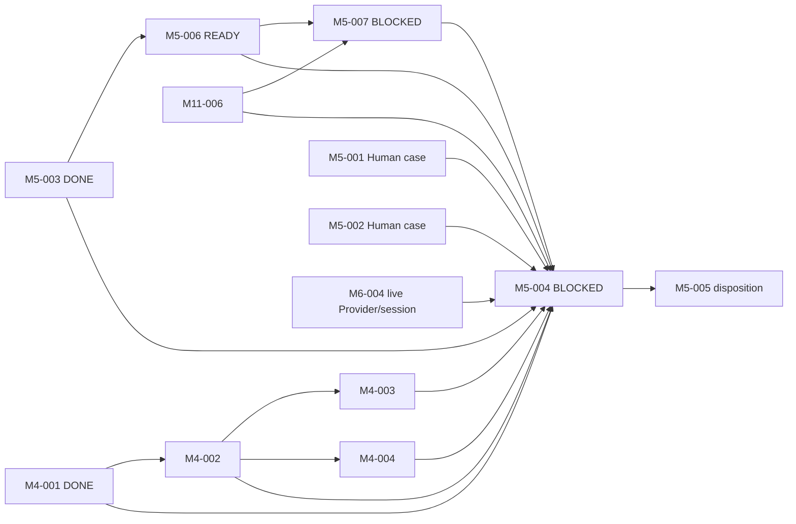

# M5 System-Level Evaluation Design

责任人：路诚钺（GitHub `Chengyue-Lu`）

风险：R2

PR 类型：`task-definition`（docs-only）

## 1. Primary estimand

本工作流冻结 Phase D 的首要问题：

> 最终 RWB Runtime 集成后的完整系统，相对 simpler Agent / Tool baseline，是否产生可复核的
> system-level net benefit？

Skill 独立效果只能作为 secondary interpretation，不能替代 system-level primary estimand。当前提交只定义
未来 Task 与 Gate，不执行 Evaluation，也不声称 RWB 已产生净收益。

## 2. 保留的 M5-003 基线

M5-003 已 DONE，其 Task definition 不作任何修改。四个 canonical arms 继续是：

```text
A1 plain-agent
A2 plain-agent-tool
A3 mode-no-skill
   Mode + Method + no-Skill/direct-tool/procedure
A4 mode-candidate-skill
   Mode + Method + real projection-backed Skill Runtime path
```

Task、exact Model、Provider Adapter、Host、budget、context、data policy 与 evidence classes 是四臂共享
frozen conditions，arm 不得覆写。M5-003 仍只编译 non-executing exact-reference plan。

## 3. Case dossier boundary

### M5-001 — Evidence-Synthesis Evaluation Case Dossier

Public Case Package 可被所有 treatment arm 读取，至少包含：research question、exact admitted source set、
inclusion/exclusion boundary、data/read boundary、required outputs、Claim ceiling、initial context 与 Task
contract。

Private Adjudication Package 不得被 treatment arm 读取，至少包含：required-fact set、known
counterevidence、known limitations、forbidden/overreaching claims、evidence-relation expectations 与 Human
scoring anchors。

### M5-002 — Theory + Simulation Evaluation Case Dossier

Public Case Package 至少包含：research question、exact model/governing equations、assumptions、parameters、
input data、simulation environment、required outputs、Claim ceiling 与 Task/context boundaries。

Private Adjudication Package 至少包含：expected invariants、numerical tolerances、known failure/convergence
conditions、known limitations、forbidden Claim overreach 与 evaluator anchors。

两个 dossier 都必须在观察 treatment output 前冻结 case 与 oracle hash，记录 case-selection rationale 与
Human approval，禁止 treatment-specific tuning 和 post-result oracle rewriting。M5-001/002 因真实案例尚未由
Human 批准而继续 BLOCKED。

## 4. M5-006 — System-Level Evaluation Protocol

M5-006 在 M5-003 之后独立 READY；它不等待真实案例完成。实现时必须预注册：

- primary estimand 与 secondary comparisons；
- run randomization、replicate count、pilot semantics 与 stopping rule；
- failure/retry rule、model/provider drift handling；
- blind-first Human review、reveal procedure；
- metric operationalization、measurement status 与 analysis rule；
- decision hierarchy。

Measurement status 是一等语义：`measured`、`estimated`、`unavailable` 与 `not-applicable` 互不等价；N/A、
unavailable 和 estimated 都不能写成 measured zero。

Blind phase 不展示 arm identity、Skill identity、cost、token usage 或“完整 RWB”标签。Reveal 之后才允许把
质量判断与 execution facts 对齐。禁止用单一 weighted aggregate score 消解以下层级：

1. Research Integrity：method violation、claim overreach、provenance error、counterevidence omission；
2. Research Quality / Human Burden：omission、human correction、rework、lookup、cascade；
3. Efficiency：context、cost、completion time。

Research Integrity 的实质退化不能被更低成本抵消。replicate count 由 protocol freeze；Task identity 不把
`n=3` 永久写死。

## 5. M5-007 — System-Level Evaluation Harness

M5-007 在 M5-006 与 M11-006 验收后实现，但不 hard-depend 真实 case data。其 bounded responsibility 是：

- compile frozen evaluation plan；
- 为每次 run 创建 fresh Attempt/session 并启动 exact arm execution；
- 形成 standardized run record；
- 绑定 Runtime Bundle / Resolved Execution View / Thin Host；
- 引用 Trace / Receipt / Artifact；
- 匿名化输出并抽取 metric evidence；
- 记录 Human Review、reveal map 与 analysis input。

Harness 不得建立 A4 bypass、直接读取 candidate directory、在 confirmatory run 接受 synthetic projection、
自动 promotion、自动 pruning、自动 Human score 或 Topic 5 recovery semantics。

## 6. M5-004 live execution Gate

M5-004 只在所有真实执行前置闭合后运行：



当前没有另一个已接受、具名且等价的 live Provider/session Gate，因此 M5-004 明确 hard-depend M6-004。
synthetic Driver 不能成为 system-level formal evidence；A4 还必须存在真实 accepted immutable Skill Release →
valid SkillReleaseProjection → projection-backed Skill Supply。pilot 与 confirmatory evidence 分开，failed
Attempts 保留，blind Human Review 和所有 metric status 必须闭合。

## 7. M5-005 disposition

M5-005 必须引用 exact protocol、case dossiers、run set、blind reviews、analysis 与 known limitations，并至少
作出一个 KEEP、KEEP-WITH-BOUNDARY、MODIFY、PARK、DEPRECATE、DELETE、STOP 或仓库接受的等价决定。

A4 看起来较优不自动触发 Skill promotion；既有开发成本也不自动触发 KEEP。该 Gate 明确保留删除无净收益
复杂度的权力。

## 8. 非目标与停止点

本 task-definition PR 不：

- 写 runner 或 Harness 实现；
- 运行模型、选择真实案例或准入真实 Skill；
- 修改 M5-003、M11/M4 implementation 或 Provider Adapter；
- thaw Topic 5；
- 建立自动 Human judge、单一总分或 automatic promotion/pruning；
- 宣称 RWB 已有 system-level net benefit。

合入后，合法下一施工入口只有 M5-006；M5-001/002 保持 Human-boundary BLOCKED，M5-007/004/005 按各自
hard dependencies 保持 BLOCKED。

## 9. 本地验证

- `python -m unittest tests.test_documentation tests.test_pr_governance -v`：76/76 PASS；
- `python -m research_workbench validate examples registry --root .`：182 validated，0 errors，0 warnings；
- 使用 repository governance 的 `validate_task_changes()` 对实际 diff 校验：declared Task closure、docs-only、
  dependency 与 DONE immutability 全部 PASS；
- `git diff --check`：PASS。

最终接受仍等待 PR 精确 HEAD 的 hosted CI 与 cross-owner R2 review。
