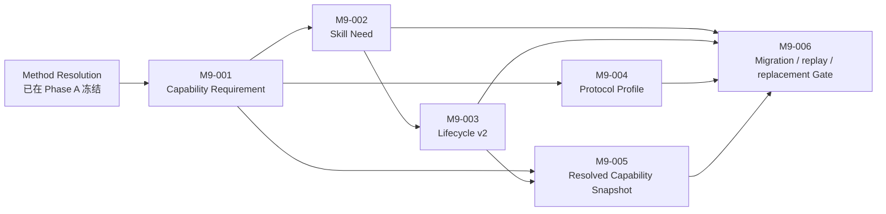

# Phase B Evolution Foundation

- 责任人：路诚钺（GitHub `Chengyue-Lu`）
- 跨负责人共享接口审查：黄毅（GitHub `let778750-cpu`）
- Tasks：`M9-001`～`M9-006`
- 基线：`develop@8825d9a`
- 目标 base：`develop`
- 阶段分支：`agent/phase-b-evolution-foundation`
- 当前状态：Phase A 已收口；M9-001 已实现并进入 R2 验证，M9-002 READY
- 风险触发：跨多个公共契约、Registry migration 与 Method/Provider 共享接口

## 1. 阶段目标

Phase B 把 M8 已冻结的需求表达推进为可迁移、可评测且可由不同供给实现消费的演化基础：



目标不是把 Method Resolution 扩成第二个 Router，而是建立清晰的交接：

```text
Method 说明需要什么与为何需要
→ Capability 层判断由什么已冻结供给满足
→ Execution 只消费 Snapshot，不反向改写 Method
```

## 2. 第一节点：M9-001

M9-001 只正式化需求侧 `Capability Requirement`。最小语义必须覆盖：

- 文档/实例 identity、Schema version，以及被外部引用时的 content hash；
- capability objective 与适用/不适用条件；
- required inputs / outputs / artifacts；
- permission、data-egress 与 side-effect ceiling；
- deterministic / semantic / Human verification expectation；
- unavailable 时的显式结果边界。

它不得包含 Provider、Model、Adapter、具体 Tool/Skill、运行时可用性、fallback 顺序或价格路由。
`available / gap / blocked` 属于后续供给解析结果；不能重新污染 Method Resolution。

Requirement 是否需要独立文件、内嵌对象或复用 Registry，不在计划阶段预设；M9-001 应先用现有八个
Resolution 的引用与复用需求作证。默认不新增全局 Registry，除非真实跨 Task identity 需求证明必要。

M9-001 的停止条件是：至少覆盖现有八个 Method Resolution 中的 capability need，正反 fixture 可证明
同一 Requirement 能被不同供给候选消费，并且没有改变 M8 的 Task/Mode/Action/Resolution identity。

实现审计确认八个 Resolution 只复用四个 Requirement ID，且每个 Task 的 `required_capabilities` 与其
Resolution 聚合结果精确相等。由此采用四份不可变需求文档和一个 path/hash 完整性 index；不增加
supply discovery、active/latest 或 fallback Registry。M8 Resolution 原始字节保持不变，实际供给
conformance 与 provider replacement 证据仍留给 M9-005/M9-006。

## 3. 责任与写入边界

路诚钺维护：

- Capability Requirement、Skill Need、Protocol Profile 的语义、Schema、Registry 和 fixture；
- Skill lifecycle/admission/evaluation vocabulary 与迁移；
- Method Resolution 到上述对象的引用和确定性关系验证；
- Resolved Capability Snapshot 的 Method-side requirements 与 authority ceiling。

黄毅维护：

- Provider/Adapter/Tool 的真实供给发现与字段映射；
- API session、认证、HTTP transport、模型能力探测与 live conformance；
- Runtime 消费 Snapshot 时的实现和 API 专用测试。

共享的 Resolved Capability Snapshot Schema 在双方确认 producer/consumer 字段、迁移影响和合并顺序前
不得进入实现。任何一方都不能用自己的实现便利修改对方 authority：Method 不选 Provider，Runtime
不改 Mode/Action/Claim/Gate/permission ceiling。

## 4. 非目标

本阶段不实现：

- Resolved Execution View、Assignment/Receipt migration 或端到端 Runtime；
- Provider SDK、认证、API session loop 或真实外部模型测试；
- Method Trace、Research State、Human Decision provenance；
- 新正式 Research Mode、大量 accepted Skill、Tool marketplace；
- 自动 fallback、模型路由、multi-Agent Supervisor 或固定研究 DAG；
- 没有真实对象版本需求的通用 migration framework。

Phase D 的 baseline/evaluation 设计可以在 M9-001/002 稳定后并行启动，但其结果不能绕过 Human
admission，也不能为了方便评测反向修改 Phase B 契约。

## 5. 读取与记录纪律

默认读取集限于：`TASKS.md`、`ROADMAP.md`、ADR-0013/0015/0016、modules 02/04/08、M8 contract
文档、现有八个 Method Resolution，以及当前 Task 明确涉及的 Capability/Skill Schema、Registry 和测试。
不递归读取外部候选池、其他负责人 Runtime worktree 或历史长日志。

本 workstream 因跨 PR、migration 和共享接口持续保留 README 与[风险台账](RISK_LEDGER.md)；普通
实现过程由 PR body 和 Git 历史记录，不为每个 M9 子节点创建新分支、Handoff 或重复 closeout 文档。

## 6. 阶段 Gate

Phase B 只有在以下条件均有证据时收口：

1. Need/Requirement、candidate、admission 与 runtime eligibility 不再混成一套状态；
2. Skill promotion 必须引用 baseline/trial/evaluation evidence；
3. 旧发布对象与历史 Assignment 仍可解释，不被新 Registry 静默重写；
4. 至少一个合成 Tool provider replacement fixture 不修改 Task/Mode/Action/Method contract；
5. Snapshot 精确固定 supply 与权限/数据/副作用边界，但不拥有科学决定权；
6. 完整 repository validation、测试、CI 与跨负责人共享接口审查通过。

上述 Gate 证明契约、迁移和替换边界，不证明 Skill 有科研净收益、外部 Provider 真实可用或端到端产品
已经完成。
