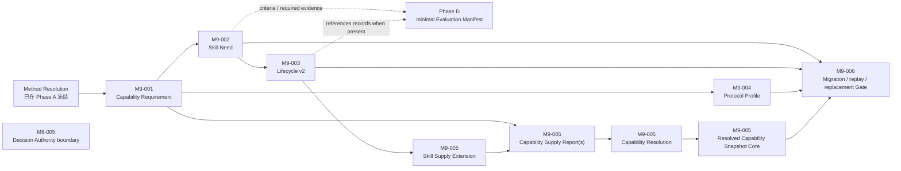

# Phase B Evolution Foundation

- 责任人：路诚钺（GitHub `Chengyue-Lu`）
- 跨负责人共享接口审查：黄毅（GitHub `let778750-cpu`）
- Tasks：`M9-001`～`M9-006`
- 基线：`develop@a3b6d174a6f3da7f2b890eb40883c4b378e92e16`
- 目标 base：`develop`
- 阶段分支：`agent/phase-b-evolution-foundation`
- 当前状态：M9-001～006 的结构契约及系统一致性修复已实现；Runtime execution 仍无合格 checked-in fixture
- 风险触发：跨多个公共契约、Registry migration 与 Method/Provider 共享接口
- 后续边界澄清：[ADR-0019](../../../decisions/0019-OPTIONAL-MAINTAINER-SKILL-EVOLUTION-OUTER-LOOP.md)

## 1. 阶段目标

Phase B 把 M8 已冻结的需求表达推进为可迁移、可评测且可由不同供给实现消费的演化基础：



目标不是把 Method Resolution 扩成第二个 Router，而是建立清晰的交接：

```text
Method 说明需要什么与为何需要
→ Supply Report 只报告实际供给事实
→ Capability Resolution 在既有 ceiling 内比较、判定并选择
→ Snapshot 先区分 structural replay 与供 Topic 4 继续准入的 runtime execution
→ Execution 只消费 validated runtime-execution Snapshot，不反向改写 Method
```

## 2. 第一节点：M9-001

M9-001 只正式化需求侧 `Capability Requirement`。最小语义必须覆盖：

- 文档/实例 identity、Schema version，以及被外部引用时的 content hash；
- capability objective 与适用/不适用条件；
- required inputs / outputs / artifacts；
- permission、data-egress 与 side-effect ceiling；
- deterministic / semantic / Human verification expectation；
- unavailable 时的显式结果边界。

它不得包含 Provider、Model、Adapter、具体 Tool/Skill、运行时可用性、fallback 顺序或价格路由。
`available / gap / blocked` 属于后续供给解析结果；不能重新污染 Method Resolution。

Requirement 是否需要独立文件、内嵌对象或复用 Registry，不在计划阶段预设；M9-001 应先用现有八个
Resolution 的引用与复用需求作证。默认不新增全局 Registry，除非真实跨 Task identity 需求证明必要。

M9-001 的停止条件是：至少覆盖现有八个 Method Resolution 中的 capability need，正反 fixture 可证明
同一 Requirement 能被不同供给候选消费，并且没有改变 M8 的 Task/Mode/Action/Resolution identity。

## 3. M9-002～005 的职责边界

### 3.1 Skill Need 与实际证据分离

Skill Need 只定义：need identity、trigger/non-trigger、semantic gap、no-Skill/direct-tool baseline、
expected increment、evaluation criteria、required evidence classes 与 domain scope/variants。它回答
“为什么需要 Skill，以及未来什么证据足以进入 trial/promotion”，不是持续追加实验结果的日志。

实际 trial/evaluation result 写入独立 Evaluation/Trial Record；M9-003 lifecycle 只保存 intake、evaluation
state、admission、runtime eligibility、trial/superseded/retired 状态，以及 `baseline_ref`、`trial_ref`、
`evaluation_record_ref`、`decision_ref` 和 promotion evidence references。Phase B 不设计完整 benchmark、
metric 或 experiment framework；M9-002 稳定后，Phase D 可并行启动 minimal Evaluation Manifest。

### 3.2 M9-005 的 supply-side seam

```text
Capability Requirement
        ↓
Capability Supply Report(s)
        ↓
Capability Resolution
        ↓
Resolved Capability Snapshot
```

- **Capability Requirement**：只声明需求、验证期待和 permission/data-egress/side-effect ceiling；
- **Capability Supply Report**：陈述 supply identity，Tool/Skill/Adapter/Provider implementation identity，
  version/hash、provided capability、supported I/O、permissions、data-egress、side effects、typed
  conformance artifact、scoped availability 与 limits；typed evidence 必须绑定 artifact path/hash、kind/class、
  ID、implementation ref/version、capability、observation scope 与 result；它不能用自报 status 覆盖
  引用制品，不能选择自己，也没有 Method、permission
  relaxation、fallback、Claim 或 Human Gate authority；
- **Capability Resolution**：比较零个或多个 Report，输出 `satisfied`、`gap`、`ambiguous` 或 `blocked`；
  比较固定 `evaluated_at`，选择具体供给时必须满足 Requirement ceiling，歧义不能伪装成 automatic
  fallback；
- **Resolved Capability Snapshot**：所有级别冻结 exact Task/Method/Requirement/Resolution/Supply refs、
  Supply-side boundary facts 与 evidence refs；`structural-replay` 不是执行输入，`runtime-execution` 只证明
  非 fixture typed-evidence 资格并留给 Topic 4 继续准入。Snapshot 不计算 Task/Profile/Skill/Assignment
  最终权限，不建立 exact Provider binding 或 Authority eligibility，也不是 Method decision 或 permission grant。

Snapshot Core 只依赖 M9-001 与 M8 Decision Authority 的既有 ceiling，先支持 Method no-Skill 对应的
procedure、direct Tool、Adapter/Provider 供给事实的 structural replay。Skill Supply Extension 额外依赖 M9-003；lifecycle 状态只形成结构资格，
真正新绑定还要外部 evidence/Human-decision resolver；Report 可陈述 Skill 供给事实，但缺 resolver 时
Resolution/Snapshot new-binding eligibility 默认拒绝。三条 fixture 均不得升格为 runtime execution。
M9-004 Protocol Profile 与这两条路径正交并行，不阻塞 Core。

### 3.3 Protocol Profile 正交边界

M9-004 只表达 PRISMA、V&V 等方法标准的 applicable/not applicable、required method obligations，以及
Gate/evidence expectations。它不复制 Mode Action、不固定全局研究 DAG、不绑定 Skill/Tool/Provider，
也不承担 Runtime routing。

## 4. 责任与写入边界

路诚钺维护：

- Capability Requirement、Skill Need、Protocol Profile 的语义、Schema、Registry 和 fixture；
- Skill lifecycle/admission/evaluation vocabulary 与迁移；
- Method Resolution 到上述对象的引用和确定性关系验证；
- Capability Supply Report/Resolution/Snapshot 的 provider-neutral 契约、Method-side requirements 与 authority
  ceiling；不伪造真实 Provider 可用性或 live conformance。

黄毅维护：

- Provider/Adapter/Tool 的真实供给发现与字段映射；
- API session、认证、HTTP transport、模型能力探测与 live conformance；
- Runtime 消费 Snapshot 时的实现和 API 专用测试。

共享的 Capability Supply Report、Capability Resolution 与 Resolved Capability Snapshot Schema 在双方
确认 producer/consumer 字段、迁移影响和合并顺序前不得视为接受。任何一方都不能用自己的实现便利
修改对方 authority：Report 不选择自身，Method 不指定 Provider，Runtime 不改 Mode/Action/Claim/Gate
或 permission/data-egress/side-effect ceiling。

## 5. 非目标

本阶段不实现：

- Resolved Execution View、Assignment/Receipt migration 或端到端 Runtime；
- Provider SDK、认证、API session loop 或真实外部模型测试；
- Method Trace、Research State、Human Decision provenance；
- 新正式 Research Mode、大量 accepted Skill、Tool marketplace；
- 自动 fallback、模型路由、multi-Agent Supervisor 或固定研究 DAG；
- 没有真实对象版本需求的通用 migration framework。

Phase D 的 minimal Evaluation Manifest 可在 M9-002 稳定后并行启动，但实际 trial/evaluation result
不得写回 Need，也不能绕过 Human admission 或为了方便评测反向修改 Phase B 契约。

## 6. 读取与记录纪律

默认读取集限于：`TASKS.md`、`ROADMAP.md`、ADR-0013/0015/0016、modules 02/04/08、M8 contract
文档、现有八个 Method Resolution，以及当前 Task 明确涉及的 Capability/Skill Schema、Registry 和测试。
不递归读取外部候选池、其他负责人 Runtime worktree 或历史长日志。

本 workstream 因跨 PR、migration 和共享接口持续保留 README 与[风险台账](RISK_LEDGER.md)；普通
实现过程由 PR body 和 Git 历史记录，不为每个 M9 子节点创建新分支、Handoff 或重复 closeout 文档。

## 7. Topic 4 / Topic 5 Gate

Topic 4 thin-layer Architecture Hold 只在 Capability Requirement、Capability Supply Report、Capability
Resolution boundary 均稳定且 Resolved Capability Snapshot Core 被接受后解除。届时只允许 Runtime
在 Topic 4 内补齐 external pin、freshness、精确 Provider/Adapter/Model/Runtime、最终权限/DataPolicy 交集后，
消费 closure-valid 的 `runtime-execution` Snapshot、报告 actual execution facts，并执行 permission/data-egress/
side-effect boundary。automatic fallback、model auto-routing、multi-Agent orchestration、critic voting、
hidden routing，以及 Runtime 修改 Method/Claim/Gate 继续禁止。

Topic 5 继续冻结，直到 Phase C 至少完成 minimal Research State、Failure/Attempt semantics 与 Method
Trace v0.1；之后才恢复 Handoff、context rollover、safe pause、recovery 和 salvage/clean recovery 的
后续扩展。M9-005 或 Topic 4 的解冻不构成 Topic 5 的替代 Gate。

## 8. 阶段 Gate

Phase B 只有在以下条件均有证据时收口：

1. Need/Requirement、actual evaluation result、candidate、admission 与 runtime eligibility 不再混成一套状态；
2. Skill Need 只声明 evaluation criteria/evidence classes；Skill promotion 必须引用独立的
   baseline/trial/evaluation record 与 decision；
3. 旧发布对象与历史 Assignment 仍可解释，不被新 Registry 静默重写；
4. 至少一个合成 Tool/Provider replacement fixture 保持 Task/Mode/Action/Method/Requirement 不变，只将
   Supply A/Snapshot A 替换为 Supply B/Snapshot B；
5. Supply Report 不选择自身或自报 evidence 结果，Resolution 不越过 ceiling；structural Snapshot 不声明
   final effective boundary/eligibility，runtime Snapshot 只形成 Topic 4 的 provider-neutral 供给输入，且
   两者都不拥有 Method、Claim、Gate、permission grant 或 fallback authority；
6. 完整 repository validation、测试、CI 与跨负责人共享接口审查通过。

上述 Gate 证明契约、迁移和替换边界，不证明 Skill 有科研净收益、外部 Provider 真实可用或端到端产品
已经完成。

## 9. Task-specific verification evidence

| Task | 实现证据 | 主要验证 |
|---|---|---|
| M9-001 | Capability Requirement Schema、四份 immutable Requirement、path/hash index、Task↔Method closure | demand-only 字段负面测试；八组 Method Resolution 引用闭合 |
| M9-002 | Skill Need Schema、三份 Need 与 index | actual result/supply/admission 字段被拒绝；no-Skill/direct-tool baseline 保留 |
| M9-003 | lifecycle v2 Record/Index/Migration 与 Skill Supply eligibility seam | 五轴不变量、旧 accepted entry append-stability、非 eligible Skill Supply 阻断 |
| M9-004 | 两份 bounded PRISMA/V&V Protocol Profile 与 index | Mode/Skill/Provider/Runtime/global-DAG 越界字段被拒绝 |
| M9-005 | typed Supply Report、Resolution、两级 Snapshot、validated consumer 与三条 Core chain | satisfied/gap/ambiguous/blocked 重算；evidence identity/result、fixture、permission 与 routing/fallback 绕过测试；Method no-Skill→procedure、Tool、Adapter/Provider 的 structural chain，以及非 fixture typed-evidence seam |
| M9-006 | `PHASE-B-M9-CLOSEOUT-001` Gate manifest | stable contract hash、A/B exact-supply replacement、三类 ceiling、两类 migration replay 与越权声明负面测试 |

这六项在同一 R2 Stage PR 中构成连通 atomic completion DAG。每项 DONE 均在 PR body 具名列出上述
证据；最终接受仍以远端 governance、Python 3.11/3.13、repository validation 与跨负责人审查为准。

## 10. ADR-0019 后续澄清

本 workstream 保存 PR #33 的 Phase B 结构基础与当时实施证据，不回写其历史完成判断。ADR-0019 对消费
边界作前向限定：

- 图中的 `Capability Requirement → Skill Need` 表示 Phase B 建设和 Maintainer triage 关系，不是
  Research Runtime 的数据依赖；capability gap/failure 不自动创建 Need；
- `load_validated_capability_snapshot()` 是 repository-wide `maintainer-full` 结构验证 helper，不是最终
  Runtime bundle API；
- Skill Supply→Lifecycle 只形成 Maintainer 侧结构资格；Runtime 新绑定未来只消费已发布、不可变的
  `SkillReleaseProjection`；
- no-Skill、direct Tool、procedure 与 Adapter/Provider 必须在零 Skill、零 Evolution Registry 时闭合；
- Topic 4 的 runtime-bundle、release projection 与 Resolved Execution View 属于后续独立实现，不改变
  M9-001～006 已完成的 Schema、fixture、migration 或 replay 证据。
