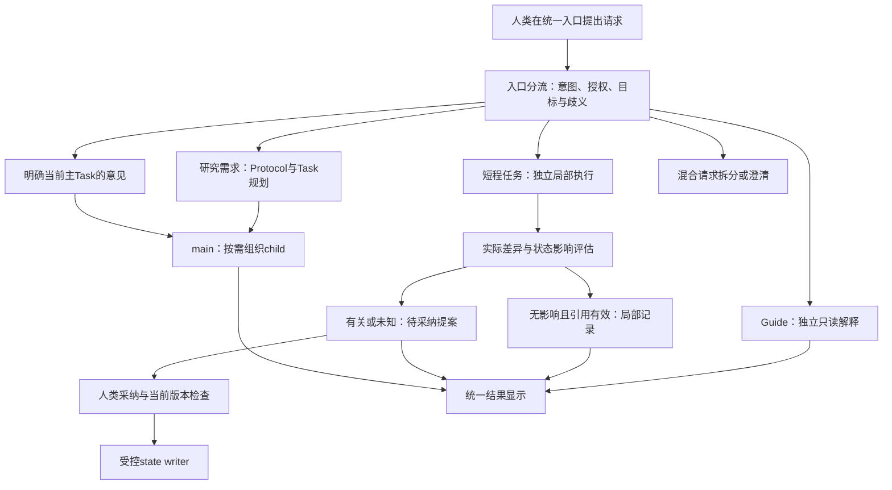

# 同一对话入口下的研究、查询与局部修改

2026-10-08；AUDIT-RWB-DOCS-005；PR141 设计候选。依据 [ADR-0024](../../../decisions/0024-UNIFIED-ENTRY-AND-SHORT-TASK-ROUTING.md)，exact scope/deps/state 由 [TASKS](../../../TASKS.md)维护，排程见 [REALIZATION_PLAN](REALIZATION_PLAN.md)。本文件描述后续接口及案例，不表示已有路由、写回或状态评估实现。

## 请求先分流，研究才形成 Protocol

人类在一个对话框询问、编辑或提出研究任务。应用先为每个请求确定目标与获准范围，界面再将各路结果呈现到同一处。共享显示不等于把全聊天送给每个模型。本设计只增加既有研究主线之前的入口层及旁路，研究 Protocol/Task/Method、main/child、Handoff、MainState 和人类决定的主线保持。

这张图是入口与消费关系，不是固定研究 DAG。职责可合并执行，必要程序检查不必增加一个模型 Agent。具体意图分类、路由适用性与编辑影响判断由角色绑定的 Skill 或提示词指导，不由内核预猜所有人类请求。

## 职责契约与判断规则分别维护

架构规定各分支允许读写什么、接收/输出哪些引用、如何隔离以及何处需要人类采纳。角色 Skill/提示词规定如何理解需求、识别研究含义、提出路径和评估实际变更；装配时绑定 Profile、规则版本/hash、适用范围和所需材料。评审覆盖局部呈现与研究语义、混合请求、缺少状态视图、提示注入和不确定情形，不能以固定关键词或文件大小保证路由正确。

程序独立检查权限、预算、目标版本、diff/ref 和输入冲突；它不能替代语义判断。模型输出只构成有依据的路由/影响提案，须通过适用执行边界；材料不足则澄清或保留 unknown。角色必载提示词与可选方法 Skill 分开，不为每次短程操作强加 Skill Supply；实际选择 Skill 时沿既有加载、评价/准入和 use-boundary，不用提示词版本替代 Skill 资格。职责可以合并，不新增固定 Core Role 或调用编制。

| 路径 | 最小上下文与控制 | 实际输出与状态接点 |
|---|---|---|
| Guide | 问题、获准 MainState/必要 refs；独立只读、无主聊天默认读取 | 有依据的解释和未知；不写项目、不通知 main。修改建议只是新请求候选 |
| 短程任务 | 局部目标、选中文件/片段及版本、写范围、预算与检查；独立会话和最小有界 Task | 实际局部工件、diff、检查与影响评估；默认不直接 MainState/主会话反馈 |
| 研究需求 | 意图、获准材料、项目政策与未知 | Protocol/Task/Method/Requirement 规划后，main 执行与人类决定 |
| 当前主 Task 意见 | 人类明确的目标 Task 和有界修改，不包含全部旁路聊天 | 沿该 Task 的治理入口处理；正在执行的子 Task 仍由 main 协调 |
| 混合或歧义 | 最小必要项目/任务 metadata，询问具体目标或拆分关联请求 | 澄清/路由提案，不通过猜测投递 main/child 或扩大写入 |

路由器可提出职责/API 配置建议，但供给选择由既有控制面冻结，Runtime 只消费结果。多个 API 可来自同一供应商；独立隔离指上下文、任务、权限及工件消费边界，不要求固定供应商或模型数量。Adapter 可以承载在原生聊天、CLI或网页；通用入口不锁定一种前端。

## 短程任务不是免控制的直接模型调用

短程 Agent 与 Guide/main 同级是应用职责关系；它不继承 main 的科学决定权或 child 控制权。没有研究 Protocol 不等于没有 Task、预算、输入版本、能力与执行事实。复用 no-Skill/direct Tool 的最小 Method/Requirement/Resolution/Snapshot/Bundle/View，只声明本次局部操作需要的能力；缺 Action、供给或资格时记录 gap，不制造 Mode、Skill 或 accepted Supply。

当前 intake 要完整研究 Protocol/Task ceilings，现有候选 factory 仅接 readonly Tool，Guide 也没有短程写回能力；这些既有接口不自动满足本设计。后续由最小短程 compiler、获准 Tool handler 和统一 caller 接合。Guide 的独立生成仍需在统一 caller 内闭合实际权限、费用与记录，不能以“询问”绕过总预算。

写入前核对目标版本、授权和活动任务使用情况。冲突对象优先另存局部候选或停止写入；不能因为打算后置评估就先覆盖活动 main/child 的冻结输入。短程不暴露任意 child session 的独立修改入口；人类若要改变某个子任务，先明确其所属主 Task，再由该治理接点处理。

## 后置评估同时看语义与引用

“段落排布调整”通常只影响呈现，但不凭任务名称保证无影响。必须看实际内容差异、研究对象/决定依赖、被引用的文件版本及活动 Task 输入。

| 判断 | 消费事实 | 后续动作 |
|---|---|---|
| none | 主张、来源、方法、目标/决定和依赖不变；MainState 所引用的确切版本仍有效；活动输入无失效 | 局部工件/检查/变更记录即可；MainState 与主会话保持原内容，不发送旁路聊天 |
| relevant | 改变研究语义/依赖，或需要维护 MainState 的确切引用 | 生成状态影响与采纳提案，相关正式发布保持 hold；不静默写研究状态或自动升级 Claim |
| unknown | 缺少必要依赖/状态视图，语义或引用影响不能确定 | 请求有界回查/澄清，相关发布保持 hold；不能把“不知道”归为无影响 |

单纯文件索引/缓存更新与 MainState 研究语义更新分开：在获准范围内可维护局部执行事实或索引，不因这类维护强制全局研究状态变化。若 MainState exact-pin 原件，优先保留不可变旧版本并把编辑形成新工件；不能只因内容语义相同就留下已损坏 hash。仍须改 MainState 引用时，提案明确“引用维护”而不伪装新的科研决定。

状态提案须绑定实际 diff、工件/check refs、读取时 MainState revision/hash、目标 Task、影响/未知及所需人类决定。人类采纳后，受控 writer 重查当前 State 和受影响输入；版本漂移则重新评估，不能覆盖新 main 的状态。None、未采纳或未知提案不进入 main 的普通上下文。

若发生确切活动输入失效，最小通知只包含目标 Task、失效 refs、实际差异和需要的动作，不转发整个旁路会话。这是防止使用旧输入的冲突检查，不启动自动 rollover/resume/recovery；Topic 5 冻结保持。

## 通用路由记录与验证案例

应用记录 request/target Task、route 与理由、授权/输入引用、实际判断所用 Profile 与 Skill/提示词版本、获准 recipient/API binding、实际费用/unknown、局部输出、影响判定、采纳/通知事实。它是应用级投递记录，不新增公共内核对象或全局消息数据库；最终 Schema/接口若需改变核心身份或权威，另按版本/ADR实施。

| 人类请求/实际情况 | 应看到的行为与证据 |
|---|---|
| 询问某 MainState 当前结论 | Guide 仅消费批准资料；actual request 无 main/child 原聊天；状态无写入、无默认通知 |
| 重排一个章节段落，内容/引用/活动输入不变 | 独立短程实际编辑及 diff/check；post none，MainState before/after 相同、main 待办/上下文未变 |
| “只改一句”，实际从“可能相关”变成“已经证明” | 不能按规模判低风险；预分类应识别研究含义，若执行中才发现则 relevant/hold/待采纳，不静默更新研究结论 |
| 主张不变，但被 MainState pin 的文件被改 | 保留旧不可变版本，或进入明确引用维护提案；坏 pin 不能当 none |
| 请求内容同时含查询、局部编辑和新的研究目标 | 拆为关联请求/澄清，各路独立输入及预算记录，研究部分才生成 Protocol |
| 修改的文件正在被 main 或 child 写入/消费 | 执行前检测冲突，另存候选或阻断；确切输入失效通过对应 Task 接点最小通知 |
| “继续刚才研究”或明确修订主 Task | 核目标 Task 后投递主治理入口；不猜任意 child，未明确目标先澄清 |
| 人类试图独立重绑 child API/改其执行指令 | 不提供普通旁路直接操控入口；关联主 Task 再由 main 协调，授权/资格不因此放宽 |

新完整研究从0/人工材料初始化继续共用原研究流程；前述旁路只决定是否进入它。一次旁路请求不得使 main 自动认为收到下一研究任务，也不能将 pending 提案当已接受 MainState。后续 M11-011 验证实际 producer、recipient、请求上下文、diff/check、State 前后及通知事实，不能用模拟路由或 JSON 字段代替实际链。
