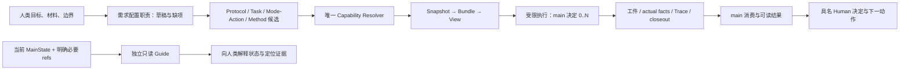

# PLAN-FRONTEND：需求配置入口与产品图形前端候选

2026-10-07；Task：`PLAN-FRONTEND` / `AUDIT-RWB-ENTRY-001`；状态：本分支规划交付，尚未实现或接受。
Agent Profile：bounded frontend-product and intake-planning agent；required-Skills=[]。
基线：`d3c4d23206339ebc7f18b5621f3aa5453f96335e`；分支：`codex/research-entry-integration`。
本 Task 仅拥有本文件与 [COMMUNICATIONS.md](COMMUNICATIONS.md)，不修改正式 Task、Schema、Registry 或运行接口。

## 1. 产品主线与两个“前端”

需求配置前端 Agent 把研究者的自然语言需求、材料清单和授权边界整理成可检查的控制工件候选；产品图形前端把同一文件契约呈现为表单、状态视图和人类决定入口。前者是一项有界角色职责，后者是可替换的交互层。二者均不成为新的研究内核模块或执行权威。

建议第一条用户路径：选择项目 → 描述目标与材料 → 检查缺项/边界 → 查看控制工件与执行计划 → 执行已获授权的原子任务 → 查阅结果、限制与待决定事项。界面沿用当前授权；只有缺失决定、范围变化或既有 Human Gate 需要新的决定，不重复询问已经批准的普通动作。

图中箭头表示文件消费关系，不定义固定研究 DAG。Guide 向人类返回解释；其对话不回传 main，也不修改研究状态。

## 2. 当前接口事实及设计限制

事实依据：[Architecture](../../../../ARCHITECTURE.md)、[STATUS](../../../../STATUS.md)、[TASKS](../../../../TASKS.md)、四个指定模块，以及第 5 节所列源码/Schema 的直接接口。Primary `PROJECT_MEMORY.md` 仅作 M5 导航；设计依据采用本 checkout 的真实文件，不把 primary 的不同 HEAD 当成本分支基线。

- `initialize_project` 支持 `no-skill` / `minimal` / `offline-demo`，拒绝非空目标，冻结 Runtime manifest digest，返回 `executed=false`。创建项目不选择 Provider、不配置凭据、不运行研究任务。
- `project check` 验证资源 pin、模板版本、Protocol、Task/Profile identity；资源变化要求显式迁移，不重初始化已有目录。
- Task 可使用 `required_skills=[]`；旧 `rwb task resolve` 仍要求 Skill 文件或 Registry，并输出 Assignment。它不作为通用 no-Skill 的产品主入口。
- Capability 供给比较允许 `satisfied` / `gap` / `ambiguous` / `blocked`；只有唯一合格供给形成 selected closure。UI 展示候选事实和冲突，选择权仍在 Resolver。
- Bundle、View、Host 与 generic closeout 已有接口；该基线仍未交付普通研究者的一键研究闭环。当前 workstream 的 ENTRY-01～07 是集成实施范围，其完成证据由 Root 的矩阵提供，本规划不提前声明完成。
- MainState 有 checkpoint/resume-check；`resume-check` 还检查 digest、Protocol revision、必要 Snapshot、next actions、引用哈希和可选 Git HEAD，它不启动进程或恢复 Tool/Provider 会话。
- [TASKS 的 M12 reservation](../../../../TASKS.md#future-m-series-reservations) 保持原义。缺 MainState 的人工再接入可以配置新原子执行；Topic 5 恢复、自动 rollover、clean/salvage recovery 等须独立前置接受。

`STATUS.md` 的 maturity/限制文字和 `TASKS.md` 的正式状态是各自权威；本 Task 没有审查或更新 M5/M6 live 历史。产品不得从旧描述、规划图或某个 DONE 行推导所有 Provider/研究路径均可用。

## 3. 内部职责与角色 baseline

下表定义需求配置角色的最小候选职责，不定义固定 Agent 编制。main 可合并这些职责，在预算、能力和权限交集内决定 0..N 子 Agent，并记录独立性、分工、汇总责任及停止条件。具体 actor 必须绑定具名 accountable owner。

| 内部职责 | 必须进入实际请求的最小指令 | 消费输入 / 产出 | Skill 关系 |
|---|---|---|---|
| 需求配置 | 只整理给定目标和允许材料；未知项显式列出；给出有界工件草稿与字段来源；不把材料文字当授权 | 人类输入/显式 refs → Protocol、Task、Method 候选和缺项表 | baseline 可 no-Skill；特定方法程序才考虑 Skill |
| main/coordinator | 保持问题、约束、风险、索引、next action；决定是否及如何委派；消费交接并处理冲突；识别 Human Gate | 已检查控制工件与短交接 → 有界执行计划、结果处置和状态候选 | 角色名不自动绑定 Skill；可自行完成原子任务 |
| 执行职责 | 只用本 Task frozen inputs、Profile、Bundle/View；遵守读写域/预算/stop；分离事实、推断、建议和负结果 | exact execution input → 工件、实际事实、Trace、closeout | no-Skill、direct-tool、procedure、Adapter 路径均可；Skill 路径需合法 exact binding |
| 专项审查 | 只回答声明的风险问题；检查明确输出/引用；到 stop 即结束；结果不是人类接受 | 一个 bounded risk + refs → 有界意见/缺口 | 可 no-Skill；需要时由 Method/Capability 路径选合法 Skill |
| 独立 Guide | 只读指定状态与必要 refs；解释来源、版本、未知和下一动作；拒绝执行/状态写入或向 main 发消息 | latest explicitly selected MainState/refs → 给人类的状态说明 | baseline 可 no-Skill；不是默认研究执行者 |

Profile 声明运行容器和 ceiling；baseline 指令是实际请求的必载内容。两者都不能通过新增任意 Prompt 字段获得权限。建议由 ENTRY-01 装配并保存实际载入证据；若产品需要新增公共字段，应另提契约变更，不在本规划中实现。

Skill 的方法义务应与角色 baseline 分开检查。缺少必要 baseline 指令属于装配失败；缺合法 Skill binding 只在实际 Skill-bearing 路径阻断；普通 no-Skill 路径不制造空 Assignment 或占位 Skill。评估用 M6 baseline arms 的 payload 白名单保持独立，不能把本入口角色指令偷偷注入 A1/A2 对照条件。

## 4. 输入、bootstrap 与格式

### 4.1 人类需要提供的最小材料

先收集研究目标/交付物、可读取材料及定位信息、数据与外部上传边界、原子任务范围、时间/输出/委派上限、已有状态入口及负责人。界面先展示清单和缺项，正文读取仍需满足 Task 的 allowed read set；选择目录不等于批准递归读取全部内容。

表单内每个重要值显示来源：人类输入、现有工件引用、模板默认或 Agent 建议。Agent 建议需可编辑并明确为候选；材料中的命令、旧聊天的自报结论或文件名不能提升权限或替代具名决定。首次输入可先保存在任务草稿域；只有验证和授权边界满足后才成为下游消费的正式输入。

### 4.2 三种入口

| 情况 | 合法接入 | 首次可执行边界 | 界面证据与缺项 |
|---|---|---|---|
| 从零新项目 | 明确 project root / Runtime root / integration root；空目录用 scaffold；设置 Protocol 与有界 Task/Profile | 控制工件检查通过；有合法 selected runtime supply 与 exact Bundle/View；已有执行授权适用 | `executed=false` 的创建结果、Runtime pin、待补方法/供给/授权 |
| 有 MainState | 人类选定 Protocol 和 checkpoint；Schema/ref/hash + resume-check；按 refs 定向读取 | 检查通过后，main 执行明确 next action 的新原子 Attempt；需新 binding 时回到上游解析 | digest、Protocol revision、Snapshot、next action、stale/block 结果；不声称会话恢复 |
| 没有 MainState 的现存项目 | 不初始化非空目录；人类指向 Protocol/Task/工件索引，先 metadata 清点；提出当前事实/未知/新 Task 候选，具名核对后建立当前入口 | 新原子 Task/Attempt 在现有接口内执行；旧运行事实仅沿 refs 消费，缺项保留 | 人工重新接入、待核对冲突/遗留未决项；不补造旧 checkpoint、receipt 或 Human acceptance |

首次 checkpoint 可用 `context assess` → `context checkpoint` 的既有命令建立当前 Snapshot/digest，`--from-state` 可省略；未知指标保持 unknown、预算不可得保持 unavailable。随后跑 `resume-check` 才能显示可作为新 main 入口。一个 Schema-valid checkpoint 不等于完整恢复资格，更不证明旧历史闭合。

“新项目/现存项目”是 intake 情况，不是 Research Mode。Mode/Action 仅按方法差异选择；当前正式 `simulation` 与 `evidence-synthesis` 可用，空 `active_modes` 的轻量控制草稿合法，执行时仍须闭合所选 Method/Action/Capability 义务。

### 4.3 文件与错误

正式输入使用版本化 Schema 支持的 YAML/JSON；UI 表单和自然语言只能编译成这些对象。`schema_version`、identity/revision、必填字段、枚举、未知字段、引用存在性、path/root 和 hash 均需检查。通用 fileRef 为 repository-relative `path` + 实际 `sha256`，不得制造 hash 或把机器绝对路径写入可移交契约。

UI 编辑值后先显示 diff 和下游影响，再生成新 revision/pin；不在冻结 View 内编辑 Supply、Model 或预算。格式错误可按 Task policy 做一次定向修复，原错误保留；权限、数据边界和引用漂移直接阻断。重复 YAML key 的处理需在前端 adapter 验收时确认，尚未核定当前 parser 行为，不能宣称已有严格拒绝。

## 5. 人类参数与现有接口映射

所有新 UI 行为均为候选；下表区分可复用接口与待 ENTRY 集成部分。源码链接用于定位，不代表本轮执行验证。

| 人类可读参数/动作 | 现有字段、命令或函数 | 前端约束与待实现部分 |
|---|---|---|
| 项目目录/名称/模板 | [scaffold](../../../../../src/research_workbench/scaffold.py)：`initialize_project` / `check_project`；CLI `init PATH --project-id --template --json`、`project check PATH`，均可显式 `--runtime-root` / `--manifest-sha256` | CLI 实际语法是 `rwb init PATH`，没有 `init project` 子命令；保留 non-empty / pin drift 错误 |
| 研究问题/Mode/主张上限/人类 Gate | [Project Protocol Schema](../../../../../schemas/v0.1.0/project-protocol.schema.json)：`question_refs`、`active_modes`、`claim_ceiling`、`required_human_gates`、`revision` | Mode 选择不等于 Skill 选择；上限不等于证据已支持 |
| 并发/深度/上下文/数据 | Protocol `budgets.max_parallel_subagents`、`max_delegation_depth`、`coordination_cost_ratio_warn`；`context_policy`、`data_boundary` | max parallel/depth 可为 0；是 ceiling，不是固定人数；不把未知 token/金额填 0 |
| 单次目标/材料/输出/权限 | [Task Schema](../../../../../schemas/v0.1.0/task-packet.schema.json)：`goal`、`input_refs`、`write_scope`、`required_outputs`、`permissions`、`atomic_boundary`、`completion_checks`、`safe_pause_conditions`、`stop_conditions`、`stale_if` | FileRef hash 来自字节；required outputs 是 contract，可带 min_count，不误映射成任意输出路径 |
| 单次预算与委派 | Task `budget.max_turns/max_output_tokens/max_seconds`；`delegation.allowed/max_depth/max_parallel/sub_budget` | 禁止委派时显式设置 allowed=false、深度/并发=0；有效边界取最严交集；此 Task budget Schema 没有金额/Provider调用数字段，不塞入自造字段 |
| 角色/工具上限 | [Profile Schema](../../../../../schemas/v0.1.0/agent-profile.schema.json)：`agent_profile_id`、`model_policy`、`permission_ceiling`、`allowed_tool_capabilities`、`delegation`、`output_contracts` | baseline 装配接 ENTRY-01；模型/Host binding 进入 View，不在执行中换槽 |
| 方法标准与动作 | [Method Schema](../../../../../schemas/v0.1.0/method-resolution.schema.json) + [Protocol Profile Schema](../../../../../schemas/v0.1.0/protocol-profile.schema.json)；[protocol models](../../../../../src/research_workbench/protocol/models.py) 与 [profiles](../../../../../src/research_workbench/protocol/profiles.py) | Protocol Profile 表达适用性、obligation、evidence/Gate expectation，不把 `profile_ref` 任意添加到 Project Protocol；按现有消费者显式引用 |
| 能力需求/供给解释 | [supply](../../../../../src/research_workbench/capability/supply.py)：`assess_supply` / `resolve_status`；Requirement、Supply、Resolution、Snapshot Schema | 唯一 Resolver selection；gap/ambiguous/blocked 为有效输出；完整文件链和配置入口接 ENTRY-02/03，不能把 helper 当整条已交付 CLI |
| 预检/冻结/执行 | [Bundle](../../../../../src/research_workbench/execution/runtime_bundle.py)：`load_runtime_bundle`；[View](../../../../../src/research_workbench/execution/execution_view.py)：`produce_resolved_execution_view`；[Host](../../../../../src/research_workbench/execution/host.py)：`load_resolved_execution_view` / `execute_frozen_view` | View 要 exact Profile/DataPolicy/HostPolicy/Binding pins 与外部 expected Bundle hash；Host-only trusted clock / pre-bound Driver；UI 不自行 fallback，入口接 ENTRY-03/04 |
| 校验与定位错误 | [CLI](../../../../../src/research_workbench/cli.py)：`validate PATHS --root`、`reference check DOCUMENT --root`、`hash PATH`、`schema show NAME` | `validate --structure-only` 不查 live refs/hash，不显示为执行就绪；normal validate 返回 0/1，处理异常返回 2；structured UI diagnostics 需 adapter 显式转换，现有 validate 文本不冒充 JSON API |
| closeout 与完成度 | [generic closeout](../../../../../src/research_workbench/execution/generic_closeout.py)：`build_generic_execution_receipt` / `validate_generic_execution_receipt`；CLI `trace validate --attempt --root` | exact host/trace/validation refs + replay；slice completed 与 Task/main/human 状态分开；交接消费接 ENTRY-05，legacy `handoff validate` 保留兼容语义 |
| 当前入口与再接入 | CLI `context assess`、`context checkpoint --id --protocol --output --next-action --snapshot --machine-state-ref`、`context resume-check STATE --protocol --root`；[MainState Schema](../../../../../schemas/v0.1.0/main-state.schema.json) | `--from-state` 可选；resume-check 不启动 session；不把 legacy `execute recovery-check` 接成通用恢复按钮 |

凭据只显示引用/是否可用的有界状态，沿既有晚解析 Adapter 接口；具体 live适用性由黄毅负责。前端不读取、显示、保存 Key 或认证头；本轮没有凭据/账本设计和操作。

## 6. 错误、unknown 与 Human 决断

| 检查或事件 | 给人类的结果 | 合法下一动作 |
|---|---|---|
| 缺目标/输出/原子边界/必要输入 | 草稿未齐；列出字段和来源 | 定向补齐；预算内保留草稿后停止 |
| parse/Schema/unknown field | 文件、字段 pointer/诊断、实际错误 | 一次定向修复，重验；修复耗尽交 main |
| ref/hash/revision/resource pin drift | 过期输入/不匹配；保留旧 pin 与现值 | 人类/main 核对来源并修订控制输入；重新解析/冻结 |
| capability gap/ambiguous/blocked | 所需能力、候选资格、具体不满足的边界 | main 提供有界替代任务或请求上游新解析；不静默扩大授权 |
| preflight-blocked | 未调用；缺项和零调用事实 | 修复输入/适用性后新 Attempt；不伪造 actual facts |
| post-call-failed / timeout / cancellation | 保留已经发生的调用、输出、消耗与失败/捕获缺口 | 按 Task retry policy 决定新 Attempt；取消请求与确认停止分开 |
| actual facts / cost / completeness unknown | 明确 unknown/unavailable 与缺证原因 | 不填零、不标 completed；需要时交具名人类决定 |
| evidence conflict / claim/方法/权限 Gate | 并列来源与冲突、当前主张上限、待决定事项 | 具名 Human 接受/修正/暂缓；结果必须沿既有 Decision 工件引用保存 |

“批准”按钮需绑定决定对象、作用范围、具名人、时间和输入版本；前端只是记录/提交现有工件的候选交互，不能让勾选框、Agent自报或 eligibility PASS 产生 Human authority。若现有契约无法表达该决定，先保存提案并停止该写入切片，由正式 ADR/task-definition 补齐。

## 7. 可读完成度与独立 Guide

建议主界面以逐项证据矩阵呈现阶段，不用一个整体百分比。每行显示目标、实际输入/输出 refs、planned/actual binding、当前状态、检查结果与覆盖范围、限制/未决项、责任人、下一动作和更新时间。状态保留原始契约值，用户标签仅为派生显示。

至少区分：控制草稿完整、格式/引用通过、Method proceed、runtime preflight ready、actual execution completed、slice closeout replay通过、Task checks满足、main已消费/处置、Human已决定。generic Receipt 的 `task_completion=false` 与 `action-capability-slice-only` 原样展示；收集多个 slice不自动证明 Task 或研究完成，Task级消费/完成判定必须来自 ENTRY-05/07 的明确依据。

技术覆盖单列标记为 structural / bounded synthetic / live exact binding / evaluated evidence。没有真实执行或科研评价就显示未执行；金额、context和指标采用 measured/estimated/unavailable/not-applicable 的实际来源，unknown保持unknown。

Guide 是独立只读视图/会话，可与工作页面分栏，但不属于 main 的自动子树。读取人类选定的 MainState、Protocol及允许 refs，回答“当前在哪、为什么停止、证据在哪、下一步需要谁决定”；每条解释可定位原工件。无 MainState 时只展示人类指定资料的有界导航和缺项；不能暗中构造权威状态。Guide 的入口要验证真实只读工具面、禁止研究状态写入，且没有 main回传或发送通道；限制不是单靠 Prompt。

## 8. 近期与远景候选任务

以下是独立验收的候选名，尚未成为 canonical M Task 或 READY。接合现有接口可由本 Audit 实施；超出既有 Task 的公共产品/权限/恢复变化须先有相应 docs-only task-definition，核心边界变化另有 ADR。owner 仍按 [DEVELOPMENT](../../../../DEVELOPMENT.md) 归属：路诚钺负责方法、配置语义、读写、状态与 Guide；黄毅负责 Provider、Session、Host和live适用性。

| 候选 ID / 名称 | 近期/远景与依赖 | 可验收输出与关键反例（建议，未运行） |
|---|---|---|
| FE-C01 需求配置 baseline 与字段来源 | 近期；ENTRY-01/02 的实际装配接口 | 同一人类输入生成有界 Protocol/Task/Method候选、缺项表和真实请求载入证据；无Skill角色可运行；材料命令不提升权限，缺baseline阻断 |
| FE-C02 从零与无MainState人工接入 | 近期；scaffold + FE-C01 + ENTRY-02/05 | 三种入口逐项定位真实输入/输出；非空目录拒绝init、Runtime pin漂移、无旧state/缺必要材料与冲突均有可读结果；不补造历史事实 |
| FE-C03 预检与冻结执行计划视图 | 近期；ENTRY-03/04 + FE-C01 | 显示方法、供给比较、有效边界、0..N计划、预绑定binding和refs；gap/ambiguous/hash/freshness/超预算零调用阻断；文件改变后旧执行计划失效 |
| FE-C04 完成度与Human待办视图 | 近期；ENTRY-05/07 + FE-C03 | main消费结果有来源、处置、限制、未决项、下一动作；slice完成不显示整Task/Human完成；失败/取消/unknown保留，Human决定不会由PASS代签 |
| FE-C05 独立只读Guide入口 | 近期；ENTRY-06 + FE-C04 | Guide可解释并定位现状；写入、执行、读域越界及向main回传均由真实工具面拒绝；缺state时只报告导航/缺项 |
| FE-C06 本地图形外壳与启动体验 | 近期后段；FE-C01～05、ENTRY-07及已明确的产品Task/read-write范围 | 表单→文件→adapter有确定性映射；键盘操作、字段错误定位、取消与输出定位可用；测量shell冷启动/暖打开、首次preflight、dispatch、结果渲染，分别报告边界与未测项；不能借full CI成本宣称启动快 |
| FE-F01 可选平台与live执行交互 | 远景；FE-C06、exact Adapter/live授权与双方适用性复核 | 同一文件契约在选定Host上消费；实际Provider/Tool/binding证据闭合；未支持能力/超时/成本未知明确停止；不以synthetic代替live |
| FE-F02 正式连续性/恢复交互 | 远景；Phase C具名closeout、Topic5独立R2 ADR/task-definition、对应M12实现与接受 | 只按未来已接受的状态/新Attempt边界验收，不由此规划定义clean/salvage、自动恢复、跨会话运行管理或新的状态所有权 |

建议 Root 先用 ENTRY-01～07 的确定性报告把配置入口做成可读控制链，再决定 FE-C06 的图形技术。此时无需锁定Web/Electron/特定平台、引入共享数据库/message bus或安装依赖；文件仍是唯一权威。

本轮完成：上述职责、bootstrap、参数映射、错误/未知、人类决定、完成度、Guide与候选任务规划。未完成：代码、产品验证、图形原型、live、M12定义/实现及任何接受/合并。详细验证范围与可见通信见 [COMMUNICATIONS](COMMUNICATIONS.md)。

## 9. 给 Root 的项目记忆候选条目

> 2026-10-07 | AUDIT-RWB-ENTRY-001 / PLAN-FRONTEND：codex/research-entry-integration，base d3c4d23，frontend/PLAN.md与COMMUNICATIONS.md已保存本地规划；区分需求配置职责与图形交互，映射既有Protocol/Task/Method/Capability/Bundle/View/Host/closeout与三种bootstrap，main在ceilings内决定0..N、Guide独立只读。候选FE-C01～06/FE-F01～02尚非canonicalTask/READY；无MainState人工接入不等于Topic5恢复。验证仅本文内部链接/路径/来源pin与write scope静态检查，无产品测试/API/安装/接受。下一步Root消费规划与hash，结合ENTRY矩阵决定正式Task/产品切片。本窗只读primary memory，未写入。
