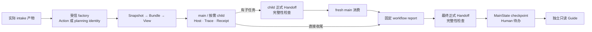

# Planning 与正式 Handoff 接合

本切片为 PR140 的后续 R2 实施：让 Method 内的 planning 决策取得精确执行身份，让实际子任务和最终结果通过正式 Handoff 进入下一消费者。输入、范围与停止条件见 [Task Packet](TASK_PACKET.md)；验证结果及剩余范围见 [验收记录](VERIFICATION.md)。前一包内 caller/factory 的 Action 证据见 [原记录](../package-caller-003/VERIFICATION.md)。

main 可直接执行，子任务数量仍由 main 在已声明边界内决定。Handoff 的确定性生产与检查无需增加固定模型角色或额外模型调用。每个 actual Receipt 使用自身 Bundle/View 回放；交付计数依据唯一、经过验证的实际产物。未验证交付、未知用量、冲突与人类待决事项保持可见。

角色请求显式提供当前 role、实际 Task 身份和消费阶段。同一个 Agent Profile 可以复用到不同 Task/会话；新主消费的 child_results 来自实际子任务执行，不能当作自身先前回答。独立会话本身不证明科学独立性，也不强迫主 Agent 完成或固定子任务数。

planning 身份在 exact Method 的版本、内容 hash 与独立决策内成立；原 Action 身份继续支持。新增来源锁的 Handoff 将实际 Task、输入、结果、usage、产物及 Receipt 固定为可核验链。版本与单向兼容见候选 [ADR-0025](../../../../decisions/0025-PLANNING-EXECUTION-IDENTITY.md) 和 [ADR-0026](../../../../decisions/0026-PINNED-COMPACT-HANDOFF-CONSUMPTION.md)。

包内 `ApiRoleBindingFactory` 以互斥的 `action_ref` 或 `planning_action_id` 选择 exact Method 决策。`run_frozen_intake_workflow` 的结果增加可选 `handoff_ref`；成功生产后它指向本次最终正式 Handoff。应用应把该 pin 显式交给 `publish_workflow_checkpoint(..., handoff_ref=result.handoff_ref)`。独立消费者可调用 `consume_compact_handoff`，同时提供自己的 expected Task、attempt 和执行 observation；单独传入 packet 或 producer 自述不足以验收。底层通用 workflow 的正式收尾入口为 `publish_workflow_handoff`。

Handoff 的 source record、Task 和 packet 分别有实际文件及 hash。artifact_refs 继续引用原产物，全部 Receipt 按自身冻结链复验，Handoff 本身保持 compact。新 Handoff 没有真实 Skill 执行时使用空锁；required Skill 未加载、H2 Manifest/Audit 未提供时给出具体阻断。

Guide 的调用方可通过既有 `approved_refs` 显式提供已消费的 final Handoff 和最终执行 Receipt pins，与 MainState 一起构成只读解释输入。文件中仅列出的 refs 不代表已读其内容；Guide 不自动追读。MainState 保留的早期阶段限制与执行后的交付事实应分别解释，结构记录不授予研究接受。

本轮 planning 检查采用有界工程 Method；自由需求规划、研究方法语义、合格 Skill 装配与 Guide 解释质量继续依各自 Task 验收。Task、Claim、来源与人类接受仍保留原边界。PR140 是未合并候选，三项 Task 状态见 [TASKS](../../../../TASKS.md)。
