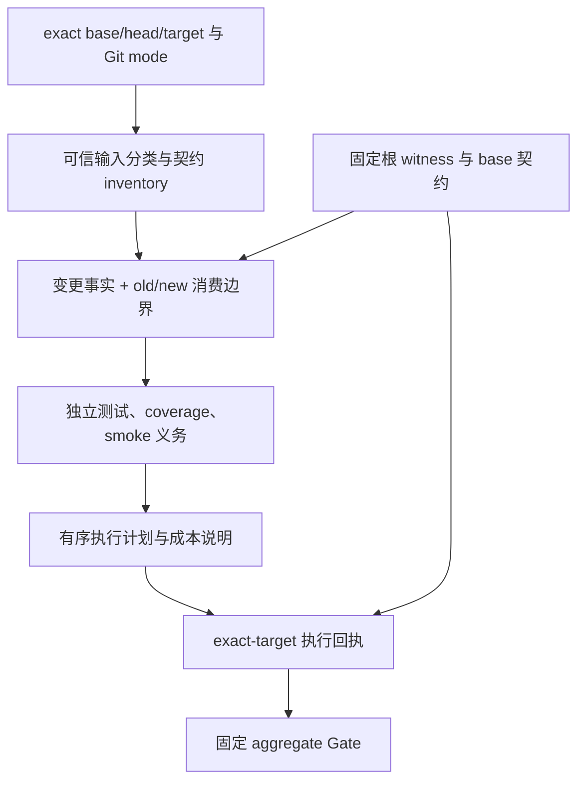

# CI 契约重规划：评审稿

状态：PROPOSAL；TEST-PERF-002 / Issue #48；2026-09-16。
负责人：路诚钺（Chengyue-Lu）；执行、Provider、baseline 边界的评审责任人为黄毅（let778750-cpu）。
用户授权本轮深入盘点业务模块并重新规划 CI。本文定义拟采用的统一规范，尚未替换 accepted
planner、witness、coverage policy、workflow、Task 状态或业务契约。

基线：`b041aeef8c32b74bc4399f90bf3fb49fbbb4fc22`。配套材料：
[模块与成本盘点](MODULE_AUDIT.md)、[迁移与验收](CI_REPLAN_ACCEPTANCE.md)、
[证据索引](../../../../work/TEST-PERF-002/A-20260916-005/RESULTS.md)。

## 1. 本轮重新定义什么

CI 的选择单位是**可验证的业务契约及其执行输入**。文件、Python module、M Task 和测试名称是定位信息，
不能分别充当完整影响边界。M-series 保持任务和验收身份；一个 CI 契约可以覆盖其中一条稳定业务路径，
多个契约可以共享基础设施。

每次 PR 必须回答四个问题：什么事实改变了、哪些契约可能受影响、需要哪些行为及覆盖证明、
哪些输入不变的契约具有可核验的排除依据。安全性与选择精度共同验收；测试全部通过不证明选测准确。

保留既有基础：exact Git diff、base-side policy、old/new closure、Agent 只能扩大范围、metadata isolation、
obsolete HEAD cancellation、独立固定根 witness、固定 `test (3.11)` / `test (3.13)` aggregate、
global 90%、critical 95/90、changed 100/100、positive/negative acceptance、integration 完整基线。

R2 继续决定治理与审查强度；普通 R2 业务修复采用受影响契约范围。selection authority 本身的变更，
在可信外部 witness 约束下继续 full behavioral bootstrap。完整 coverage 与 smoke 均独立推导。

## 2. 三层模型

**契约层**描述输入、输出、不变量和 owner；**影响层**推导哪些契约受本次变化影响；
**执行层**选择测试、保留 fixture 生命周期、收集覆盖事实和可读失败报告。执行便利不能反向决定契约范围。

已有 import graph 作为发现和保守兜底机制保留，但不能继续把每个字符串或 reader 自动解释为全仓业务依赖。
不建设能解释任意 Python 的通用分析器；优先通过小而显式的契约、资源根和测试 helper 边界减少不可判定部分。

## 3. 输入分类必须统一

同一路径的 surface、coverage、dependency 和 smoke 分类必须消费同一份可信事实。分类优先顺序为
authority / executable / runtime input / declared test input / document-evidence；路径命中 docs 不能覆盖更强语义。

| 输入类别 | 如何认定 | 基本义务 |
| --- | --- | --- |
| 业务源码 | tracked executable、所属契约、public API / import / initialization 差异 | 受影响契约行为，impact coverage，独立 smoke 判断 |
| 运行资源 | installed catalog、schema `$ref`、Registry identity、显式读取闭包 | 数据正反校验及真实消费者；按资源安装和全局闭包触发 smoke |
| 测试及 fixture | exact test ID、helper/fixture 依赖和生命周期 | 受影响测试及 helper 消费者；不因测试文件变化自动收集生产 coverage |
| 文档与证据 | 内容用途、归档引用、被执行或读取情况 | links、Task/governance、适用的 hash/schema/trace 闭包；真实运行读取仍保留 |
| selection authority | planner、selector、runner、witness 及执行选择语义 | full behavioral bootstrap、独立 witness；coverage 单独判断 |
| coverage authority | threshold/root/exclusion/critical inventory/negative-acceptance 语义 | repository coverage，变更源码另加 impact |
| packaging authority | build backend、依赖、入口、公开安装及 runtime catalog 构建 | package smoke；环境/全局语义变化扩大相应行为及 coverage |
| 未知输入 | 无法读取、解析、分类或界定闭包 | 保守扩大并给出具体不确定项；不能静默忽略 |

`.md`、`.yaml`、`.json` 和 `work/` 都不是通行证。归档内可执行脚本按 executable 处理；固定归档数据
只触发其真实数据消费义务。嵌套 `.gitattributes` 按所处目录、实际规则、mode 与受影响文件判定，
不能直接等同根目录配置，也不能 blanket skip。

等价文档或归档在合法目录间移动，不应仅因扩展名或目录前缀改变就触发全仓业务回归；
若目录确实被运行时扫描或发布，必须指出具体 reader / catalog 变化。

## 4. 业务契约 inventory

扩展现有 `tests/ci_impact_policy.yaml` 的契约表达能力，具体 schema version 在实现 PR 中确定；
本评审稿不创建平行的第二份选择 authority。契约以模块/能力为粒度维护，不为每个函数建立配置。

每条记录至少包括：

- 稳定 contract ID、具名 owner、源码与 public entrypoint；
- 输入 roots / 精确 refs / manifest、输出 roots，以及运行环境依赖；
- shared helper、跨契约输入/输出约束、包初始化及动态调用的已知边界；
- 必需 unit/contract/scenario/negative test IDs，coverage subjects 与确定性证明集合；
- 允许局部变化的条件、必须升级的条件、fallback 边界；
- accepted revision、实现/测试/helper/资源/environment fingerprint 和失效规则。

candidate 新增的契约、fixture 指纹或消费关系只能增加本 PR 的义务，不能立即授权自身减测。
减少边界先在独立规范/契约 PR 获得 review 和必要完整证据，进入可信 base 后才能被后续 PR 使用。
新增源码、新测试、移除/重命名消费者、失效的 fingerprint 都必须明确处理。

局部函数内部 bugfix 只有在 public API、imports、初始化、资源读写和副作用范围保持约束时，
才适用已接受的局部契约。跨文件小型重构可以保持同一契约，但必须验证 old/new consumers、
公共导入路径、序列化结果和副作用顺序；不能仅凭 AST 相似或文件移动声明等价。

## 5. 传播语义

| 变化 / 边 | 推导方式 |
| --- | --- |
| 代码实现改变 | 自身契约 + old/new 行为消费者；public contract 改变扩至已声明下游 |
| 特定输入数据改变 | 验证此输入和实际消费实例；不能转换成“reader 的代码改变”再无条件传播给其他实例 |
| 输出路径/输出文件名 | 写入边；仅通过实际后续读取建立 downstream，不能匹配所有同名输入 |
| 文件名、kind、长度等元数据 | 只在值确实参与输入选择/解析时产生数据边；保留作用域和修改绑定的反例 |
| 静态 import / re-export | 保留 Python 初始化语义；符号契约受影响时扩大，不能把未变导入本身当作所有业务都变了 |
| shared helper 修改 | 自身以及真实调用者；helper 必须声明输入、输出、全局状态和可变对象生命周期 |
| 参数化路径 / 动态执行 | 先用可信 root/manifest/调用契约界定；无证明时保守扩大 |
| schema / Registry 变化 | old/new refs、identity 及 catalog 消费闭包；当前全量 catalog 验证的真实耦合不得抹除 |

每条选中理由须给出 `changed fact → input/contract edge → required assertion/test`。
每个被排除契约须有可复核的 base-side boundary 和未失效依据。一次动态观测未读到文件，
或旧 coverage 未执行某行，都不能单独证明未来不会受影响。

## 6. 独立 obligations 与执行要求

沿用独立 `behavioral_scope`、`coverage_obligations`、`package_smoke`、`repository_smoke`；
扩充诊断中的 affected contracts、selected cases、coverage-only cases、smoke reasons、fallback reasons。
`FAST/FOCUSED/FULL` 仍可作为摘要，不能作为成本验收或所有 job 的总开关。

| 变化 | Behavioral | Coverage | Smoke |
| --- | --- | --- | --- |
| 文档、工作记录、已界定归档数据 | 文档/证据检查和真实消费者 | none，除非改变 executable / coverage authority | 按实际消费，无默认开启 |
| 普通测试、fixture、已审阅 fingerprint 更新 | 变化测试和真实下游 | 通常 none；重新证明生产覆盖不是默认义务 | 独立 |
| 已接受局部契约内 bugfix | affected contracts，双 Python | impact：changed 100/100；critical 整文件 95/90 + 正反例 | 独立 |
| 同契约内的小型结构调整 | old/new API 与 affected contracts；失去边界时扩大 | impact；坐标、exclusion 与文件映射精确重算 | 独立 |
| shared API / 初始化 / environment 改变 | 声明下游或 full | impact；全局测量权威或无法界定时另加 repository | 独立 |
| selection authority 改变 | full + 外部 witness | impact；coverage authority 同时改变则加 repository | 独立 |
| coverage authority 改变 | 相关 authority 及消费者；改变 runner 时 full | repository；源码改变同时保留 impact | 独立 |
| develop/main/release integration | full，双 Python | repository；PR required impact 不能被抹除 | 保留完整基线 |

`impact` 和 `repository` 可同时要求，不能互相替代。无法闭合的 executable 影响仍可要求 full + repository。
未知数据输入的诊断必须指出未知何在；不能用 R2 代替这个理由。新规则尚未证明该数据边界时继续保守执行。

aggregate 验证 exact plan/target、义务、所需 producers、test IDs、结果与证据 digest。
只有 plan 明确不需要的 job 才允许 skipped；required job 的 missing/cancelled/failure/skip 均阻断。
发现 inventory 不一致不得接受“已有一个绿色 full job”替代本次义务。

## 7. Coverage 的责任和成本

Coverage 是在指定环境和输入下实际发生的行/分支执行事实；静态可达、调用过函数、测试成功与行为正确
分别是不同证据。保留当前阈值，不改为函数级替代指标。

令 B 为本次必需行为测试，C 为本次覆盖证明测试。报告同时显示 B、C、B∩C、C−B、
instrumentation subjects、实际 instrumented cases 和执行 wall time。C 的数量小不能掩盖 B 实际近全量。

已有同一 plan/run 的 ordered B→C−B 去重继续保留。不得仅因为 coverage 要求存在，就把
其他未受影响契约的行为测试加入 B。全量边界下，当前 producer 为保留 fixture/order 而对完整 B 计量，
这是独立的优化目标，不能把 coverage projection 的较小数量当作已经减少 instrumentation。

后续可评估保持原有顺序/fixture 生命周期的选择性计量，或有 isolation 证明的执行批次。
在 cold/warm initialization、setUp/tearDown、subprocess、状态污染、coverage 坐标与完整 negative evidence
均通过对照前，保留现有 producer。不能用分两次运行再拼 ID 的方式冒充原有完整执行。

同一进程内 immutable schema 自检缓存等已实现优化保留。跨提交结果复用另设后续阶段：
输入源码、测试/helper/fixture、schema/resource inventory、依赖与环境、runner、种子和生命周期均需完整绑定；
缺少任一项就重新执行。不能计算“新全量 − 旧同名测试”，也不能复制旧 coverage 百分比。
第一轮新规范不依赖跨提交缓存获得预期收益。

## 8. 测试组织与业务代码调整

测试报告以 `contract / scenario / checkpoint / violated invariant` 为主索引，仍保留可执行的 canonical TestCase ID。
同一业务路径可合并重复搭建步骤，但每个独立失败模式保留具名断言或 checkpoint，以及可单独重跑的入口。
需要不同前置条件、进程隔离或失败后继续验证的场景，不强行拼成一条长测试。

删除/合并冗余必须比较前置输入、assertions、error code、负面检测能力、integration 边界和 lifecycle；
同样的覆盖率不能证明冗余。任何被合并反例在新测试中仍须实际触发失败，不能被前一个 assertion 遮蔽。

业务代码拆分优先级见 MODULE_AUDIT：validation dispatch、Trace producer/validator、CLI command families、
execution/baseline transport vs replay、shared fixture。拆分须保持 public API、归档格式、错误码、
权限/hash/TOCTOU、导入与初始化、fresh-process replay 及生命周期行为。
RuntimeResources 的全包完整性扫描是真实契约；若要分区/快照化复用，须有独立设计和 adversarial 验收，
不能在 selector 中假设它已经局部化。

新 Skill 的工作文档、candidate data、已准入 projection、打包 runtime asset、可执行 tool 分别分类。
新增候选 Skill 不应触发所有 Provider/Host 测试；改变发布、解析、权限或运行输入时必须验证实际下游。
Skill eval 与人类准入仍独立于工程 CI。

## 9. 全流程成本与规范维护

规范只保留一个当前评审入口；旧 Issue body、历史 PR 和 accepted records 不覆盖重写。
本稿接受后更新 Issue #48 当前方向和 TESTING_STRATEGY/工作流规范的引用，避免多份互相矛盾的当前要求。

性能验收同时报告 selection、case/fixture/setup、instrumentation、job critical path、总 runner 时间及排队时间。
成本目标必须经真实 positive/negative fixtures 证明，不能通过自动截断测试集合达标。
有新契约/输入类别却只能全仓回退时，需记录缺口和 owner；不再把每个新目录的失败都独立堆进例外列表。

参考 [Bazel hermeticity](https://bazel.build/basics/hermeticity) 的显式输入和隔离原则；
[Coverage.py contexts](https://coverage.readthedocs.io/en/latest/contexts.html) 可提供 test→line 的观测，
用于成本归因和补充证据，不能单独授权排除。以上为设计借鉴；实现继续基于当前 Python/unittest 和可信 CI。
