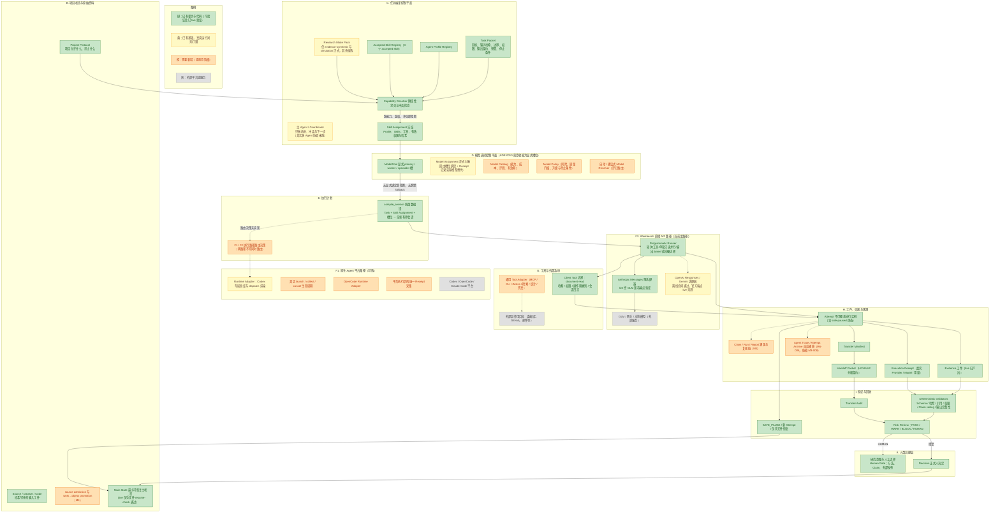

# RWB 目标架构流程图（进度对齐版）

- 基准：仓库外本地文件 `流程图.pdf`（2026-08-13，不入库）的目标架构 A–I 分层与四色图例
- 本图状态对齐日期：**2026-08-16**（M6-004 live `completed` 收口之后）
- 图例（沿用 PDF 四色，含义按当前状态对齐）：
  - 🟢 **绿**：已有契约与代码；凡可 live 验证处已经真实运行验证
  - 🟡 **黄**：已有基础（契约/代码/离线测试），真实运行尚未打通
  - 🟠 **橙**：需要新增（未启动，或按 ADR 刻意暂缓）
  - ⬜ **灰**：外部平台或服务（不由本仓库实现）

## 与 2026-08-13 PDF 差距清单的对账

PDF 第 7–8 页列出的“尚未完全具备”项，截至 2026-08-16 的状态：

| PDF 差距项 | 2026-08-16 状态 |
|---|---|
| 三家 API 真实账户、真实模型 conformance | **部分闭合**：glm-5.3 经 open.bigmodel.cn Anthropic 兼容端点 text/structured/tools 三项通过（2026-08-15）；OpenAI / Gemini 官方端点仍未测 |
| Task→API 执行闭环、统一 Receipt 采集（直接 API 路径） | **闭合**：K-API-2 离线四路径闭环；2026-08-16 EVID-001 尝试 `A-2D05287D7252` 以 glm-5.3 到达 live `completed`（contract-satisfied、11 工件原子落盘、check-report pass、幂等重跑、handoff validate、仅凭文件 resume-check 全过）；Receipt 记录真实 Provider/Model/用量 |
| Runtime 的真实 launch/collect/cancel；OpenCode Adapter；平台统一 Receipt | 仍缺（M2-006 PARKED，无真实消费者不启动） |
| Model Catalog / 正式 Model Policy / 自动 Model Resolver | 仍缺，且属**刻意收缩**（ADR-0010：显式槽位、无评分路由、跨提供商 fallback 必须是新 Attempt） |
| 正式 Model Assignment 对象 | 部分：显式槽位绑定 + Attempt/Receipt 已记录实际模型与预算；正式对象未建 |
| 经济模型按实际任务评测升降级的证据 | 仍缺（依赖 M5 真实案例） |

PDF 点名的“最明显黑箱”（Skill Assignment 之后：谁选模型 / 实际用了什么 / 为什么 / 是否降级 / 实际成本）当前由**显式槽位 + attempt 身份 + Receipt 核对**最低限度显式化；是否进一步形式化为 Model Policy/Assignment 对象，留待真实案例驱动决定。

## 本图相对 PDF 的主要颜色变化（2026-08-13 → 2026-08-16）

- **F2 直接 API 路径整体 黄→绿**：Programmatic Runner、Anthropic 薄适配器（经 GLM 兼容端点）、原子关闭事务、Evidence/Receipt/Handoff/Manifest/Attempt 全链 live 验证
- **并行度子决策**（登记 M6-005 范畴）：单轮只读工具 fan-out 默认 ≤4、含副作用工具的回合保持串行；attempt 身份纳入会话边界
- D 层维持黄/橙不变：显式槽位是设计决定，不是欠账

## 仍未完成（为什么“没有全量完成”）

按 `docs/TASKS.md`（2026-08-16）：

- **M4** 工件与复现（source admission、promotion、Claim trace、Run manifest）：全部未启动
- **M5** 两个真实案例与删减评审：BLOCKED，等人类批准案例边界——多 Agent 相对单 Agent 的科研净收益**尚未证明**
- **M6** 剩余：M6-003 待评审合并（本地 12 提交 vs 远端 Codex 平行线 PR #9 的收敛待商定）；M6-005 其余（streaming/multimodal/server tools/平台 Adapter）PARKED；M6-006 自动 Agent Trace（依赖 M3-008）
- **M3**：001–007 已有契约与 fixture、真实演练数据待采；**M3-008 Trace Envelope/Index/Event Schema** READY 未开始
- **M7 / K-MS-1**：Mode 决策卡、Task-to-Skill 选择矩阵、accepted Skill 边界审计、triage candidate 去留、H0/H1/H2 成本对照（路诚钺线）
- **M2**：003/004/007/008 的真实前向证据
- **M0-007** 许可证（BLOCKED）、**M1-009** 外部 scaffold（READY）

> 证据边界：绿色模块的 live 验证目前限于 glm-5.3 单模型、单个受限 evidence 任务（结构完成 ≠ 科学正确性）；Evidence 工件本身如实自标 `synthetic-fixture / no-citable-evidence`。
